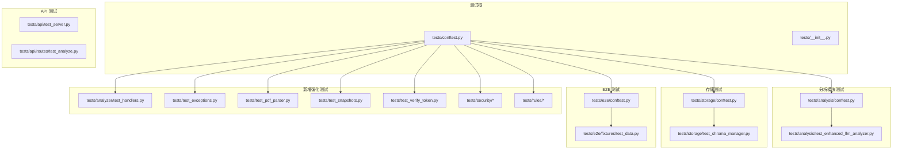
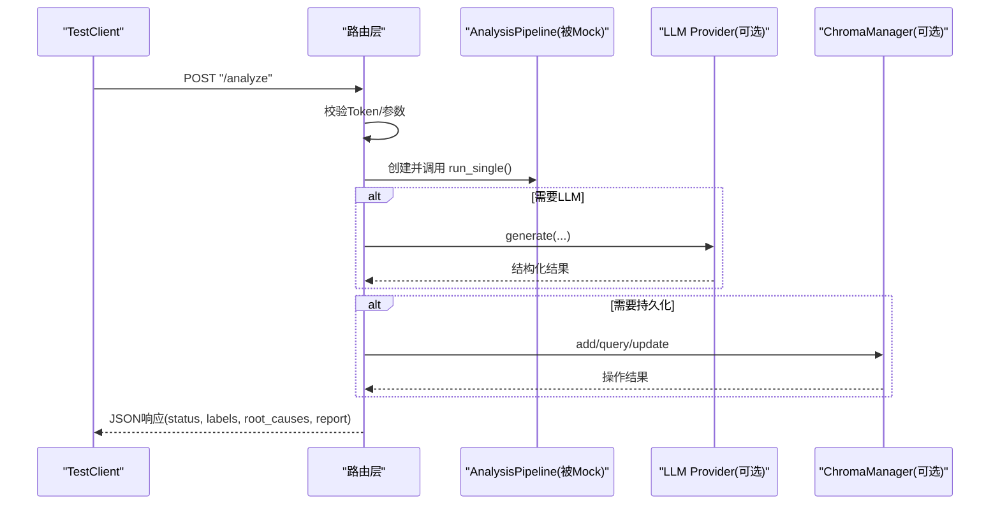
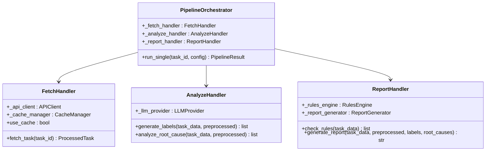
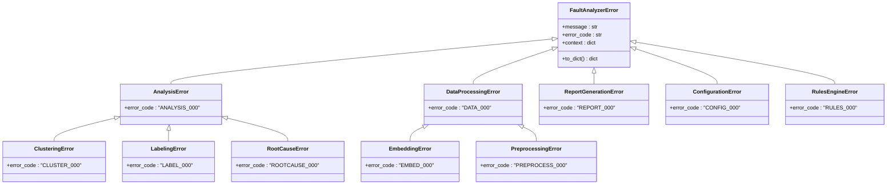
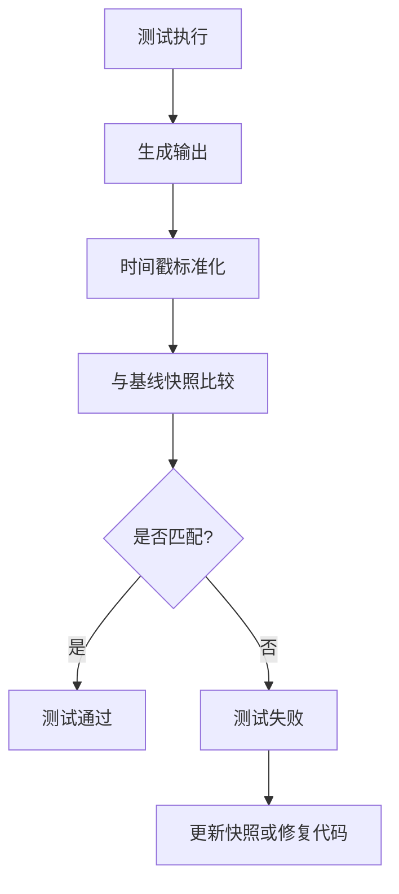
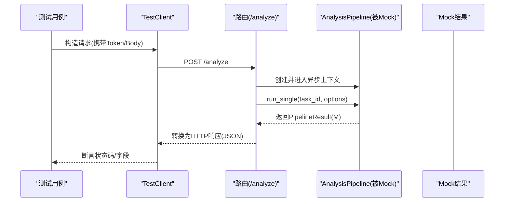
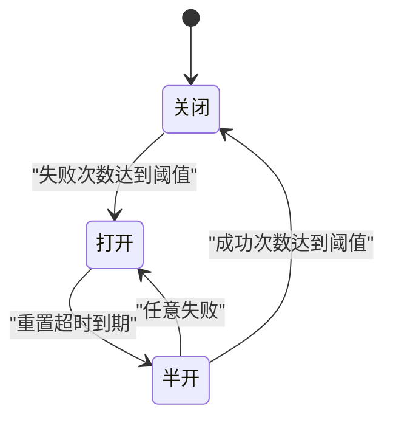
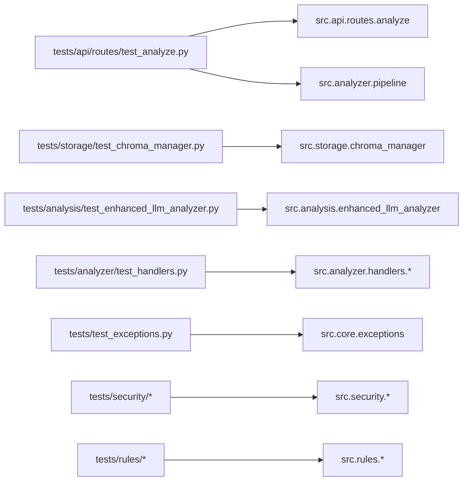

# 单元测试

<cite>
**本文引用的文件**
- [tests/conftest.py](file://tests/conftest.py)
- [tests/analysis/conftest.py](file://tests/analysis/conftest.py)
- [tests/config/conftest.py](file://tests/config/conftest.py)
- [tests/storage/conftest.py](file://tests/storage/conftest.py)
- [tests/e2e/conftest.py](file://tests/e2e/conftest.py)
- [tests/e2e/fixtures/test_data.py](file://tests/e2e/fixtures/test_data.py)
- [tests/analysis/test_enhanced_llm_analyzer.py](file://tests/analysis/test_enhanced_llm_analyzer.py)
- [tests/api/test_server.py](file://tests/api/test_server.py)
- [tests/api/routes/test_analyze.py](file://tests/api/routes/test_analyze.py)
- [tests/storage/test_chroma_manager.py](file://tests/storage/test_chroma_manager.py)
- [tests/utils/test_circuit_breaker.py](file://tests/utils/test_circuit_breaker.py)
- [scripts/run_tests.sh](file://scripts/run_tests.sh)
- [pyproject.toml](file://pyproject.toml)
- [tests/analyzer/test_handlers.py](file://tests/analyzer/test_handlers.py)
- [tests/test_exceptions.py](file://tests/test_exceptions.py)
- [tests/test_pdf_parser.py](file://tests/test_pdf_parser.py)
- [tests/test_snapshots.py](file://tests/test_snapshots.py)
- [tests/test_verify_token.py](file://tests/test_verify_token.py)
- [src/core/exceptions.py](file://src/core/exceptions.py)
- [src/analyzer/handlers/__init__.py](file://src/analyzer/handlers/__init__.py)
- [tests/security/test_token_manager.py](file://tests/security/test_token_manager.py)
- [tests/security/test_input_validator.py](file://tests/security/test_input_validator.py)
- [tests/security/test_prompt_guard.py](file://tests/security/test_prompt_guard.py)
- [tests/rules/test_engine.py](file://tests/rules/test_engine.py)
- [tests/rules/test_condition_evaluator.py](file://tests/rules/test_condition_evaluator.py)
</cite>

## 更新摘要
**变更内容**
- 新增处理器单元测试（361行），涵盖FetchHandler、AnalyzeHandler、ReportHandler和PipelineOrchestrator
- 添加统一异常层次结构测试，覆盖FaultAnalyzerError及其所有子类
- 新增PDF规则解析器测试，验证PDF文档中的规则提取功能
- 引入快照回归测试，使用syrupy框架确保输出格式稳定性
- 扩展API客户端令牌验证测试，覆盖认证错误和网络异常场景
- 增强安全模块测试，包括TokenManager、InputValidator和PromptGuard
- 完善规则引擎测试，覆盖条件评估器和复杂规则逻辑

## 目录
1. [简介](#简介)
2. [项目结构](#项目结构)
3. [核心组件](#核心组件)
4. [架构总览](#架构总览)
5. [详细组件分析](#详细组件分析)
6. [依赖关系分析](#依赖关系分析)
7. [性能与基准测试](#性能与基准测试)
8. [故障排查指南](#故障排查指南)
9. [结论](#结论)
10. [附录](#附录)

## 简介
本指南面向使用 pytest 的单元测试实践，结合仓库现有测试代码与配置，系统化说明：
- 测试用例组织与命名约定
- fixture 的使用与共享（含 conftest.py）
- Mock 策略（外部 API、数据库、LLM 服务）
- 断言方法与技巧（异常、异步）
- 覆盖率要求与质量检查配置
- 测试数据管理与环境隔离
- 性能测试与基准测试的实施方法

## 项目结构
测试目录按功能模块划分，并在各子模块中放置对应的 conftest.py 以提供局部共享 fixture。根级 conftest.py 提供通用 fixture；E2E 测试独立在 tests/e2e 下，避免与单元/集成测试混用。

图示来源
- [tests/conftest.py:1-80](file://tests/conftest.py#L1-L80)
- [tests/analysis/conftest.py:1-78](file://tests/analysis/conftest.py#L1-L78)
- [tests/storage/conftest.py:1-45](file://tests/storage/conftest.py#L1-L45)
- [tests/e2e/conftest.py:1-59](file://tests/e2e/conftest.py#L1-L59)
- [tests/e2e/fixtures/test_data.py:1-40](file://tests/e2e/fixtures/test_data.py#L1-L40)
- [tests/analyzer/test_handlers.py:1-362](file://tests/analyzer/test_handlers.py#L1-L362)
- [tests/test_exceptions.py:1-169](file://tests/test_exceptions.py#L1-L169)
- [tests/test_pdf_parser.py:1-128](file://tests/test_pdf_parser.py#L1-L128)
- [tests/test_snapshots.py:1-136](file://tests/test_snapshots.py#L1-L136)
- [tests/test_verify_token.py:1-108](file://tests/test_verify_token.py#L1-L108)

章节来源
- [tests/conftest.py:1-80](file://tests/conftest.py#L1-L80)
- [tests/analysis/conftest.py:1-78](file://tests/analysis/conftest.py#L1-L78)
- [tests/storage/conftest.py:1-45](file://tests/storage/conftest.py#L1-L45)
- [tests/e2e/conftest.py:1-59](file://tests/e2e/conftest.py#L1-L59)
- [tests/e2e/fixtures/test_data.py:1-40](file://tests/e2e/fixtures/test_data.py#L1-L40)
- [tests/analyzer/test_handlers.py:1-362](file://tests/analyzer/test_handlers.py#L1-L362)
- [tests/test_exceptions.py:1-169](file://tests/test_exceptions.py#L1-L169)
- [tests/test_pdf_parser.py:1-128](file://tests/test_pdf_parser.py#L1-L128)
- [tests/test_snapshots.py:1-136](file://tests/test_snapshots.py#L1-L136)
- [tests/test_verify_token.py:1-108](file://tests/test_verify_token.py#L1-L108)

## 核心组件
- 测试运行与标记
  - pytest 自动发现 tests 目录，启用 asyncio 自动模式，并定义 e2e/ui/slow 等标记。
  - 默认忽略 UI 端到端测试路径，便于快速运行。
- 覆盖率与报告
  - 覆盖 src 源码，开启分支覆盖，排除 CLI/UI 等不适合单测的模块。
  - 设置失败阈值，生成 HTML/XML 报告。
- 代码质量
  - Ruff 规则集包含常见 lint 规则，对测试目录放宽部分规则。
  - mypy 严格模式，对第三方库忽略缺失导入。

章节来源
- [pyproject.toml:77-165](file://pyproject.toml#L77-L165)

## 架构总览
下图展示"请求进入 FastAPI -> 路由 -> 管道 -> 外部依赖"的测试断点与 Mock 位置，适用于 /analyze 相关接口测试。

图示来源
- [tests/api/routes/test_analyze.py:1-252](file://tests/api/routes/test_analyze.py#L1-L252)
- [tests/api/test_server.py:1-241](file://tests/api/test_server.py#L1-L241)

## 详细组件分析

### Fixture 与共享数据管理
- 根级 fixtures
  - 临时目录、预处理器实例、样例任务对象与字典数据，用于通用场景。
- 分析模块 fixtures
  - 标准规范管理器、违规检测器、根因验证器、代码变更分析器、增强 LLM 分析器。
  - 样例故障信息（含代码片段与提交记录）。
  - LLM Provider 的 MagicMock 示例，返回可解析的结构化字符串。
- 配置隔离
  - 通过 autouse fixture 在每个测试前清理配置相关环境变量，防止 .env 泄漏影响单测。
- 存储 fixtures
  - 基于 tmp_path 的 Chroma 持久化目录、ChromaManager 实例、样本向量结果集合。
- E2E fixtures
  - 从环境变量加载密钥、基础 URL、路径前缀、小批量测试 ID、输出目录等。

最佳实践
- 将领域相关的 fixture 放在对应模块的 conftest.py，减少跨模块耦合。
- 使用 scope="session" 仅用于昂贵且不可变的数据准备（如 E2E 的大文件读取）。
- 使用 monkeypatch 清理环境变量，确保测试间完全隔离。

章节来源
- [tests/conftest.py:1-80](file://tests/conftest.py#L1-L80)
- [tests/analysis/conftest.py:1-78](file://tests/analysis/conftest.py#L1-L78)
- [tests/config/conftest.py:1-27](file://tests/config/conftest.py#L1-L27)
- [tests/storage/conftest.py:1-45](file://tests/storage/conftest.py#L1-L45)
- [tests/e2e/conftest.py:1-59](file://tests/e2e/conftest.py#L1-L59)
- [tests/e2e/fixtures/test_data.py:1-40](file://tests/e2e/fixtures/test_data.py#L1-L40)

### 处理器架构单元测试
**新增** 处理器架构测试覆盖了新的模块化设计，将单体 AnalysisPipeline 拆分为三个专注的处理器：

**图示来源**
- [tests/analyzer/test_handlers.py:77-362](file://tests/analyzer/test_handlers.py#L77-L362)
- [src/analyzer/handlers/__init__.py:1-18](file://src/analyzer/handlers/__init__.py#L1-L18)

处理器测试要点：
- **FetchHandler**: 测试缓存命中/未命中场景、API调用模拟、缓存禁用模式
- **AnalyzeHandler**: 测试无LLM提供者时的空结果返回、标签生成和根因分析流程
- **ReportHandler**: 测试规则检查委托、报告生成模板处理
- **PipelineOrchestrator**: 测试完整流水线编排、向后兼容性保证

章节来源
- [tests/analyzer/test_handlers.py:1-362](file://tests/analyzer/test_handlers.py#L1-L362)
- [src/analyzer/handlers/__init__.py:1-18](file://src/analyzer/handlers/__init__.py#L1-L18)

### 统一异常层次结构测试
**新增** 统一的异常层次结构测试确保所有自定义异常都继承自 FaultAnalyzerError 基类：

**图示来源**
- [tests/test_exceptions.py:20-169](file://tests/test_exceptions.py#L20-L169)
- [src/core/exceptions.py:15-195](file://src/core/exceptions.py#L15-L195)

异常层次结构测试覆盖：
- 基类属性验证（message、error_code、context）
- 继承关系正确性检查
- 异常捕获层次测试
- API错误独立性验证（不属于FaultAnalyzerError层次）

章节来源
- [tests/test_exceptions.py:1-169](file://tests/test_exceptions.py#L1-L169)
- [src/core/exceptions.py:1-195](file://src/core/exceptions.py#L1-L195)

### PDF规则解析器测试
**新增** PDF规则解析器测试验证从PDF文档中提取规则的能力：

测试场景包括：
- **文件存在性检查**: 不存在文件时抛出DataProcessingError
- **规则字段提取**: 名称、描述、严重级别、分类字段的正确解析
- **可选字段处理**: 缺失字段时使用默认值（严重级别默认为medium）
- **空内容处理**: 空PDF内容返回空规则列表
- **库可用性检查**: PDF库不可用时提供友好的错误提示
- **多规则解析**: 支持从单个PDF中提取多个规则定义

章节来源
- [tests/test_pdf_parser.py:1-128](file://tests/test_pdf_parser.py#L1-L128)

### 快照回归测试
**新增** 使用syrupy框架进行快照回归测试，确保输出格式和内容的一致性：

**图示来源**
- [tests/test_snapshots.py:30-94](file://tests/test_snapshots.py#L30-L94)

快照测试覆盖：
- **报告生成快照**: 验证Markdown报告格式稳定性
- **标签生成快照**: 确保标签数据结构一致性
- **时间戳处理**: 动态时间戳替换为固定占位符
- **空数据处理**: 最小数据集的输出格式验证

章节来源
- [tests/test_snapshots.py:1-136](file://tests/test_snapshots.py#L1-L136)

### API客户端令牌验证测试
**新增** 全面的令牌验证测试覆盖各种认证场景：

测试场景包括：
- **有效令牌**: HTTP 200响应返回True
- **过期令牌**: 401响应抛出AuthenticationError
- **连接错误**: 网络异常抛出APIConnectionError
- **空令牌**: 缺少令牌时抛出AuthenticationError
- **服务端错误**: 500+响应抛出ServerError
- **客户端初始化**: 懒加载HTTP客户端的正确性

章节来源
- [tests/test_verify_token.py:1-108](file://tests/test_verify_token.py#L1-L108)

### 安全模块测试增强
**新增** 安全相关功能的全面测试覆盖：

#### TokenManager测试
- **初始化验证**: 默认和自定义过期天数设置
- **过期检查**: 精确的令牌过期时间计算
- **轮换提醒**: 接近过期时的提醒机制
- **剩余天数计算**: 浮点数精度的剩余时间计算

#### InputValidator测试
- **任务号验证**: 7-10位数字格式验证
- **令牌验证**: 长度限制和字符集验证
- **边界情况**: 空值、特殊字符、长度边界处理

#### PromptGuard测试
- **注入检测**: 多种提示注入攻击模式的识别
- **文本清洗**: XML标签转义和安全化处理
- **防护机制**: 恶意内容的过滤和拒绝

章节来源
- [tests/security/test_token_manager.py:1-120](file://tests/security/test_token_manager.py#L1-L120)
- [tests/security/test_input_validator.py:1-64](file://tests/security/test_input_validator.py#L1-64)
- [tests/security/test_prompt_guard.py:1-147](file://tests/security/test_prompt_guard.py#L1-147)

### 规则引擎测试完善
**新增** 规则引擎和条件评估器的深度测试：

#### RuleEngine测试
- **规则注册/注销**: 动态规则管理
- **规则执行**: 违规检测和结果统计
- **配置管理**: 引擎配置选项验证

#### ConditionEvaluator测试
- **值解析**: 布尔、数字、字符串、JSON类型解析
- **上下文访问**: 嵌套键值和默认值处理
- **原子表达式**: 相等、比较、包含、正则匹配等操作符
- **复杂条件**: 组合条件和优先级处理

章节来源
- [tests/rules/test_engine.py:1-200](file://tests/rules/test_engine.py#L1-200)
- [tests/rules/test_condition_evaluator.py:1-200](file://tests/rules/test_condition_evaluator.py#L1-200)

### Mock 策略与用法
- 外部 API 调用模拟
  - 使用 unittest.mock.patch 替换路由中的关键类或函数，配合 AsyncMock 模拟异步上下文管理器与返回值。
  - 针对认证中间件与路由逻辑分别构造有效/无效 Token 的场景。
- 数据库操作模拟
  - 对于向量数据库（Chroma），优先使用真实但隔离的临时目录进行集成式单测；若需纯内存/无 IO，可对底层客户端进行 patch。
- LLM 服务模拟
  - 使用 MagicMock 构造 provider.generate 的返回，保证返回可被下游解析的结构化内容。
  - 在增强分析流程中，可选择注入 mock provider 或不注入以覆盖不同分支。

建议
- 尽量靠近边界进行 Mock（路由层或外部依赖入口），避免深入业务逻辑内部。
- 为异步上下文管理器提供 __aenter__/__aexit__ 的 AsyncMock 返回值，确保 with/as 语法正确。
- 对错误路径显式设置 side_effect，验证异常传播与状态码映射。

章节来源
- [tests/api/test_server.py:1-241](file://tests/api/test_server.py#L1-L241)
- [tests/api/routes/test_analyze.py:1-252](file://tests/api/routes/test_analyze.py#L1-L252)
- [tests/analysis/conftest.py:73-78](file://tests/analysis/conftest.py#L73-L78)
- [tests/analysis/test_enhanced_llm_analyzer.py:1-102](file://tests/analysis/test_enhanced_llm_analyzer.py#L1-L102)

### 断言方法与技巧
- 基本断言
  - 使用 assert 对状态码、JSON 字段、类型与长度进行断言。
- 异常断言
  - 使用 pytest.raises 捕获预期异常，并断言消息片段或属性。
- 异步断言
  - 使用 @pytest.mark.asyncio 装饰异步测试，await 异步调用后断言。
- 数值近似
  - 使用 pytest.approx 处理浮点误差比较。
- 参数化
  - 使用 @pytest.mark.parametrize 覆盖多组输入输出组合。

章节来源
- [tests/utils/test_circuit_breaker.py:1-363](file://tests/utils/test_circuit_breaker.py#L1-L363)
- [tests/security/test_token_manager.py:1-120](file://tests/security/test_token_manager.py#L1-L120)
- [tests/api/routes/test_analyze.py:1-252](file://tests/api/routes/test_analyze.py#L1-L252)

### 测试数据与环境隔离
- 测试数据
  - 使用 fixtures 集中提供最小可用数据集，必要时基于随机种子生成稳定样本。
  - E2E 从 Excel 读取少量任务 ID，提升执行速度。
- 环境隔离
  - 通过 autouse fixture 清理配置相关环境变量，避免 .env 污染。
  - 使用 tmp_path 作为临时工作目录，确保每次测试拥有干净的文件系统视图。
  - E2E 使用独立输出目录，避免与开发输出冲突。

章节来源
- [tests/config/conftest.py:1-27](file://tests/config/conftest.py#L1-L27)
- [tests/storage/conftest.py:1-45](file://tests/storage/conftest.py#L1-L45)
- [tests/e2e/conftest.py:1-59](file://tests/e2e/conftest.py#L1-L59)
- [tests/e2e/fixtures/test_data.py:1-40](file://tests/e2e/fixtures/test_data.py#L1-L40)

### API 路由测试序列图（/analyze）

图示来源
- [tests/api/routes/test_analyze.py:1-252](file://tests/api/routes/test_analyze.py#L1-L252)

### 电路断路器状态机（用于可靠性测试）

图示来源
- [tests/utils/test_circuit_breaker.py:1-363](file://tests/utils/test_circuit_breaker.py#L1-L363)

## 依赖关系分析
- 测试与源码依赖
  - API 测试依赖 FastAPI TestClient 与路由实现；通过 patch 替换 AnalysisPipeline 以降低耦合。
  - 存储测试依赖 ChromaManager，使用临时目录隔离。
  - 分析测试依赖增强 LLM 分析器与各类检测器，通过 fixtures 注入。
  - **新增** 处理器测试依赖新的模块化架构，验证向后兼容性。
  - **新增** 异常层次结构测试依赖统一的异常体系。
  - **新增** 安全模块测试依赖TokenManager、InputValidator、PromptGuard等安全组件。
- 外部依赖
  - LLM、向量数据库、外部 API 均通过 Mock 或隔离环境控制，避免不稳定因素。

图示来源
- [tests/api/routes/test_analyze.py:1-252](file://tests/api/routes/test_analyze.py#L1-L252)
- [tests/storage/test_chroma_manager.py:1-105](file://tests/storage/test_chroma_manager.py#L1-L105)
- [tests/analysis/test_enhanced_llm_analyzer.py:1-102](file://tests/analysis/test_enhanced_llm_analyzer.py#L1-L102)
- [tests/analyzer/test_handlers.py:1-362](file://tests/analyzer/test_handlers.py#L1-L362)
- [tests/test_exceptions.py:1-169](file://tests/test_exceptions.py#L1-L169)
- [tests/security/test_token_manager.py:1-120](file://tests/security/test_token_manager.py#L1-L120)
- [tests/rules/test_engine.py:1-200](file://tests/rules/test_engine.py#L1-200)

## 性能与基准测试
- 现状与建议
  - 仓库未内置专用基准测试框架（如 pytest-benchmark）。可在现有测试中引入轻量计时与重复执行统计，或使用 timeit 对热点函数进行微基准。
  - 建议在 tests/benchmarks 下新增独立模块，使用固定数据集与多次迭代，输出均值/方差。
- 指标采集
  - 利用 utils.metrics 与日志记录关键路径耗时，结合 CI 对比历史基线。
- 资源限制
  - 对涉及 LLM/Embedding 的测试，使用 Mock 或本地小型模型，避免高成本调用。

[本节为通用指导，不直接分析具体文件]

## 故障排查指南
- 常见问题
  - 环境变量泄漏：确认 config 模块的 autouse fixture 是否生效，必要时在测试内显式清理。
  - 异步测试未识别：检查 pyproject.toml 的 asyncio_mode 与 @pytest.mark.asyncio 装饰器。
  - 覆盖率未达标：查看 coverage.xml 与 htmlcov 定位未覆盖分支，补充边界条件测试。
  - 外部依赖不稳定：统一在路由层或依赖入口处进行 patch，避免深层修改。
  - **新增** 快照测试失败：检查时间戳标准化逻辑，必要时更新基线快照。
  - **新增** 处理器架构问题：验证向后兼容性，确保旧API仍然可用。
- 调试技巧
  - 使用 -v 详细输出，结合 --tb=short 快速定位。
  - 对复杂响应使用 json() 解析后断言关键字段。
  - 对异常路径使用 pytest.raises 捕获并断言错误码/消息。
  - **新增** 异常层次调试：使用 to_dict() 方法获取完整的异常信息。
  - **新增** 安全测试调试：检查输入验证规则和注入检测模式。

章节来源
- [pyproject.toml:77-110](file://pyproject.toml#L77-L110)
- [scripts/run_tests.sh:1-149](file://scripts/run_tests.sh#L1-L149)
- [tests/test_exceptions.py:140-169](file://tests/test_exceptions.py#L140-L169)
- [tests/test_snapshots.py:21-28](file://tests/test_snapshots.py#L21-L28)

## 结论
本项目已具备完善的 pytest 基础设施与模块化测试组织。通过合理的 fixture 分层、严格的 Mock 策略、清晰的断言与覆盖率门槛，能够保障核心逻辑的正确性与稳定性。**新增的处理器架构测试、统一异常层次结构测试、PDF规则解析器测试、快照回归测试和安全模块测试进一步增强了系统的可靠性和可维护性**。建议持续完善基准测试与性能回归，进一步提升交付质量。

## 附录
- 常用命令
  - 运行全部测试：bash scripts/run_tests.sh
  - 带覆盖率：bash scripts/run_tests.sh -c
  - 指定目录：bash scripts/run_tests.sh -f tests/api/
  - **新增** 运行特定测试：pytest tests/analyzer/test_handlers.py -v
  - **新增** 运行快照测试：pytest tests/test_snapshots.py --snapshot-update
- 覆盖率目标
  - 失败阈值约 79.9%，建议逐步提升至 85%+。
- 质量检查
  - Ruff + mypy 在脚本中集成，建议加入 pre-commit 钩子。
- **新增** 测试分类
  - 单元测试：tests/ 下的各个模块测试
  - 集成测试：tests/integration/ 下的组件交互测试
  - 端到端测试：tests/e2e/ 下的完整流程测试
  - 快照测试：tests/test_snapshots.py 下的输出格式回归测试
  - 安全测试：tests/security/ 下的安全功能测试

章节来源
- [scripts/run_tests.sh:1-149](file://scripts/run_tests.sh#L1-L149)
- [pyproject.toml:90-110](file://pyproject.toml#L90-L110)
- [tests/test_snapshots.py:1-136](file://tests/test_snapshots.py#L1-L136)
- [tests/security/test_token_manager.py:1-120](file://tests/security/test_token_manager.py#L1-L120)