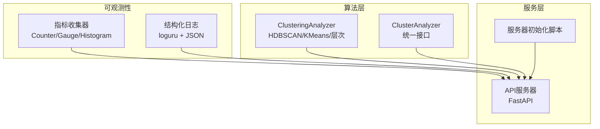
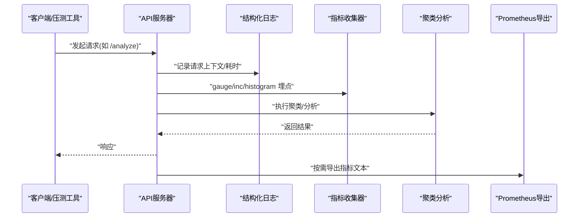
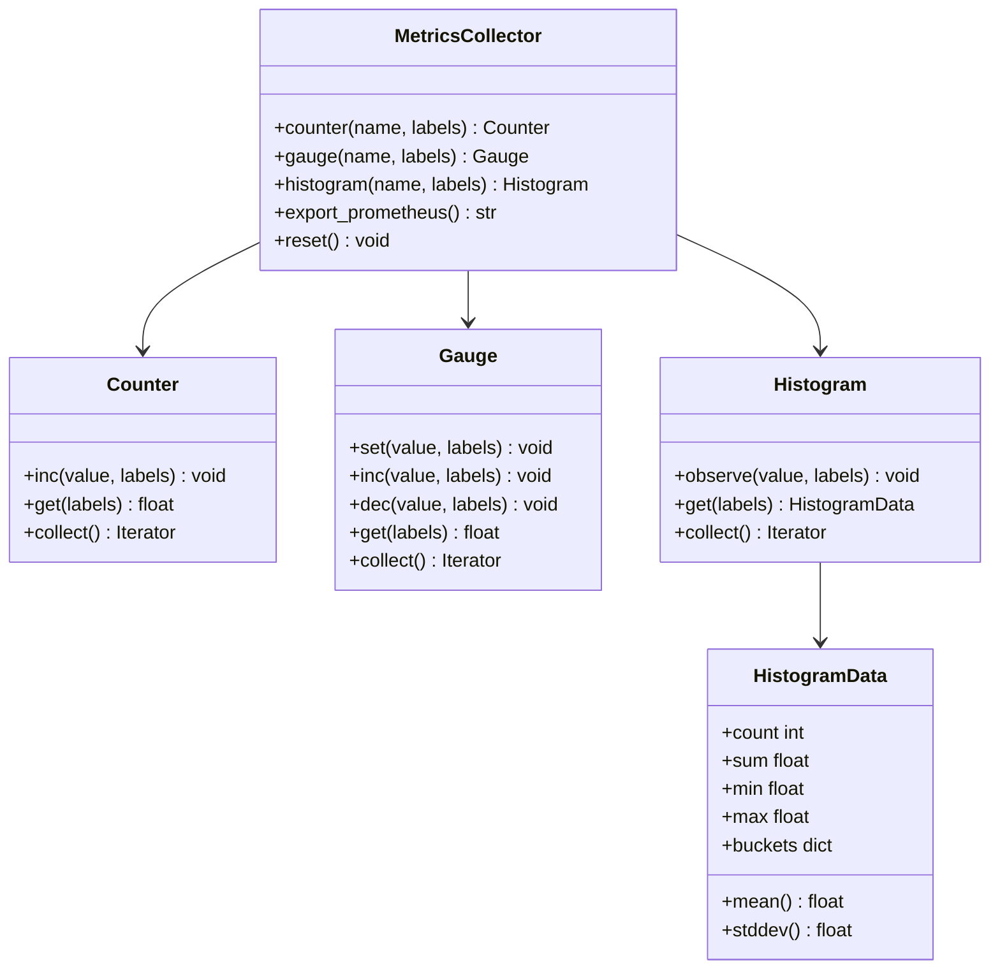
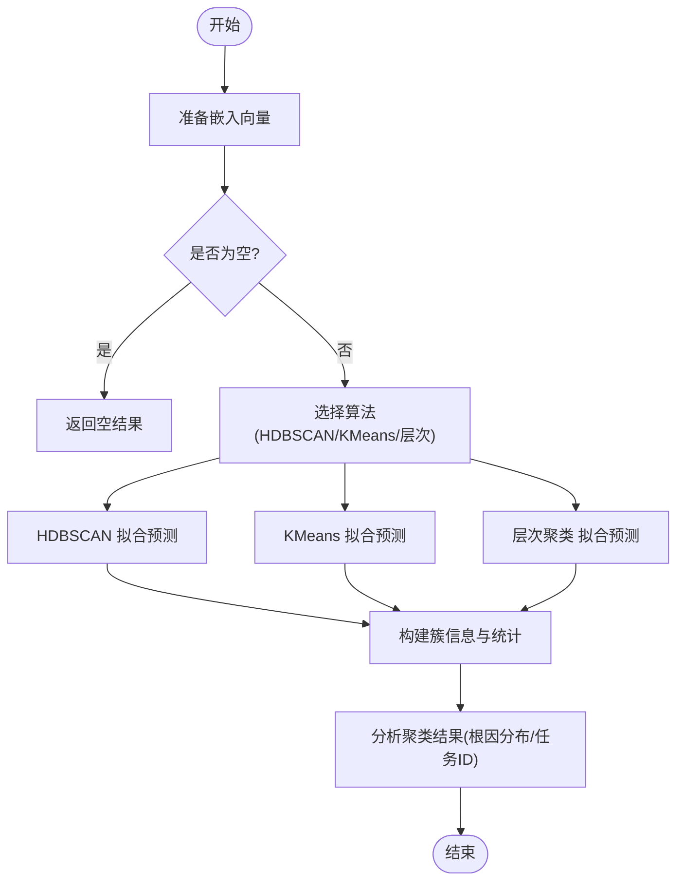
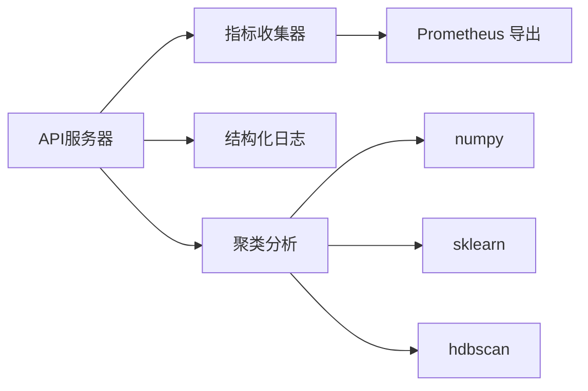

# 性能测试

<cite>
**本文引用的文件**   
- [src/utils/metrics.py](file://src/utils/metrics.py)
- [tests/utils/test_metrics.py](file://tests/utils/test_metrics.py)
- [docs/observability_guide.md](file://docs/observability_guide.md)
- [example_observability.py](file://example_observability.py)
- [src/utils/logger.py](file://src/utils/logger.py)
- [src/analysis/clustering.py](file://src/analysis/clustering.py)
- [src/clustering/analyzer.py](file://src/clustering/analyzer.py)
- [src/api/server.py](file://src/api/server.py)
- [scripts/test_api_server.py](file://scripts/test_api_server.py)
- [docs/DEPLOYMENT.md](file://docs/DEPLOYMENT.md)
</cite>

## 目录
1. [引言](#引言)
2. [项目结构](#项目结构)
3. [核心组件](#核心组件)
4. [架构总览](#架构总览)
5. [详细组件分析](#详细组件分析)
6. [依赖关系分析](#依赖关系分析)
7. [性能考虑](#性能考虑)
8. [故障排查指南](#故障排查指南)
9. [结论](#结论)
10. [附录](#附录)

## 引言
本文件面向“性能测试”目标，结合仓库中已有的可观测性与指标基础设施、聚类算法实现与API服务骨架，给出完整的性能基准与负载测试策略。内容覆盖：
- 关键性能指标(KPI)定义与测量方法
- 负载测试工具使用与并发请求模拟
- 内存泄漏检测与CPU性能分析方法（含profiling与热点识别）
- 大数据量处理优化测试（聚类算法评估与向量检索速度）
- 性能回归自动化配置（基准数据管理与阈值告警）
- 结果分析与优化建议生成
- 分布式系统性能测试策略与监控方案

## 项目结构
围绕性能测试相关能力，本项目已具备以下基础：
- 指标收集器：提供计数器、仪表盘、直方图及Prometheus导出能力
- 结构化日志：支持JSON输出与文件轮转，便于追踪与审计
- 聚类模块：HDBSCAN/KMeans/层次聚类的实现与分析接口
- API服务：FastAPI应用与路由初始化脚本，便于压测接入

图示来源
- [src/utils/metrics.py:151-252](file://src/utils/metrics.py#L151-L252)
- [src/utils/logger.py:34-103](file://src/utils/logger.py#L34-L103)
- [src/analysis/clustering.py:22-94](file://src/analysis/clustering.py#L22-L94)
- [src/clustering/analyzer.py:8-46](file://src/clustering/analyzer.py#L8-L46)
- [src/api/server.py](file://src/api/server.py)
- [scripts/test_api_server.py:13-42](file://scripts/test_api_server.py#L13-L42)

章节来源
- [src/utils/metrics.py:1-252](file://src/utils/metrics.py#L1-252)
- [src/utils/logger.py:1-160](file://src/utils/logger.py#L1-160)
- [src/analysis/clustering.py:1-316](file://src/analysis/clustering.py#L1-316)
- [src/clustering/analyzer.py:1-121](file://src/clustering/analyzer.py#L1-121)
- [scripts/test_api_server.py:1-51](file://scripts/test_api_server.py#L1-51)

## 核心组件
- 指标收集器
  - 提供 Counter/Gauge/Histogram 三类指标，支持标签与命名空间，并可直接导出 Prometheus 文本格式，便于对接监控系统。
  - 全局收集器通过单例获取，适合跨模块共享。
- 结构化日志
  - 基于 loguru，支持控制台/文件输出、JSON序列化、自动轮转与保留策略，便于定位问题与关联追踪。
- 聚类分析
  - 提供 HDBSCAN/KMeans/层次聚类三种算法，封装了参数自适应、噪声点统计与簇信息构建。
  - 对外暴露 analyze_clusters 用于对标签与元数据进行聚合分析。
- API服务
  - FastAPI应用创建与路由检查脚本，可作为压测入口的验证与基线。

章节来源
- [src/utils/metrics.py:151-252](file://src/utils/metrics.py#L151-L252)
- [src/utils/logger.py:34-103](file://src/utils/logger.py#L34-L103)
- [src/analysis/clustering.py:22-94](file://src/analysis/clustering.py#L22-L94)
- [src/clustering/analyzer.py:8-46](file://src/clustering/analyzer.py#L8-L46)
- [scripts/test_api_server.py:13-42](file://scripts/test_api_server.py#L13-L42)

## 架构总览
下图展示从API请求到指标采集、日志记录与聚类处理的端到端路径，以及Prometheus导出位置。

图示来源
- [src/api/server.py](file://src/api/server.py)
- [src/utils/logger.py:34-103](file://src/utils/logger.py#L34-L103)
- [src/utils/metrics.py:190-226](file://src/utils/metrics.py#L190-L226)
- [src/analysis/clustering.py:262-316](file://src/analysis/clustering.py#L262-L316)

## 详细组件分析

### 指标收集器与KPI设计
- 指标类型与用途
  - Counter：累计计数（如请求总数、错误数）
  - Gauge：瞬时值（如活跃请求数、队列长度）
  - Histogram：分布统计（如响应时间、处理时长），内置分桶与sum/count
- KPI建议
  - 延迟类：P50/P90/P99响应时间、平均耗时、超时比例
  - 吞吐类：QPS、并发度、资源利用率(CPU/内存)
  - 质量类：错误率、重试率、熔断触发次数
  - 业务类：聚类成功数、噪声点比例、簇规模分布
- 测量方法
  - 在API入口/出口处打点，按endpoint/method等维度加标签
  - 使用Histogram记录耗时，结合Prometheus计算分位值
  - 使用Gauge跟踪活跃请求与队列深度
  - 使用Counter统计成功/失败总量

图示来源
- [src/utils/metrics.py:54-149](file://src/utils/metrics.py#L54-L149)
- [src/utils/metrics.py:151-252](file://src/utils/metrics.py#L151-L252)

章节来源
- [src/utils/metrics.py:1-252](file://src/utils/metrics.py#L1-252)
- [tests/utils/test_metrics.py:218-299](file://tests/utils/test_metrics.py#L218-L299)
- [docs/observability_guide.md:74-138](file://docs/observability_guide.md#L74-L138)
- [example_observability.py:51-85](file://example_observability.py#L51-L85)

### 结构化日志与追踪
- 功能要点
  - 支持JSON格式输出，便于机器解析
  - 支持文件输出与轮转，避免磁盘写满
  - 提供 correlation_id 辅助链路追踪
- 性能影响
  - JSON序列化开销可控；生产环境建议仅开启必要级别
  - 文件落盘需关注I/O瓶颈，合理设置轮转大小与保留天数

章节来源
- [src/utils/logger.py:34-103](file://src/utils/logger.py#L34-L103)
- [src/utils/logger.py:119-128](file://src/utils/logger.py#L119-L128)

### 聚类算法性能评估
- 算法选择
  - HDBSCAN：无需预设簇数量，适合发现自然簇；对高维向量需归一化或降维
  - KMeans：速度快，需指定簇数，对初始中心敏感
  - 层次聚类：小样本稳定，大规模数据较慢
- 性能关注点
  - 向量维度与数量对时间与内存的影响
  - 距离度量与归一化策略（余弦等价于欧氏+L2归一化）
  - 噪声点比例与簇稳定性
- 评估方法
  - 以不同数据规模与维度为变量，记录运行时间、峰值内存、簇数量与噪声比
  - 对比不同算法在同一数据集上的吞吐与时延

图示来源
- [src/analysis/clustering.py:22-94](file://src/analysis/clustering.py#L22-L94)
- [src/analysis/clustering.py:95-156](file://src/analysis/clustering.py#L95-L156)
- [src/analysis/clustering.py:158-226](file://src/analysis/clustering.py#L158-L226)
- [src/analysis/clustering.py:262-316](file://src/analysis/clustering.py#L262-L316)
- [src/clustering/analyzer.py:22-46](file://src/clustering/analyzer.py#L22-L46)

章节来源
- [src/analysis/clustering.py:1-316](file://src/analysis/clustering.py#L1-316)
- [src/clustering/analyzer.py:1-121](file://src/clustering/analyzer.py#L1-121)

### API服务与压测接入
- 服务初始化与路由校验
  - 通过脚本快速验证关键路由是否存在，确保压测入口可用
- 压测建议
  - 使用HTTP压测工具（如wrk、locust、k6）对 /health、/analyze、/clusters 等接口进行并发压测
  - 结合指标收集器埋点，观察QPS、时延与错误率变化

章节来源
- [scripts/test_api_server.py:13-42](file://scripts/test_api_server.py#L13-L42)
- [src/api/server.py](file://src/api/server.py)

## 依赖关系分析
- 组件耦合
  - API服务依赖指标与日志模块进行可观测性埋点
  - 聚类模块独立于服务层，可通过API调用
- 外部依赖
  - 指标导出至Prometheus生态
  - 日志框架loguru
  - 聚类依赖numpy/sklearn/hdbscan

图示来源
- [src/utils/metrics.py:190-226](file://src/utils/metrics.py#L190-L226)
- [src/analysis/clustering.py:7-10](file://src/analysis/clustering.py#L7-L10)
- [src/clustering/analyzer.py:29-71](file://src/clustering/analyzer.py#L29-L71)

章节来源
- [src/utils/metrics.py:1-252](file://src/utils/metrics.py#L1-252)
- [src/analysis/clustering.py:1-316](file://src/analysis/clustering.py#L1-316)
- [src/clustering/analyzer.py:1-121](file://src/clustering/analyzer.py#L1-121)

## 性能考虑
- 指标埋点最佳实践
  - 在请求进入与退出处分别打点，记录活跃请求与耗时
  - 使用标签区分endpoint与方法，避免标签基数爆炸
- 日志策略
  - 生产环境降低日志级别，关闭不必要的DEBUG
  - 启用JSON输出以便集中采集与检索
- 聚类性能
  - 大向量先做L2归一化再使用欧氏距离近似余弦
  - 控制最小簇大小与样本数以减少噪声与提升稳定性
- 资源限制
  - 容器部署中合理设置CPU与内存限制，避免抖动

章节来源
- [docs/observability_guide.md:74-138](file://docs/observability_guide.md#L74-L138)
- [src/utils/logger.py:34-103](file://src/utils/logger.py#L34-L103)
- [src/clustering/analyzer.py:54-71](file://src/clustering/analyzer.py#L54-L71)
- [docs/DEPLOYMENT.md:441-445](file://docs/DEPLOYMENT.md#L441-L445)

## 故障排查指南
- 常见问题定位
  - 指标缺失：确认命名空间与标签是否正确，检查导出函数是否被调用
  - 日志过大：调整轮转大小与保留天数，必要时切换JSON格式
  - 聚类异常：检查输入向量维度与空集处理，核对算法参数
- 诊断步骤
  - 查看结构化日志中的correlation_id，串联请求链路
  - 导出Prometheus指标，观察P99时延与错误率突增
  - 针对聚类阶段，打印簇数量与噪声点比例，判断参数合理性

章节来源
- [src/utils/logger.py:119-128](file://src/utils/logger.py#L119-L128)
- [src/utils/metrics.py:190-226](file://src/utils/metrics.py#L190-L226)
- [src/analysis/clustering.py:43-94](file://src/analysis/clustering.py#L43-L94)

## 结论
本项目已具备完善的指标与日志基础设施，配合聚类算法与服务入口，能够支撑系统的性能基准与负载测试。建议在CI中引入自动化基准与阈值告警，持续监控关键KPI，并结合profiling手段定位热点，形成闭环的性能保障体系。

## 附录

### 性能基准测试设计与KPI
- 基准场景
  - 单条分析：固定输入规模，多次运行取P50/P90/P99
  - 批量分析：不同批次大小下的吞吐与时延
  - 聚类评估：不同数据规模与维度下的运行时间与内存占用
- KPI定义
  - 延迟：P50/P90/P99响应时间
  - 吞吐：QPS、每秒分析任务数
  - 资源：CPU使用率、内存峰值
  - 质量：错误率、超时率、聚类噪声比

### 负载测试工具与并发模拟
- 工具建议
  - wrk/ab：轻量HTTP压测
  - locust/k6：脚本化并发与可视化报告
- 并发策略
  - 逐步增加并发度，观察QPS与时延拐点
  - 长稳态压测，评估资源漂移与GC行为

### 内存泄漏检测与CPU性能分析
- 内存
  - 使用tracemalloc或memory_profiler定位增长趋势
  - 结合容器监控观察RSS与Limit差异
- CPU
  - 使用cProfile/py-spy进行热点采样
  - 聚焦向量运算与I/O密集段，评估向量化与并行化机会

### 大数据量处理与向量检索
- 聚类
  - 预归一化与降维（如PCA/UMAP）以降低复杂度
  - 分批处理与流式写入，避免一次性加载全部数据
- 向量检索
  - 评估Chroma/Qdrant/Faiss在不同规模下的查询时延与召回率
  - 索引预热与缓存策略

### 性能回归自动化与阈值告警
- CI集成
  - 在流水线中运行基准用例，产出指标与报告
  - 将P99时延、错误率、内存峰值纳入阈值比较
- 基准数据管理
  - 固定种子与输入快照，保证可比性
  - 版本化存储基准结果，便于回溯

### 分布式系统性能测试与监控
- 多实例压测
  - 水平扩展下观察负载均衡与尾延迟
- 监控方案
  - 指标统一导出至Prometheus，配置告警规则
  - 日志集中采集，建立SLO与错误预算
