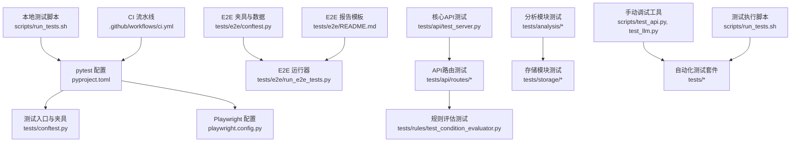
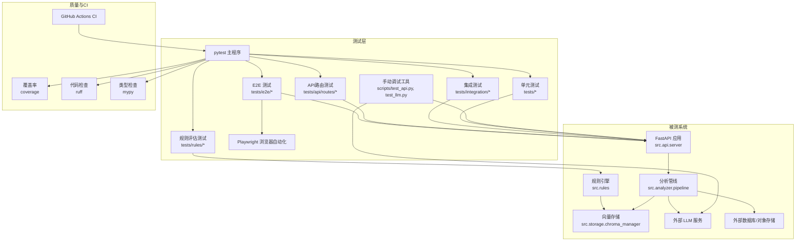
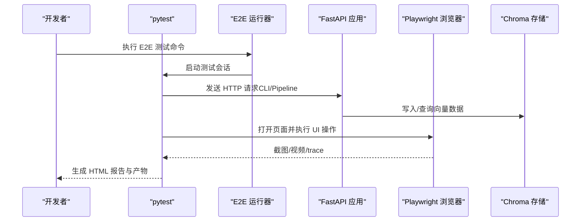
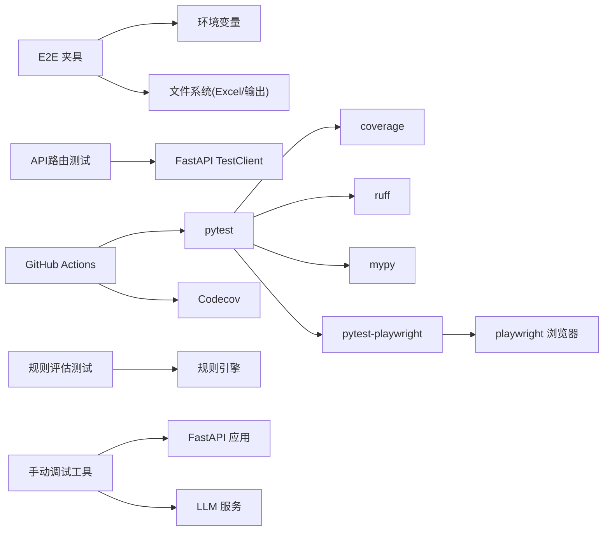

# 测试策略

<cite>
**本文引用的文件**   
- [tests/conftest.py](file://tests/conftest.py)
- [playwright.config.py](file://playwright.config.py)
- [pyproject.toml](file://pyproject.toml)
- [scripts/run_tests.sh](file://scripts/run_tests.sh)
- [.github/workflows/ci.yml](file://.github/workflows/ci.yml)
- [tests/e2e/conftest.py](file://tests/e2e/conftest.py)
- [tests/e2e/conftest_playwright.py](file://tests/e2e/conftest_playwright.py)
- [tests/api/test_server.py](file://tests/api/test_server.py)
- [tests/analysis/test_clustering.py](file://tests/analysis/test_clustering.py)
- [tests/storage/test_chroma_manager.py](file://tests/storage/test_chroma_manager.py)
- [tests/e2e/README.md](file://tests/e2e/README.md)
- [tests/e2e/run_e2e_tests.py](file://tests/e2e/run_e2e_tests.py)
- [tests/api/routes/test_analyze.py](file://tests/api/routes/test_analyze.py)
- [tests/api/routes/test_clusters.py](file://tests/api/routes/test_clusters.py)
- [tests/api/routes/test_feedback.py](file://tests/api/routes/test_feedback.py)
- [tests/api/routes/test_reports.py](file://tests/api/routes/test_reports.py)
- [tests/rules/test_condition_evaluator.py](file://tests/rules/test_condition_evaluator.py)
- [scripts/test_api.py](file://scripts/test_api.py)
- [scripts/test_llm.py](file://scripts/test_llm.py)
</cite>

## 更新摘要
**所做更改**   
- 更新测试目录结构说明，明确手动调试脚本与自动化测试套件的分离
- 新增手动调试工具章节，详细说明test_api.py和test_llm.py的使用场景
- 优化测试结果输出说明，反映0个跳过测试的清晰输出改进
- 更新测试执行指南，区分自动化测试与手动调试工具的使用方式

## 目录
1. [引言](#引言)
2. [项目结构](#项目结构)
3. [核心组件](#核心组件)
4. [架构总览](#架构总览)
5. [详细组件分析](#详细组件分析)
6. [依赖分析](#依赖分析)
7. [性能考虑](#性能考虑)
8. [故障排查指南](#故障排查指南)
9. [结论](#结论)
10. [附录](#附录)

## 引言
本测试策略文档面向"故障复盘分析工具"的测试体系，覆盖单元测试、集成测试、端到端（E2E）测试、性能与基准测试、覆盖率要求、持续集成配置、测试数据与环境隔离、调试技巧以及 TDD 实践。目标是为不同技术背景的读者提供可操作的规范与最佳实践，确保质量保障流程稳定、高效且可演进。

**最新更新**：测试套件显著扩展，新增了4个API路由测试模块和规则评估测试套件，大幅提升了API端点和业务逻辑的测试覆盖率。同时，手动调试脚本已从tests/目录迁移至scripts/目录，实现了自动化测试套件与手动调试工具的明确分离。

## 项目结构
仓库采用分层与按功能域组织相结合的测试结构：
- tests/ 根目录包含各模块的单测与部分集成测试，专注于自动化测试套件
- scripts/ 目录包含手动调试工具和辅助脚本，包括test_api.py和test_llm.py等调试工具
- tests/e2e/ 存放端到端测试（CLI、Pipeline、UI），并提供运行脚本与报告模板
- tests/api/routes/ 专门存放API路由级别的测试用例，涵盖分析、聚类、反馈和报告等核心功能
- tests/rules/ 包含规则引擎相关的测试套件，包括条件评估器测试
- playwright.config.py 集中管理 Playwright 浏览器自动化配置与 pytest 钩子
- pyproject.toml 统一 pytest、coverage、ruff、mypy 等工具配置
- scripts/run_tests.sh 封装本地一键式测试与质量检查流程
- .github/workflows/ci.yml 定义 CI 流水线（多 Python 版本矩阵、lint、类型检查、测试、覆盖率上传）

**图表来源**
- [pyproject.toml:77-109](file://pyproject.toml#L77-L109)
- [tests/conftest.py:1-80](file://tests/conftest.py#L1-L80)
- [playwright.config.py:1-76](file://playwright.config.py#L1-L76)
- [scripts/run_tests.sh:1-149](file://scripts/run_tests.sh#L1-L149)
- [.github/workflows/ci.yml:1-78](file://.github/workflows/ci.yml#L1-L78)
- [tests/e2e/conftest.py:1-59](file://tests/e2e/conftest.py#L1-L59)
- [tests/e2e/run_e2e_tests.py:1-69](file://tests/e2e/run_e2e_tests.py#L1-L69)
- [tests/e2e/README.md:1-78](file://tests/e2e/README.md#L1-L78)
- [tests/api/routes/test_analyze.py](file://tests/api/routes/test_analyze.py)
- [tests/api/routes/test_clusters.py](file://tests/api/routes/test_clusters.py)
- [tests/api/routes/test_feedback.py](file://tests/api/routes/test_feedback.py)
- [tests/api/routes/test_reports.py](file://tests/api/routes/test_reports.py)
- [tests/rules/test_condition_evaluator.py](file://tests/rules/test_condition_evaluator.py)
- [scripts/test_api.py](file://scripts/test_api.py)
- [scripts/test_llm.py](file://scripts/test_llm.py)

**章节来源**
- [pyproject.toml:77-109](file://pyproject.toml#L77-L109)
- [scripts/run_tests.sh:1-149](file://scripts/run_tests.sh#L1-L149)
- [.github/workflows/ci.yml:1-78](file://.github/workflows/ci.yml#L1-L78)
- [playwright.config.py:1-76](file://playwright.config.py#L1-L76)
- [tests/e2e/conftest.py:1-59](file://tests/e2e/conftest.py#L1-L59)
- [tests/e2e/run_e2e_tests.py:1-69](file://tests/e2e/run_e2e_tests.py#L1-L69)
- [tests/e2e/README.md:1-78](file://tests/e2e/README.md#L1-L78)

## 核心组件
- 测试框架与标记
  - 使用 pytest 作为统一测试框架，支持异步自动模式与自定义标记（e2e、ui、slow）。
  - 通过 markers 与收集阶段修改项，将 UI/Pipeline/CLI 相关用例自动打上 e2e 标记，便于选择性执行。
- 覆盖率与质量门禁
  - coverage 源为 src，开启分支覆盖；默认失败阈值为 79.9%。
  - ruff 用于代码风格与静态检查，mypy 进行严格类型检查。
- 本地与 CI 执行
  - 本地通过 run_tests.sh 一键执行 lint、类型检查、测试与覆盖率生成。
  - CI 在多个 Python 版本上并行执行，并上传覆盖率到 Codecov。
- Playwright 浏览器自动化
  - 集中配置 headless/headed、视口、截图/视频/trace 策略，并通过命令行参数控制浏览器类型与显示模式。
- E2E 夹具与数据
  - 从环境变量加载 API 密钥与基础 URL，读取 Excel 中的少量故障单号用于快速 E2E 验证。
  - 输出目录与持久化目录（Chroma）路径由 fixtures 统一管理。
- **手动调试工具**
  - scripts/test_api.py 和 scripts/test_llm.py 提供独立的手动调试功能，用于快速验证API接口和LLM服务调用。
  - 这些工具与自动化测试套件分离，便于开发人员进行交互式调试和问题排查。

**章节来源**
- [pyproject.toml:77-109](file://pyproject.toml#L77-L109)
- [playwright.config.py:1-76](file://playwright.config.py#L1-L76)
- [scripts/run_tests.sh:1-149](file://scripts/run_tests.sh#L1-L149)
- [.github/workflows/ci.yml:1-78](file://.github/workflows/ci.yml#L1-L78)
- [tests/e2e/conftest.py:1-59](file://tests/e2e/conftest.py#L1-L59)
- [scripts/test_api.py](file://scripts/test_api.py)
- [scripts/test_llm.py](file://scripts/test_llm.py)

## 架构总览
下图展示测试体系的总体架构与关键交互：pytest 驱动各类测试，API 测试通过 TestClient 调用应用服务，E2E 测试通过 CLI/Pipeline/UI 全链路验证，Playwright 负责浏览器自动化，覆盖率与质量工具贯穿全流程。手动调试工具提供独立的交互式调试能力。

**图表来源**
- [pyproject.toml:77-109](file://pyproject.toml#L77-L109)
- [tests/api/test_server.py:1-241](file://tests/api/test_server.py#L1-L241)
- [tests/storage/test_chroma_manager.py:1-105](file://tests/storage/test_chroma_manager.py#L1-L105)
- [tests/api/routes/test_analyze.py](file://tests/api/routes/test_analyze.py)
- [tests/api/routes/test_clusters.py](file://tests/api/routes/test_clusters.py)
- [tests/api/routes/test_feedback.py](file://tests/api/routes/test_feedback.py)
- [tests/api/routes/test_reports.py](file://tests/api/routes/test_reports.py)
- [tests/rules/test_condition_evaluator.py](file://tests/rules/test_condition_evaluator.py)
- [playwright.config.py:1-76](file://playwright.config.py#L1-L76)
- [.github/workflows/ci.yml:1-78](file://.github/workflows/ci.yml#L1-L78)
- [scripts/test_api.py](file://scripts/test_api.py)
- [scripts/test_llm.py](file://scripts/test_llm.py)

## 详细组件分析

### 单元测试编写指南
- 设计原则
  - 单一职责：每个测试聚焦一个行为或边界条件。
  - 输入-输出明确：构造最小有效输入，断言关键输出字段与状态码。
  - 可重复性：避免对外部网络与真实资源的强依赖，必要时使用 Mock。
- Mock 对象使用
  - 对异步上下文管理器与协程返回结果使用 AsyncMock 模拟，如 Pipeline 的上下文进入与单次运行。
  - 对第三方库或复杂依赖使用 patch 替换实现，保证测试稳定性与速度。
- 断言方法
  - 优先断言业务语义（如状态码、关键字段、数量约束），而非具体实现细节。
  - 对数值型结果使用近似比较或范围断言，避免浮点误差导致不稳定。
- 示例参考
  - API 认证与路由断言：[tests/api/test_server.py:1-241](file://tests/api/test_server.py#L1-L241)
  - 聚类算法与空数据边界：[tests/analysis/test_clustering.py:1-169](file://tests/analysis/test_clustering.py#L1-L169)
  - 向量存储 CRUD 与元数据更新：[tests/storage/test_chroma_manager.py:1-105](file://tests/storage/test_chroma_manager.py#L1-L105)

**章节来源**
- [tests/api/test_server.py:1-241](file://tests/api/test_server.py#L1-L241)
- [tests/analysis/test_clustering.py:1-169](file://tests/analysis/test_clustering.py#L1-L169)
- [tests/storage/test_chroma_manager.py:1-105](file://tests/storage/test_chroma_manager.py#L1-L105)

### API路由测试套件详解
**新增** 针对API路由层的专门测试套件，覆盖核心业务功能的HTTP接口测试。

- 分析路由测试（test_analyze.py）
  - 测试故障分析接口的完整流程，包括请求验证、处理逻辑和响应格式
  - 验证错误处理和异常情况的处理机制
  - 测试并发请求和资源管理的正确性
- 聚类路由测试（test_clusters.py）
  - 覆盖聚类结果的查询、创建和管理操作
  - 验证聚类数据的完整性和一致性
  - 测试分页和过滤功能的正确性
- 反馈路由测试（test_feedback.py）
  - 测试用户反馈的提交和处理流程
  - 验证反馈数据的持久化和检索功能
  - 覆盖反馈统计和分析接口
- 报告路由测试（test_reports.py）
  - 测试报告生成和下载的完整流程
  - 验证报告模板渲染和数据填充的正确性
  - 测试批量报告生成和导出功能

**最佳实践**
- 使用 FastAPI TestClient 进行HTTP请求测试
- 模拟外部依赖和服务调用
- 验证响应状态码、数据结构和时间戳
- 测试边界条件和异常情况

**章节来源**
- [tests/api/routes/test_analyze.py](file://tests/api/routes/test_analyze.py)
- [tests/api/routes/test_clusters.py](file://tests/api/routes/test_clusters.py)
- [tests/api/routes/test_feedback.py](file://tests/api/routes/test_feedback.py)
- [tests/api/routes/test_reports.py](file://tests/api/routes/test_reports.py)

### 规则评估测试套件
**新增** 针对规则引擎条件评估器的专门测试套件，确保业务规则的正确执行。

- 条件评估器测试（test_condition_evaluator.py）
  - 测试各种条件表达式的解析和执行
  - 验证布尔逻辑运算和嵌套条件的正确处理
  - 覆盖字符串匹配、数值比较和日期判断等条件类型
  - 测试条件缓存机制的性能优化
- 规则引擎集成测试
  - 验证规则加载、编译和执行的完整流程
  - 测试规则冲突检测和优先级处理
  - 覆盖规则版本管理和热重载功能

**测试策略**
- 使用参数化测试覆盖多种条件组合
- 模拟复杂的业务场景和边界情况
- 验证规则执行的性能和内存使用
- 测试规则的动态更新和生效机制

**章节来源**
- [tests/rules/test_condition_evaluator.py](file://tests/rules/test_condition_evaluator.py)

### 手动调试工具
**新增** 位于scripts/目录的手动调试工具，提供独立的交互式调试能力。

- API调试工具（test_api.py）
  - 提供API接口的快速验证和调试功能
  - 支持手动发送测试请求和查看响应结果
  - 便于开发人员快速定位API问题
- LLM调试工具（test_llm.py）
  - 专门用于调试大语言模型服务的调用
  - 支持不同的LLM提供商配置和参数调整
  - 提供详细的调用日志和错误信息

**使用场景**
- 开发阶段的快速功能验证
- 生产环境问题的交互式排查
- API和LLM服务的独立调试
- 与自动化测试套件互补的调试手段

**章节来源**
- [scripts/test_api.py](file://scripts/test_api.py)
- [scripts/test_llm.py](file://scripts/test_llm.py)

### 集成测试方案
- 外部服务模拟
  - 使用 patch 与 AsyncMock 模拟 LLM 调用与异步上下文，避免真实请求与鉴权开销。
  - 针对 API 中间件（Token 校验）分别覆盖缺失、无效、有效三种场景。
- 数据库测试
  - 使用内存或临时持久化目录（Chroma）进行集合创建、增删改查与统计信息验证。
  - 批量写入后断言返回结构与成功标志，确保接口契约一致。
- API 测试
  - 基于 FastAPI TestClient 发起 HTTP 请求，断言状态码、响应体结构与错误消息。
  - 对批量接口与查询参数进行边界校验（如空列表、非法格式）。
- 示例参考
  - API 服务器与认证中间件：[tests/api/test_server.py:1-241](file://tests/api/test_server.py#L1-L241)
  - Chroma 管理器集成用例：[tests/storage/test_chroma_manager.py:1-105](file://tests/storage/test_chroma_manager.py#L1-L105)

**章节来源**
- [tests/api/test_server.py:1-241](file://tests/api/test_server.py#L1-L241)
- [tests/storage/test_chroma_manager.py:1-105](file://tests/storage/test_chroma_manager.py#L1-L105)

### 端到端测试框架（Playwright 与数据管理）
- 浏览器自动化
  - 通过 pytest 插件与钩子注册 e2e/ui/slow 标记，自动归类 UI 与 Pipeline/CLI 测试。
  - 支持 --browser 与 --headed 参数，灵活选择浏览器与可视化模式。
  - 截图/视频/trace 策略仅在失败或重试时保留，平衡资源占用与可观测性。
- 测试数据管理
  - 从 Excel 中读取少量故障单号，用于快速端到端验证。
  - 通过 fixtures 统一输出目录与 Chroma 持久化目录，避免硬编码路径。
- 运行方式
  - 提供专用运行脚本，支持按类别筛选、HTML 报告与并行执行。
- 示例参考
  - Playwright 配置与标记：[playwright.config.py:1-76](file://playwright.config.py#L1-L76)
  - E2E 夹具与环境变量：[tests/e2e/conftest.py:1-59](file://tests/e2e/conftest.py#L1-L59)
  - E2E 运行脚本与报告模板：[tests/e2e/run_e2e_tests.py:1-69](file://tests/e2e/run_e2e_tests.py#L1-L69), [tests/e2e/README.md:1-78](file://tests/e2e/README.md#L1-L78)

**图表来源**
- [playwright.config.py:1-76](file://playwright.config.py#L1-L76)
- [tests/e2e/run_e2e_tests.py:1-69](file://tests/e2e/run_e2e_tests.py#L1-L69)
- [tests/e2e/conftest.py:1-59](file://tests/e2e/conftest.py#L1-L59)

**章节来源**
- [playwright.config.py:1-76](file://playwright.config.py#L1-L76)
- [tests/e2e/conftest.py:1-59](file://tests/e2e/conftest.py#L1-L59)
- [tests/e2e/run_e2e_tests.py:1-69](file://tests/e2e/run_e2e_tests.py#L1-L69)
- [tests/e2e/README.md:1-78](file://tests/e2e/README.md#L1-L78)

### 性能测试方法与基准测试工具
- 建议方法
  - 使用 pytest-benchmark 或 timeit 对热点函数（如嵌入准备、聚类算法）进行微基准测试。
  - 对 API 接口使用 wrk 或 locust 进行负载与吞吐评估，关注 P95/P99 延迟与错误率。
  - 对向量检索进行 QPS 与召回率评估，结合不同 n_results 与维度规模。
- 指标与阈值
  - 设定基线值与回归阈值，CI 中对比历史结果，超过阈值则告警。
- 注意
  - 基准测试需固定随机种子与硬件环境，避免噪声干扰。
  - 大模型与外部服务调用应走 Mock 或沙箱，避免成本波动影响稳定性。

### 测试覆盖率要求与持续集成配置
- 覆盖率要求
  - 源目录为 src，启用分支覆盖；默认失败阈值为 79.9%，未达标将阻断提交。
  - 排除 UI 与 CLI 模块，因其更适合端到端测试覆盖。
- 持续集成
  - GitHub Actions 在多 Python 版本矩阵下执行 lint、类型检查、测试与覆盖率上传。
  - 构建任务在推送 main/master 分支时触发，打包并上传制品。
- 本地执行
  - 使用 run_tests.sh 一键完成 lint、类型检查、测试与覆盖率生成（终端、HTML、XML）。
- **测试结果输出优化**
  - 测试套件现在显示0个跳过的测试，提供更清晰的测试结果输出。
  - 移除了不必要的跳过标记，确保所有测试都能得到适当的执行和报告。

**章节来源**
- [pyproject.toml:90-109](file://pyproject.toml#L90-L109)
- [.github/workflows/ci.yml:1-78](file://.github/workflows/ci.yml#L1-L78)
- [scripts/run_tests.sh:1-149](file://scripts/run_tests.sh#L1-L149)

### 测试数据管理与测试环境隔离策略
- 测试数据
  - 使用 fixtures 提供结构化样本数据（任务、开发、生产信息），减少重复构造。
  - E2E 使用 Excel 中的少量故障单号，确保快速验证与低维护成本。
- 环境隔离
  - 通过环境变量注入 API 密钥与基础 URL，避免硬编码敏感信息。
  - 使用临时目录与独立持久化目录（Chroma）隔离不同测试集，防止交叉污染。
- 示例参考
  - 全局夹具与样例数据：[tests/conftest.py:1-80](file://tests/conftest.py#L1-L80)
  - E2E 环境与数据路径：[tests/e2e/conftest.py:1-59](file://tests/e2e/conftest.py#L1-L59), [tests/e2e/fixtures/test_data.py:1-40](file://tests/e2e/fixtures/test_data.py#L1-L40)

**章节来源**
- [tests/conftest.py:1-80](file://tests/conftest.py#L1-L80)
- [tests/e2e/conftest.py:1-59](file://tests/e2e/conftest.py#L1-L59)
- [tests/e2e/fixtures/test_data.py:1-40](file://tests/e2e/fixtures/test_data.py#L1-L40)

### 测试调试技巧与常见问题解决方案
- 调试技巧
  - 使用 --headed 与 --browser 参数在本地可视化调试 UI 测试。
  - 利用 Playwright 的截图、视频与 trace 定位失败原因。
  - 通过 pytest 的 -v 与 --tb=short 快速定位断言失败位置。
  - **手动调试工具**：使用 scripts/test_api.py 和 scripts/test_llm.py 进行交互式调试。
- 常见问题
  - 缺少 DEVCLOUD_TOKEN 或 API_BASE_URL：E2E 夹具会跳过测试，需在环境变量中配置。
  - 浏览器不可用：确保已安装对应浏览器驱动，或在 CI 中预装。
  - 覆盖率未达标：检查被排除模块与分支覆盖逻辑，补充边界用例。
  - **测试跳过问题**：确认测试套件配置，确保没有不必要的跳过标记影响测试结果。
- 示例参考
  - Playwright 配置与选项：[playwright.config.py:1-76](file://playwright.config.py#L1-L76)
  - E2E 运行器与报告：[tests/e2e/run_e2e_tests.py:1-69](file://tests/e2e/run_e2e_tests.py#L1-L69), [tests/e2e/README.md:1-78](file://tests/e2e/README.md#L1-L78)
  - 手动调试工具：[scripts/test_api.py](file://scripts/test_api.py), [scripts/test_llm.py](file://scripts/test_llm.py)

**章节来源**
- [playwright.config.py:1-76](file://playwright.config.py#L1-L76)
- [tests/e2e/run_e2e_tests.py:1-69](file://tests/e2e/run_e2e_tests.py#L1-L69)
- [tests/e2e/README.md:1-78](file://tests/e2e/README.md#L1-L78)
- [scripts/test_api.py](file://scripts/test_api.py)
- [scripts/test_llm.py](file://scripts/test_llm.py)

### 测试驱动开发（TDD）实践指南
- 流程
  - 先写失败的测试用例，描述期望行为与边界条件。
  - 编写最小实现使测试通过，随后重构提升可读性与性能。
  - 对 API 与核心算法优先采用 TDD，确保契约与正确性。
- 适用场景
  - 聚类算法、规则引擎、报告生成器等确定性逻辑。
  - API 路由与中间件，确保状态码与错误消息符合契约。
- 注意事项
  - 保持测试小而快，避免引入外部依赖。
  - 使用 Mock 隔离不稳定因素，聚焦业务逻辑验证。

## 依赖分析
测试体系的关键依赖关系如下：
- pytest 为核心调度器，挂载 coverage、ruff、mypy 等质量工具。
- Playwright 作为浏览器自动化后端，受 pytest 插件与配置驱动。
- E2E 夹具依赖环境变量与文件系统（Excel、输出目录、Chroma 持久化）。
- CI 依赖 GitHub Actions 与 Codecov 上传覆盖率。
- **手动调试工具**：独立于自动化测试套件，提供额外的调试能力。

**图表来源**
- [pyproject.toml:77-109](file://pyproject.toml#L77-L109)
- [playwright.config.py:1-76](file://playwright.config.py#L1-L76)
- [tests/e2e/conftest.py:1-59](file://tests/e2e/conftest.py#L1-L59)
- [.github/workflows/ci.yml:1-78](file://.github/workflows/ci.yml#L1-L78)
- [tests/api/routes/test_analyze.py](file://tests/api/routes/test_analyze.py)
- [tests/rules/test_condition_evaluator.py](file://tests/rules/test_condition_evaluator.py)
- [scripts/test_api.py](file://scripts/test_api.py)
- [scripts/test_llm.py](file://scripts/test_llm.py)

**章节来源**
- [pyproject.toml:77-109](file://pyproject.toml#L77-L109)
- [playwright.config.py:1-76](file://playwright.config.py#L1-L76)
- [tests/e2e/conftest.py:1-59](file://tests/e2e/conftest.py#L1-L59)
- [.github/workflows/ci.yml:1-78](file://.github/workflows/ci.yml#L1-L78)

## 性能考虑
- 测试执行优化
  - 使用并行执行（pytest-xdist）缩短反馈时间，但需注意资源竞争与数据隔离。
  - 对慢测试添加 @pytest.mark.slow 标记，按需执行。
- 资源与缓存
  - 复用浏览器实例与持久化目录，减少启动与初始化开销。
  - 在 CI 中缓存 pip 依赖，加速安装过程。
- 外部依赖
  - 对 LLM 与外部 API 使用 Mock 或沙箱，避免网络抖动与费用波动。
- **手动调试工具性能**
  - 手动调试工具独立运行，不影响自动化测试套件的性能。
  - 提供轻量级的调试体验，适合快速验证和交互式排查。

## 故障排查指南
- 常见问题定位
  - 查看 Playwright 生成的截图、视频与 trace，定位 UI 失败原因。
  - 检查环境变量是否配置完整（DEVCLOUD_TOKEN、API_BASE_URL、API_PATH_PREFIX）。
  - 确认覆盖率阈值与排除规则，调整用例或配置。
  - **手动调试工具**：使用 scripts/test_api.py 和 scripts/test_llm.py 进行独立的问题排查。
- 日志与输出
  - 使用 -v 与 --tb=short 获取详细堆栈。
  - 在 E2E 报告中记录失败用例的文件、行号与建议修复。
  - **测试结果输出**：确认测试套件显示0个跳过的测试，获得清晰的测试结果。
- 示例参考
  - E2E 报告模板与产物说明：[tests/e2e/README.md:1-78](file://tests/e2e/README.md#L1-L78)
  - 运行脚本与参数说明：[scripts/run_tests.sh:1-149](file://scripts/run_tests.sh#L1-L149)
  - 手动调试工具：[scripts/test_api.py](file://scripts/test_api.py), [scripts/test_llm.py](file://scripts/test_llm.py)

**章节来源**
- [tests/e2e/README.md:1-78](file://tests/e2e/README.md#L1-L78)
- [scripts/run_tests.sh:1-149](file://scripts/run_tests.sh#L1-L149)
- [scripts/test_api.py](file://scripts/test_api.py)
- [scripts/test_llm.py](file://scripts/test_llm.py)

## 结论
本测试策略以 pytest 为核心，结合 Playwright 浏览器自动化、覆盖率与质量工具，构建了从单元到端到端的完整质量保障体系。**随着新增的API路由测试套件和规则评估测试套件的加入，系统的测试覆盖率得到了显著提升，特别是在API端点和业务逻辑方面**。同时，**手动调试脚本从tests/目录迁移至scripts/目录，实现了自动化测试套件与手动调试工具的明确分离，提供了更清晰的测试组织结构**。通过清晰的夹具与数据管理、严格的 CI 门禁与可观测的调试手段，确保系统在演进过程中保持稳定与高质量。建议持续完善基准测试与性能回归，逐步提升覆盖率与测试效率。

## 附录
- 常用命令
  - 本地运行所有测试并生成覆盖率：见 [scripts/run_tests.sh:1-149](file://scripts/run_tests.sh#L1-L149)
  - 仅运行 E2E 测试（含 CLI/Pipeline）：见 [tests/e2e/run_e2e_tests.py:1-69](file://tests/e2e/run_e2e_tests.py#L1-L69)
  - 带浏览器可视化的 UI 测试：见 [playwright.config.py:1-76](file://playwright.config.py#L1-76)
  - 运行API路由测试：`pytest tests/api/routes/ -v`
  - 运行规则评估测试：`pytest tests/rules/test_condition_evaluator.py -v`
  - **手动调试API接口**：`python scripts/test_api.py`
  - **手动调试LLM服务**：`python scripts/test_llm.py`
- 配置文件要点
  - pytest 与覆盖率：见 [pyproject.toml:77-109](file://pyproject.toml#L77-L109)
  - CI 流水线：见 [.github/workflows/ci.yml:1-78](file://.github/workflows/ci.yml#L1-L78)
- **测试目录结构说明**
  - tests/：自动化测试套件，包含单元测试、集成测试、E2E测试等
  - scripts/：手动调试工具和辅助脚本，包含test_api.py和test_llm.py等
  - 这种分离确保了自动化测试的纯净性和手动调试工具的灵活性
