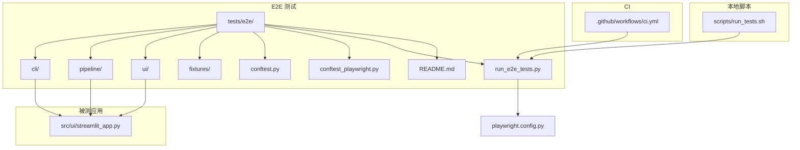
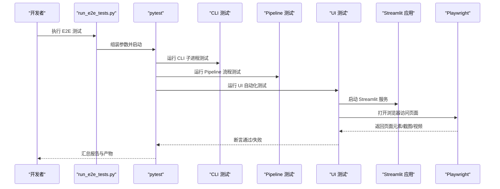
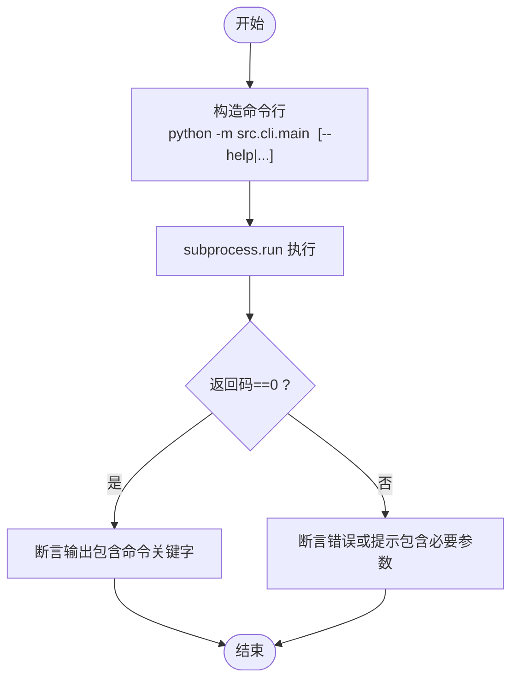
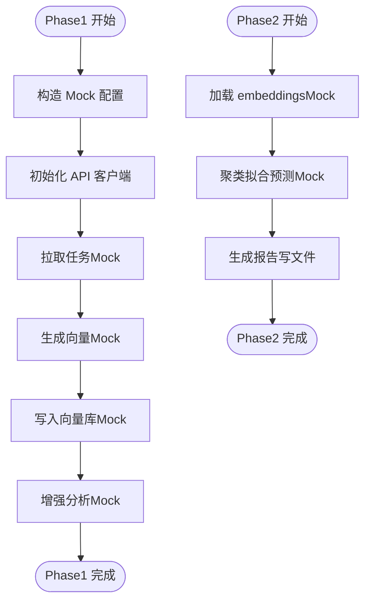
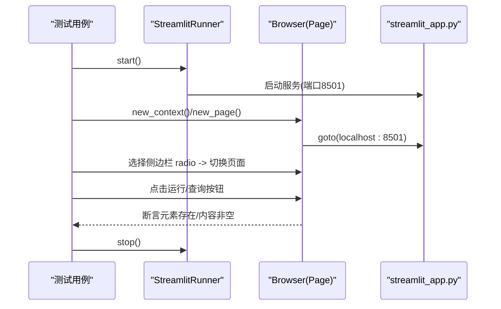
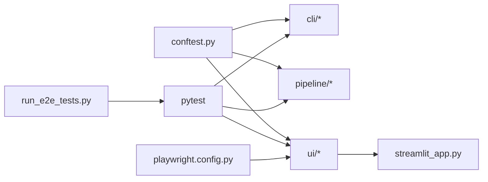

# 端到端测试

<cite>
**本文引用的文件**   
- [tests/e2e/README.md](file://tests/e2e/README.md)
- [playwright.config.py](file://playwright.config.py)
- [tests/e2e/conftest.py](file://tests/e2e/conftest.py)
- [tests/e2e/conftest_playwright.py](file://tests/e2e/conftest_playwright.py)
- [tests/e2e/run_e2e_tests.py](file://tests/e2e/run_e2e_tests.py)
- [tests/e2e/cli/test_analyze.py](file://tests/e2e/cli/test_analyze.py)
- [tests/e2e/cli/test_fetch.py](file://tests/e2e/cli/test_fetch.py)
- [tests/e2e/cli/test_report.py](file://tests/e2e/cli/test_report.py)
- [tests/e2e/pipeline/test_phase1.py](file://tests/e2e/pipeline/test_phase1.py)
- [tests/e2e/pipeline/test_phase2.py](file://tests/e2e/pipeline/test_phase2.py)
- [tests/e2e/fixtures/test_data.py](file://tests/e2e/fixtures/test_data.py)
- [src/ui/streamlit_app.py](file://src/ui/streamlit_app.py)
- [tests/e2e/ui/test_streamlit.py](file://tests/e2e/ui/test_streamlit.py)
- [.github/workflows/ci.yml](file://.github/workflows/ci.yml)
- [scripts/run_tests.sh](file://scripts/run_tests.sh)
</cite>

## 目录
1. [简介](#简介)
2. [项目结构](#项目结构)
3. [核心组件](#核心组件)
4. [架构总览](#架构总览)
5. [详细组件分析](#详细组件分析)
6. [依赖关系分析](#依赖关系分析)
7. [性能与并行策略](#性能与并行策略)
8. [故障排查指南](#故障排查指南)
9. [结论](#结论)
10. [附录](#附录)

## 简介
本文件面向“端到端测试”的构建、运行与维护，覆盖以下目标：
- Playwright 浏览器自动化测试的配置与使用（页面元素定位、用户交互模拟、截图验证）
- CLI 工具的端到端测试（命令执行、输出验证、错误场景）
- Streamlit UI 界面的自动化测试（组件交互、状态验证）
- 测试数据生命周期管理（准备、清理、版本控制）
- 测试环境隔离与并行执行策略
- 测试报告生成与结果分析
- 持续集成中的 E2E 配置与优化

## 项目结构
E2E 测试位于 tests/e2e 目录，按功能域划分为 CLI、Pipeline、UI 三类；同时提供统一的运行脚本、Playwright 配置与共享 fixtures。

图表来源
- [tests/e2e/README.md:1-78](file://tests/e2e/README.md#L1-L78)
- [playwright.config.py:1-76](file://playwright.config.py#L1-L76)
- [tests/e2e/run_e2e_tests.py:1-69](file://tests/e2e/run_e2e_tests.py#L1-L69)
- [src/ui/streamlit_app.py:1-548](file://src/ui/streamlit_app.py#L1-L548)
- [.github/workflows/ci.yml:1-78](file://.github/workflows/ci.yml#L1-L78)
- [scripts/run_tests.sh:1-149](file://scripts/run_tests.sh#L1-L149)

章节来源
- [tests/e2e/README.md:1-78](file://tests/e2e/README.md#L1-L78)
- [playwright.config.py:1-76](file://playwright.config.py#L1-L76)
- [tests/e2e/run_e2e_tests.py:1-69](file://tests/e2e/run_e2e_tests.py#L1-L69)

## 核心组件
- Playwright 配置与标记
  - 自定义 pytest 选项 --browser、--headed
  - 自动为 UI/Pipeline/CLI 测试添加 e2e 标记
  - 集中式 PLAYWRIGHT_CONFIG 字典用于统一浏览器行为
- 共享 fixtures
  - API 密钥、基础 URL、路径前缀等环境变量注入
  - 小批量测试 ID 读取（Excel），便于快速回归
  - 输出目录与 Chroma 持久化目录约定
- 运行器与报告
  - run_e2e_tests.py 封装 pytest 调用，支持按模块筛选、headed 模式、HTML 报告、并行
  - README 提供常用运行命令与产物说明

章节来源
- [playwright.config.py:1-76](file://playwright.config.py#L1-L76)
- [tests/e2e/conftest.py:1-59](file://tests/e2e/conftest.py#L1-L59)
- [tests/e2e/fixtures/test_data.py:1-40](file://tests/e2e/fixtures/test_data.py#L1-L40)
- [tests/e2e/run_e2e_tests.py:1-69](file://tests/e2e/run_e2e_tests.py#L1-L69)
- [tests/e2e/README.md:1-78](file://tests/e2e/README.md#L1-L78)

## 架构总览
E2E 测试由三类用例组成：CLI 子进程调用、Pipeline 流程（含 mock）、Streamlit UI 自动化。三者共用配置与 fixtures，并通过运行器统一编排。

图表来源
- [tests/e2e/run_e2e_tests.py:1-69](file://tests/e2e/run_e2e_tests.py#L1-L69)
- [tests/e2e/ui/test_streamlit.py:1-186](file://tests/e2e/ui/test_streamlit.py#L1-L186)
- [src/ui/streamlit_app.py:1-548](file://src/ui/streamlit_app.py#L1-L548)
- [playwright.config.py:1-76](file://playwright.config.py#L1-L76)

## 详细组件分析

### CLI 端到端测试
- 目标
  - 验证 help 输出与必要参数校验
  - 验证错误场景（缺失必填参数）
- 关键实现要点
  - 通过 subprocess 调用 Python 模块入口
  - 断言返回码与标准输出包含关键字
- 典型用例
  - analyze/help、analyze/缺少 task-id
  - fetch/help、fetch/单条与多条任务获取（结合 APIClient）
  - report/help、report/缺少 task-id

图表来源
- [tests/e2e/cli/test_analyze.py:1-34](file://tests/e2e/cli/test_analyze.py#L1-L34)
- [tests/e2e/cli/test_fetch.py:1-63](file://tests/e2e/cli/test_fetch.py#L1-L63)
- [tests/e2e/cli/test_report.py:1-33](file://tests/e2e/cli/test_report.py#L1-L33)

章节来源
- [tests/e2e/cli/test_analyze.py:1-34](file://tests/e2e/cli/test_analyze.py#L1-L34)
- [tests/e2e/cli/test_fetch.py:1-63](file://tests/e2e/cli/test_fetch.py#L1-L63)
- [tests/e2e/cli/test_report.py:1-33](file://tests/e2e/cli/test_report.py#L1-L33)

### Pipeline 端到端测试
- 目标
  - Phase1：数据准备（嵌入、入库、增强分析）
  - Phase2：聚类分析与报告生成
- 关键实现要点
  - 使用 unittest.mock 对外部依赖（EmbeddingGenerator、ChromaManager、ClusterAnalyzer）进行打桩
  - 以少量测试 ID 驱动最小闭环
  - 断言数据结构与返回值类型

图表来源
- [tests/e2e/pipeline/test_phase1.py:1-120](file://tests/e2e/pipeline/test_phase1.py#L1-L120)
- [tests/e2e/pipeline/test_phase2.py:1-173](file://tests/e2e/pipeline/test_phase2.py#L1-L173)

章节来源
- [tests/e2e/pipeline/test_phase1.py:1-120](file://tests/e2e/pipeline/test_phase1.py#L1-L120)
- [tests/e2e/pipeline/test_phase2.py:1-173](file://tests/e2e/pipeline/test_phase2.py#L1-L173)

### Streamlit UI 端到端测试
- 目标
  - 启动被测 Streamlit 服务
  - 使用 Playwright 打开页面，导航各功能页，断言关键元素存在与可交互
  - 验证空数据与长文本等边界情况
- 关键实现要点
  - 通过子进程启动 streamlit run，轮询端口等待就绪
  - 使用 radio 选择不同页面，点击按钮触发逻辑
  - 使用 locator 定位输入框、按钮、图表容器等元素
  - 可选截图/视频/trace 辅助定位问题

图表来源
- [tests/e2e/ui/test_streamlit.py:1-186](file://tests/e2e/ui/test_streamlit.py#L1-L186)
- [src/ui/streamlit_app.py:1-548](file://src/ui/streamlit_app.py#L1-L548)

章节来源
- [tests/e2e/ui/test_streamlit.py:1-186](file://tests/e2e/ui/test_streamlit.py#L1-L186)
- [src/ui/streamlit_app.py:1-548](file://src/ui/streamlit_app.py#L1-L548)

### Playwright 配置与使用
- 配置项
  - 浏览器类型与 headed/headless 切换
  - 视口大小、忽略 HTTPS 错误、失败截图、失败视频、首次重试 trace
- 使用建议
  - 在 CI 默认 headless；本地调试使用 --headed
  - 通过 --browser 指定 chromium/firefox/webkit
  - 利用只失败时截图/视频与 trace 提升排障效率

章节来源
- [playwright.config.py:1-76](file://playwright.config.py#L1-L76)
- [tests/e2e/conftest_playwright.py:1-16](file://tests/e2e/conftest_playwright.py#L1-L16)

### 测试数据生命周期管理
- 数据来源
  - 从 Excel 读取少量故障单号作为快速数据集
- 生命周期
  - 准备：fixture 读取 Excel 并返回前 N 个 ID
  - 使用：CLI/Pipeline/UI 用例按需消费 small_test_ids
  - 清理：输出目录约定在 output/e2e，可在 CI 中归档或清理
- 版本控制
  - 示例数据文件应纳入版本控制或随仓库分发；若过大建议使用外部存储并在 fixture 中判断存在性后跳过

章节来源
- [tests/e2e/conftest.py:1-59](file://tests/e2e/conftest.py#L1-L59)
- [tests/e2e/fixtures/test_data.py:1-40](file://tests/e2e/fixtures/test_data.py#L1-L40)

### 测试环境隔离与并行执行
- 环境隔离
  - 通过环境变量注入 API 密钥与基础地址，避免硬编码
  - 每个测试用例使用独立 Page/Context，避免状态污染
- 并行执行
  - 使用 pytest-xdist（-n auto）并行运行
  - 注意：UI 测试需确保端口不冲突（当前固定 8501，建议在并发时动态分配端口）

章节来源
- [tests/e2e/conftest.py:1-59](file://tests/e2e/conftest.py#L1-L59)
- [tests/e2e/run_e2e_tests.py:1-69](file://tests/e2e/run_e2e_tests.py#L1-L69)
- [tests/e2e/ui/test_streamlit.py:1-186](file://tests/e2e/ui/test_streamlit.py#L1-L186)

### 测试报告与结果分析
- 产物
  - HTML 报告、截图、视频、trace
- 生成方式
  - 通过运行器传入 --html 与 --self-contained-html
  - Playwright 自动在失败时保存截图/视频，trace 在首次重试时启用
- 查看与分析
  - 打开 playwright-report/index.html 浏览详情
  - 结合 artifacts 下的截图/视频/trace 定位问题

章节来源
- [tests/e2e/README.md:1-78](file://tests/e2e/README.md#L1-L78)
- [playwright.config.py:1-76](file://playwright.config.py#L1-L76)
- [tests/e2e/run_e2e_tests.py:1-69](file://tests/e2e/run_e2e_tests.py#L1-L69)

### 持续集成中的 E2E 配置与优化
- 现状
  - CI 仅运行单元测试与覆盖率上报，未包含 E2E
- 建议
  - 新增 job 专门运行 E2E，安装依赖并缓存 pip
  - 使用矩阵覆盖多 Python 版本
  - 将 HTML 报告与 artifacts 上传为构建产物
  - 仅在 main/master 分支合并后运行完整 E2E，PR 阶段可仅跑轻量 CLI/Pipeline 用例

章节来源
- [.github/workflows/ci.yml:1-78](file://.github/workflows/ci.yml#L1-L78)

## 依赖关系分析
- 模块耦合
  - CLI/Pipeline/UI 测试均依赖 conftest 提供的 fixtures
  - UI 测试依赖被测 Streamlit 应用
  - 运行器聚合所有 E2E 用例并传递参数
- 外部依赖
  - Playwright 浏览器与驱动
  - Streamlit 运行时
  - 可选：pytest-xdist（并行）

图表来源
- [tests/e2e/conftest.py:1-59](file://tests/e2e/conftest.py#L1-L59)
- [tests/e2e/run_e2e_tests.py:1-69](file://tests/e2e/run_e2e_tests.py#L1-L69)
- [src/ui/streamlit_app.py:1-548](file://src/ui/streamlit_app.py#L1-L548)
- [playwright.config.py:1-76](file://playwright.config.py#L1-L76)

## 性能与并行策略
- 减少外部调用
  - Pipeline 测试大量使用 mock，避免真实网络与模型推理
- 浏览器优化
  - CI 使用 headless；必要时开启 --headed 复现
  - 合理设置超时与等待策略，避免过度等待
- 并行
  - 使用 -n auto 并行；UI 测试建议串行或分片以避免端口冲突
- 缓存
  - 复用 pip 缓存与浏览器二进制，缩短冷启动时间

[本节为通用指导，无需源码引用]

## 故障排查指南
- 常见问题
  - 环境变量缺失导致跳过：检查 DEVCLOUD_TOKEN、API_BASE_URL、API_PATH_PREFIX
  - 测试数据文件不存在：fixture 会跳过相关用例，确认 data 目录下 Excel 是否存在
  - Streamlit 启动超时：检查端口占用与服务日志
  - 浏览器不可用：确保已安装 Playwright 浏览器驱动
- 定位手段
  - 使用 --headed 观察界面
  - 查看失败截图/视频/trace
  - 使用 run_tests.sh 一键执行 lint/type-check/test/coverage，快速定位代码质量与覆盖率问题

章节来源
- [tests/e2e/conftest.py:1-59](file://tests/e2e/conftest.py#L1-L59)
- [tests/e2e/ui/test_streamlit.py:1-186](file://tests/e2e/ui/test_streamlit.py#L1-L186)
- [scripts/run_tests.sh:1-149](file://scripts/run_tests.sh#L1-L149)

## 结论
本项目已具备较完整的 E2E 测试骨架：CLI 子进程验证、Pipeline 流程（mock 驱动）、Streamlit UI 自动化，配合 Playwright 配置与运行器，可实现从本地到 CI 的端到端质量保障。后续建议完善 CI 中的 E2E 作业、细化 UI 断言与可视化对比、引入更完善的测试数据管理与产物归档策略。

[本节为总结，无需源码引用]

## 附录
- 常用命令
  - 运行全部 E2E：参考运行器与 README
  - 仅 CLI/Pipeline/UI：使用运行器参数过滤
  - 生成 HTML 报告：运行器 --html
  - 本地全量检查：scripts/run_tests.sh

章节来源
- [tests/e2e/README.md:1-78](file://tests/e2e/README.md#L1-L78)
- [tests/e2e/run_e2e_tests.py:1-69](file://tests/e2e/run_e2e_tests.py#L1-L69)
- [scripts/run_tests.sh:1-149](file://scripts/run_tests.sh#L1-L149)
