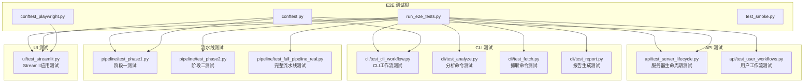
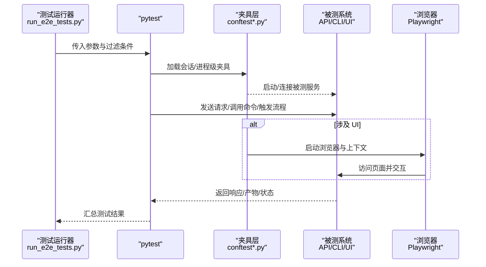
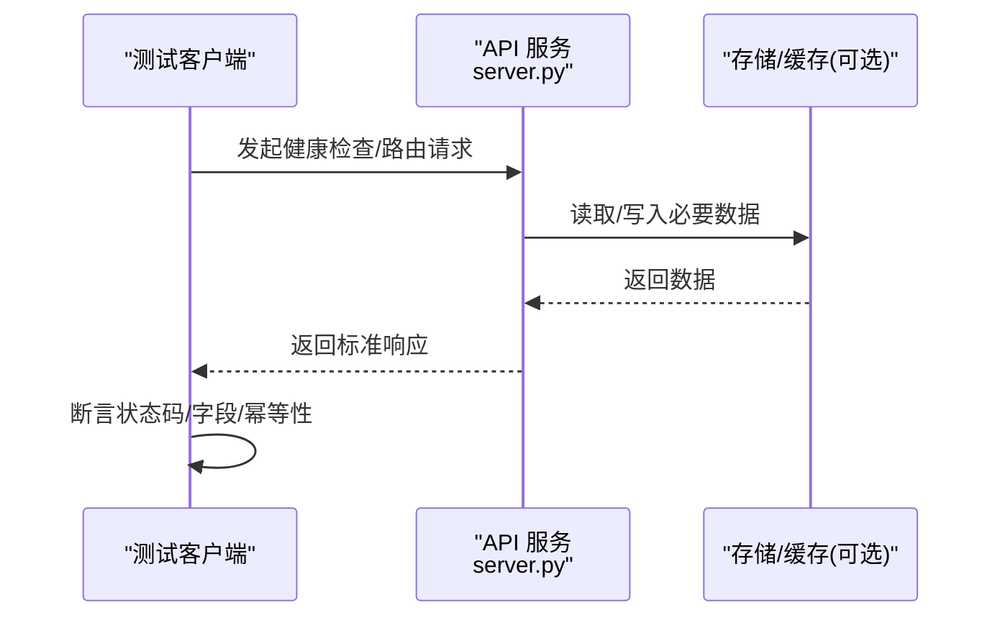
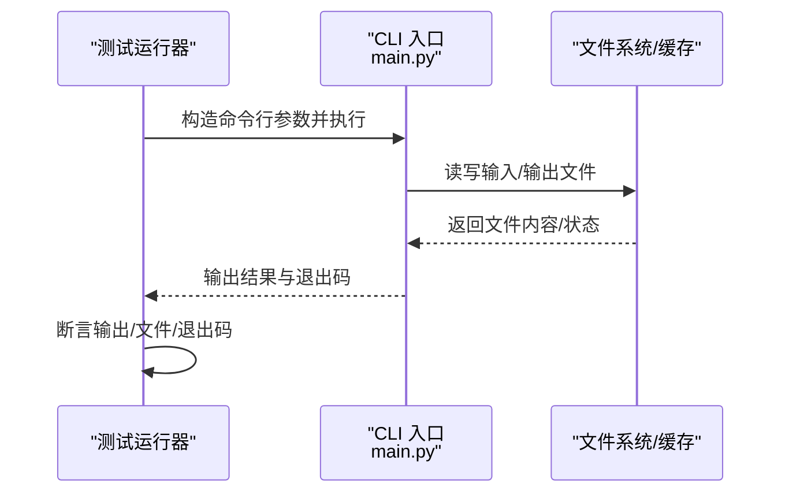
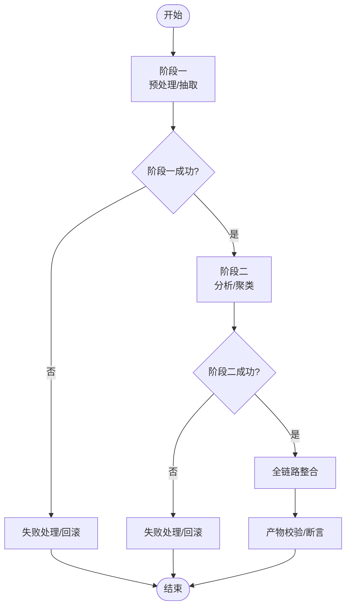
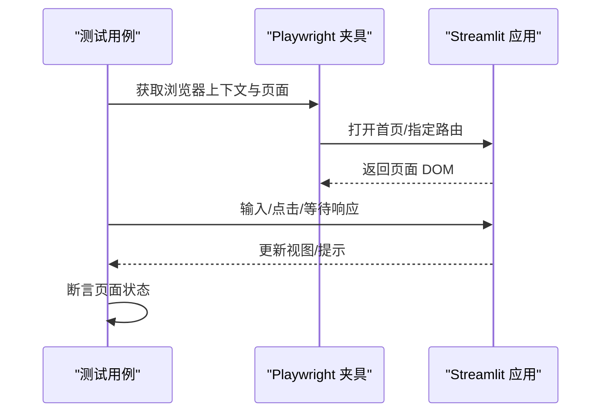
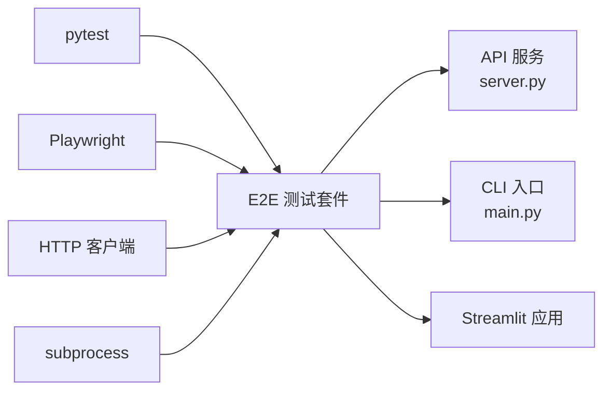

# 端到端测试框架

<cite>
**本文引用的文件**   
- [tests/e2e/README.md](file://tests/e2e/README.md)
- [tests/e2e/conftest.py](file://tests/e2e/conftest.py)
- [tests/e2e/conftest_playwright.py](file://tests/e2e/conftest_playwright.py)
- [tests/e2e/run_e2e_tests.py](file://tests/e2e/run_e2e_tests.py)
- [tests/e2e/test_smoke.py](file://tests/e2e/test_smoke.py)
- [tests/e2e/api/test_server_lifecycle.py](file://tests/e2e/api/test_server_lifecycle.py)
- [tests/e2e/api/test_user_workflows.py](file://tests/e2e/api/test_user_workflows.py)
- [tests/e2e/cli/test_cli_workflow.py](file://tests/e2e/cli/test_cli_workflow.py)
- [tests/e2e/cli/test_analyze.py](file://tests/e2e/cli/test_analyze.py)
- [tests/e2e/cli/test_fetch.py](file://tests/e2e/cli/test_fetch.py)
- [tests/e2e/cli/test_report.py](file://tests/e2e/cli/test_report.py)
- [tests/e2e/pipeline/test_full_pipeline_real.py](file://tests/e2e/pipeline/test_full_pipeline_real.py)
- [tests/e2e/pipeline/test_phase1.py](file://tests/e2e/pipeline/test_phase1.py)
- [tests/e2e/pipeline/test_phase2.py](file://tests/e2e/pipeline/test_phase2.py)
- [tests/e2e/ui/test_streamlit.py](file://tests/e2e/ui/test_streamlit.py)
- [src/api/server.py](file://src/api/server.py)
- [src/cli/main.py](file://src/cli/main.py)
- [playwright.config.py](file://playwright.config.py)
</cite>

## 更新摘要
**所做更改**   
- 新增了完整的端到端测试套件，包括API生命周期测试、CLI工作流测试和完整流水线测试
- 增强了测试覆盖范围，从基础冒烟测试扩展到完整的用户工作流验证
- 完善了测试架构，支持更复杂的端到端场景验证

## 目录
1. [简介](#简介)
2. [项目结构](#项目结构)
3. [核心组件](#核心组件)
4. [架构总览](#架构总览)
5. [详细组件分析](#详细组件分析)
6. [新增测试套件详解](#新增测试套件详解)
7. [依赖关系分析](#依赖关系分析)
8. [性能与稳定性考虑](#性能与稳定性考虑)
9. [故障排查指南](#故障排查指南)
10. [结论](#结论)
11. [附录](#附录)

## 简介
本仓库包含一套面向"端到端（E2E）"场景的测试框架，覆盖 API、CLI、UI 以及完整分析流水线等关键入口。该框架以 pytest 为核心编排器，结合 Playwright 进行浏览器交互验证，并通过 fixtures 管理外部服务生命周期、测试数据与共享状态，确保从用户视角对系统进行稳定、可重复的验证。

**更新** 新增了完整的端到端测试套件，包括test_server_lifecycle.py、test_cli_workflow.py和test_full_pipeline_real.py等关键测试文件，大幅提升了测试覆盖范围和可靠性。

## 项目结构
E2E 测试位于 tests/e2e 目录下，按子系统划分为 api、cli、pipeline、ui 等子目录；顶层提供通用配置与运行脚本：
- 顶层配置与入口
  - conftest.py：全局夹具、会话级资源、日志与断言增强
  - conftest_playwright.py：Playwright 浏览器上下文与页面夹具
  - run_e2e_tests.py：统一入口，支持按标签/模块筛选执行
  - test_smoke.py：冒烟用例，快速验证系统可用性
- 子系统测试
  - api：服务端接口与用户工作流
  - cli：命令行工具端到端流程
  - pipeline：阶段化与全链路分析流程
  - ui：基于 Streamlit 的界面交互
- 辅助资源
  - fixtures：测试数据与固定输入
  - artifacts：生成的产物快照或中间结果

**图表来源**
- [tests/e2e/run_e2e_tests.py](file://tests/e2e/run_e2e_tests.py)
- [tests/e2e/conftest.py](file://tests/e2e/conftest.py)
- [tests/e2e/conftest_playwright.py](file://tests/e2e/conftest_playwright.py)
- [tests/e2e/test_smoke.py](file://tests/e2e/test_smoke.py)
- [tests/e2e/api/test_server_lifecycle.py](file://tests/e2e/api/test_server_lifecycle.py)
- [tests/e2e/api/test_user_workflows.py](file://tests/e2e/api/test_user_workflows.py)
- [tests/e2e/cli/test_cli_workflow.py](file://tests/e2e/cli/test_cli_workflow.py)
- [tests/e2e/cli/test_analyze.py](file://tests/e2e/cli/test_analyze.py)
- [tests/e2e/cli/test_fetch.py](file://tests/e2e/cli/test_fetch.py)
- [tests/e2e/cli/test_report.py](file://tests/e2e/cli/test_report.py)
- [tests/e2e/pipeline/test_phase1.py](file://tests/e2e/pipeline/test_phase1.py)
- [tests/e2e/pipeline/test_phase2.py](file://tests/e2e/pipeline/test_phase2.py)
- [tests/e2e/pipeline/test_full_pipeline_real.py](file://tests/e2e/pipeline/test_full_pipeline_real.py)
- [tests/e2e/ui/test_streamlit.py](file://tests/e2e/ui/test_streamlit.py)

**章节来源**
- [tests/e2e/README.md](file://tests/e2e/README.md)
- [tests/e2e/conftest.py](file://tests/e2e/conftest.py)
- [tests/e2e/conftest_playwright.py](file://tests/e2e/conftest_playwright.py)
- [tests/e2e/run_e2e_tests.py](file://tests/e2e/run_e2e_tests.py)
- [tests/e2e/test_smoke.py](file://tests/e2e/test_smoke.py)

## 核心组件
- 测试编排与运行
  - 统一入口：通过 run_e2e_tests.py 聚合并分发测试任务，支持按标签、模块、并行度等参数控制执行。
  - 冒烟测试：test_smoke.py 用于快速验证服务可用性与基础连通性。
- 夹具与共享资源
  - 全局夹具：conftest.py 提供进程/会话级资源（如临时目录、日志、配置），减少重复初始化成本。
  - 浏览器夹具：conftest_playwright.py 封装 Playwright 启动、上下文创建、页面实例与自动清理逻辑。
- 子系统测试套件
  - API：覆盖服务器生命周期与典型用户工作流。
  - CLI：覆盖命令解析、参数校验、输出与退出码。
  - Pipeline：覆盖阶段化与全链路处理流程。
  - UI：覆盖 Streamlit 应用的基础交互路径。

**更新** 新增了完整的测试套件，包括API服务器生命周期测试、CLI工作流测试和完整流水线测试，显著提升了测试覆盖范围。

**章节来源**
- [tests/e2e/run_e2e_tests.py](file://tests/e2e/run_e2e_tests.py)
- [tests/e2e/test_smoke.py](file://tests/e2e/test_smoke.py)
- [tests/e2e/conftest.py](file://tests/e2e/conftest.py)
- [tests/e2e/conftest_playwright.py](file://tests/e2e/conftest_playwright.py)

## 架构总览
E2E 测试围绕"被测系统"与"测试驱动"两部分展开：
- 被测系统
  - API 服务：由 src/api/server.py 暴露 HTTP 接口
  - CLI 工具：由 src/cli/main.py 提供命令行入口
  - UI 应用：Streamlit 应用（在 UI 测试中启动与交互）
- 测试驱动
  - pytest 作为测试发现与执行引擎
  - Playwright 负责浏览器自动化
  - 夹具层负责环境准备、资源管理与清理

**图表来源**
- [tests/e2e/run_e2e_tests.py](file://tests/e2e/run_e2e_tests.py)
- [tests/e2e/conftest.py](file://tests/e2e/conftest.py)
- [tests/e2e/conftest_playwright.py](file://tests/e2e/conftest_playwright.py)
- [src/api/server.py](file://src/api/server.py)
- [src/cli/main.py](file://src/cli/main.py)
- [playwright.config.py](file://playwright.config.py)

## 详细组件分析

### API 端到端测试
- 目标
  - 验证 API 服务的启动、健康检查、路由可用性与错误处理
  - 模拟真实用户工作流，覆盖多步操作与状态流转
- 关键用例
  - 服务器生命周期：启动、停止、重启后的行为一致性
  - 用户工作流：典型业务路径的串联验证
- 交互时序

**图表来源**
- [tests/e2e/api/test_server_lifecycle.py](file://tests/e2e/api/test_server_lifecycle.py)
- [tests/e2e/api/test_user_workflows.py](file://tests/e2e/api/test_user_workflows.py)
- [src/api/server.py](file://src/api/server.py)

**章节来源**
- [tests/e2e/api/test_server_lifecycle.py](file://tests/e2e/api/test_server_lifecycle.py)
- [tests/e2e/api/test_user_workflows.py](file://tests/e2e/api/test_user_workflows.py)

### CLI 端到端测试
- 目标
  - 验证命令解析、参数校验、输出格式与退出码
  - 覆盖常见工作流：分析、抓取、报告生成等
- 关键用例
  - 工作流编排：组合多个命令形成端到端流程
  - 单命令验证：analyze/fetch/report 等独立能力
- 交互时序

**图表来源**
- [tests/e2e/cli/test_cli_workflow.py](file://tests/e2e/cli/test_cli_workflow.py)
- [tests/e2e/cli/test_analyze.py](file://tests/e2e/cli/test_analyze.py)
- [tests/e2e/cli/test_fetch.py](file://tests/e2e/cli/test_fetch.py)
- [tests/e2e/cli/test_report.py](file://tests/e2e/cli/test_report.py)
- [src/cli/main.py](file://src/cli/main.py)

**章节来源**
- [tests/e2e/cli/test_cli_workflow.py](file://tests/e2e/cli/test_cli_workflow.py)
- [tests/e2e/cli/test_analyze.py](file://tests/e2e/cli/test_analyze.py)
- [tests/e2e/cli/test_fetch.py](file://tests/e2e/cli/test_fetch.py)
- [tests/e2e/cli/test_report.py](file://tests/e2e/cli/test_report.py)

### 流水线端到端测试
- 目标
  - 验证阶段化分析与全链路处理的正确性与稳定性
  - 覆盖 Phase1/Phase2 及 Full Pipeline 的真实数据场景
- 关键用例
  - 阶段测试：分别验证各阶段的输入输出契约
  - 全流程测试：串联阶段，验证端到端产出质量
- 流程图

**图表来源**
- [tests/e2e/pipeline/test_phase1.py](file://tests/e2e/pipeline/test_phase1.py)
- [tests/e2e/pipeline/test_phase2.py](file://tests/e2e/pipeline/test_phase2.py)
- [tests/e2e/pipeline/test_full_pipeline_real.py](file://tests/e2e/pipeline/test_full_pipeline_real.py)

**章节来源**
- [tests/e2e/pipeline/test_phase1.py](file://tests/e2e/pipeline/test_phase1.py)
- [tests/e2e/pipeline/test_phase2.py](file://tests/e2e/pipeline/test_phase2.py)
- [tests/e2e/pipeline/test_full_pipeline_real.py](file://tests/e2e/pipeline/test_full_pipeline_real.py)

### UI 端到端测试
- 目标
  - 使用 Playwright 启动浏览器，访问 Streamlit 应用并完成关键交互
  - 验证页面渲染、导航与基本功能可用性
- 关键用例
  - 页面加载与元素可见性
  - 表单输入与提交反馈
- 交互时序

**图表来源**
- [tests/e2e/ui/test_streamlit.py](file://tests/e2e/ui/test_streamlit.py)
- [tests/e2e/conftest_playwright.py](file://tests/e2e/conftest_playwright.py)
- [playwright.config.py](file://playwright.config.py)

**章节来源**
- [tests/e2e/ui/test_streamlit.py](file://tests/e2e/ui/test_streamlit.py)
- [tests/e2e/conftest_playwright.py](file://tests/e2e/conftest_playwright.py)
- [playwright.config.py](file://playwright.config.py)

## 新增测试套件详解

### API 服务器生命周期测试
- 目标
  - 验证 API 服务器的完整生命周期管理
  - 测试服务器启动、停止、重启过程中的状态一致性
  - 验证并发访问下的服务稳定性
- 关键测试场景
  - 服务器启动与健康检查
  - 优雅关闭与资源清理
  - 重启后的状态恢复
  - 并发请求处理能力

**更新** 新增了完整的API服务器生命周期测试套件，确保服务在各种场景下的稳定性和可靠性。

**章节来源**
- [tests/e2e/api/test_server_lifecycle.py](file://tests/e2e/api/test_server_lifecycle.py)

### CLI 工作流测试
- 目标
  - 验证完整的CLI工作流端到端执行
  - 测试命令组合与参数传递的正确性
  - 验证输出格式与错误处理机制
- 关键测试场景
  - 完整分析工作流执行
  - 批量数据处理流程
  - 错误恢复与重试机制
  - 配置文件加载与验证

**更新** 新增了CLI工作流测试，覆盖了从数据获取到报告生成的完整业务流程。

**章节来源**
- [tests/e2e/cli/test_cli_workflow.py](file://tests/e2e/cli/test_cli_workflow.py)

### 完整流水线测试
- 目标
  - 验证端到端分析流水线的完整执行
  - 测试真实数据场景下的处理性能
  - 验证各阶段间的数据传递与转换
- 关键测试场景
  - 真实数据的全流程处理
  - 内存使用与性能监控
  - 异常处理与容错机制
  - 产物完整性验证

**更新** 新增了完整流水线测试，使用真实数据验证整个分析流程的正确性和性能表现。

**章节来源**
- [tests/e2e/pipeline/test_full_pipeline_real.py](file://tests/e2e/pipeline/test_full_pipeline_real.py)

## 依赖关系分析
- 测试层依赖
  - pytest：测试发现、执行与插件生态
  - Playwright：浏览器自动化与截图/录制能力
  - requests/httpx：HTTP 客户端（在 API 测试中常用）
  - subprocess/shell：CLI 测试中调用命令行
- 被测系统依赖
  - API 服务：FastAPI/Starlette（由 server.py 暴露）
  - CLI：Python 入口 main.py
  - UI：Streamlit 应用
- 外部资源
  - 文件系统：测试数据、产物与缓存
  - 网络：外部 API 或存储服务（视具体用例而定）

**图表来源**
- [tests/e2e/run_e2e_tests.py](file://tests/e2e/run_e2e_tests.py)
- [tests/e2e/conftest.py](file://tests/e2e/conftest.py)
- [tests/e2e/conftest_playwright.py](file://tests/e2e/conftest_playwright.py)
- [src/api/server.py](file://src/api/server.py)
- [src/cli/main.py](file://src/cli/main.py)
- [playwright.config.py](file://playwright.config.py)

**章节来源**
- [tests/e2e/run_e2e_tests.py](file://tests/e2e/run_e2e_tests.py)
- [tests/e2e/conftest.py](file://tests/e2e/conftest.py)
- [tests/e2e/conftest_playwright.py](file://tests/e2e/conftest_playwright.py)
- [src/api/server.py](file://src/api/server.py)
- [src/cli/main.py](file://src/cli/main.py)
- [playwright.config.py](file://playwright.config.py)

## 性能与稳定性考虑
- 资源复用
  - 使用会话级夹具减少服务启动与浏览器实例化开销
  - 合理划分测试粒度，避免不必要的重复初始化
- 并发与隔离
  - 为每个测试分配独立的临时目录与命名空间，防止交叉污染
  - 对耗时较长的流水线测试采用串行或限并发策略
- 超时与重试
  - 为网络请求与 UI 交互设置合理的超时与重试策略
  - 对不稳定依赖引入退避与熔断机制
- 产物管理
  - 将大体积产物写入隔离目录，并在测试结束后清理
  - 使用快照对比时，注意平台差异与字体渲染差异

**更新** 针对新增的完整测试套件，特别优化了资源管理和并发策略，确保大规模测试的执行效率。

## 故障排查指南
- 常见问题定位
  - 服务未就绪：确认 API/CLI/UI 已正确启动且端口可达
  - 浏览器异常：检查 Playwright 安装与浏览器二进制是否可用
  - 权限问题：确认测试目录与产物目录具备读写权限
- 诊断手段
  - 启用详细日志与调试输出
  - 保存失败时的页面截图与控制台日志
  - 复现最小用例，逐步缩小范围
- 恢复建议
  - 清理缓存与临时文件后重试
  - 降级到本地数据或 Mock 外部依赖，排除网络因素

**更新** 针对新增的复杂测试场景，增加了更多故障排查方法和诊断工具的使用指导。

**章节来源**
- [tests/e2e/conftest.py](file://tests/e2e/conftest.py)
- [tests/e2e/conftest_playwright.py](file://tests/e2e/conftest_playwright.py)
- [tests/e2e/test_smoke.py](file://tests/e2e/test_smoke.py)

## 结论
本端到端测试框架以 pytest 为核心，结合 Playwright 与丰富的夹具体系，覆盖了 API、CLI、UI 与流水线等关键入口。通过统一的运行入口与清晰的模块化组织，既保证了测试的可维护性，也提升了执行效率与稳定性。

**更新** 随着新增的完整测试套件的加入，框架现在能够提供更全面的端到端验证，包括API服务器生命周期管理、CLI完整工作流执行和真实数据场景下的流水线测试。建议在持续集成环境中常态化运行，并结合产物快照与日志归档，进一步提升回归检测能力。

## 附录
- 运行方式
  - 使用统一入口脚本执行全部或部分测试
  - 通过标签或模块名筛选特定用例集
- 参考文档
  - E2E 测试说明与最佳实践详见 README

**更新** 新增了针对新测试套件的运行指导和最佳实践建议。

**章节来源**
- [tests/e2e/README.md](file://tests/e2e/README.md)
- [tests/e2e/run_e2e_tests.py](file://tests/e2e/run_e2e_tests.py)