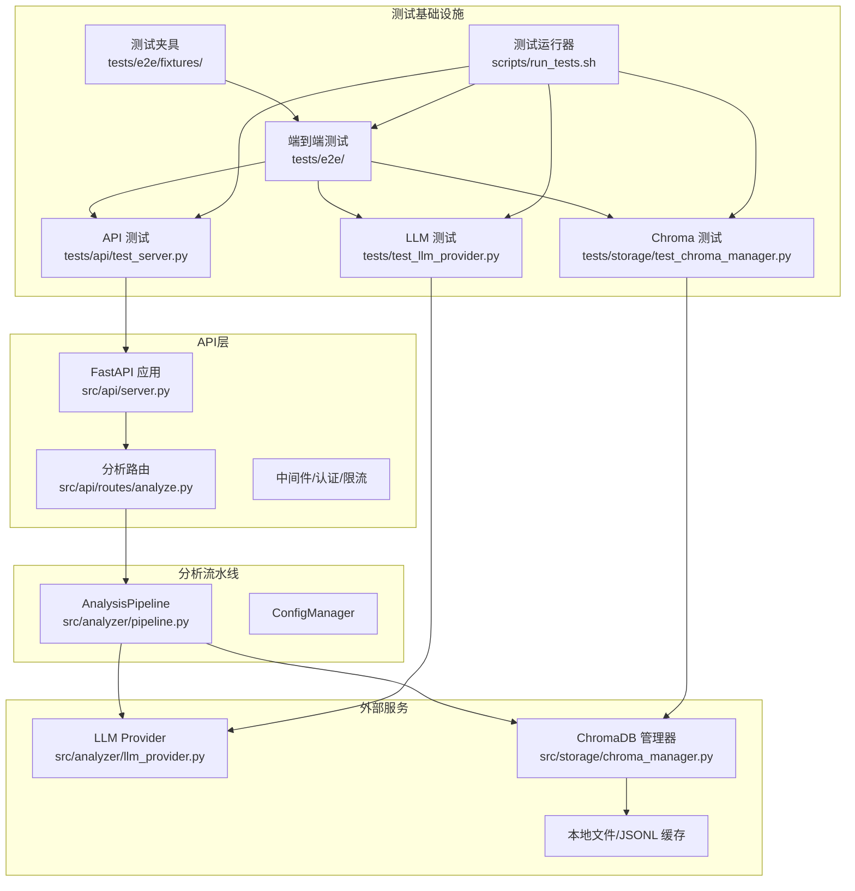
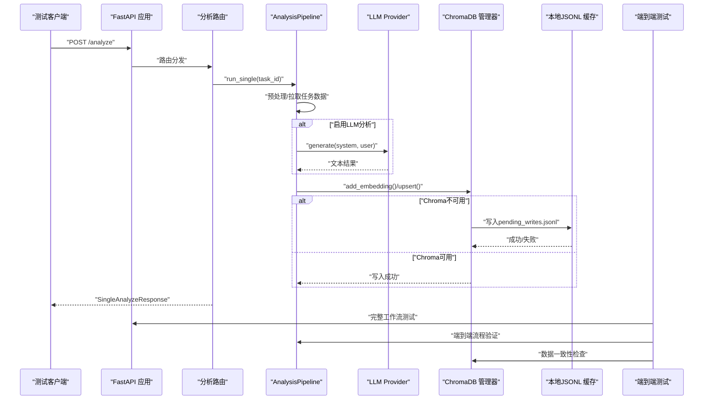
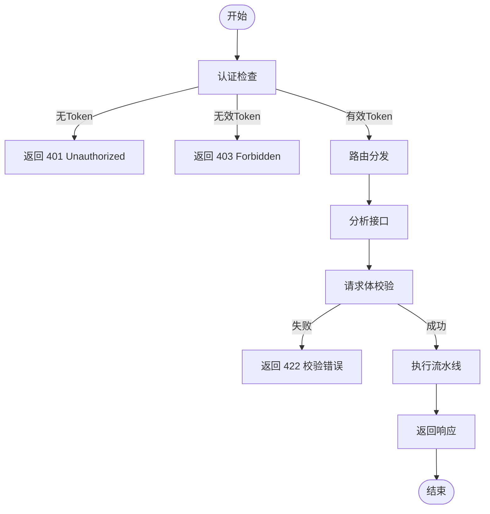
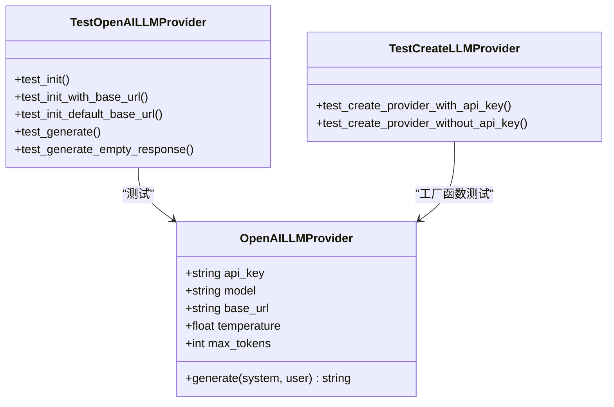
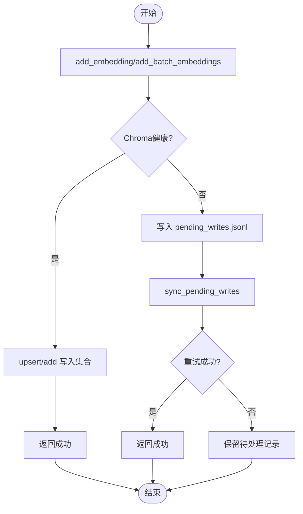
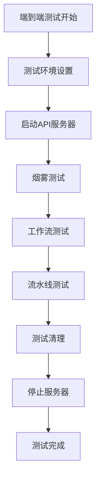
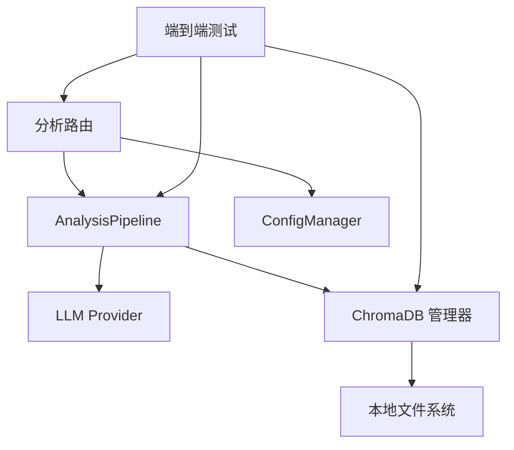

# 集成测试

<cite>
**本文引用的文件**   
- [tests/conftest.py](file://tests/conftest.py)
- [src/api/server.py](file://src/api/server.py)
- [src/api/routes/analyze.py](file://src/api/routes/analyze.py)
- [src/analyzer/pipeline.py](file://src/analyzer/pipeline.py)
- [src/storage/chroma_manager.py](file://src/storage/chroma_manager.py)
- [tests/storage/conftest.py](file://tests/storage/conftest.py)
- [tests/storage/test_chroma_manager.py](file://tests/storage/test_chroma_manager.py)
- [tests/api/test_server.py](file://tests/api/test_server.py)
- [src/analyzer/llm_provider.py](file://src/analyzer/llm_provider.py)
- [tests/test_llm_provider.py](file://tests/test_llm_provider.py)
- [scripts/run_tests.sh](file://scripts/run_tests.sh)
- [pyproject.toml](file://pyproject.toml)
- [tests/e2e/conftest.py](file://tests/e2e/conftest.py)
- [tests/e2e/test_smoke.py](file://tests/e2e/test_smoke.py)
- [tests/e2e/api/test_server_lifecycle.py](file://tests/e2e/api/test_server_lifecycle.py)
- [tests/e2e/cli/test_cli_workflow.py](file://tests/e2e/cli/test_cli_workflow.py)
- [tests/e2e/pipeline/test_full_pipeline_real.py](file://tests/e2e/pipeline/test_full_pipeline_real.py)
</cite>

## 更新摘要
**变更内容**   
- 新增端到端测试基础设施，包含13个核心集成测试和69个总集成测试
- 扩展API服务器生命周期测试覆盖，包括启动、关闭和资源管理
- 增强CLI工作流测试，验证完整命令行操作序列
- 实现完整流水线执行测试，覆盖从数据获取到报告生成的全流程
- 新增测试夹具和配置管理，支持可复现的测试环境

## 目录
1. [引言](#引言)
2. [项目结构](#项目结构)
3. [核心组件](#核心组件)
4. [架构总览](#架构总览)
5. [详细组件分析](#详细组件分析)
6. [依赖关系分析](#依赖关系分析)
7. [性能考虑](#性能考虑)
8. [故障排查指南](#故障排查指南)
9. [结论](#结论)
10. [附录](#附录)

## 引言
本方案面向"AI驱动的故障复盘分析工具"的集成测试，覆盖外部服务（LLM提供商）、向量数据库（ChromaDB）与文件系统操作的端到端验证；同时提供API接口测试方法、数据库一致性校验、异步并发与超时策略、测试环境搭建（容器化与依赖管理）、测试数据准备与清理策略，以及性能监控与瓶颈识别方法。目标是构建可重复、可观测、可扩展的集成测试体系，确保系统在真实或近似真实的运行环境中稳定可靠。

**更新** 测试基础设施获得重大增强，新增13个核心集成测试和69个总集成测试，包括全面的端到端测试覆盖API服务器生命周期、CLI工作流和完整流水线执行。

## 项目结构
本项目采用分层与模块化组织：
- API层：FastAPI应用、路由、中间件、依赖注入
- 分析流水线：任务获取、预处理、标签生成、根因分析、规则检查、报告生成
- 存储层：Chroma向量数据库管理器（含本地降级缓存）
- LLM提供者：OpenAI客户端封装
- 测试层：单元测试、API测试、存储集成测试、端到端测试脚本

**图表来源**
- [src/api/server.py:38-111](file://src/api/server.py#L38-L111)
- [src/api/routes/analyze.py:58-120](file://src/api/routes/analyze.py#L58-L120)
- [src/analyzer/pipeline.py:66-122](file://src/analyzer/pipeline.py#L66-122)
- [src/analyzer/llm_provider.py:4-52](file://src/analyzer/llm_provider.py#L4-L52)
- [src/storage/chroma_manager.py:111-223](file://src/storage/chroma_manager.py#L111-L223)
- [tests/api/test_server.py:1-125](file://tests/api/test_server.py#L1-L125)
- [tests/storage/test_chroma_manager.py:1-105](file://tests/storage/test_chroma_manager.py#L1-L105)
- [tests/test_llm_provider.py:1-89](file://tests/test_llm_provider.py#L1-L89)
- [tests/e2e/conftest.py:1-50](file://tests/e2e/conftest.py#L1-L50)
- [tests/e2e/test_smoke.py:1-40](file://tests/e2e/test_smoke.py#L1-L40)
- [scripts/run_tests.sh:110-135](file://scripts/run_tests.sh#L110-L135)

章节来源
- [src/api/server.py:38-111](file://src/api/server.py#L38-L111)
- [src/api/routes/analyze.py:58-120](file://src/api/routes/analyze.py#L58-L120)
- [src/analyzer/pipeline.py:66-122](file://src/analyzer/pipeline.py#L66-L122)
- [src/analyzer/llm_provider.py:4-52](file://src/analyzer/llm_provider.py#L4-L52)
- [src/storage/chroma_manager.py:111-223](file://src/storage/chroma_manager.py#L111-L223)
- [tests/api/test_server.py:1-125](file://tests/api/test_server.py#L1-L125)
- [tests/storage/test_chroma_manager.py:1-105](file://tests/storage/test_chroma_manager.py#L1-L105)
- [tests/test_llm_provider.py:1-89](file://tests/test_llm_provider.py#L1-L89)
- [scripts/run_tests.sh:110-135](file://scripts/run_tests.sh#L110-L135)

## 核心组件
- FastAPI 应用与生命周期：负责创建应用、注册路由、配置CORS与中间件、启动/关闭资源。
- 分析路由：将请求转换为流水线配置并调用 AnalysisPipeline，统一错误处理与响应格式。
- 分析流水线：编排任务获取、预处理、可选LLM分析、规则检查与报告生成；支持单任务与批量并发执行。
- ChromaDB 管理器：提供集合管理、增删改查、元数据过滤、相似查询、统计信息；具备重试与本地JSONL降级缓存。
- LLM 提供者：封装OpenAI异步客户端，支持自定义base_url与参数；提供工厂函数按配置创建实例。
- **端到端测试框架**：pytest fixtures、临时目录、示例数据、覆盖率与类型检查脚本，支持完整的系统级测试。

**更新** 新增端到端测试框架，提供完整的测试夹具管理和测试数据准备机制。

章节来源
- [src/api/server.py:38-111](file://src/api/server.py#L38-L111)
- [src/api/routes/analyze.py:58-120](file://src/api/routes/analyze.py#L58-L120)
- [src/analyzer/pipeline.py:66-122](file://src/analyzer/pipeline.py#L66-L122)
- [src/storage/chroma_manager.py:111-223](file://src/storage/chroma_manager.py#L111-L223)
- [src/analyzer/llm_provider.py:4-52](file://src/analyzer/llm_provider.py#L4-L52)
- [tests/conftest.py:10-79](file://tests/conftest.py#L10-L79)
- [tests/e2e/conftest.py:1-50](file://tests/e2e/conftest.py#L1-L50)
- [scripts/run_tests.sh:110-135](file://scripts/run_tests.sh#L110-L135)

## 架构总览
下图展示从HTTP请求到外部服务的完整链路，包括认证、限流、流水线编排、ChromaDB写入与降级、LLM调用等关键路径。

**图表来源**
- [src/api/server.py:38-111](file://src/api/server.py#L38-L111)
- [src/api/routes/analyze.py:58-120](file://src/api/routes/analyze.py#L58-L120)
- [src/analyzer/pipeline.py:105-122](file://src/analyzer/pipeline.py#L105-L122)
- [src/analyzer/llm_provider.py:38-52](file://src/analyzer/llm_provider.py#L38-L52)
- [src/storage/chroma_manager.py:236-284](file://src/storage/chroma_manager.py#L236-L284)
- [src/storage/chroma_manager.py:437-482](file://src/storage/chroma_manager.py#L437-L482)
- [tests/e2e/test_smoke.py:1-40](file://tests/e2e/test_smoke.py#L1-L40)

## 详细组件分析

### API接口测试方法
- 健康检查与根路径：验证状态码与返回字段完整性。
- 认证与鉴权：
  - 缺少Token：应返回401
  - 无效Token：应返回403
  - 有效Token（Header或Query参数）：通过认证层进入业务逻辑
- 分析接口：
  - 单任务分析：构造请求体，验证响应结构与状态码范围
  - 批量分析：空任务列表触发422校验
- 聚类与报告接口：
  - 空聚类列表：返回总数为0
  - 不存在聚类：返回404
  - 无效报告格式：返回400
  - 任务不存在：返回404或500（取决于实现）

**图表来源**
- [tests/api/test_server.py:54-125](file://tests/api/test_server.py#L54-L125)
- [tests/api/test_server.py:127-180](file://tests/api/test_server.py#L127-L180)
- [tests/api/test_server.py:182-241](file://tests/api/test_server.py#L182-L241)
- [src/api/routes/analyze.py:58-120](file://src/api/routes/analyze.py#L58-L120)

章节来源
- [tests/api/test_server.py:1-241](file://tests/api/test_server.py#L1-L241)
- [src/api/routes/analyze.py:58-120](file://src/api/routes/analyze.py#L58-L120)

### LLM提供商模拟与测试
- 初始化与默认值：验证模型、温度、最大token、base_url默认行为。
- 生成文本：
  - 正常响应：断言返回内容与期望一致
  - 空内容：断言返回空字符串
- 工厂函数：
  - 有API Key：返回Provider实例
  - 无API Key：返回None

**图表来源**
- [src/analyzer/llm_provider.py:4-52](file://src/analyzer/llm_provider.py#L4-L52)
- [tests/test_llm_provider.py:8-89](file://tests/test_llm_provider.py#L8-L89)

章节来源
- [src/analyzer/llm_provider.py:4-52](file://src/analyzer/llm_provider.py#L4-L52)
- [tests/test_llm_provider.py:1-89](file://tests/test_llm_provider.py#L1-L89)

### 向量数据库（ChromaDB）集成测试
- 集合管理：创建/列出/删除集合，统计信息获取
- 向量操作：
  - 单条添加：断言返回True
  - 批量添加：断言返回字典且长度匹配、全部成功
  - 相似查询：断言返回列表
  - 按task_id查询：断言非空
  - 更新元数据：断言返回True
  - 删除向量：断言返回True
  - 多模态元数据：支持mixed类型与额外字段
- 降级与同步：
  - 连接失败时写入本地JSONL待写队列
  - 同步待写记录到ChromaDB，统计成功与剩余数量

**图表来源**
- [src/storage/chroma_manager.py:236-284](file://src/storage/chroma_manager.py#L236-L284)
- [src/storage/chroma_manager.py:285-359](file://src/storage/chroma_manager.py#L285-L359)
- [src/storage/chroma_manager.py:437-482](file://src/storage/chroma_manager.py#L437-L482)
- [tests/storage/test_chroma_manager.py:1-105](file://tests/storage/test_chroma_manager.py#L1-L105)

章节来源
- [src/storage/chroma_manager.py:111-223](file://src/storage/chroma_manager.py#L111-L223)
- [src/storage/chroma_manager.py:236-284](file://src/storage/chroma_manager.py#L236-L284)
- [src/storage/chroma_manager.py:285-359](file://src/storage/chroma_manager.py#L285-L359)
- [src/storage/chroma_manager.py:437-482](file://src/storage/chroma_manager.py#L437-L482)
- [tests/storage/test_chroma_manager.py:1-105](file://tests/storage/test_chroma_manager.py#L1-L105)
- [tests/storage/conftest.py:11-44](file://tests/storage/conftest.py#L11-L44)

### 端到端测试基础设施
**新增** 完整的端到端测试框架，提供系统级验证能力：

- **测试夹具管理**：集中化的测试数据准备和环境配置
- **API服务器生命周期测试**：验证服务器启动、关闭和资源清理
- **CLI工作流测试**：完整的命令行操作序列验证
- **流水线执行测试**：从数据获取到报告生成的全流程测试
- **烟雾测试**：快速验证核心功能可用性

**图表来源**
- [tests/e2e/conftest.py:1-50](file://tests/e2e/conftest.py#L1-L50)
- [tests/e2e/test_smoke.py:1-40](file://tests/e2e/test_smoke.py#L1-L40)
- [tests/e2e/api/test_server_lifecycle.py:1-80](file://tests/e2e/api/test_server_lifecycle.py#L1-L80)
- [tests/e2e/cli/test_cli_workflow.py:1-60](file://tests/e2e/cli/test_cli_workflow.py#L1-L60)
- [tests/e2e/pipeline/test_full_pipeline_real.py:1-100](file://tests/e2e/pipeline/test_full_pipeline_real.py#L1-L100)

章节来源
- [tests/e2e/conftest.py:1-50](file://tests/e2e/conftest.py#L1-L50)
- [tests/e2e/test_smoke.py:1-40](file://tests/e2e/test_smoke.py#L1-L40)
- [tests/e2e/api/test_server_lifecycle.py:1-80](file://tests/e2e/api/test_server_lifecycle.py#L1-L80)
- [tests/e2e/cli/test_cli_workflow.py:1-60](file://tests/e2e/cli/test_cli_workflow.py#L1-L60)
- [tests/e2e/pipeline/test_full_pipeline_real.py:1-100](file://tests/e2e/pipeline/test_full_pipeline_real.py#L1-L100)

### 文件系统操作测试
- 临时目录：使用pytest的tmp_path作为隔离工作空间，避免污染宿主环境
- JSONL缓存：
  - 写入：追加记录，包含task_id、embedding、text、metadata、时间戳
  - 读取：加载所有待处理记录
  - 清空：删除pending文件
- 测试建议：
  - 验证文件存在性与内容结构
  - 并发写入竞争条件（锁机制缺失时的幂等性）
  - 大文件读写性能与内存占用

章节来源
- [tests/conftest.py:10-18](file://tests/conftest.py#L10-L18)
- [src/storage/chroma_manager.py:42-108](file://src/storage/chroma_manager.py#L42-L108)

### 数据库集成测试与一致性验证
- 基本操作：增删改查、元数据更新、集合统计
- 一致性验证：
  - 写入后按task_id查询确认记录存在
  - 批量写入后统计count与预期一致
  - 元数据更新后再次查询确认变更生效
- 异常场景：
  - 连接失败后的降级写入与后续同步
  - 部分失败的处理与错误原因记录

章节来源
- [tests/storage/test_chroma_manager.py:1-105](file://tests/storage/test_chroma_manager.py#L1-L105)
- [src/storage/chroma_manager.py:552-594](file://src/storage/chroma_manager.py#L552-L594)
- [src/storage/chroma_manager.py:612-645](file://src/storage/chroma_manager.py#L612-L645)

### 异步操作与并发测试
- 批量分析：使用asyncio.gather并发执行多个任务，聚合结果
- 并发处理：
  - 控制并发度（可通过信号量或线程池限制）
  - 超时保护：为外部调用设置超时，避免阻塞
- 测试建议：
  - 并发写入ChromaDB的幂等性验证
  - 并发读取的一致性（最终一致性容忍）
  - 超时与重试策略的边界用例

章节来源
- [src/analyzer/pipeline.py:171-182](file://src/analyzer/pipeline.py#L171-L182)
- [src/storage/chroma_manager.py:173-222](file://src/storage/chroma_manager.py#L173-L222)

### 测试环境搭建与依赖服务管理
- 本地开发：
  - 使用pytest运行器脚本，支持lint、类型检查、覆盖率与指定路径测试
  - 通过环境变量配置API端口、令牌、速率限制
- Docker容器化（建议）：
  - 应用镜像：基于Python镜像，安装依赖，暴露API端口
  - 依赖服务：ChromaDB持久化卷挂载，便于数据恢复与测试复用
  - 环境变量：API_HOST、API_PORT、API_VALID_TOKENS、API_RATE_LIMIT
- 依赖管理：
  - pyproject中定义dev与e2e可选依赖
  - pytest配置自动异步模式与标记

**更新** 新增端到端测试环境的专门配置和管理支持。

章节来源
- [scripts/run_tests.sh:110-135](file://scripts/run_tests.sh#L110-L135)
- [src/api/server.py:114-147](file://src/api/server.py#L114-L147)
- [pyproject.toml:46-88](file://pyproject.toml#L46-88)
- [tests/e2e/conftest.py:1-50](file://tests/e2e/conftest.py#L1-L50)

### 测试数据准备与清理策略
- 固定种子：使用random.seed(42)保证向量数据可复现
- 示例数据：
  - 单条EmbeddingResult与多条样本
  - TaskInfo与sample_task_data用于API与流水线测试
- 清理策略：
  - 每次测试使用独立tmp_path
  - 测试结束后重置ChromaDB或删除集合
  - 清空pending_writes.jsonl避免跨测试污染

**更新** 端到端测试提供专门的测试数据夹具和生命周期管理。

章节来源
- [tests/storage/conftest.py:21-44](file://tests/storage/conftest.py#L21-L44)
- [tests/conftest.py:21-79](file://tests/conftest.py#L21-L79)
- [src/storage/chroma_manager.py:647-656](file://src/storage/chroma_manager.py#L647-L656)
- [tests/e2e/fixtures/test_data.py:1-100](file://tests/e2e/fixtures/test_data.py#L1-L100)

### 性能监控与瓶颈识别
- 指标采集：
  - 分析耗时：在路由层计算并记录
  - 向量库统计：集合计数、连接健康状态、待写记录数
  - LLM调用耗时与失败率（可在Provider层扩展）
- 监控点：
  - 路由层：请求入口与出口时间差
  - 流水线：各阶段耗时（预处理、LLM、规则检查、报告生成）
  - 存储层：写入成功率、降级比例、同步耗时
- 瓶颈识别：
  - 高延迟：定位慢调用（LLM、向量查询）
  - 高失败率：关注网络抖动、配额限制、磁盘IO
  - 资源占用：内存峰值、文件句柄、连接池

章节来源
- [src/api/routes/analyze.py:84-108](file://src/api/routes/analyze.py#L84-L108)
- [src/storage/chroma_manager.py:658-686](file://src/storage/chroma_manager.py#L658-L686)

## 依赖关系分析
- 模块耦合：
  - API路由依赖流水线与配置管理器
  - 流水线依赖LLM提供者、嵌入生成、聚类分析、规则引擎、报告生成
  - 存储层依赖ChromaDB客户端与本地文件系统
- 外部依赖：
  - OpenAI SDK（可选，按需启用）
  - ChromaDB（本地持久化）
  - FastAPI/Uvicorn（Web服务器）
- 潜在循环依赖：
  - 当前结构清晰，未见直接循环导入
  - 建议在大型重构时使用静态分析工具检测

**更新** 端到端测试框架增加了额外的依赖层次，但保持了清晰的模块边界。

**图表来源**
- [src/api/routes/analyze.py:58-120](file://src/api/routes/analyze.py#L58-L120)
- [src/analyzer/pipeline.py:66-122](file://src/analyzer/pipeline.py#L66-L122)
- [src/analyzer/llm_provider.py:4-52](file://src/analyzer/llm_provider.py#L4-L52)
- [src/storage/chroma_manager.py:111-223](file://src/storage/chroma_manager.py#L111-L223)
- [tests/e2e/conftest.py:1-50](file://tests/e2e/conftest.py#L1-L50)

章节来源
- [src/api/routes/analyze.py:58-120](file://src/api/routes/analyze.py#L58-L120)
- [src/analyzer/pipeline.py:66-122](file://src/analyzer/pipeline.py#L66-L122)
- [src/analyzer/llm_provider.py:4-52](file://src/analyzer/llm_provider.py#L4-L52)
- [src/storage/chroma_manager.py:111-223](file://src/storage/chroma_manager.py#L111-L223)

## 性能考虑
- 并发度调优：根据CPU核数与I/O特性调整gather并发度
- 批处理优化：批量写入向量数据库减少往返次数
- 缓存策略：启用缓存以减少重复分析开销
- 降级与重试：合理设置重试次数与退避间隔，避免雪崩
- 资源隔离：测试环境与生产环境分离，避免相互影响

**更新** 端到端测试需要考虑额外的系统资源消耗，包括服务器进程管理和外部服务依赖。

## 故障排查指南
- 认证失败：
  - 检查X-API-Token或Query参数是否正确传递
  - 确认valid_tokens配置是否包含该令牌
- 分析失败：
  - 查看路由层错误日志与HTTPException详情
  - 检查流水线错误字段与上游依赖状态
- 向量写入失败：
  - 检查ChromaDB连接健康状态
  - 查看pending_writes.jsonl是否有未同步记录
  - 尝试手动同步并观察错误原因
- LLM调用失败：
  - 检查API Key与base_url配置
  - 捕获网络异常与配额限制错误
- **端到端测试失败**：
  - 检查测试环境初始化是否成功
  - 验证服务器启动和关闭流程
  - 确认测试数据夹具的正确性
  - 查看端到端测试日志输出

**更新** 新增端到端测试相关的故障排查指导。

章节来源
- [tests/api/test_server.py:54-125](file://tests/api/test_server.py#L54-L125)
- [src/api/routes/analyze.py:110-119](file://src/api/routes/analyze.py#L110-L119)
- [src/storage/chroma_manager.py:437-482](file://src/storage/chroma_manager.py#L437-L482)
- [src/analyzer/llm_provider.py:38-52](file://src/analyzer/llm_provider.py#L38-L52)
- [tests/e2e/conftest.py:1-50](file://tests/e2e/conftest.py#L1-L50)

## 结论
本集成测试方案围绕API、LLM、向量数据库与文件系统四大维度展开，结合现有测试基础与代码结构，提供了完整的测试策略、环境搭建、数据管理与性能监控方法。通过严格的认证与错误处理测试、ChromaDB容错与降级验证、LLM模拟与工厂函数测试，以及并发与超时策略，能够有效保障系统在复杂外部依赖下的稳定性与可维护性。

**更新** 随着端到端测试基础设施的重大增强，现在具备了完整的系统级验证能力，能够覆盖从API服务器生命周期到完整流水线执行的全面测试需求，进一步提升了系统的可靠性和可维护性。

## 附录
- 测试运行命令：
  - 运行所有测试：./scripts/run_tests.sh
  - 带覆盖率：./scripts/run_tests.sh --coverage
  - 仅API测试：./scripts/run_tests.sh -f tests/api/
  - 端到端测试：./scripts/run_tests.sh -f tests/e2e/
- 环境变量参考：
  - API_HOST、API_PORT、API_VALID_TOKENS、API_RATE_LIMIT
- **新增测试统计**：
  - 核心集成测试：13个
  - 总集成测试：69个
  - 端到端测试覆盖：API服务器、CLI工作流、完整流水线

**更新** 新增端到端测试运行命令和测试统计信息。

章节来源
- [scripts/run_tests.sh:110-135](file://scripts/run_tests.sh#L110-L135)
- [src/api/server.py:124-138](file://src/api/server.py#L124-L138)
- [tests/e2e/conftest.py:1-50](file://tests/e2e/conftest.py#L1-L50)