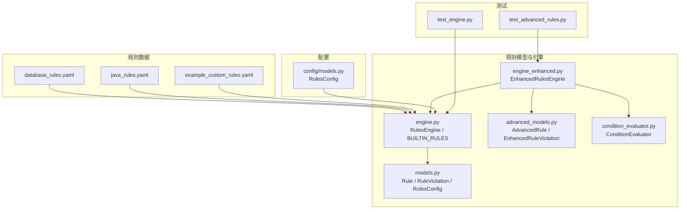
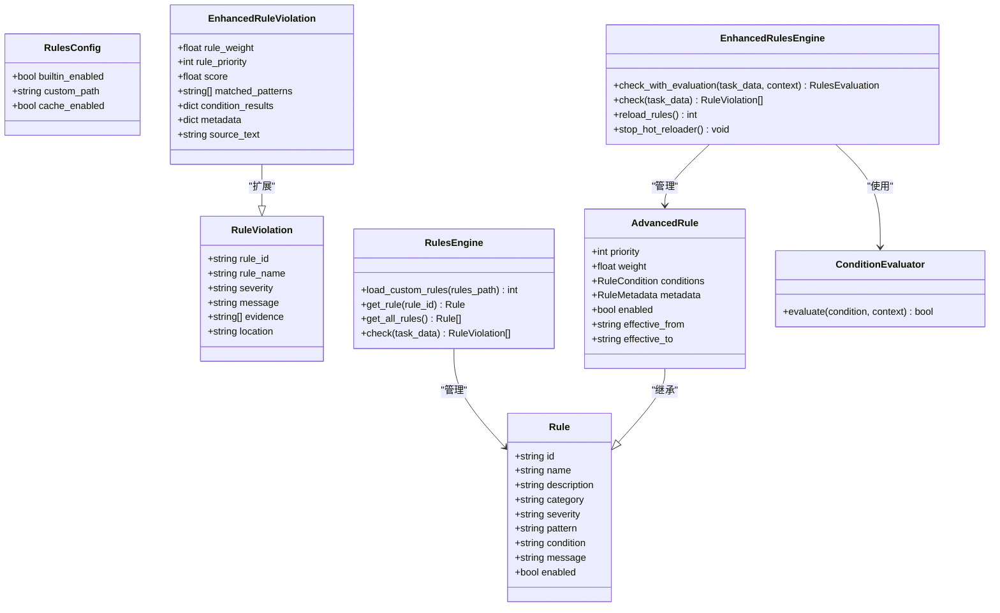
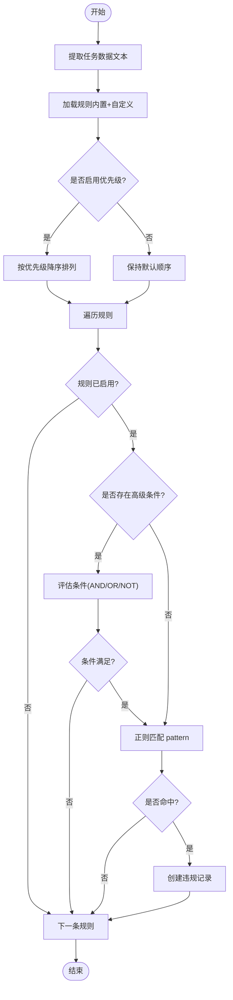
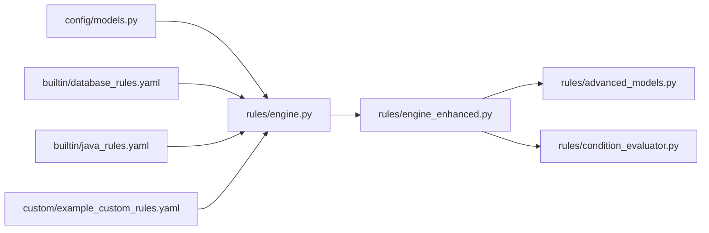

# 内置规则库

<cite>
**本文引用的文件**   
- [src/rules/builtin/database_rules.yaml](file://src/rules/builtin/database_rules.yaml)
- [src/rules/builtin/java_rules.yaml](file://src/rules/builtin/java_rules.yaml)
- [src/rules/models.py](file://src/rules/models.py)
- [src/rules/engine.py](file://src/rules/engine.py)
- [src/rules/advanced_models.py](file://src/rules/advanced_models.py)
- [src/rules/condition_evaluator.py](file://src/rules/condition_evaluator.py)
- [src/rules/engine_enhanced.py](file://src/rules/engine_enhanced.py)
- [src/rules/custom/example_custom_rules.yaml](file://src/rules/custom/example_custom_rules.yaml)
- [src/config/models.py](file://src/config/models.py)
- [tests/rules/test_engine.py](file://tests/rules/test_engine.py)
- [tests/rules/test_advanced_rules.py](file://tests/rules/test_advanced_rules.py)
</cite>

## 目录
1. [简介](#简介)
2. [项目结构](#项目结构)
3. [核心组件](#核心组件)
4. [架构总览](#架构总览)
5. [详细组件分析](#详细组件分析)
6. [依赖关系分析](#依赖关系分析)
7. [性能考量](#性能考量)
8. [故障排查指南](#故障排查指南)
9. [结论](#结论)
10. [附录：完整规则清单与使用示例](#附录完整规则清单与使用示例)

## 简介
本技术文档面向“内置规则库”，系统化说明系统预定义的规则集结构与分类，覆盖安全（security）、代码规范（code）、性能（performance）等类别；详解每个内置规则的检测逻辑、匹配模式与违规示例；文档化数据库规则与 Java 编码规范的具体实现；解释严重级别定义与优先级处理机制；提供启用/禁用配置方法；并给出完整的规则列表与使用示例，帮助开发者快速理解和使用内置规则。

## 项目结构
规则相关源码与数据主要分布在以下位置：
- 内置规则数据：YAML 文件集中存放于 src/rules/builtin/
- 规则模型与引擎：src/rules/ 下的 models.py、engine.py、engine_enhanced.py、advanced_models.py、condition_evaluator.py
- 自定义规则示例：src/rules/custom/example_custom_rules.yaml
- 全局配置模型：src/config/models.py 中的 RulesConfig
- 测试用例：tests/rules/ 下对基础与增强引擎的验证

图表来源
- [src/rules/builtin/database_rules.yaml:1-39](file://src/rules/builtin/database_rules.yaml#L1-L39)
- [src/rules/builtin/java_rules.yaml:1-48](file://src/rules/builtin/java_rules.yaml#L1-L48)
- [src/rules/custom/example_custom_rules.yaml:1-41](file://src/rules/custom/example_custom_rules.yaml#L1-L41)
- [src/rules/models.py:1-51](file://src/rules/models.py#L1-L51)
- [src/rules/engine.py:1-376](file://src/rules/engine.py#L1-L376)
- [src/rules/advanced_models.py:1-102](file://src/rules/advanced_models.py#L1-L102)
- [src/rules/condition_evaluator.py:1-189](file://src/rules/condition_evaluator.py#L1-L189)
- [src/rules/engine_enhanced.py:1-388](file://src/rules/engine_enhanced.py#L1-L388)
- [src/config/models.py:99-102](file://src/config/models.py#L99-L102)
- [tests/rules/test_engine.py:1-367](file://tests/rules/test_engine.py#L1-L367)
- [tests/rules/test_advanced_rules.py:1-331](file://tests/rules/test_advanced_rules.py#L1-L331)

章节来源
- [src/rules/builtin/database_rules.yaml:1-39](file://src/rules/builtin/database_rules.yaml#L1-L39)
- [src/rules/builtin/java_rules.yaml:1-48](file://src/rules/builtin/java_rules.yaml#L1-L48)
- [src/rules/models.py:1-51](file://src/rules/models.py#L1-L51)
- [src/rules/engine.py:1-376](file://src/rules/engine.py#L1-L376)
- [src/rules/advanced_models.py:1-102](file://src/rules/advanced_models.py#L1-L102)
- [src/rules/condition_evaluator.py:1-189](file://src/rules/condition_evaluator.py#L1-L189)
- [src/rules/engine_enhanced.py:1-388](file://src/rules/engine_enhanced.py#L1-L388)
- [src/config/models.py:99-102](file://src/config/models.py#L99-L102)
- [tests/rules/test_engine.py:1-367](file://tests/rules/test_engine.py#L1-L367)
- [tests/rules/test_advanced_rules.py:1-331](file://tests/rules/test_advanced_rules.py#L1-L331)

## 核心组件
- 规则数据模型
  - Rule：包含 id、name、description、category、severity、pattern、condition、message、enabled 等字段，用于描述一条规则及其执行开关。
  - RuleViolation：记录一次违规结果，包括 rule_id、rule_name、severity、message、evidence、location。
  - RulesConfig：控制是否启用内置规则、自定义规则路径、缓存开关等。
- 规则引擎
  - RulesEngine：加载内置与自定义规则，按 pattern 正则匹配任务数据中的文本片段，返回违规列表。
  - EnhancedRulesEngine：在基础引擎之上扩展高级能力，支持优先级、权重、条件评估、热重载、评分与评估报告。
  - ConditionEvaluator：支持 AND/OR/NOT 组合的条件表达式解析与求值。
- 高级模型
  - AdvancedRule：在 Rule 基础上增加 priority、weight、conditions、metadata、生效时间窗口等。
  - EnhancedRuleViolation：在 RuleViolation 基础上增加 score、matched_patterns、source_text 等。
  - RulesEvaluation：汇总整体得分、各类别得分、严重级别分布等。

章节来源
- [src/rules/models.py:1-51](file://src/rules/models.py#L1-L51)
- [src/rules/engine.py:1-376](file://src/rules/engine.py#L1-L376)
- [src/rules/advanced_models.py:1-102](file://src/rules/advanced_models.py#L1-L102)
- [src/rules/condition_evaluator.py:1-189](file://src/rules/condition_evaluator.py#L1-L189)
- [src/rules/engine_enhanced.py:1-388](file://src/rules/engine_enhanced.py#L1-L388)

## 架构总览
规则引擎采用“数据驱动 + 可扩展”的设计：
- 数据层：以 YAML 文件定义规则，便于维护与扩展。
- 引擎层：基础引擎负责加载与匹配；增强引擎引入优先级、权重、条件评估与评估报告。
- 配置层：通过全局配置模型统一控制内置规则开关与自定义路径。

图表来源
- [src/rules/models.py:1-51](file://src/rules/models.py#L1-L51)
- [src/rules/engine.py:1-376](file://src/rules/engine.py#L1-L376)
- [src/rules/advanced_models.py:1-102](file://src/rules/advanced_models.py#L1-L102)
- [src/rules/condition_evaluator.py:1-189](file://src/rules/condition_evaluator.py#L1-L189)
- [src/rules/engine_enhanced.py:1-388](file://src/rules/engine_enhanced.py#L1-L388)

## 详细组件分析

### 规则数据与分类
- 分类体系
  - security：安全类规则，如 SQL 注入风险、敏感信息泄露等。
  - code：代码规范类规则，如空指针未防御、异常被吞、资源未关闭等。
  - performance：性能类规则，如 SELECT *、循环内查询（N+1）、索引列函数导致全表扫描等。
  - concurrency：并发相关规则（Java 非线程安全集合）。
  - custom：自定义规则（用户扩展）。
- 数据来源
  - 数据库规则：src/rules/builtin/database_rules.yaml
  - Java 规则：src/rules/builtin/java_rules.yaml
  - 自定义示例：src/rules/custom/example_custom_rules.yaml

章节来源
- [src/rules/builtin/database_rules.yaml:1-39](file://src/rules/builtin/database_rules.yaml#L1-L39)
- [src/rules/builtin/java_rules.yaml:1-48](file://src/rules/builtin/java_rules.yaml#L1-L48)
- [src/rules/custom/example_custom_rules.yaml:1-41](file://src/rules/custom/example_custom_rules.yaml#L1-L41)

### 规则检测逻辑与匹配模式
- 基础引擎匹配流程
  - 从任务数据中提取待检查文本（例如 development.commits.message 拼接）。
  - 遍历已加载的规则，若 enabled 为 true，则使用 pattern 正则进行匹配。
  - 命中后生成 RuleViolation，包含证据片段（最多前若干条）。
- 增强引擎匹配流程
  - 除 pattern 外，还支持：
    - 简单条件 condition（如 lines > 100）。
    - 高级条件 conditions（基于 ConditionEvaluator 的 AND/OR/NOT 组合）。
    - 优先级 priority 排序，先高优先级规则。
    - 权重 weight 影响最终评分。
    - 生效时间窗口 effective_from/effective_to。
- 条件评估器
  - 支持操作符：==、!=、>、<、>=、<=、contains、not_contains、matches、in、not_in、starts_with、ends_with、exists、is_empty。
  - 支持字符串、数值、布尔、JSON 数组等值的解析。

图表来源
- [src/rules/engine.py:324-352](file://src/rules/engine.py#L324-L352)
- [src/rules/engine_enhanced.py:170-258](file://src/rules/engine_enhanced.py#L170-L258)
- [src/rules/condition_evaluator.py:35-110](file://src/rules/condition_evaluator.py#L35-L110)

章节来源
- [src/rules/engine.py:324-352](file://src/rules/engine.py#L324-L352)
- [src/rules/engine_enhanced.py:170-258](file://src/rules/engine_enhanced.py#L170-L258)
- [src/rules/condition_evaluator.py:35-110](file://src/rules/condition_evaluator.py#L35-L110)

### 严重级别定义与优先级处理
- 严重级别
  - 基础引擎兼容枚举：info、warning、error、critical，并提供比较语义。
  - 增强引擎评分映射：critical=100、high=75、medium=50、low=25、info=10。
- 优先级与权重
  - 优先级 priority：决定规则检查顺序（降序），高优先级优先触发。
  - 权重 weight：影响单条违规的分数贡献，最终总分扣减。
- 评分计算
  - 单条违规分数 = 基础分 × min(priority/10, 2.0) × weight，上限 100。
  - 总体得分初始 100，逐条扣减，最低 0。

章节来源
- [src/rules/engine.py:22-34](file://src/rules/engine.py#L22-L34)
- [src/rules/engine_enhanced.py:319-333](file://src/rules/engine_enhanced.py#L319-L333)
- [src/rules/engine_enhanced.py:335-373](file://src/rules/engine_enhanced.py#L335-L373)

### 数据库规则实现（database_rules.yaml）
- db-001：SQL 注入风险（字符串拼接）
  - 分类：security；严重级别：critical
  - 检测逻辑：匹配 executeQuery/executeUpdate/execute 调用中字符串拼接的模式。
  - 建议修复：使用参数化查询（PreparedStatement）。
- db-002：SELECT * 查询
  - 分类：performance；严重级别：low
  - 检测逻辑：匹配 SELECT * FROM 模式。
  - 建议修复：明确列出所需字段以提升性能。
- db-003：循环内数据库查询（N+1）
  - 分类：performance；严重级别：high
  - 检测逻辑：匹配 for 循环体内调用 query/find/select/fetch 的模式。
  - 建议修复：改用批量查询或 JOIN。
- db-004：索引列上使用函数
  - 分类：performance；严重级别：medium
  - 检测逻辑：匹配 WHERE 子句中对 DATE/YEAR/MONTH/UPPER/LOWER/SUBSTRING 等函数的使用。
  - 建议修复：避免在索引列上应用函数，防止全表扫描。

章节来源
- [src/rules/builtin/database_rules.yaml:1-39](file://src/rules/builtin/database_rules.yaml#L1-L39)

### Java 编码规范实现（java_rules.yaml）
- java-001：空指针未防御
  - 分类：code；严重级别：high
  - 检测逻辑：链式调用未判空，可能引发 NullPointerException。
  - 建议修复：在链式调用前进行空值判断。
- java-002：吞异常
  - 分类：code；严重级别：high
  - 检测逻辑：catch 块仅打印堆栈或为空，异常被静默吞掉。
  - 建议修复：至少记录日志或重新抛出。
- java-003：资源未关闭
  - 分类：code；严重级别：medium
  - 检测逻辑：检测到 FileInputStream/FileOutputStream/Connection/Statement/ResultSet 等资源构造。
  - 建议修复：使用 try-with-resources 确保资源关闭。
- java-004：使用非线程安全集合
  - 分类：concurrency；严重级别：high
  - 检测逻辑：多线程环境下使用 HashMap/ArrayList/LinkedList。
  - 建议修复：使用 ConcurrentHashMap/CopyOnWriteArrayList。
- java-005：System.out.println 调试代码残留
  - 分类：code；严重级别：low
  - 检测逻辑：匹配 System.out.println 调用。
  - 建议修复：移除调试输出，改用 SLF4J 日志框架。

章节来源
- [src/rules/builtin/java_rules.yaml:1-48](file://src/rules/builtin/java_rules.yaml#L1-L48)

### 规则启用/禁用配置方法
- 全局配置
  - RulesConfig.builtin_enabled：控制是否启用内置规则。
  - RulesConfig.custom_paths：指定自定义规则文件路径。
- 规则级开关
  - 每条规则可设置 enabled 字段，false 时跳过该规则。
- 自定义规则加载
  - 将 YAML/JSON 文件放入自定义路径，引擎启动时自动加载。
  - 示例文件：src/rules/custom/example_custom_rules.yaml

章节来源
- [src/config/models.py:99-102](file://src/config/models.py#L99-L102)
- [src/rules/models.py:45-51](file://src/rules/models.py#L45-L51)
- [src/rules/custom/example_custom_rules.yaml:1-41](file://src/rules/custom/example_custom_rules.yaml#L1-L41)

### 使用示例与集成方式
- 基础引擎使用
  - 初始化 RulesEngine，加载内置与自定义规则。
  - 调用 check(task_data) 获取违规列表。
- 增强引擎使用
  - 初始化 EnhancedRulesEngine，支持 check_with_evaluation 获取详细评估报告。
  - 可通过 reload_rules 与 stop_hot_reloader 管理热重载。
- 工厂创建
  - 使用 RulesEngineFactory.create()/create_enhanced() 便捷创建实例。

章节来源
- [src/rules/engine.py:217-352](file://src/rules/engine.py#L217-L352)
- [src/rules/engine_enhanced.py:22-130](file://src/rules/engine_enhanced.py#L22-L130)
- [src/rules/engine_enhanced.py:376-388](file://src/rules/engine_enhanced.py#L376-L388)

## 依赖关系分析
- 模块耦合
  - engine.py 提供基础规则管理与匹配逻辑，被 enhanced 引擎复用。
  - advanced_models.py 扩展了规则与违规数据结构。
  - condition_evaluator.py 提供条件表达式解析与求值，被增强引擎使用。
  - config/models.py 提供全局配置项，影响规则加载策略。
- 外部依赖
  - YAML/JSON 解析用于加载规则数据。
  - watchdog 可选用于热重载监听（增强引擎）。

图表来源
- [src/config/models.py:99-102](file://src/config/models.py#L99-L102)
- [src/rules/engine.py:1-376](file://src/rules/engine.py#L1-L376)
- [src/rules/engine_enhanced.py:1-388](file://src/rules/engine_enhanced.py#L1-L388)
- [src/rules/advanced_models.py:1-102](file://src/rules/advanced_models.py#L1-L102)
- [src/rules/condition_evaluator.py:1-189](file://src/rules/condition_evaluator.py#L1-L189)
- [src/rules/builtin/database_rules.yaml:1-39](file://src/rules/builtin/database_rules.yaml#L1-L39)
- [src/rules/builtin/java_rules.yaml:1-48](file://src/rules/builtin/java_rules.yaml#L1-L48)
- [src/rules/custom/example_custom_rules.yaml:1-41](file://src/rules/custom/example_custom_rules.yaml#L1-L41)

章节来源
- [src/config/models.py:99-102](file://src/config/models.py#L99-L102)
- [src/rules/engine.py:1-376](file://src/rules/engine.py#L1-L376)
- [src/rules/engine_enhanced.py:1-388](file://src/rules/engine_enhanced.py#L1-L388)
- [src/rules/advanced_models.py:1-102](file://src/rules/advanced_models.py#L1-L102)
- [src/rules/condition_evaluator.py:1-189](file://src/rules/condition_evaluator.py#L1-L189)
- [src/rules/builtin/database_rules.yaml:1-39](file://src/rules/builtin/database_rules.yaml#L1-L39)
- [src/rules/builtin/java_rules.yaml:1-48](file://src/rules/builtin/java_rules.yaml#L1-L48)
- [src/rules/custom/example_custom_rules.yaml:1-41](file://src/rules/custom/example_custom_rules.yaml#L1-L41)

## 性能考量
- 正则匹配开销
  - 大量规则与长文本可能导致匹配耗时上升，建议合理拆分规则与优化正则。
- 优先级与短路
  - 增强引擎按优先级排序，可在高优先级规则命中后减少后续不必要的检查。
- 条件评估
  - 复杂条件表达式会增加评估成本，应谨慎使用嵌套条件。
- 热重载
  - 文件监听会引入额外开销，生产环境按需开启。

[本节为通用指导，不直接分析具体文件]

## 故障排查指南
- 规则未生效
  - 检查 RulesConfig.builtin_enabled 是否为 true。
  - 检查规则文件中 enabled 字段是否为 true。
  - 确认自定义规则路径是否正确且文件存在。
- 匹配不符合预期
  - 校验 pattern 正则是否符合目标语言语法。
  - 检查任务数据中是否包含期望匹配的文本片段。
- 条件评估失败
  - 检查条件表达式语法与操作符是否支持。
  - 确认上下文键名与层级是否正确。
- 热重载问题
  - 确认 watchdog 可用，监听目录权限正常。
  - 查看日志中是否有重载失败的错误信息。

章节来源
- [src/config/models.py:99-102](file://src/config/models.py#L99-L102)
- [src/rules/engine.py:239-310](file://src/rules/engine.py#L239-L310)
- [src/rules/engine_enhanced.py:76-127](file://src/rules/engine_enhanced.py#L76-L127)
- [src/rules/condition_evaluator.py:77-110](file://src/rules/condition_evaluator.py#L77-L110)

## 结论
内置规则库通过 YAML 数据驱动与可扩展的引擎设计，提供了安全、代码规范、性能等多维度的规则检测能力。基础引擎满足常规匹配需求，增强引擎进一步引入优先级、权重、条件评估与评估报告，适用于更复杂的场景。通过全局配置与规则级开关，用户可以灵活启用/禁用规则，并结合自定义规则扩展企业特定规范。

[本节为总结性内容，不直接分析具体文件]

## 附录：完整规则清单与使用示例

### 数据库规则清单（database_rules.yaml）
- db-001：SQL 注入风险（字符串拼接）
  - 分类：security；严重级别：critical
  - 检测逻辑：匹配 executeQuery/executeUpdate/execute 调用中的字符串拼接。
  - 违规示例：在 SQL 语句中使用字符串拼接外部输入。
  - 修复建议：使用 PreparedStatement 参数化查询。
- db-002：SELECT * 查询
  - 分类：performance；严重级别：low
  - 检测逻辑：匹配 SELECT * FROM。
  - 违规示例：查询所有字段。
  - 修复建议：明确列出所需字段。
- db-003：循环内数据库查询（N+1）
  - 分类：performance；严重级别：high
  - 检测逻辑：匹配 for 循环体内的 query/find/select/fetch 调用。
  - 违规示例：在循环中逐条查询数据库。
  - 修复建议：批量查询或 JOIN。
- db-004：索引列上使用函数
  - 分类：performance；严重级别：medium
  - 检测逻辑：匹配 WHERE 子句中 DATE/YEAR/MONTH/UPPER/LOWER/SUBSTRING 等函数。
  - 违规示例：对索引列应用函数导致全表扫描。
  - 修复建议：改写查询以避免函数作用于索引列。

章节来源
- [src/rules/builtin/database_rules.yaml:1-39](file://src/rules/builtin/database_rules.yaml#L1-L39)

### Java 编码规范清单（java_rules.yaml）
- java-001：空指针未防御
  - 分类：code；严重级别：high
  - 检测逻辑：链式调用未判空。
  - 违规示例：obj.method().method() 未判空。
  - 修复建议：在链式调用前进行空值判断。
- java-002：吞异常
  - 分类：code；严重级别：high
  - 检测逻辑：catch 块仅 printStackTrace 或为空。
  - 违规示例：捕获异常但不记录或抛出。
  - 修复建议：记录日志或重新抛出。
- java-003：资源未关闭
  - 分类：code；严重级别：medium
  - 检测逻辑：构造 FileInputStream/FileOutputStream/Connection/Statement/ResultSet。
  - 违规示例：未使用 try-with-resources 管理资源。
  - 修复建议：使用 try-with-resources。
- java-004：使用非线程安全集合
  - 分类：concurrency；严重级别：high
  - 检测逻辑：new HashMap/ArrayList/LinkedList。
  - 违规示例：多线程共享非线程安全集合。
  - 修复建议：使用 ConcurrentHashMap/CopyOnWriteArrayList。
- java-005：System.out.println 调试代码残留
  - 分类：code；严重级别：low
  - 检测逻辑：匹配 System.out.println。
  - 违规示例：生产代码中包含调试输出。
  - 修复建议：改用 SLF4J 日志框架。

章节来源
- [src/rules/builtin/java_rules.yaml:1-48](file://src/rules/builtin/java_rules.yaml#L1-L48)

### 使用示例（集成与运行）
- 基础引擎
  - 初始化 RulesEngine，加载内置与自定义规则。
  - 调用 check(task_data) 获取违规列表。
- 增强引擎
  - 初始化 EnhancedRulesEngine，调用 check_with_evaluation 获取评估报告。
  - 使用 reload_rules 与 stop_hot_reloader 管理热重载。
- 工厂创建
  - 使用 RulesEngineFactory.create()/create_enhanced() 便捷创建实例。

章节来源
- [src/rules/engine.py:217-352](file://src/rules/engine.py#L217-L352)
- [src/rules/engine_enhanced.py:22-130](file://src/rules/engine_enhanced.py#L22-L130)
- [src/rules/engine_enhanced.py:376-388](file://src/rules/engine_enhanced.py#L376-L388)