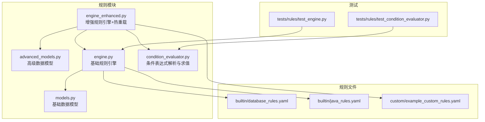
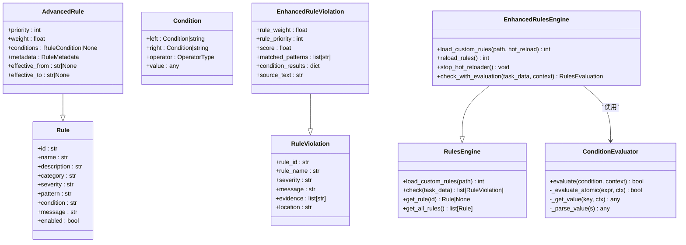
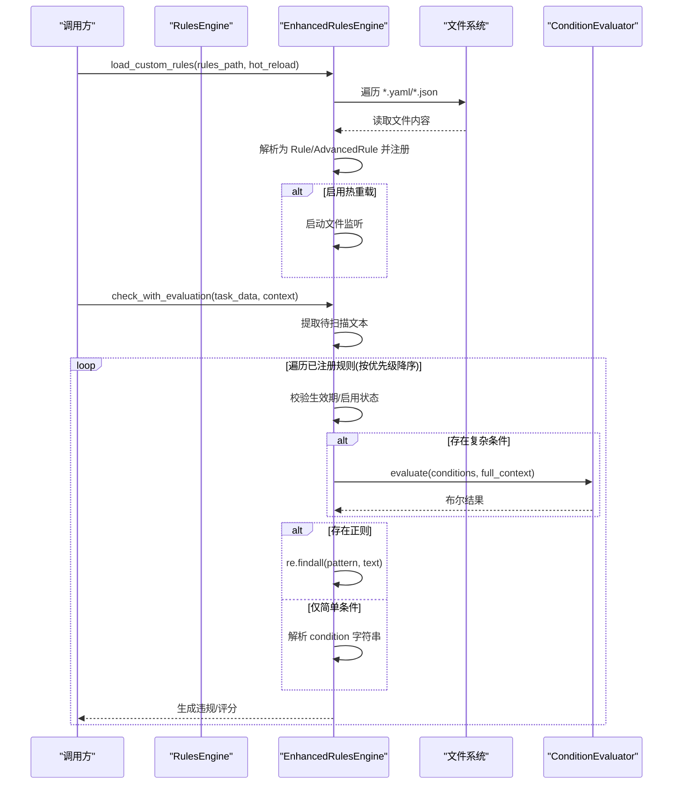
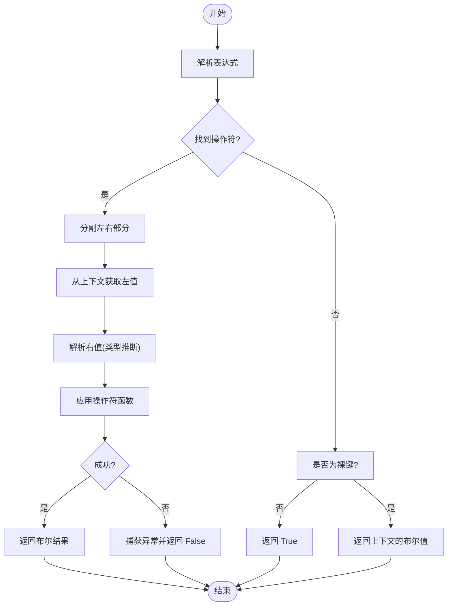
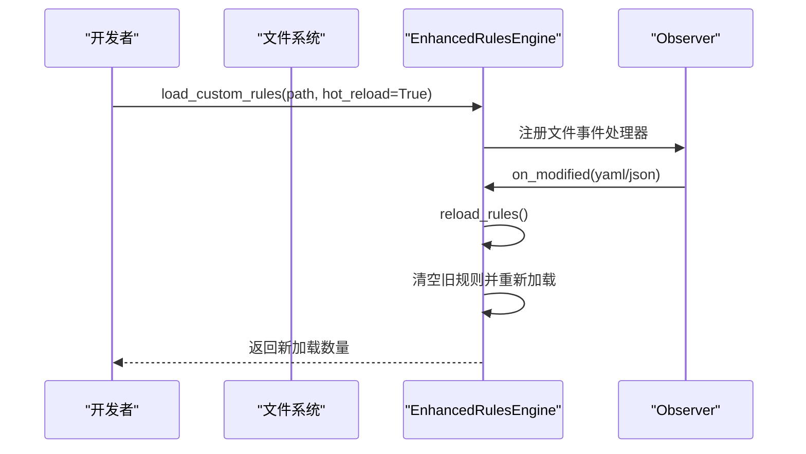
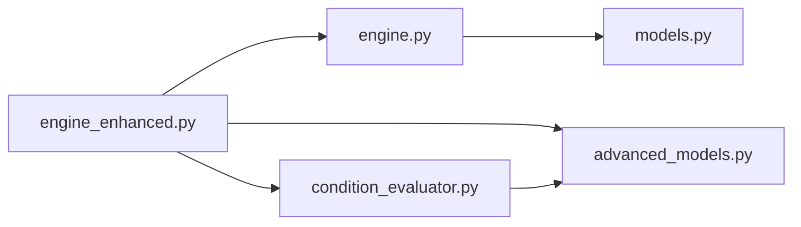

# 自定义规则开发

<cite>
**本文引用的文件列表**
- [src/rules/models.py](file://src/rules/models.py)
- [src/rules/advanced_models.py](file://src/rules/advanced_models.py)
- [src/rules/engine.py](file://src/rules/engine.py)
- [src/rules/engine_enhanced.py](file://src/rules/engine_enhanced.py)
- [src/rules/condition_evaluator.py](file://src/rules/condition_evaluator.py)
- [src/rules/builtin/database_rules.yaml](file://src/rules/builtin/database_rules.yaml)
- [src/rules/builtin/java_rules.yaml](file://src/rules/builtin/java_rules.yaml)
- [src/rules/custom/example_custom_rules.yaml](file://src/rules/custom/example_custom_rules.yaml)
- [tests/rules/test_engine.py](file://tests/rules/test_engine.py)
- [tests/rules/test_condition_evaluator.py](file://tests/rules/test_condition_evaluator.py)
</cite>

## 目录
1. [简介](#简介)
2. [项目结构](#项目结构)
3. [核心组件](#核心组件)
4. [架构总览](#架构总览)
5. [详细组件分析](#详细组件分析)
6. [依赖关系分析](#依赖关系分析)
7. [性能与可扩展性](#性能与可扩展性)
8. [故障排查指南](#故障排查指南)
9. [结论](#结论)
10. [附录：规则文件格式与语法规范](#附录规则文件格式与语法规范)

## 简介
本技术文档面向“自定义规则开发”，围绕仓库中规则引擎的实现，系统说明 YAML/JSON 规则文件格式、字段定义、条件表达式语法与上下文变量、正则模式编写要点、完整开发流程（从需求到测试）、以及版本管理与热重载机制。读者可据此快速编写高质量的业务规则，如特定框架使用规范、团队编码约定等。

## 项目结构
规则相关代码集中在 src/rules 目录下，包含基础模型、增强模型、规则引擎、条件评估器、内置规则示例与自定义规则示例；测试覆盖引擎与条件评估器的关键路径。

图表来源
- [src/rules/models.py:1-51](file://src/rules/models.py#L1-L51)
- [src/rules/advanced_models.py:1-102](file://src/rules/advanced_models.py#L1-L102)
- [src/rules/engine.py:1-376](file://src/rules/engine.py#L1-L376)
- [src/rules/engine_enhanced.py:1-388](file://src/rules/engine_enhanced.py#L1-L388)
- [src/rules/condition_evaluator.py:1-189](file://src/rules/condition_evaluator.py#L1-L189)
- [src/rules/builtin/database_rules.yaml:1-39](file://src/rules/builtin/database_rules.yaml#L1-L39)
- [src/rules/builtin/java_rules.yaml:1-48](file://src/rules/builtin/java_rules.yaml#L1-L48)
- [src/rules/custom/example_custom_rules.yaml:1-41](file://src/rules/custom/example_custom_rules.yaml#L1-L41)
- [tests/rules/test_engine.py:1-367](file://tests/rules/test_engine.py#L1-L367)
- [tests/rules/test_condition_evaluator.py:1-407](file://tests/rules/test_condition_evaluator.py#L1-L407)

章节来源
- [src/rules/models.py:1-51](file://src/rules/models.py#L1-L51)
- [src/rules/advanced_models.py:1-102](file://src/rules/advanced_models.py#L1-L102)
- [src/rules/engine.py:1-376](file://src/rules/engine.py#L1-L376)
- [src/rules/engine_enhanced.py:1-388](file://src/rules/engine_enhanced.py#L1-L388)
- [src/rules/condition_evaluator.py:1-189](file://src/rules/condition_evaluator.py#L1-L189)
- [src/rules/builtin/database_rules.yaml:1-39](file://src/rules/builtin/database_rules.yaml#L1-L39)
- [src/rules/builtin/java_rules.yaml:1-48](file://src/rules/builtin/java_rules.yaml#L1-L48)
- [src/rules/custom/example_custom_rules.yaml:1-41](file://src/rules/custom/example_custom_rules.yaml#L1-L41)
- [tests/rules/test_engine.py:1-367](file://tests/rules/test_engine.py#L1-L367)
- [tests/rules/test_condition_evaluator.py:1-407](file://tests/rules/test_condition_evaluator.py#L1-L407)

## 核心组件
- 基础数据模型：Rule、RuleViolation、RuleCheckResult、RulesConfig
- 高级数据模型：AdvancedRule、EnhancedRuleViolation、Condition、OperatorType、RuleMetadata、RulesEvaluation
- 规则引擎：
  - RulesEngine：加载内置/自定义规则（YAML/JSON），基于正则匹配与简单条件检查
  - EnhancedRulesEngine：在基础之上支持优先级/权重、生效时间窗口、评分统计、热重载
- 条件评估器：ConditionEvaluator，支持 AND/OR/NOT 组合与原子表达式操作符

章节来源
- [src/rules/models.py:1-51](file://src/rules/models.py#L1-L51)
- [src/rules/advanced_models.py:1-102](file://src/rules/advanced_models.py#L1-L102)
- [src/rules/engine.py:1-376](file://src/rules/engine.py#L1-L376)
- [src/rules/engine_enhanced.py:1-388](file://src/rules/engine_enhanced.py#L1-L388)
- [src/rules/condition_evaluator.py:1-189](file://src/rules/condition_evaluator.py#L1-L189)

## 架构总览
规则引擎采用分层设计：
- 数据层：基础/高级数据模型描述规则、违规、评估结果
- 引擎层：基础引擎负责加载与扫描；增强引擎扩展评分、优先级、生效期与热重载
- 条件层：条件评估器提供表达式求值能力
- 配置层：YAML/JSON 规则文件作为外部化配置

图表来源
- [src/rules/models.py:1-51](file://src/rules/models.py#L1-L51)
- [src/rules/advanced_models.py:1-102](file://src/rules/advanced_models.py#L1-L102)
- [src/rules/engine.py:1-376](file://src/rules/engine.py#L1-L376)
- [src/rules/engine_enhanced.py:1-388](file://src/rules/engine_enhanced.py#L1-L388)
- [src/rules/condition_evaluator.py:1-189](file://src/rules/condition_evaluator.py#L1-L189)

## 详细组件分析

### 规则数据模型与字段语义
- Rule（基础）
  - id：唯一标识，建议采用“前缀-编号”格式
  - name/description：人类可读的名称与描述
  - category：分类，如 security/code/performance/concurrency/custom
  - severity：严重级别，如 critical/high/medium/low/info
  - pattern：Python 正则表达式，用于文本匹配
  - condition：简单条件表达式字符串（当前由引擎进行有限解析）
  - message：触发违规时的提示信息
  - enabled：是否启用
- AdvancedRule（增强）
  - priority/weight：影响执行顺序与评分权重
  - conditions：复杂条件树（AND/OR/NOT）
  - metadata：版本、作者、标签、参考链接等元信息
  - effective_from/effective_to：生效时间窗口
- RuleViolation/EnhancedRuleViolation：违规记录，后者附加分数、命中模式、源文本等

章节来源
- [src/rules/models.py:1-51](file://src/rules/models.py#L1-L51)
- [src/rules/advanced_models.py:1-102](file://src/rules/advanced_models.py#L1-L102)

### 规则引擎与加载流程
- 内置规则：以 Python 常量形式注册，供基础/增强引擎初始化时加载
- 自定义规则：从指定目录加载 *.yaml/*.json，要求顶层包含 rules 数组
- 扫描逻辑：对任务数据提取待扫描文本（例如 commits 的 message 拼接），按规则顺序执行正则匹配或条件判断，收集违规

图表来源
- [src/rules/engine.py:217-352](file://src/rules/engine.py#L217-L352)
- [src/rules/engine_enhanced.py:52-118](file://src/rules/engine_enhanced.py#L52-L118)
- [src/rules/engine_enhanced.py:131-173](file://src/rules/engine_enhanced.py#L131-L173)
- [src/rules/condition_evaluator.py:35-75](file://src/rules/condition_evaluator.py#L35-L75)

章节来源
- [src/rules/engine.py:159-310](file://src/rules/engine.py#L159-L310)
- [src/rules/engine_enhanced.py:1-388](file://src/rules/engine_enhanced.py#L1-L388)

### 条件表达式语法与上下文变量
- 复合操作符：AND、OR、NOT
- 原子表达式操作符（从左到右匹配，注意子串冲突风险）：
  - 比较：==、!=、>、<、>=、<=
  - 包含：contains、not_contains
  - 正则：matches
  - 集合：in、not_in
  - 前后缀：starts_with、ends_with
  - 存在性：exists、is_empty
- 值解析：自动识别 true/false/null/none、整数/浮点数、单双引号字符串、JSON 数组
- 上下文访问：支持点号分隔的嵌套键访问，如 data.nested.value
- 注意事项：
  - 操作符匹配基于子串查找，存在歧义场景（如 contains 先于 not_contains 匹配；in 可能误匹配到 key 中的片段）。建议在表达式中避免关键字出现在键名中，或使用更明确的键名。
  - >= 和 <= 在当前实现中存在与 >/< 的匹配冲突，可能导致意外失败。建议优先使用 ==、!=、>、< 组合表达边界条件。

图表来源
- [src/rules/condition_evaluator.py:77-164](file://src/rules/condition_evaluator.py#L77-L164)

章节来源
- [src/rules/condition_evaluator.py:1-189](file://src/rules/condition_evaluator.py#L1-L189)
- [tests/rules/test_condition_evaluator.py:1-407](file://tests/rules/test_condition_evaluator.py#L1-L407)

### 正则表达式模式编写指南
- 适用语言：Python 正则（re 模块）
- 常用技巧：
  - 大小写不敏感：在引擎侧统一使用 IGNORECASE 标志
  - 多行匹配：利用换行与缩进特征定位代码块
  - 分组捕获：便于证据展示与后续处理
  - 转义字符：谨慎处理括号、点号、反斜杠
- 性能建议：
  - 避免过度回溯，尽量使用非贪婪量词与明确锚点
  - 将高频匹配的子模式提取为命名组，减少重复计算
- 示例参考：
  - 数据库安全与性能规则：[database_rules.yaml:1-39](file://src/rules/builtin/database_rules.yaml#L1-L39)
  - Java 编码规范规则：[java_rules.yaml:1-48](file://src/rules/builtin/java_rules.yaml#L1-L48)
  - 自定义示例：[example_custom_rules.yaml:1-41](file://src/rules/custom/example_custom_rules.yaml#L1-L41)

章节来源
- [src/rules/builtin/database_rules.yaml:1-39](file://src/rules/builtin/database_rules.yaml#L1-L39)
- [src/rules/builtin/java_rules.yaml:1-48](file://src/rules/builtin/java_rules.yaml#L1-L48)
- [src/rules/custom/example_custom_rules.yaml:1-41](file://src/rules/custom/example_custom_rules.yaml#L1-L41)
- [src/rules/engine.py:324-352](file://src/rules/engine.py#L324-L352)

### 完整的自定义规则开发流程
- 需求分析
  - 明确业务目标（如禁止硬编码 IP、限制函数长度、强制日志框架等）
  - 确定分类与严重级别，评估影响范围
- 规则设计
  - 选择 pattern 或 condition（二者选一即可）
  - 若需复杂条件，使用 advanced models 的 conditions 树
  - 编写 message 提示，指导开发者修复
- 规则实现
  - 在 custom 目录创建 YAML/JSON 文件，遵循顶层 rules 数组结构
  - 如需版本与元信息，使用 AdvancedRule 的 metadata 字段
- 单元测试
  - 针对规则的正则与条件编写用例，覆盖正常与异常分支
  - 验证违规消息、证据、位置信息
- 集成与回归
  - 通过引擎接口批量扫描历史代码，确认误报/漏报
  - 调整正则或条件表达式，优化召回率与精确率
- 发布与治理
  - 纳入团队规范，定期评审规则有效性
  - 结合 CI 门禁，阻断高风险违规

章节来源
- [src/rules/custom/example_custom_rules.yaml:1-41](file://src/rules/custom/example_custom_rules.yaml#L1-L41)
- [tests/rules/test_engine.py:1-367](file://tests/rules/test_engine.py#L1-L367)

### 实际业务规则示例（思路与要点）
- 特定框架使用规范
  - 禁止直接打印调试信息，改用日志框架（参考 Java 规则中对 System.out.println 的检测）
  - 强制使用参数化查询，防止 SQL 注入（参考数据库规则中对字符串拼接构造 SQL 的检测）
- 团队编码约定
  - 禁止硬编码网络地址或密钥（参考自定义示例中对 IP 地址的检测）
  - 控制函数规模，超过阈值建议拆分（参考 condition 示例 lines > N）
- 质量与安全
  - 检测空指针链式调用未判空
  - 检测资源未关闭、异常被吞掉等常见缺陷

章节来源
- [src/rules/builtin/java_rules.yaml:1-48](file://src/rules/builtin/java_rules.yaml#L1-L48)
- [src/rules/builtin/database_rules.yaml:1-39](file://src/rules/builtin/database_rules.yaml#L1-L39)
- [src/rules/custom/example_custom_rules.yaml:1-41](file://src/rules/custom/example_custom_rules.yaml#L1-L41)

### 版本管理与热重载机制
- 版本管理
  - 使用 RuleMetadata.version 标注规则版本，配合 tags/references 追踪变更
  - 通过 effective_from/effective_to 控制规则的生效窗口
- 热重载
  - 增强引擎支持基于文件系统的监听，修改 YAML/JSON 后自动重新加载
  - 线程安全：使用重入锁保护 reload 过程，避免并发竞争
  - 生命周期：析构时停止监听器，释放资源

图表来源
- [src/rules/engine_enhanced.py:76-118](file://src/rules/engine_enhanced.py#L76-L118)

章节来源
- [src/rules/advanced_models.py:38-63](file://src/rules/advanced_models.py#L38-L63)
- [src/rules/engine_enhanced.py:52-127](file://src/rules/engine_enhanced.py#L52-L127)

## 依赖关系分析
- 模块内依赖
  - engine_enhanced 依赖 engine（继承）、advanced_models、condition_evaluator
  - condition_evaluator 依赖 advanced_models 的 Condition/OperatorType
- 外部依赖
  - YAML 解析：PyYAML（按需导入）
  - JSON 解析：标准库 json
  - 文件监听：watchdog（可选，仅在启用热重载时使用）
- 潜在耦合点
  - 条件表达式操作符匹配存在子串冲突风险，需在表达式设计与键命名上规避
  - 正则匹配的性能与准确性直接影响整体扫描效率

图表来源
- [src/rules/engine_enhanced.py:1-388](file://src/rules/engine_enhanced.py#L1-L388)
- [src/rules/engine.py:1-376](file://src/rules/engine.py#L1-L376)
- [src/rules/condition_evaluator.py:1-189](file://src/rules/condition_evaluator.py#L1-L189)
- [src/rules/advanced_models.py:1-102](file://src/rules/advanced_models.py#L1-L102)
- [src/rules/models.py:1-51](file://src/rules/models.py#L1-L51)

章节来源
- [src/rules/engine_enhanced.py:1-388](file://src/rules/engine_enhanced.py#L1-L388)
- [src/rules/engine.py:1-376](file://src/rules/engine.py#L1-L376)
- [src/rules/condition_evaluator.py:1-189](file://src/rules/condition_evaluator.py#L1-L189)
- [src/rules/advanced_models.py:1-102](file://src/rules/advanced_models.py#L1-L102)
- [src/rules/models.py:1-51](file://src/rules/models.py#L1-L51)

## 性能与可扩展性
- 正则性能
  - 避免灾难性回溯，使用非贪婪量词与明确边界
  - 将通用子模式抽取为命名组，减少重复编译开销
- 条件评估
  - 合理组织条件树，短路求值（AND/OR）提升效率
  - 避免在表达式中使用易冲突的操作符与键名
- 热重载
  - 文件监听开销较小，但频繁修改会导致反复 reload，建议批量提交变更
- 可扩展点
  - 新增操作符：在条件评估器中扩展 _operators 映射
  - 新增上下文变量：在任务数据或传入 context 中提供键值
  - 新增规则来源：扩展 load_custom_rules 以支持更多格式或远程源

[本节为通用指导，无需具体文件引用]

## 故障排查指南
- 条件表达式解析失败
  - 现象：警告日志输出“Failed to evaluate condition...”
  - 排查：检查操作符是否存在、键名是否包含操作符子串、值类型是否正确
  - 参考：[condition_evaluator.py:77-164](file://src/rules/condition_evaluator.py#L77-L164)
- 规则加载失败
  - 现象：日志输出“Failed to load rules from ...”
  - 排查：确认顶层包含 rules 数组、字段名称正确、YAML/JSON 语法合法
  - 参考：[engine.py:252-310](file://src/rules/engine.py#L252-L310)
- 热重载未生效
  - 现象：修改文件后未触发 reload
  - 排查：确认 hot_reload 参数为 True、watchdog 可用、监听路径正确
  - 参考：[engine_enhanced.py:76-118](file://src/rules/engine_enhanced.py#L76-L118)
- 正则误报/漏报
  - 现象：规则触发不符合预期
  - 排查：缩小匹配范围、增加锚点、使用命名组捕获证据、在测试中验证
  - 参考：[engine.py:324-352](file://src/rules/engine.py#L324-L352)

章节来源
- [src/rules/condition_evaluator.py:77-164](file://src/rules/condition_evaluator.py#L77-L164)
- [src/rules/engine.py:252-310](file://src/rules/engine.py#L252-L310)
- [src/rules/engine_enhanced.py:76-118](file://src/rules/engine_enhanced.py#L76-L118)
- [src/rules/engine.py:324-352](file://src/rules/engine.py#L324-L352)

## 结论
本规则引擎提供了灵活的 YAML/JSON 规则定义方式、强大的条件表达式求值能力、完善的正则扫描与评分体系，并通过热重载提升了迭代效率。遵循本文档的语法规范与开发流程，团队可以快速构建贴合自身业务的高质量规则集，持续改进代码质量与安全性。

[本节为总结，无需具体文件引用]

## 附录：规则文件格式与语法规范

### YAML 规则文件结构
- 顶层必须包含 rules 数组
- 每条规则支持的字段：
  - id：唯一标识
  - name：规则名称
  - description：详细描述
  - category：分类
  - severity：严重级别
  - pattern：正则表达式
  - condition：简单条件表达式
  - message：违规提示
  - enabled：是否启用
- 示例参考：
  - [database_rules.yaml:1-39](file://src/rules/builtin/database_rules.yaml#L1-L39)
  - [java_rules.yaml:1-48](file://src/rules/builtin/java_rules.yaml#L1-L48)
  - [example_custom_rules.yaml:1-41](file://src/rules/custom/example_custom_rules.yaml#L1-L41)

章节来源
- [src/rules/builtin/database_rules.yaml:1-39](file://src/rules/builtin/database_rules.yaml#L1-L39)
- [src/rules/builtin/java_rules.yaml:1-48](file://src/rules/builtin/java_rules.yaml#L1-L48)
- [src/rules/custom/example_custom_rules.yaml:1-41](file://src/rules/custom/example_custom_rules.yaml#L1-L41)

### JSON 规则文件结构
- 顶层必须包含 rules 数组
- 字段与 YAML 一致，便于程序化生成与合并
- 示例参考（测试中使用的结构）：
  - [test_rules_engine.py:90-120](file://tests/rules/test_engine.py#L90-L120)

章节来源
- [tests/rules/test_engine.py:90-120](file://tests/rules/test_engine.py#L90-L120)

### 条件表达式语法规则
- 复合操作符：AND、OR、NOT
- 原子操作符：==、!=、>、<、>=、<=、contains、not_contains、matches、in、not_in、starts_with、ends_with、exists、is_empty
- 值解析：true/false/null/none、数字、引号字符串、JSON 数组
- 上下文访问：支持点号分隔的嵌套键
- 注意事项：
  - 操作符匹配存在子串冲突风险，建议避免在键名中包含操作符片段
  - >= 与 <= 在当前实现中可能与 >/< 发生冲突，建议使用组合表达

章节来源
- [src/rules/condition_evaluator.py:1-189](file://src/rules/condition_evaluator.py#L1-L189)
- [tests/rules/test_condition_evaluator.py:1-407](file://tests/rules/test_condition_evaluator.py#L1-L407)