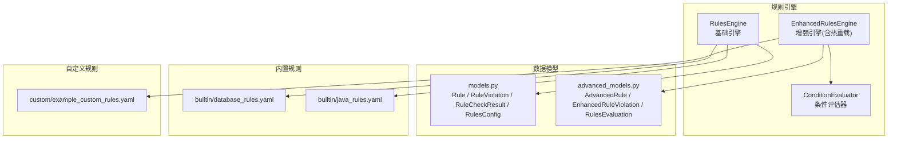
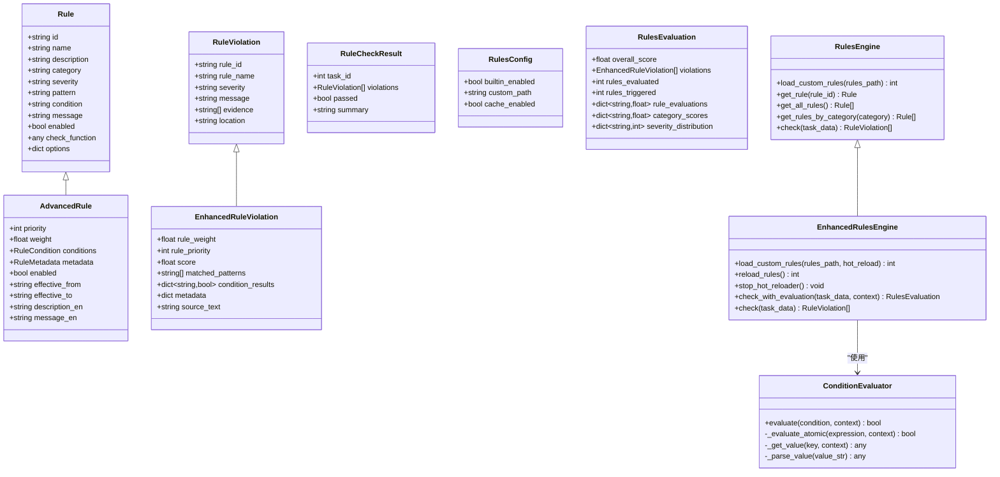
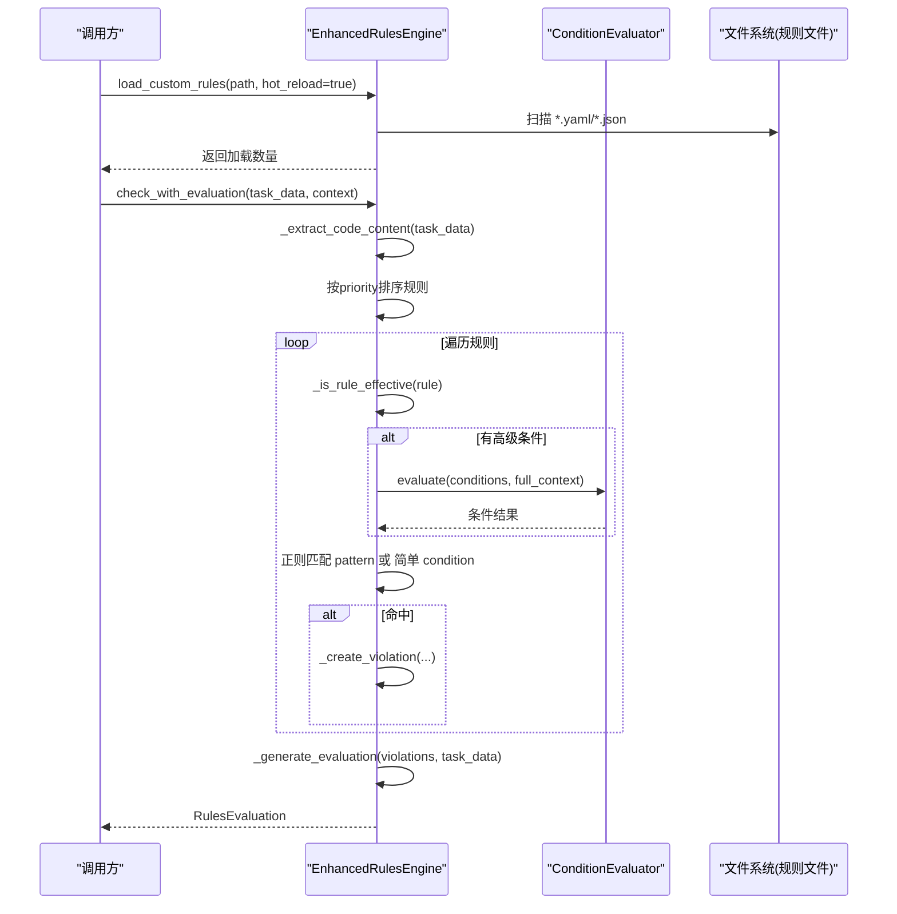
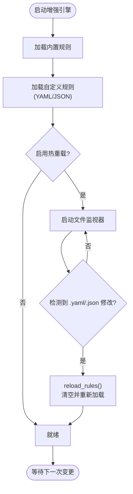
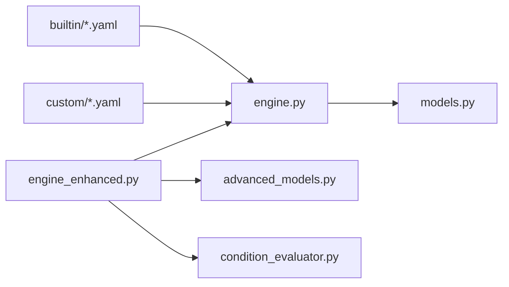

# 规则引擎系统

<cite>
**本文引用的文件**
- [src/rules/engine.py](file://src/rules/engine.py)
- [src/rules/models.py](file://src/rules/models.py)
- [src/rules/condition_evaluator.py](file://src/rules/condition_evaluator.py)
- [src/rules/advanced_models.py](file://src/rules/advanced_models.py)
- [src/rules/engine_enhanced.py](file://src/rules/engine_enhanced.py)
- [src/rules/builtin/database_rules.yaml](file://src/rules/builtin/database_rules.yaml)
- [src/rules/builtin/java_rules.yaml](file://src/rules/builtin/java_rules.yaml)
- [src/rules/custom/example_custom_rules.yaml](file://src/rules/custom/example_custom_rules.yaml)
- [tests/rules/test_engine.py](file://tests/rules/test_engine.py)
- [tests/rules/test_condition_evaluator.py](file://tests/rules/test_condition_evaluator.py)
</cite>

## 目录
1. [简介](#简介)
2. [项目结构](#项目结构)
3. [核心组件](#核心组件)
4. [架构总览](#架构总览)
5. [详细组件分析](#详细组件分析)
6. [依赖关系分析](#依赖关系分析)
7. [性能与优化](#性能与优化)
8. [故障排查指南](#故障排查指南)
9. [结论](#结论)
10. [附录](#附录)

## 简介
本技术文档面向规则引擎子系统，系统性说明内置规则库的组织方式、自定义规则开发流程、条件表达式语法与动作定义、规则执行引擎的匹配算法与优先级处理、违规检测报告的生成格式、调试与测试方法、业务规则示例与最佳实践，以及版本管理与热重载机制。读者无需深入源码即可理解如何扩展规则、编写复杂条件、评估性能并定位问题。

## 项目结构
规则引擎位于 src/rules 下，采用“模型 + 引擎 + 条件评估器 + 内置/自定义规则集”的分层组织：
- 数据模型：Rule、RuleViolation、RuleCheckResult、RulesConfig 等基础模型；AdvancedRule、EnhancedRuleViolation、RulesEvaluation 等增强模型
- 引擎实现：基础 RulesEngine 与增强版 EnhancedRulesEngine（含热重载）
- 条件评估器：ConditionEvaluator 支持 AND/OR/NOT 组合与丰富的原子操作符
- 内置规则：database_rules.yaml、java_rules.yaml
- 自定义规则示例：example_custom_rules.yaml

图表来源
- [src/rules/engine.py:217-352](file://src/rules/engine.py#L217-L352)
- [src/rules/engine_enhanced.py:22-118](file://src/rules/engine_enhanced.py#L22-L118)
- [src/rules/condition_evaluator.py:12-164](file://src/rules/condition_evaluator.py#L12-L164)
- [src/rules/models.py:5-51](file://src/rules/models.py#L5-L51)
- [src/rules/advanced_models.py:18-102](file://src/rules/advanced_models.py#L18-L102)
- [src/rules/builtin/database_rules.yaml:1-39](file://src/rules/builtin/database_rules.yaml#L1-L39)
- [src/rules/builtin/java_rules.yaml:1-48](file://src/rules/builtin/java_rules.yaml#L1-L48)
- [src/rules/custom/example_custom_rules.yaml:1-41](file://src/rules/custom/example_custom_rules.yaml#L1-L41)

章节来源
- [src/rules/__init__.py:1-33](file://src/rules/__init__.py#L1-L33)

## 核心组件
- 基础规则模型与结果
  - Rule：规则定义，包含 id、name、description、category、severity、pattern、condition、message、enabled、check_function、options
  - RuleViolation：违规记录，包含 rule_id、rule_name、severity、message、evidence、location
  - RuleCheckResult：检查结果，包含 task_id、violations、passed、summary
  - RulesConfig：引擎配置项，如是否启用内置规则、自定义路径、缓存开关
- 增强规则模型与评估结果
  - AdvancedRule：在 Rule 基础上增加 priority、weight、conditions、metadata、生效时间窗口等
  - EnhancedRuleViolation：在 RuleViolation 基础上增加权重、优先级、分数、匹配模式、条件结果、元数据、源文本
  - RulesEvaluation：整体评分、按严重级别分布、按分类得分、统计指标
- 条件评估器
  - ConditionEvaluator：支持 ==、!=、>、<、>=、<=、contains、not_contains、matches、in、not_in、starts_with、ends_with、exists、is_empty 等操作符，支持嵌套 AND/OR/NOT 条件树
- 引擎
  - RulesEngine：加载内置规则与自定义规则（YAML/JSON），基于正则 pattern 进行匹配，返回 RuleViolation 列表
  - EnhancedRulesEngine：继承基础引擎，支持高级条件、优先级排序、权重打分、热重载、详细评估报告

章节来源
- [src/rules/models.py:5-51](file://src/rules/models.py#L5-L51)
- [src/rules/advanced_models.py:18-102](file://src/rules/advanced_models.py#L18-L102)
- [src/rules/condition_evaluator.py:12-164](file://src/rules/condition_evaluator.py#L12-L164)
- [src/rules/engine.py:217-352](file://src/rules/engine.py#L217-L352)
- [src/rules/engine_enhanced.py:22-118](file://src/rules/engine_enhanced.py#L22-L118)

## 架构总览
规则引擎由“规则定义 + 条件评估 + 引擎调度 + 报告输出”构成。增强引擎在基础引擎之上增加了优先级、权重、条件树、热重载与评估报告能力。

图表来源
- [src/rules/models.py:5-51](file://src/rules/models.py#L5-L51)
- [src/rules/advanced_models.py:18-102](file://src/rules/advanced_models.py#L18-L102)
- [src/rules/condition_evaluator.py:12-164](file://src/rules/condition_evaluator.py#L12-L164)
- [src/rules/engine.py:217-352](file://src/rules/engine.py#L217-L352)
- [src/rules/engine_enhanced.py:22-118](file://src/rules/engine_enhanced.py#L22-L118)

## 详细组件分析

### 内置规则库结构与组织
- 数据库规则（security/performance）
  - SQL 注入风险（字符串拼接）
  - SELECT * 查询
  - 循环内数据库查询（N+1）
  - 索引列上使用函数导致全表扫描
- Java 编码规范（code/concurrency）
  - 空指针未防御
  - 吞异常
  - 资源未关闭
  - 使用非线程安全集合
  - System.out.println 调试代码残留

这些规则以 YAML 形式提供，字段包括 id、name、description、category、severity、pattern、message、enabled。引擎启动时自动加载到内存中，供后续匹配使用。

章节来源
- [src/rules/builtin/database_rules.yaml:1-39](file://src/rules/builtin/database_rules.yaml#L1-L39)
- [src/rules/builtin/java_rules.yaml:1-48](file://src/rules/builtin/java_rules.yaml#L1-L48)
- [src/rules/engine.py:224-237](file://src/rules/engine.py#L224-L237)

### 自定义规则开发流程
- 文件格式：YAML（或 JSON），根节点为 rules 数组
- 必填字段：id、name、description、category、severity、message
- 可选字段：pattern（正则）、condition（简单条件表达式）、enabled（默认 true）
- 放置位置：data/rules/custom/ 目录下，引擎会自动扫描 *.yaml/*.json 并加载
- 命名建议：id 使用 “前缀-编号”，避免与内置规则冲突

示例参考：
- 硬编码 IP 地址检测（pattern）
- TODO 未解决检测（pattern）
- 函数行数过长（condition）

章节来源
- [src/rules/custom/example_custom_rules.yaml:1-41](file://src/rules/custom/example_custom_rules.yaml#L1-L41)
- [src/rules/engine.py:239-310](file://src/rules/engine.py#L239-L310)

### 条件表达式语法与动作定义
- 原子操作符
  - 比较：==、!=、>、<、>=、<=
  - 子串：contains、not_contains
  - 正则：matches
  - 集合：in、not_in
  - 前后缀：starts_with、ends_with
  - 存在性：exists、is_empty
- 复合操作符
  - AND、OR、NOT，支持嵌套组合
- 值解析
  - 布尔：true/false
  - 数值：整数/浮点数
  - 字符串：单引号/双引号包裹
  - 列表：JSON 数组
- 上下文访问
  - 支持点号访问嵌套键，如 data.nested.value
- 便捷构造
  - create_condition(operator, *conditions) 用于快速构建条件树

注意：当前实现中存在若干操作符匹配歧义（例如 contains 与 not_contains、in 与 not_in、>= 与 <= 的匹配顺序），在复杂表达式中需谨慎设计以避免误判。

章节来源
- [src/rules/condition_evaluator.py:12-164](file://src/rules/condition_evaluator.py#L12-L164)
- [tests/rules/test_condition_evaluator.py:109-283](file://tests/rules/test_condition_evaluator.py#L109-L283)

### 规则执行引擎工作机制
- 规则匹配算法
  - 基础引擎：遍历所有启用的规则，对提取的代码内容执行正则匹配，命中则生成 RuleViolation
  - 增强引擎：先检查生效时间窗口，再按优先级降序执行；若定义了高级条件，先通过 ConditionEvaluator 评估；随后执行 pattern 匹配或简单 condition 判断
- 优先级处理
  - 增强引擎根据 AdvancedRule.priority 排序，优先执行高优先级规则
- 权重与评分
  - 根据 severity 映射基础分，结合 priority 与 weight 计算最终分数，累计扣减得到总体评分
- 评估报告
  - 统计规则评估数量、触发数量、严重级别分布、分类得分、总体评分

图表来源
- [src/rules/engine_enhanced.py:131-173](file://src/rules/engine_enhanced.py#L131-L173)
- [src/rules/engine_enhanced.py:170-201](file://src/rules/engine_enhanced.py#L170-L201)
- [src/rules/engine_enhanced.py:222-258](file://src/rules/engine_enhanced.py#L222-L258)
- [src/rules/engine_enhanced.py:335-373](file://src/rules/engine_enhanced.py#L335-L373)
- [src/rules/condition_evaluator.py:35-75](file://src/rules/condition_evaluator.py#L35-L75)

章节来源
- [src/rules/engine.py:324-352](file://src/rules/engine.py#L324-L352)
- [src/rules/engine_enhanced.py:170-201](file://src/rules/engine_enhanced.py#L170-L201)
- [src/rules/engine_enhanced.py:319-333](file://src/rules/engine_enhanced.py#L319-L333)
- [src/rules/engine_enhanced.py:335-373](file://src/rules/engine_enhanced.py#L335-L373)

### 违规检测报告生成格式与内容结构
- 基础报告（RuleCheckResult）
  - task_id、violations（RuleViolation 列表）、passed、summary
- 增强报告（RulesEvaluation）
  - overall_score：总体评分（初始 100，逐条扣分）
  - violations：EnhancedRuleViolation 列表（含 rule_weight、rule_priority、score、matched_patterns、condition_results、metadata、source_text）
  - rules_evaluated、rules_triggered：统计信息
  - category_scores：按分类累加扣分
  - severity_distribution：按严重级别计数

章节来源
- [src/rules/models.py:34-42](file://src/rules/models.py#L34-L42)
- [src/rules/advanced_models.py:78-102](file://src/rules/advanced_models.py#L78-L102)
- [src/rules/engine_enhanced.py:335-373](file://src/rules/engine_enhanced.py#L335-L373)

### 规则调试工具与测试方法
- 单元测试覆盖
  - 基础引擎：注册/注销规则、运行全部规则、异常容错、结果统计
  - 条件评估器：各操作符行为、嵌套条件、短路求值、上下文取值、边界情况
- 调试建议
  - 打印匹配证据（evidence/matched_patterns）
  - 开启日志（loguru）观察条件评估失败与规则加载错误
  - 逐步缩小 pattern 范围或使用 matches 操作符精确定位
  - 使用 create_condition 构建可复现的条件树进行断言

章节来源
- [tests/rules/test_engine.py:133-306](file://tests/rules/test_engine.py#L133-L306)
- [tests/rules/test_condition_evaluator.py:109-407](file://tests/rules/test_condition_evaluator.py#L109-L407)

### 实际业务规则示例与最佳实践
- 安全类
  - 禁止 SQL 注入：使用参数化查询，避免字符串拼接
  - 禁止敏感信息硬编码：密码、密钥、token 等应从配置中心读取
- 性能类
  - 避免 SELECT *：明确列出所需字段
  - 避免 N+1 查询：批量查询或 JOIN
  - 避免索引列上使用函数：保持 WHERE 条件可走索引
- 并发类
  - 多线程场景使用线程安全集合：ConcurrentHashMap/CopyOnWriteArrayList
- 代码质量类
  - 链式调用需判空，防止 NullPointerException
  - 捕获异常应至少记录日志或重新抛出
  - 资源应在 try-with-resources 或 finally 中关闭
  - 移除 System.out.println，改用 SLF4J

最佳实践
- 规则粒度适中，避免过于宽泛的正则造成误报
- 合理使用优先级与权重，确保关键问题优先暴露
- 使用条件树表达复杂业务约束，减少正则复杂度
- 定期评审规则有效性，禁用低价值规则

章节来源
- [src/rules/builtin/database_rules.yaml:1-39](file://src/rules/builtin/database_rules.yaml#L1-L39)
- [src/rules/builtin/java_rules.yaml:1-48](file://src/rules/builtin/java_rules.yaml#L1-L48)
- [src/rules/custom/example_custom_rules.yaml:1-41](file://src/rules/custom/example_custom_rules.yaml#L1-L41)

### 版本管理与热重载机制
- 版本管理
  - AdvancedRule.metadata.version 可用于标识规则版本
  - effective_from/effective_to 控制规则的生效时间窗口
- 热重载
  - 增强引擎支持基于 watchdog 的文件系统事件监听
  - 当自定义规则文件修改后自动 reload_rules，清理旧规则并重新加载
  - 提供 stop_hot_reloader 停止监视，析构时自动释放

图表来源
- [src/rules/engine_enhanced.py:52-103](file://src/rules/engine_enhanced.py#L52-L103)
- [src/rules/engine_enhanced.py:105-127](file://src/rules/engine_enhanced.py#L105-L127)
- [src/rules/advanced_models.py:38-63](file://src/rules/advanced_models.py#L38-L63)

章节来源
- [src/rules/engine_enhanced.py:52-127](file://src/rules/engine_enhanced.py#L52-L127)
- [src/rules/advanced_models.py:38-63](file://src/rules/advanced_models.py#L38-L63)

## 依赖关系分析
- 模块内依赖
  - engine_enhanced.py 依赖 engine.py 的基础引擎与内置规则常量
  - engine_enhanced.py 依赖 advanced_models.py 的增强模型
  - engine_enhanced.py 依赖 condition_evaluator.py 的条件评估器
  - models.py 与 advanced_models.py 分别定义基础与增强数据结构
- 外部依赖
  - YAML/JSON 解析（PyYAML、标准库 json）
  - 正则表达式（re）
  - 文件系统事件监听（watchdog，可选）

图表来源
- [src/rules/engine.py:217-352](file://src/rules/engine.py#L217-L352)
- [src/rules/engine_enhanced.py:11-20](file://src/rules/engine_enhanced.py#L11-L20)
- [src/rules/advanced_models.py:1-102](file://src/rules/advanced_models.py#L1-102)
- [src/rules/condition_evaluator.py:1-189](file://src/rules/condition_evaluator.py#L1-189)

章节来源
- [src/rules/engine.py:217-352](file://src/rules/engine.py#L217-L352)
- [src/rules/engine_enhanced.py:11-20](file://src/rules/engine_enhanced.py#L11-L20)

## 性能与优化
- 正则匹配
  - 尽量将高频匹配模式前置，减少回溯
  - 使用 matches 操作符替代复杂正则，提升可读性与维护性
- 条件评估
  - 利用 AND/OR 短路特性，将最可能失败的原子条件放在左侧
  - 避免在条件中使用昂贵操作（如复杂正则），必要时预计算上下文
- 规则排序
  - 合理设置 priority，使高风险规则优先执行，尽早阻断
- 热重载
  - 生产环境谨慎启用，避免频繁文件变更导致的抖动
- 评估报告
  - 仅收集必要证据（evidence 限制数量），降低序列化开销

[本节为通用指导，不直接分析具体文件]

## 故障排查指南
- 规则加载失败
  - 检查 YAML/JSON 格式与 rules 根节点
  - 查看日志中的加载错误信息
- 条件表达式误判
  - 关注操作符匹配歧义（contains/not_contains、in/not_in、>=/<=）
  - 使用单元测试验证表达式语义
- 正则匹配过多误报
  - 缩小 pattern 范围，或改用 matches 操作符
  - 结合上下文条件过滤
- 热重载无效
  - 确认 watchdog 已安装且文件路径正确
  - 检查 reload_rules 是否被触发

章节来源
- [src/rules/engine.py:252-281](file://src/rules/engine.py#L252-L281)
- [src/rules/engine.py:283-310](file://src/rules/engine.py#L283-L310)
- [src/rules/engine_enhanced.py:76-103](file://src/rules/engine_enhanced.py#L76-L103)
- [tests/rules/test_condition_evaluator.py:153-187](file://tests/rules/test_condition_evaluator.py#L153-L187)

## 结论
规则引擎提供了从基础到增强的完整能力：内置规则库覆盖常见安全与性能问题，自定义规则通过 YAML 灵活扩展；条件评估器支持丰富操作符与复合逻辑；增强引擎引入优先级、权重、评分与热重载，满足生产环境的动态演进需求。遵循最佳实践与调试方法，可有效提升规则质量与系统稳定性。

## 附录
- 常用 API 速查
  - 基础引擎：load_custom_rules、get_rule、get_all_rules、get_rules_by_category、check
  - 增强引擎：check_with_evaluation、reload_rules、stop_hot_reloader
- 规则字段说明
  - id/name/description/category/severity/pattern/condition/message/enabled
  - 增强字段：priority/weight/conditions/metadata/effective_from/effective_to

章节来源
- [src/rules/engine.py:239-352](file://src/rules/engine.py#L239-L352)
- [src/rules/engine_enhanced.py:52-173](file://src/rules/engine_enhanced.py#L52-L173)
- [src/rules/models.py:5-51](file://src/rules/models.py#L5-L51)
- [src/rules/advanced_models.py:18-102](file://src/rules/advanced_models.py#L18-L102)
