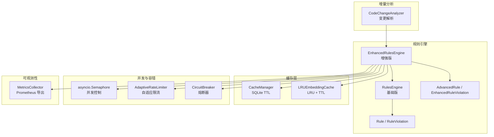
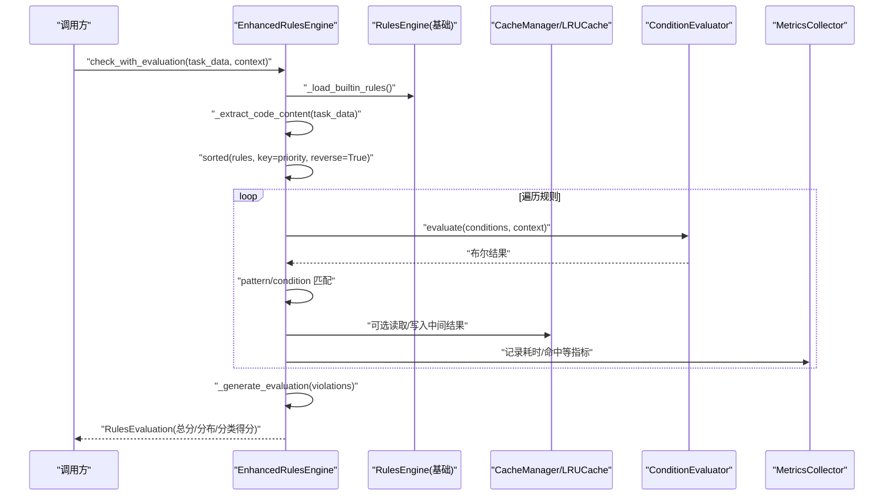
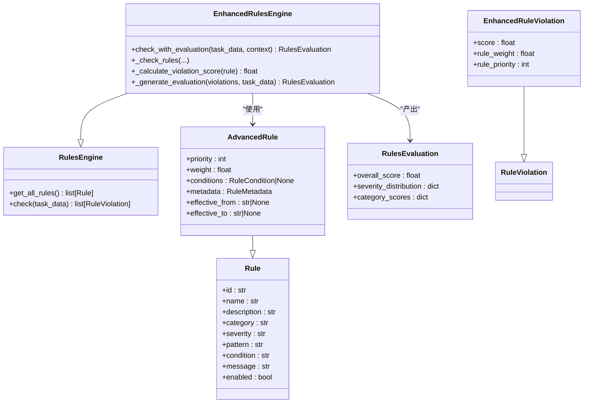
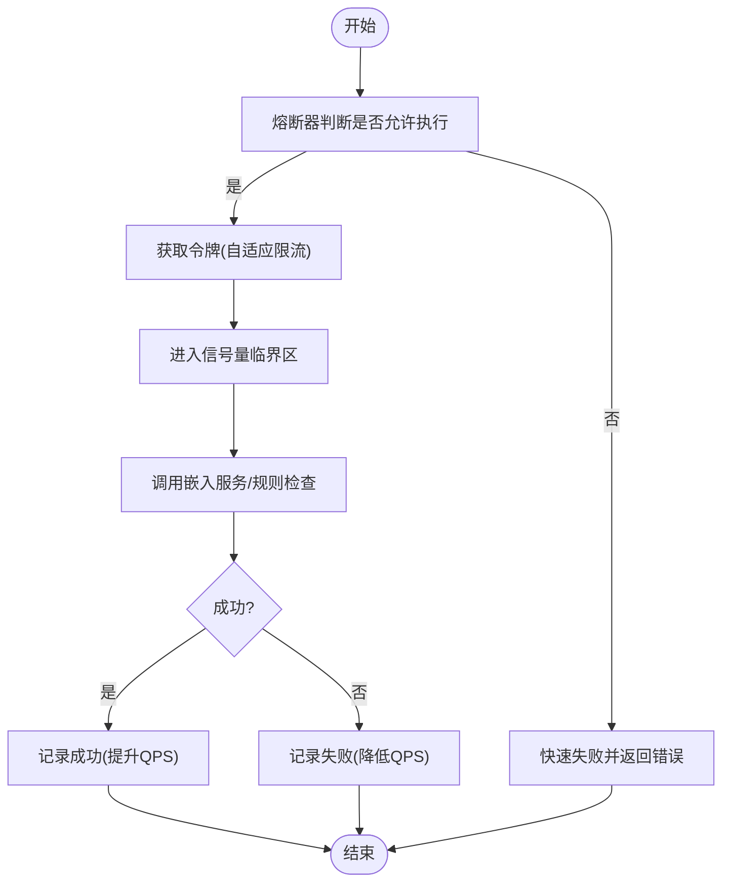
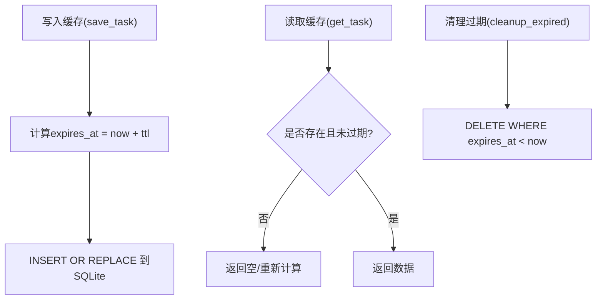
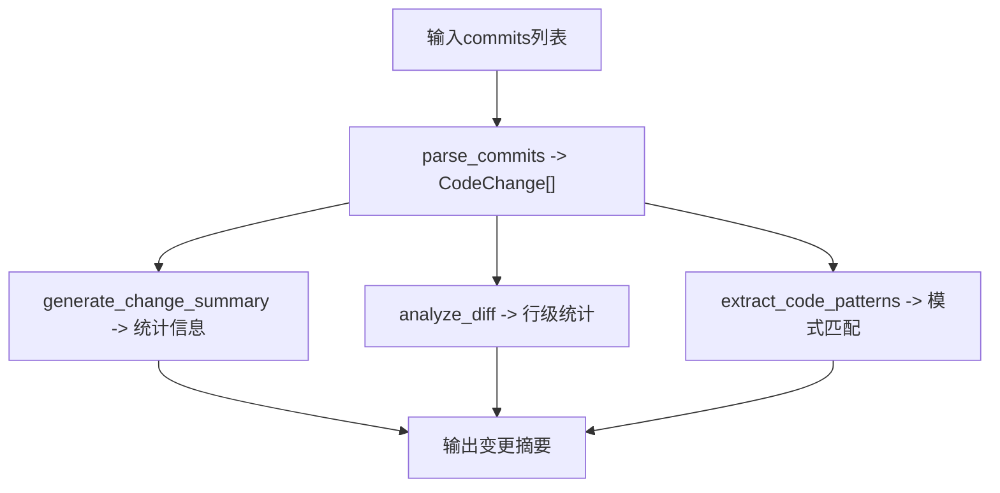
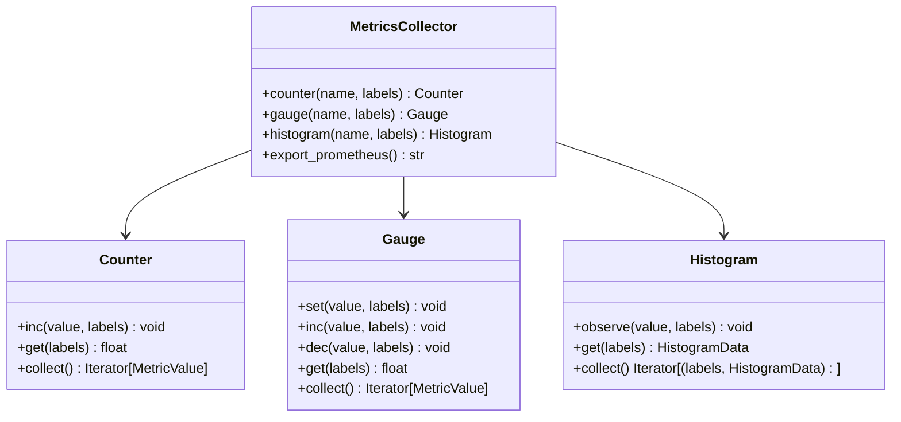
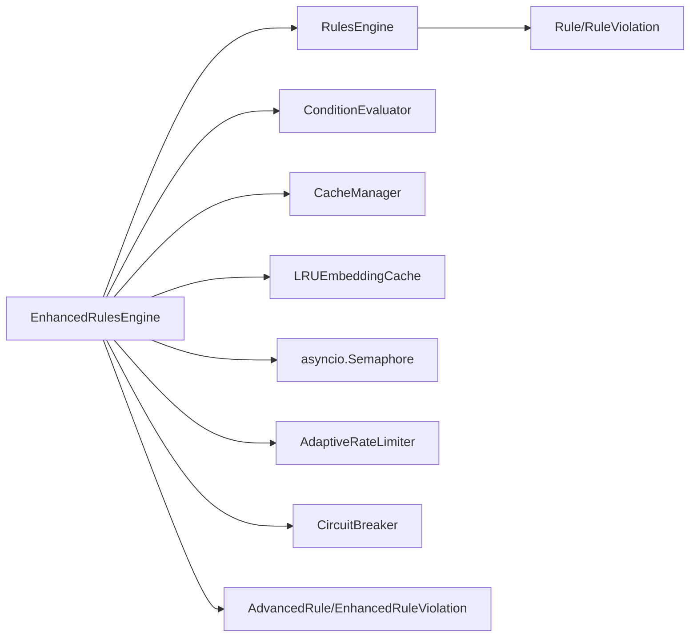

# 执行优化

<cite>
**本文引用的文件**
- [src/rules/engine.py](file://src/rules/engine.py)
- [src/rules/engine_enhanced.py](file://src/rules/engine_enhanced.py)
- [src/rules/models.py](file://src/rules/models.py)
- [src/rules/advanced_models.py](file://src/rules/advanced_models.py)
- [src/cache/manager.py](file://src/cache/manager.py)
- [src/cache/models.py](file://src/cache/models.py)
- [src/embedding/generator.py](file://src/embedding/generator.py)
- [src/utils/metrics.py](file://src/utils/metrics.py)
- [src/analysis/code_change_analyzer.py](file://src/analysis/code_change_analyzer.py)
- [src/cli/commands/cache.py](file://src/cli/commands/cache.py)
</cite>

## 目录
1. [简介](#简介)
2. [项目结构](#项目结构)
3. [核心组件](#核心组件)
4. [架构总览](#架构总览)
5. [详细组件分析](#详细组件分析)
6. [依赖关系分析](#依赖关系分析)
7. [性能考量](#性能考量)
8. [故障排查指南](#故障排查指南)
9. [结论](#结论)
10. [附录](#附录)

## 简介
本技术文档围绕“规则执行优化”展开，聚焦以下目标：
- 规则执行的优先级排序算法与严重级别、类别分组策略
- 并发执行框架（线程池管理与任务调度）
- 规则缓存机制（LRU 缓存与失效策略）
- 增量检查算法（支持部分代码变更的快速重检）
- 性能监控与指标收集方案
- 内存使用优化与垃圾回收策略
- 执行时间统计分析与瓶颈识别工具

## 项目结构
与执行优化直接相关的模块分布如下：
- 规则引擎：基础版与增强版实现，含优先级、条件评估、热重载等能力
- 缓存管理：基于 SQLite 的任务级缓存与 LRU 文本向量缓存
- 并发控制：信号量、自适应速率限制器、熔断器
- 增量分析：代码变更解析与模式提取
- 指标采集：计数器、仪表盘、直方图及 Prometheus 导出

图表来源
- [src/rules/engine.py:217-352](file://src/rules/engine.py#L217-L352)
- [src/rules/engine_enhanced.py:22-170](file://src/rules/engine_enhanced.py#L22-L170)
- [src/rules/models.py:1-51](file://src/rules/models.py#L1-L51)
- [src/rules/advanced_models.py:50-102](file://src/rules/advanced_models.py#L50-L102)
- [src/cache/manager.py:10-165](file://src/cache/manager.py#L10-L165)
- [src/embedding/generator.py:13-52](file://src/embedding/generator.py#L13-L52)
- [src/embedding/generator.py:54-89](file://src/embedding/generator.py#L54-L89)
- [src/embedding/generator.py:91-135](file://src/embedding/generator.py#L91-L135)
- [src/analysis/code_change_analyzer.py:68-112](file://src/analysis/code_change_analyzer.py#L68-L112)
- [src/utils/metrics.py:151-252](file://src/utils/metrics.py#L151-L252)

章节来源
- [src/rules/engine.py:217-352](file://src/rules/engine.py#L217-L352)
- [src/rules/engine_enhanced.py:22-170](file://src/rules/engine_enhanced.py#L22-L170)
- [src/cache/manager.py:10-165](file://src/cache/manager.py#L10-L165)
- [src/embedding/generator.py:13-52](file://src/embedding/generator.py#L13-L52)
- [src/analysis/code_change_analyzer.py:68-112](file://src/analysis/code_change_analyzer.py#L68-L112)
- [src/utils/metrics.py:151-252](file://src/utils/metrics.py#L151-L252)

## 核心组件
- 规则模型与结果
  - 基础规则与违规记录定义，用于统一数据结构与向后兼容
  - 增强规则扩展了优先级、权重、条件表达式、生效时间窗与评分
- 规则引擎
  - 基础版：加载内置/自定义规则，按正则或简单条件匹配生成违规
  - 增强版：在基础版之上提供优先级排序、高级条件评估、评分与评估报告
- 缓存系统
  - 任务级缓存：基于 SQLite 的 TTL 过期与清理
  - 文本向量 LRU 缓存：按最近最少使用淘汰并支持 TTL
- 并发与容错
  - asyncio.Semaphore 控制并发度
  - AdaptiveRateLimiter 自适应 QPS 调整
  - CircuitBreaker 熔断保护
- 增量分析
  - 解析 commit/diff，提取变更文件、模块、代码模式
- 指标采集
  - Counter/Gauge/Histogram 三类指标，支持 Prometheus 格式导出

章节来源
- [src/rules/models.py:1-51](file://src/rules/models.py#L1-L51)
- [src/rules/advanced_models.py:50-102](file://src/rules/advanced_models.py#L50-L102)
- [src/rules/engine.py:217-352](file://src/rules/engine.py#L217-L352)
- [src/rules/engine_enhanced.py:22-170](file://src/rules/engine_enhanced.py#L22-L170)
- [src/cache/manager.py:10-165](file://src/cache/manager.py#L10-L165)
- [src/embedding/generator.py:13-52](file://src/embedding/generator.py#L13-L52)
- [src/embedding/generator.py:54-89](file://src/embedding/generator.py#L54-L89)
- [src/embedding/generator.py:91-135](file://src/embedding/generator.py#L91-L135)
- [src/analysis/code_change_analyzer.py:68-112](file://src/analysis/code_change_analyzer.py#L68-L112)
- [src/utils/metrics.py:151-252](file://src/utils/metrics.py#L151-L252)

## 架构总览
下图展示了增强版规则引擎在执行时的关键路径：从任务数据到规则匹配、评分、评估报告生成，以及缓存、并发与指标采集的协作。

图表来源
- [src/rules/engine_enhanced.py:131-170](file://src/rules/engine_enhanced.py#L131-L170)
- [src/rules/engine_enhanced.py:170-202](file://src/rules/engine_enhanced.py#L170-L202)
- [src/rules/engine_enhanced.py:260-287](file://src/rules/engine_enhanced.py#L260-L287)
- [src/rules/engine_enhanced.py:335-373](file://src/rules/engine_enhanced.py#L335-L373)
- [src/cache/manager.py:10-165](file://src/cache/manager.py#L10-L165)
- [src/embedding/generator.py:13-52](file://src/embedding/generator.py#L13-L52)
- [src/utils/metrics.py:151-252](file://src/utils/metrics.py#L151-L252)

## 详细组件分析

### 规则执行与优先级排序
- 优先级排序
  - 增强版对规则按 priority 降序执行，确保高优先级规则优先触发
  - 基础版未显式排序，按字典顺序遍历
- 严重级别与类别分组
  - 严重级别映射为分数区间，结合优先级与权重计算最终 score
  - 评估阶段汇总 severity_distribution 与 category_scores，便于分层治理
- 条件评估
  - 支持 AND/OR/NOT 组合的条件树与原子条件字符串
  - 上下文合并 task_data 与外部 context，提高灵活性

图表来源
- [src/rules/models.py:1-51](file://src/rules/models.py#L1-L51)
- [src/rules/advanced_models.py:50-102](file://src/rules/advanced_models.py#L50-L102)
- [src/rules/engine.py:217-352](file://src/rules/engine.py#L217-L352)
- [src/rules/engine_enhanced.py:22-170](file://src/rules/engine_enhanced.py#L22-L170)
- [src/rules/engine_enhanced.py:319-373](file://src/rules/engine_enhanced.py#L319-L373)

章节来源
- [src/rules/engine_enhanced.py:170-202](file://src/rules/engine_enhanced.py#L170-L202)
- [src/rules/engine_enhanced.py:319-373](file://src/rules/engine_enhanced.py#L319-L373)
- [src/rules/engine.py:217-352](file://src/rules/engine.py#L217-L352)

### 并发执行框架（线程池管理与任务调度）
- 并发控制
  - 使用 asyncio.Semaphore 限制最大并发请求数，避免资源耗尽
- 自适应限流
  - AdaptiveRateLimiter 根据成功/失败动态调整 QPS，失败时退避，成功时恢复
- 熔断器
  - CircuitBreaker 在连续失败后快速失败，等待重置超时后重试
- 线程安全
  - 规则热重载使用 RLock 保证并发安全

图表来源
- [src/embedding/generator.py:91-135](file://src/embedding/generator.py#L91-L135)
- [src/embedding/generator.py:162-216](file://src/embedding/generator.py#L162-L216)
- [src/embedding/generator.py:54-89](file://src/embedding/generator.py#L54-L89)
- [src/rules/engine_enhanced.py:25-31](file://src/rules/engine_enhanced.py#L25-L31)

章节来源
- [src/embedding/generator.py:91-135](file://src/embedding/generator.py#L91-L135)
- [src/embedding/generator.py:162-216](file://src/embedding/generator.py#L162-L216)
- [src/rules/engine_enhanced.py:25-31](file://src/rules/engine_enhanced.py#L25-L31)

### 规则缓存机制（LRU 与失效策略）
- 任务级缓存（SQLite）
  - 以 task_id 为键，存储 JSON 序列化数据，附带 created_at 与 expires_at
  - 提供 get_status、cleanup_expired、invalidate/invalidate_all 等接口
- 文本向量 LRU 缓存
  - 基于 OrderedDict 实现 LRU，TTL 过期自动淘汰
  - 批量处理时先查缓存，再并发生成未命中项，最后回填缓存
- 失效策略
  - TTL 到期即视为无效；支持手动清空指定或全部条目

图表来源
- [src/cache/manager.py:59-76](file://src/cache/manager.py#L59-L76)
- [src/cache/manager.py:37-54](file://src/cache/manager.py#L37-L54)
- [src/cache/manager.py:156-165](file://src/cache/manager.py#L156-L165)
- [src/embedding/generator.py:13-52](file://src/embedding/generator.py#L13-L52)

章节来源
- [src/cache/manager.py:10-165](file://src/cache/manager.py#L10-L165)
- [src/embedding/generator.py:13-52](file://src/embedding/generator.py#L13-L52)

### 增量检查算法（部分代码变更快速重检）
- 变更解析
  - 解析 commits 列表，构造 CodeChange 对象，包含 diff、files_changed 等
- 变更摘要
  - 统计新增/删除行数、变更文件数、作者集合、模块集合、文件类型分布
- 模式检测
  - 基于预置正则模式识别数据库连接、异常处理、空值检查、并发、SQL注入等
- 快速重检建议
  - 仅对受影响模块与文件进行规则扫描，减少全量扫描开销

图表来源
- [src/analysis/code_change_analyzer.py:74-112](file://src/analysis/code_change_analyzer.py#L74-L112)
- [src/analysis/code_change_analyzer.py:186-224](file://src/analysis/code_change_analyzer.py#L186-L224)
- [src/analysis/code_change_analyzer.py:226-249](file://src/analysis/code_change_analyzer.py#L226-L249)

章节来源
- [src/analysis/code_change_analyzer.py:68-112](file://src/analysis/code_change_analyzer.py#L68-L112)
- [src/analysis/code_change_analyzer.py:186-224](file://src/analysis/code_change_analyzer.py#L186-L224)
- [src/analysis/code_change_analyzer.py:226-249](file://src/analysis/code_change_analyzer.py#L226-L249)

### 性能监控与指标收集
- 指标类型
  - Counter：累计计数（如规则命中次数）
  - Gauge：瞬时值（如当前并发数）
  - Histogram：延迟分布（如规则执行耗时）
- 导出格式
  - 支持 Prometheus 文本格式，便于接入监控系统
- 使用建议
  - 在规则执行前后埋点，记录耗时与命中情况
  - 将缓存命中率、熔断状态作为 Gauge 暴露

图表来源
- [src/utils/metrics.py:151-252](file://src/utils/metrics.py#L151-L252)

章节来源
- [src/utils/metrics.py:151-252](file://src/utils/metrics.py#L151-L252)

### 内存使用优化与垃圾回收策略
- 规则对象
  - 规则字典按 id 索引，避免重复创建；热重载时使用 RLock 保护
- 缓存对象
  - LRU 缓存通过 popitem(last=False) 淘汰最久未使用项，防止无限增长
  - SQLite 缓存使用 expires_at 字段配合定期清理，降低磁盘膨胀
- 大对象处理
  - 批量嵌入时先过滤已缓存项，减少重复计算与内存占用
- GC 友好
  - 使用 dataclass 与有序容器，避免循环引用；及时释放临时变量

章节来源
- [src/rules/engine_enhanced.py:25-31](file://src/rules/engine_enhanced.py#L25-L31)
- [src/embedding/generator.py:13-52](file://src/embedding/generator.py#L13-L52)
- [src/cache/manager.py:156-165](file://src/cache/manager.py#L156-L165)

### 执行时间统计分析与瓶颈识别工具
- 统计维度
  - 规则执行耗时（Histogram）、缓存命中率（Gauge）、并发度（Gauge）、熔断状态（Gauge）
- 分析方法
  - 通过 Prometheus 导出指标，结合 Grafana 可视化观察分位延迟与吞吐
  - 对比不同类别规则的命中分布，定位热点规则
- 工具链
  - 使用 CLI 命令查看缓存统计与清理过期条目，辅助定位 IO 瓶颈

章节来源
- [src/utils/metrics.py:151-252](file://src/utils/metrics.py#L151-L252)
- [src/cli/commands/cache.py:50-86](file://src/cli/commands/cache.py#L50-L86)

## 依赖关系分析
- 组件耦合
  - EnhancedRulesEngine 继承自 RulesEngine，复用规则加载与基础检查逻辑
  - 条件评估器独立于引擎，便于扩展新条件类型
  - 缓存与并发控制被嵌入流程与规则检查共同使用
- 外部依赖
  - SQLite 用于持久化缓存
  - OpenAI/第三方 SDK 用于向量嵌入
  - watchdog 用于规则文件热重载（可选）

图表来源
- [src/rules/engine_enhanced.py:22-170](file://src/rules/engine_enhanced.py#L22-L170)
- [src/rules/engine.py:217-352](file://src/rules/engine.py#L217-L352)
- [src/rules/models.py:1-51](file://src/rules/models.py#L1-L51)
- [src/rules/advanced_models.py:50-102](file://src/rules/advanced_models.py#L50-L102)
- [src/embedding/generator.py:91-135](file://src/embedding/generator.py#L91-L135)

章节来源
- [src/rules/engine_enhanced.py:22-170](file://src/rules/engine_enhanced.py#L22-L170)
- [src/rules/engine.py:217-352](file://src/rules/engine.py#L217-L352)
- [src/embedding/generator.py:91-135](file://src/embedding/generator.py#L91-L135)

## 性能考量
- 规则执行
  - 优先执行高优先级规则，尽早短路低价值分支
  - 条件评估尽量使用轻量原子条件，避免复杂表达式
- 缓存命中
  - 合理设置 LRU 容量与 TTL，平衡命中率与内存占用
  - 批量处理前先查缓存，减少重复计算
- 并发与限流
  - 根据下游服务 QPS 与错误率动态调整并发与限流阈值
  - 启用熔断器避免雪崩效应
- IO 与存储
  - 定期清理过期缓存，避免 SQLite 膨胀
  - 对大对象采用惰性加载与按需序列化

## 故障排查指南
- 规则未生效
  - 检查规则 enabled 标志与生效时间窗
  - 确认条件表达式与上下文字段一致
- 缓存未命中
  - 核对 TTL 设置与清理策略
  - 使用 CLI 查看缓存统计与清理过期条目
- 并发异常
  - 观察熔断器状态与限流 QPS 变化
  - 调整信号量上限与批次大小
- 性能退化
  - 通过指标观察延迟分布与命中率
  - 针对热点规则进行优化或拆分

章节来源
- [src/cli/commands/cache.py:50-86](file://src/cli/commands/cache.py#L50-L86)
- [src/embedding/generator.py:162-216](file://src/embedding/generator.py#L162-L216)
- [src/utils/metrics.py:151-252](file://src/utils/metrics.py#L151-L252)

## 结论
通过优先级排序、条件评估、LRU 缓存、并发控制与指标采集的综合优化，规则执行系统在准确性、稳定性与性能方面具备良好表现。建议在后续迭代中：
- 引入更细粒度的增量检查范围（按文件/模块粒度）
- 完善指标埋点，覆盖更多关键路径
- 持续调优缓存容量与 TTL，结合业务特征定制

## 附录
- 相关测试与示例
  - 规则引擎与高级规则测试用例
  - 缓存管理器与 LRU 缓存测试
  - 指标采集与导出验证
