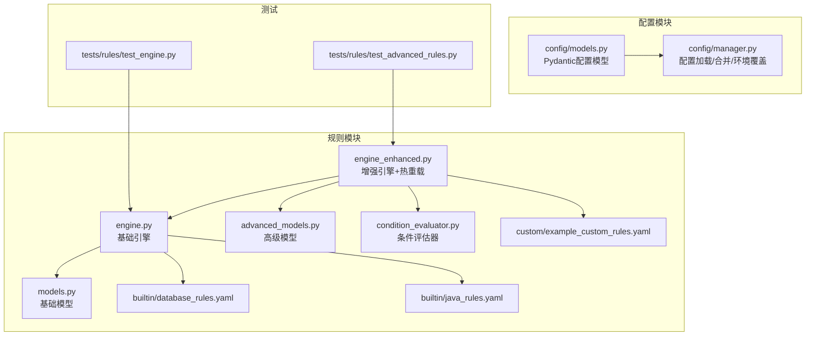
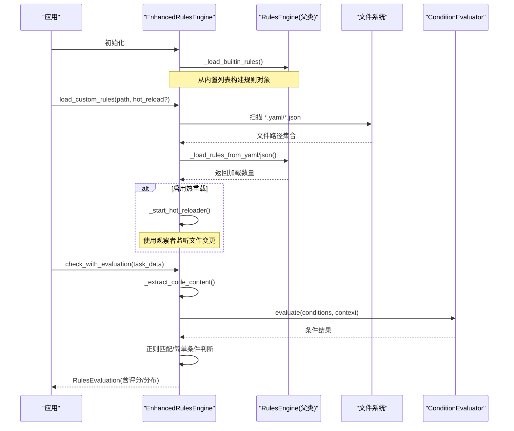
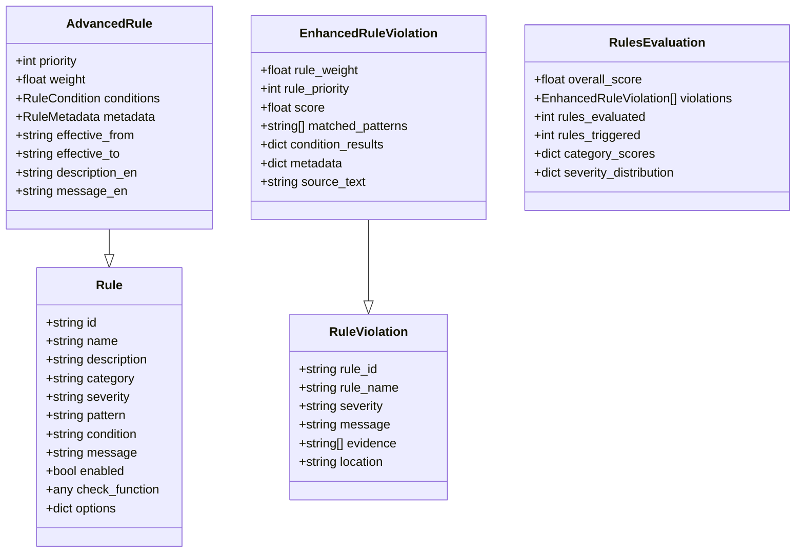
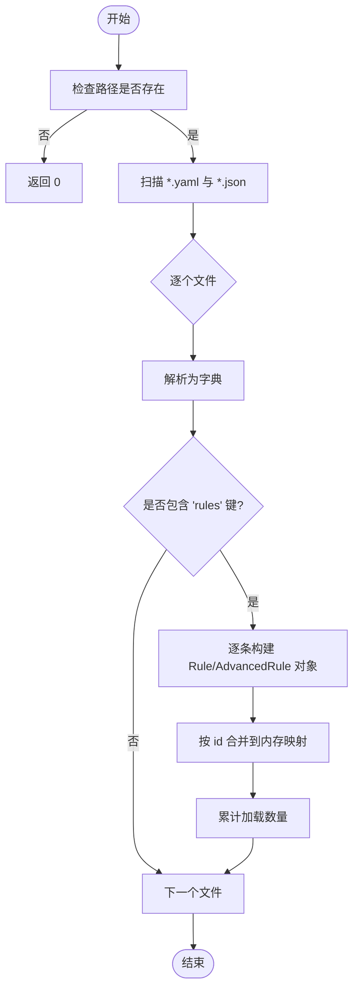
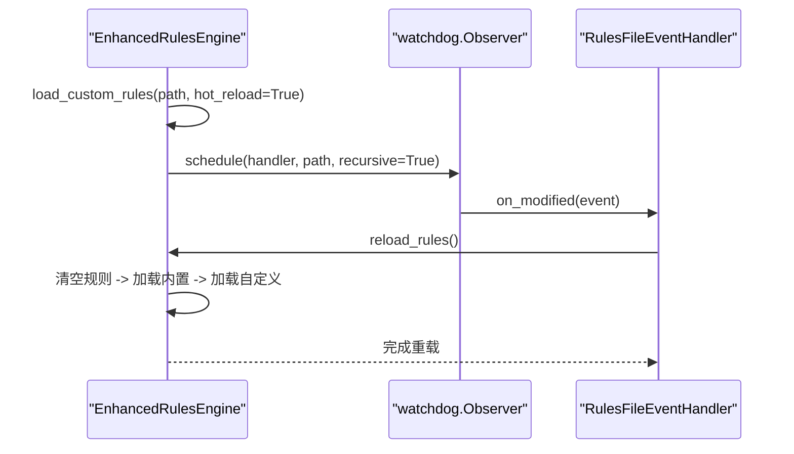
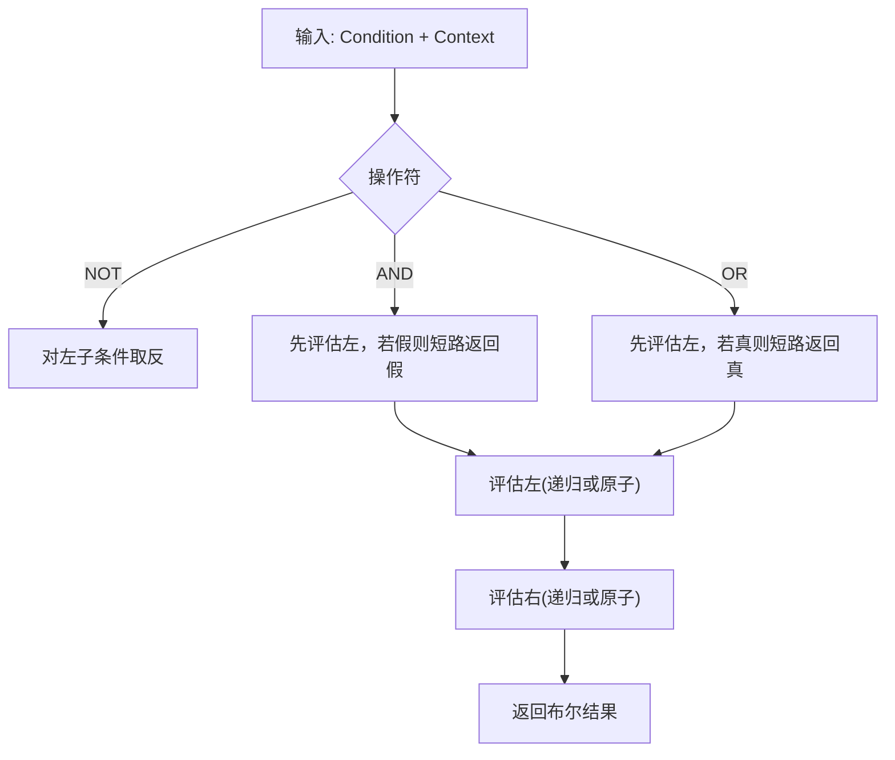
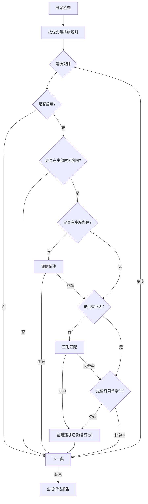
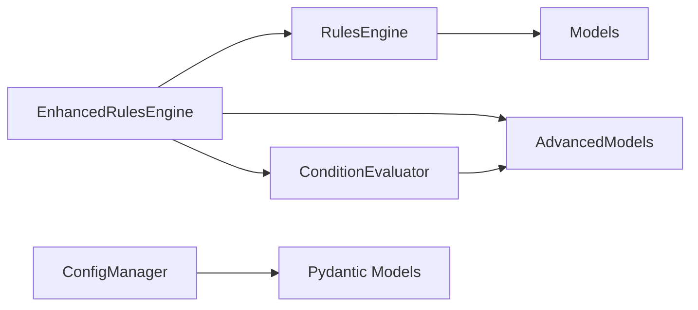

# 规则加载机制

<cite>
**本文引用的文件**   
- [src/rules/__init__.py](file://src/rules/__init__.py)
- [src/rules/models.py](file://src/rules/models.py)
- [src/rules/advanced_models.py](file://src/rules/advanced_models.py)
- [src/rules/engine.py](file://src/rules/engine.py)
- [src/rules/engine_enhanced.py](file://src/rules/engine_enhanced.py)
- [src/rules/condition_evaluator.py](file://src/rules/condition_evaluator.py)
- [src/rules/builtin/database_rules.yaml](file://src/rules/builtin/database_rules.yaml)
- [src/rules/builtin/java_rules.yaml](file://src/rules/builtin/java_rules.yaml)
- [src/rules/custom/example_custom_rules.yaml](file://src/rules/custom/example_custom_rules.yaml)
- [src/config/models.py](file://src/config/models.py)
- [src/config/manager.py](file://src/config/manager.py)
- [tests/rules/test_engine.py](file://tests/rules/test_engine.py)
- [tests/rules/test_advanced_rules.py](file://tests/rules/test_advanced_rules.py)
</cite>

## 目录
1. [引言](#引言)
2. [项目结构](#项目结构)
3. [核心组件](#核心组件)
4. [架构总览](#架构总览)
5. [详细组件分析](#详细组件分析)
6. [依赖关系分析](#依赖关系分析)
7. [性能考量](#性能考量)
8. [故障排查指南](#故障排查指南)
9. [结论](#结论)
10. [附录](#附录)

## 引言
本技术文档聚焦于“规则加载机制”，覆盖以下关键主题：
- YAML 与 JSON 格式的规则配置文件解析流程，包括字段校验、默认值处理与数据转换。
- 内置规则的注册与管理机制，以及预定义规则库的组织结构与扩展方式。
- 动态规则加载的实现原理，支持热重载与版本管理（生效时间窗口）。
- 规则依赖关系的解析与处理逻辑（条件评估器）。
- 规则文件的组织规范与命名约定。
- 错误处理与回滚策略。
- 配置验证与默认值处理。

## 项目结构
规则系统位于 src/rules 下，包含基础模型、引擎实现、高级模型与条件评估器；内置规则以 YAML 形式提供；自定义规则示例位于 custom 目录。应用级配置在 src/config 中提供 Pydantic 模型与配置管理器。

图表来源
- [src/rules/engine.py:217-310](file://src/rules/engine.py#L217-L310)
- [src/rules/engine_enhanced.py:22-118](file://src/rules/engine_enhanced.py#L22-L118)
- [src/rules/condition_evaluator.py:12-189](file://src/rules/condition_evaluator.py#L12-L189)
- [src/rules/models.py:1-51](file://src/rules/models.py#L1-L51)
- [src/rules/advanced_models.py:1-102](file://src/rules/advanced_models.py#L1-L102)
- [src/config/models.py:99-144](file://src/config/models.py#L99-L144)
- [src/config/manager.py:82-112](file://src/config/manager.py#L82-L112)

章节来源
- [src/rules/__init__.py:1-33](file://src/rules/__init__.py#L1-L33)
- [src/rules/models.py:1-51](file://src/rules/models.py#L1-L51)
- [src/rules/advanced_models.py:1-102](file://src/rules/advanced_models.py#L1-L102)
- [src/rules/engine.py:217-310](file://src/rules/engine.py#L217-L310)
- [src/rules/engine_enhanced.py:22-118](file://src/rules/engine_enhanced.py#L22-L118)
- [src/rules/condition_evaluator.py:12-189](file://src/rules/condition_evaluator.py#L12-L189)
- [src/config/models.py:99-144](file://src/config/models.py#L99-L144)
- [src/config/manager.py:82-112](file://src/config/manager.py#L82-L112)

## 核心组件
- 基础模型
  - Rule、RuleViolation、RuleCheckResult、RulesConfig：定义规则、违规、检查结果与引擎配置的数据结构。
- 高级模型
  - AdvancedRule、EnhancedRuleViolation、RulesEvaluation、Condition、OperatorType、RuleMetadata：用于复杂条件、评分与评估报告。
- 引擎
  - RulesEngine：负责内置规则加载、YAML/JSON 自定义规则加载、按正则匹配检查。
  - EnhancedRulesEngine：继承基础引擎，增加优先级、权重、条件评估、热重载与评估报告。
- 条件评估器
  - ConditionEvaluator：支持 AND/OR/NOT 组合与原子表达式解析，提供丰富的比较操作符。
- 配置
  - RulesConfig（Pydantic）：rules.builtin_enabled、rules.custom_paths。
  - ConfigManager：支持 YAML/JSON 读取、合并、环境变量覆盖与验证。

章节来源
- [src/rules/models.py:1-51](file://src/rules/models.py#L1-L51)
- [src/rules/advanced_models.py:1-102](file://src/rules/advanced_models.py#L1-L102)
- [src/rules/engine.py:217-310](file://src/rules/engine.py#L217-L310)
- [src/rules/engine_enhanced.py:22-118](file://src/rules/engine_enhanced.py#L22-L118)
- [src/rules/condition_evaluator.py:12-189](file://src/rules/condition_evaluator.py#L12-L189)
- [src/config/models.py:99-144](file://src/config/models.py#L99-L144)
- [src/config/manager.py:82-112](file://src/config/manager.py#L82-L112)

## 架构总览
规则加载与执行的整体流程如下：
- 启动时创建引擎实例，自动加载内置规则。
- 按需加载自定义规则（YAML/JSON），可开启热重载监听。
- 检查任务数据时，提取代码内容，按规则优先级排序并逐一评估。
- 条件评估器根据上下文计算布尔结果，结合正则匹配生成违规记录。
- 增强引擎输出评分与分类统计的评估报告。

图表来源
- [src/rules/engine_enhanced.py:22-118](file://src/rules/engine_enhanced.py#L22-L118)
- [src/rules/engine.py:239-310](file://src/rules/engine.py#L239-L310)
- [src/rules/condition_evaluator.py:35-110](file://src/rules/condition_evaluator.py#L35-L110)

## 详细组件分析

### 规则数据模型与转换
- 基础模型
  - Rule：id、name、description、category、severity、pattern、condition、message、enabled、check_function、options。
  - RuleViolation：rule_id、rule_name、severity、message、evidence、location。
  - RulesConfig：builtin_enabled、custom_path（兼容旧接口）。
- 高级模型
  - AdvancedRule：在基础之上增加 priority、weight、conditions、metadata、effective_from/to、多语言描述等。
  - EnhancedRuleViolation：新增 score、matched_patterns、condition_results、metadata、source_text 等。
  - RulesEvaluation：overall_score、violations、rules_evaluated/triggers、category_scores、severity_distribution 等。
- 数据转换
  - 从 YAML/JSON 的 rules 数组转换为 Rule/AdvancedRule 对象，缺失字段采用默认值。
  - 增强引擎将基础违规对象包装为增强版违规对象，附带评分与元信息。

图表来源
- [src/rules/models.py:1-51](file://src/rules/models.py#L1-L51)
- [src/rules/advanced_models.py:1-102](file://src/rules/advanced_models.py#L1-L102)

章节来源
- [src/rules/models.py:1-51](file://src/rules/models.py#L1-L51)
- [src/rules/advanced_models.py:1-102](file://src/rules/advanced_models.py#L1-L102)

### YAML/JSON 规则文件解析与 Schema 验证
- 解析入口
  - RulesEngine.load_custom_rules(rules_path)：遍历指定目录下所有 .yaml 与 .json 文件。
  - _load_rules_from_yaml / _load_rules_from_json：分别调用 yaml.safe_load 与 json.load 进行解析。
- 数据结构要求
  - 顶层需包含 "rules" 键，值为规则对象数组。
  - 每个规则对象至少包含 id，其余字段可选，未提供时使用默认值（如 category="custom"、severity="medium"、enabled=True）。
- 默认值与容错
  - 若文件不存在或无 "rules" 键，直接返回 0。
  - 解析异常被捕获并记录日志，不影响其他文件加载。
- 兼容性
  - 基础引擎与增强引擎均复用同一解析逻辑，确保行为一致。

图表来源
- [src/rules/engine.py:239-310](file://src/rules/engine.py#L239-L310)

章节来源
- [src/rules/engine.py:239-310](file://src/rules/engine.py#L239-L310)

### 内置规则注册与管理
- 内置规则源
  - engine.py 中的 BUILTIN_RULES 列表，提供安全、代码质量、性能等常见模式。
  - builtin 目录下的 database_rules.yaml 与 java_rules.yaml 作为领域专用规则集示例。
- 注册过程
  - 引擎初始化时调用 _load_builtin_rules，将内置规则转换为 Rule/AdvancedRule 对象并注册到内存映射。
- 管理与查询
  - get_rule/get_all_rules/get_rules_by_category 提供按 ID、全部、分类检索能力。
- 扩展方式
  - 新增内置规则：在 BUILTIN_RULES 追加条目。
  - 新增领域规则集：在 builtin 目录添加新的 YAML 文件，并在加载流程中纳入扫描范围（当前通过 load_custom_rules 统一加载）。

章节来源
- [src/rules/engine.py:159-238](file://src/rules/engine.py#L159-L238)
- [src/rules/builtin/database_rules.yaml:1-39](file://src/rules/builtin/database_rules.yaml#L1-L39)
- [src/rules/builtin/java_rules.yaml:1-48](file://src/rules/builtin/java_rules.yaml#L1-L48)

### 动态规则加载与热重载
- 动态加载
  - load_custom_rules(rules_path) 支持运行时加载自定义规则，返回加载数量。
- 热重载
  - EnhancedRulesEngine._start_hot_reloader 基于 watchdog 观察规则目录，当 .yaml/.yml/.json 文件修改时触发 reload_rules。
  - reload_rules 会清空内存规则、重新加载内置与自定义规则，并更新最后重载时间。
- 线程安全
  - 使用 RLock 保护重载与访问，避免并发冲突。
- 停止监视
  - stop_hot_reloader 优雅停止观察者线程，析构函数中自动清理。

图表来源
- [src/rules/engine_enhanced.py:52-127](file://src/rules/engine_enhanced.py#L52-L127)

章节来源
- [src/rules/engine_enhanced.py:52-127](file://src/rules/engine_enhanced.py#L52-L127)

### 规则依赖关系与条件评估
- 条件模型
  - Condition：left/right 可为子条件或字符串表达式，operator 为 AND/OR/NOT，value 为可选字面量。
  - RuleCondition：conditions 列表、operator、min/max_score。
- 评估器
  - ConditionEvaluator.evaluate：递归评估嵌套条件，短路求值（AND/OR）。
  - _evaluate_atomic：解析原子表达式，支持 key == value、contains/matches/in/starts_with 等操作符。
  - _get_value/_parse_value：支持点号路径取值与类型推断（布尔、数字、字符串、JSON 数组）。
- 集成到引擎
  - EnhancedRulesEngine._evaluate_advanced_conditions 将 task_data 与 context 合并后传入评估器。
  - 若条件不满足则跳过该规则的正则匹配。

图表来源
- [src/rules/condition_evaluator.py:35-110](file://src/rules/condition_evaluator.py#L35-L110)

章节来源
- [src/rules/advanced_models.py:10-36](file://src/rules/advanced_models.py#L10-L36)
- [src/rules/condition_evaluator.py:35-110](file://src/rules/condition_evaluator.py#L35-L110)
- [src/rules/engine_enhanced.py:260-286](file://src/rules/engine_enhanced.py#L260-L286)

### 规则执行与评分
- 执行顺序
  - 按 priority 降序执行，高优先级规则优先命中。
- 匹配策略
  - 若存在 conditions，先评估条件；再尝试 pattern 正则匹配；最后尝试 condition 简单条件（如 lines > 100）。
- 评分与报告
  - 根据 severity、priority、weight 计算单条违规分数。
  - 汇总整体分数、严重级别分布、分类得分等。

图表来源
- [src/rules/engine_enhanced.py:170-258](file://src/rules/engine_enhanced.py#L170-L258)
- [src/rules/engine_enhanced.py:319-373](file://src/rules/engine_enhanced.py#L319-L373)

章节来源
- [src/rules/engine_enhanced.py:170-258](file://src/rules/engine_enhanced.py#L170-L258)
- [src/rules/engine_enhanced.py:319-373](file://src/rules/engine_enhanced.py#L319-L373)

### 规则文件组织结构与命名规范
- 目录建议
  - builtin：存放官方内置规则集（YAML）。
  - custom：存放用户自定义规则（YAML/JSON），由 load_custom_rules 扫描。
- 文件名与标识
  - 建议使用 <前缀>-<编号> 的 id 格式，避免与内置规则冲突。
  - 示例：java-001、db-001、custom-001。
- 字段说明
  - id、name、description、category、severity、pattern/condition、message、enabled。
  - 高级规则可附加 priority、weight、conditions、metadata、effective_from/to 等。

章节来源
- [src/rules/custom/example_custom_rules.yaml:1-41](file://src/rules/custom/example_custom_rules.yaml#L1-L41)
- [src/rules/builtin/database_rules.yaml:1-39](file://src/rules/builtin/database_rules.yaml#L1-L39)
- [src/rules/builtin/java_rules.yaml:1-48](file://src/rules/builtin/java_rules.yaml#L1-L48)

### 错误处理与回滚机制
- 解析阶段
  - 单个文件解析异常会被捕获并记录日志，不会中断其他文件加载。
- 运行阶段
  - 规则执行异常被抑制并记录警告，继续执行后续规则。
- 热重载
  - 文件修改事件触发 reload_rules，内部使用锁保护，避免并发问题。
  - 若重载失败，仅记录错误日志，不破坏已加载规则状态。
- 回滚策略
  - 当前实现未显式维护历史快照；reload_rules 会重建规则集。建议在业务层保存最近一次成功加载的快照，以便需要时恢复。

章节来源
- [src/rules/engine.py:252-310](file://src/rules/engine.py#L252-L310)
- [src/rules/engine_enhanced.py:105-127](file://src/rules/engine_enhanced.py#L105-L127)
- [src/rules/engine_enhanced.py:255-258](file://src/rules/engine_enhanced.py#L255-L258)

### 配置验证与默认值处理
- 配置模型
  - RulesConfig：rules.builtin_enabled、rules.custom_paths。
- 配置加载
  - ConfigManager.load_from_file 支持 YAML/JSON 读取与合并。
  - _apply_env_overrides 支持通过环境变量覆盖配置项（如 RULES_BUILTIN_ENABLED）。
- 验证
  - validate 方法通过 Pydantic 模型构造进行强类型校验，返回错误列表。
- 默认值
  - 各配置项均有合理默认值，未显式设置时自动填充。

章节来源
- [src/config/models.py:99-144](file://src/config/models.py#L99-L144)
- [src/config/manager.py:82-112](file://src/config/manager.py#L82-L112)
- [src/config/manager.py:191-243](file://src/config/manager.py#L191-L243)
- [src/config/manager.py:161-173](file://src/config/manager.py#L161-L173)

## 依赖关系分析
- 模块耦合
  - EnhancedRulesEngine 依赖基础 RulesEngine、高级模型与条件评估器。
  - 条件评估器独立，仅依赖基础模型与标准库。
  - 配置模块与规则模块解耦，通过配置项控制行为。
- 外部依赖
  - 热重载依赖 watchdog（可选，仅在启用时导入）。
  - YAML 解析依赖 pyyaml（按需导入）。

图表来源
- [src/rules/engine_enhanced.py:22-118](file://src/rules/engine_enhanced.py#L22-L118)
- [src/rules/engine.py:217-310](file://src/rules/engine.py#L217-L310)
- [src/rules/condition_evaluator.py:12-189](file://src/rules/condition_evaluator.py#L12-L189)
- [src/config/manager.py:82-112](file://src/config/manager.py#L82-L112)

章节来源
- [src/rules/engine_enhanced.py:22-118](file://src/rules/engine_enhanced.py#L22-L118)
- [src/rules/engine.py:217-310](file://src/rules/engine.py#L217-L310)
- [src/rules/condition_evaluator.py:12-189](file://src/rules/condition_evaluator.py#L12-L189)
- [src/config/manager.py:82-112](file://src/config/manager.py#L82-L112)

## 性能考量
- 正则匹配开销
  - 大量规则与长文本可能导致 CPU 占用上升，建议精简 pattern 或使用更精确的模式。
- 条件评估
  - 嵌套条件较多时注意短路求值，避免不必要的深度计算。
- 热重载
  - 文件监控会增加少量 I/O 开销，生产环境谨慎启用。
- 优先级与权重
  - 合理设置 priority 与 weight，减少低价值规则的匹配成本。

[本节为通用指导，无需源码引用]

## 故障排查指南
- 规则未生效
  - 检查 enabled 是否为 true。
  - 确认 id 是否与内置规则冲突。
  - 查看日志中是否有解析错误或加载失败提示。
- 热重载无效
  - 确认 watchdog 是否安装且可用。
  - 检查规则目录路径是否正确，文件后缀是否为 .yaml/.yml/.json。
- 条件不满足
  - 核对 context 与 task_data 结构是否符合预期。
  - 使用 ConditionEvaluator 的原子表达式语法调试。
- 配置错误
  - 使用 ConfigManager.validate 获取详细错误列表。
  - 检查环境变量覆盖是否覆盖了期望字段。

章节来源
- [src/rules/engine.py:252-310](file://src/rules/engine.py#L252-L310)
- [src/rules/engine_enhanced.py:105-127](file://src/rules/engine_enhanced.py#L105-L127)
- [src/config/manager.py:161-173](file://src/config/manager.py#L161-L173)

## 结论
本规则加载机制提供了灵活的 YAML/JSON 配置解析、强大的条件评估与评分体系，并通过热重载支持动态更新。通过清晰的模型设计与模块化架构，系统在可扩展性与可维护性方面具备良好基础。建议在生产环境中结合配置验证与日志监控，确保规则集的稳定与可控。

[本节为总结，无需源码引用]

## 附录
- 使用示例参考
  - 基础引擎测试：tests/rules/test_engine.py
  - 增强引擎测试：tests/rules/test_advanced_rules.py

章节来源
- [tests/rules/test_engine.py:1-367](file://tests/rules/test_engine.py#L1-L367)
- [tests/rules/test_advanced_rules.py:1-331](file://tests/rules/test_advanced_rules.py#L1-L331)
