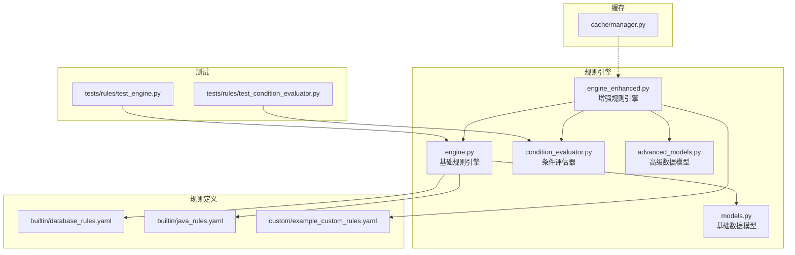
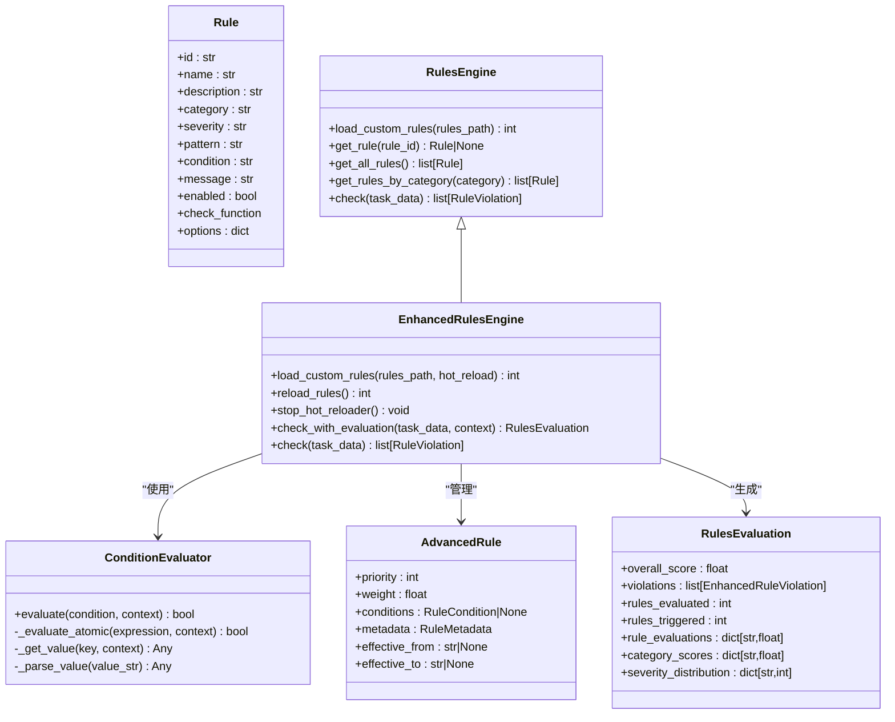
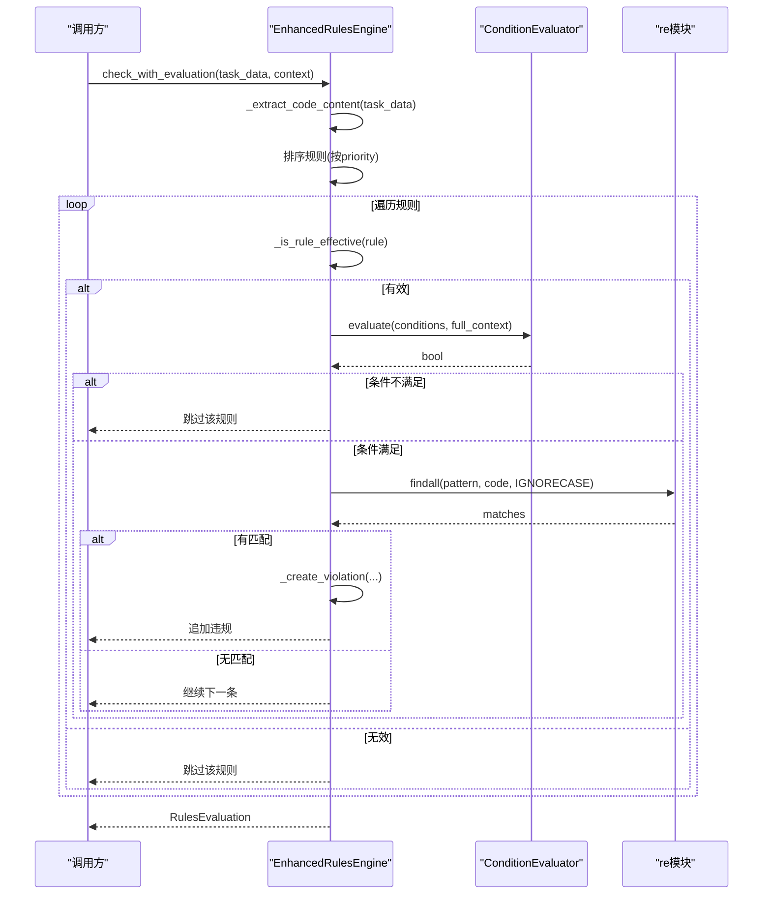
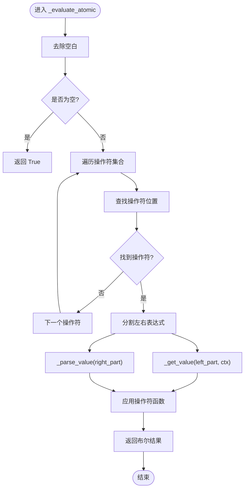
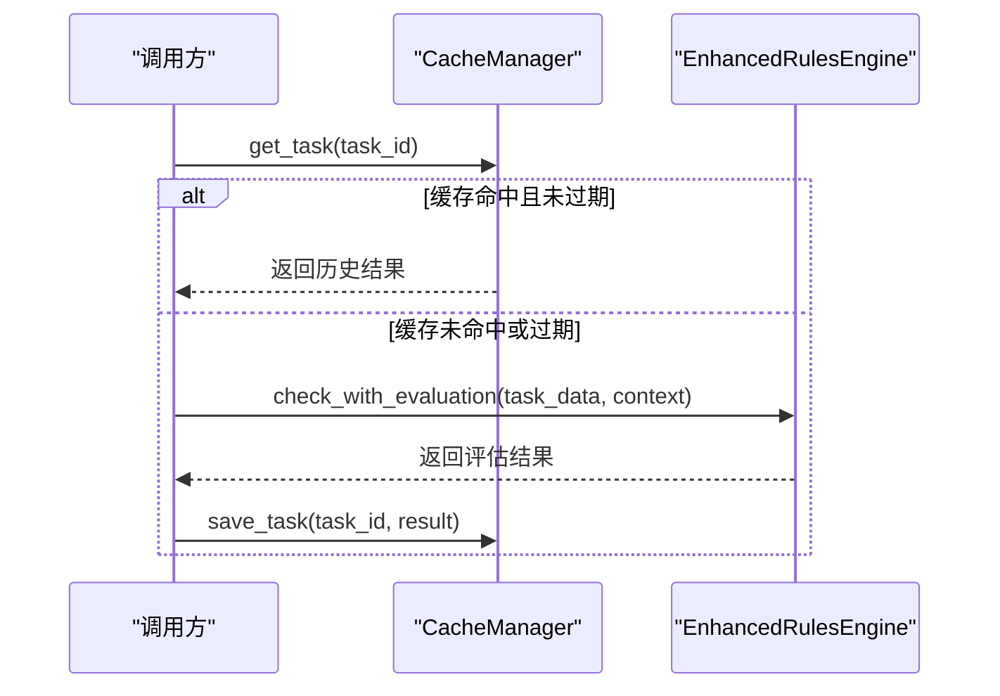
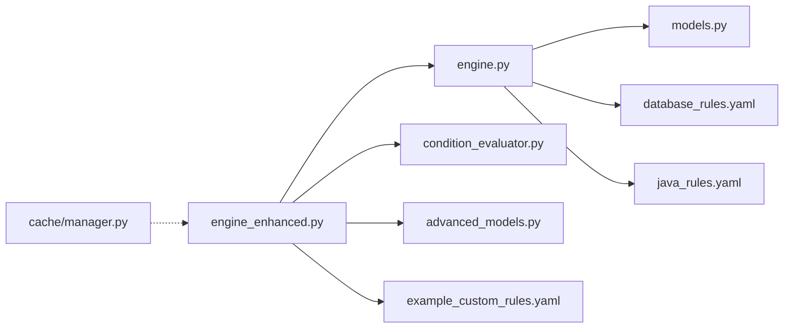

# 规则匹配算法

<cite>
**本文引用的文件**   
- [engine.py](file://src/rules/engine.py)
- [engine_enhanced.py](file://src/rules/engine_enhanced.py)
- [condition_evaluator.py](file://src/rules/condition_evaluator.py)
- [models.py](file://src/rules/models.py)
- [advanced_models.py](file://src/rules/advanced_models.py)
- [database_rules.yaml](file://src/rule s/builtin/database_rules.yaml)
- [java_rules.yaml](file://src/rules/builtin/java_rules.yaml)
- [example_custom_rules.yaml](file://src/rules/custom/example_custom_rules.yaml)
- [test_condition_evaluator.py](file://tests/rules/test_condition_evaluator.py)
- [test_engine.py](file://tests/rules/test_engine.py)
- [manager.py](file://src/cache/manager.py)
</cite>

## 目录
1. [引言](#引言)
2. [项目结构](#项目结构)
3. [核心组件](#核心组件)
4. [架构总览](#架构总览)
5. [详细组件分析](#详细组件分析)
6. [依赖关系分析](#依赖关系分析)
7. [性能与复杂度](#性能与复杂度)
8. [正则表达式最佳实践与陷阱](#正则表达式最佳实践与陷阱)
9. [条件评估器与安全求值](#条件评估器与安全求值)
10. [缓存策略与增量更新](#缓存策略与增量更新)
11. [故障排查指南](#故障排查指南)
12. [结论](#结论)

## 引言
本技术文档聚焦于规则匹配算法的实现与优化，覆盖以下关键主题：
- 正则表达式匹配：模式编译、匹配流程、性能优化与调优建议
- 条件表达式解析与执行：支持 AND/OR/NOT 组合的轻量级表达式语言
- AST（抽象语法树）在复杂条件判断中的应用现状与建议
- 时间复杂度与空间优化策略
- 正则表达式最佳实践与常见陷阱
- 条件评估器的扩展接口与自定义函数注册机制
- 匹配结果的缓存策略与增量更新机制

## 项目结构
规则引擎位于 src/rules 目录下，包含基础引擎、增强引擎、条件评估器与数据模型；内置规则以 YAML 形式提供；测试用例覆盖引擎与条件评估器。

图表来源
- [engine.py:217-352](file://src/rules/engine.py#L217-L352)
- [engine_enhanced.py:22-118](file://src/rules/engine_enhanced.py#L22-L118)
- [condition_evaluator.py:12-165](file://src/rules/condition_evaluator.py#L12-L165)
- [models.py:5-51](file://src/rules/models.py#L5-L51)
- [advanced_models.py:10-102](file://src/rules/advanced_models.py#L10-L102)
- [database_rules.yaml:1-39](file://src/rules/builtin/database_rules.yaml#L1-L39)
- [java_rules.yaml:1-48](file://src/rules/builtin/java_rules.yaml#L1-L48)
- [example_custom_rules.yaml:1-41](file://src/rules/custom/example_custom_rules.yaml#L1-L41)
- [test_condition_evaluator.py:1-407](file://tests/rules/test_condition_evaluator.py#L1-L407)
- [test_engine.py:1-367](file://tests/rules/test_engine.py#L1-L367)
- [manager.py:10-165](file://src/cache/manager.py#L10-L165)

章节来源
- [engine.py:217-352](file://src/rules/engine.py#L217-L352)
- [engine_enhanced.py:22-118](file://src/rules/engine_enhanced.py#L22-L118)
- [condition_evaluator.py:12-165](file://src/rules/condition_evaluator.py#L12-L165)
- [models.py:5-51](file://src/rules/models.py#L5-L51)
- [advanced_models.py:10-102](file://src/rules/advanced_models.py#L10-L102)
- [database_rules.yaml:1-39](file://src/rules/builtin/database_rules.yaml#L1-L39)
- [java_rules.yaml:1-48](file://src/rules/builtin/java_rules.yaml#L1-L48)
- [example_custom_rules.yaml:1-41](file://src/rules/custom/example_custom_rules.yaml#L1-L41)
- [test_condition_evaluator.py:1-407](file://tests/rules/test_condition_evaluator.py#L1-L407)
- [test_engine.py:1-367](file://tests/rules/test_engine.py#L1-L367)
- [manager.py:10-165](file://src/cache/manager.py#L10-L165)

## 核心组件
- 基础规则引擎（RulesEngine）
  - 负责加载内置与自定义规则（YAML/JSON），对任务数据进行正则匹配并生成违规记录
  - 提供按类别查询、获取全部规则等能力
- 增强规则引擎（EnhancedRulesEngine）
  - 继承基础引擎，引入优先级、权重、生效时间窗口、评分计算、热重载与评估报告
  - 集成条件评估器，支持高级条件组合与简单条件分支
- 条件评估器（ConditionEvaluator）
  - 实现 AND/OR/NOT 组合与原子表达式求值，支持比较、包含、匹配、存在性、空值检查等操作符
  - 提供便捷构造器 create_condition 用于构建嵌套条件
- 数据模型
  - 基础模型：Rule、RuleViolation、RuleCheckResult、RulesConfig
  - 高级模型：AdvancedRule、EnhancedRuleViolation、RulesEvaluation、OperatorType、Condition 等

章节来源
- [engine.py:217-352](file://src/rules/engine.py#L217-L352)
- [engine_enhanced.py:22-118](file://src/rules/engine_enhanced.py#L22-L118)
- [condition_evaluator.py:12-165](file://src/rules/condition_evaluator.py#L12-L165)
- [models.py:5-51](file://src/rules/models.py#L5-L51)
- [advanced_models.py:10-102](file://src/rules/advanced_models.py#L10-L102)

## 架构总览
规则引擎采用“基础 + 增强”的分层设计：基础引擎专注规则加载与正则匹配；增强引擎在此基础上增加条件评估、评分、热重载与评估报告。条件评估器作为独立模块，通过操作符映射与上下文取值完成表达式求值。

图表来源
- [engine.py:217-352](file://src/rules/engine.py#L217-L352)
- [engine_enhanced.py:22-118](file://src/rules/engine_enhanced.py#L22-L118)
- [condition_evaluator.py:12-165](file://src/rules/condition_evaluator.py#L12-L165)
- [advanced_models.py:51-102](file://src/rules/advanced_models.py#L51-L102)

## 详细组件分析

### 正则匹配流程与优化
- 匹配入口
  - 基础引擎：遍历所有启用规则，若规则包含 pattern，则对提取的代码内容执行 re.findall（忽略大小写）
  - 增强引擎：在优先级排序后，先评估高级条件与生效时间窗口，再执行正则匹配或简单条件分支
- 代码内容提取
  - 从 task_data.development.commits 中拼接 commit message 作为匹配文本
- 优化要点
  - 预编译正则：将频繁使用的 pattern 在规则加载阶段编译为 re.Pattern，避免重复编译开销
  - 短路评估：增强引擎对 AND/OR 条件进行短路求值，减少不必要的正则匹配
  - 优先级与过滤：按 priority 降序处理，结合 enabled 与生效时间窗口提前跳过无效规则
  - 证据裁剪：仅保留前若干条匹配证据，控制结果体积

图表来源
- [engine_enhanced.py:131-173](file://src/rules/engine_enhanced.py#L131-L173)
- [engine_enhanced.py:222-258](file://src/rules/engine_enhanced.py#L222-L258)
- [engine_enhanced.py:260-286](file://src/rules/engine_enhanced.py#L260-L286)
- [engine.py:324-352](file://src/rules/engine.py#L324-L352)

章节来源
- [engine.py:324-352](file://src/rules/engine.py#L324-L352)
- [engine_enhanced.py:131-173](file://src/rules/engine_enhanced.py#L131-L173)
- [engine_enhanced.py:222-258](file://src/rules/engine_enhanced.py#L222-L258)
- [engine_enhanced.py:260-286](file://src/rules/engine_enhanced.py#L260-L286)

### 条件表达式解析与执行
- 表达式语法
  - 原子表达式：key op value，如 name == 'alice'、age > 30、description contains 'bug'
  - 复合表达式：AND/OR/NOT 组合，支持嵌套
- 操作符集合
  - 比较：==、!=、>、<、>=、<=
  - 字符串：contains、not_contains、matches、starts_with、ends_with
  - 集合：in、not_in
  - 存在性与空值：exists、is_empty
- 上下文取值
  - 支持点号访问（data.nested.value），缺失键返回 None
- 已知问题
  - 操作符子串歧义：由于按字典顺序查找操作符，部分多字符操作符可能被短操作符抢先匹配（例如 not_contains 被 contains 命中、<= 被 < 命中、in 在 quoted 字符串内命中）。这会导致某些表达式无法按预期工作。

图表来源
- [condition_evaluator.py:77-110](file://src/rules/condition_evaluator.py#L77-L110)
- [condition_evaluator.py:112-164](file://src/rules/condition_evaluator.py#L112-L164)

章节来源
- [condition_evaluator.py:12-165](file://src/rules/condition_evaluator.py#L12-L165)
- [test_condition_evaluator.py:109-283](file://tests/rules/test_condition_evaluator.py#L109-L283)

### AST（抽象语法树）解析的应用现状与建议
- 现状
  - 当前条件评估器采用“基于字符串的解析+操作符映射”，未实现完整 AST 解析
  - 复合条件通过 Condition 对象表示，形成逻辑上的树形结构，但并非由表达式字符串解析生成的 AST
- 建议
  - 引入 Python ast 模块对表达式进行安全解析与求值，限制可访问的命名空间与内置函数
  - 将字符串表达式转换为 AST 节点，再进行受限求值，提升安全性与表达能力
  - 针对现有操作符歧义问题，可通过词法分析（Tokenizer）与语法分析（Parser）彻底解决

章节来源
- [condition_evaluator.py:12-165](file://src/rules/condition_evaluator.py#L12-L165)
- [advanced_models.py:18-36](file://src/rules/advanced_models.py#L18-L36)

### 匹配算法的时间复杂度分析与空间优化
- 时间复杂度
  - 单条规则的正则匹配：O(N)，N 为代码内容长度（re.findall 线性扫描）
  - 整体匹配：O(R × N)，R 为启用的规则数量
  - 条件评估：O(C × K)，C 为条件节点数，K 为操作符集合大小（常数级）
- 空间复杂度
  - 匹配证据裁剪至固定上限，控制内存占用
  - 规则对象与评估结果按需创建，避免全局大对象
- 优化策略
  - 预编译正则：在规则加载时编译 pattern，降低运行时开销
  - 短路求值：AND/OR 条件短路，减少不必要的正则匹配
  - 优先级与过滤：优先处理高优先级规则，结合生效时间窗口与 enabled 标志快速跳过无效规则
  - 批量匹配：对相同 pattern 的规则合并执行，减少重复扫描

章节来源
- [engine.py:324-352](file://src/rules/engine.py#L324-L352)
- [engine_enhanced.py:170-201](file://src/rules/engine_enhanced.py#L170-L201)
- [engine_enhanced.py:260-286](file://src/rules/engine_enhanced.py#L260-L286)

### 正则表达式最佳实践与常见陷阱
- 最佳实践
  - 明确边界：使用 \b 或锚点 ^/$ 限定匹配范围，避免误匹配
  - 非贪婪匹配：尽可能使用非贪婪量词以减少回溯
  - 分组与捕获：仅在需要时捕获，避免过多分组影响性能
  - 预编译：对高频使用的 pattern 进行预编译
  - 分类与索引：对规则按 category 分组，便于选择性执行
- 常见陷阱
  - 回溯灾难：避免嵌套量词与重叠分支（如 (a+)+）
  - 忽略大小写带来的语义变化：谨慎使用 IGNORECASE
  - 跨行匹配：注意换行符与 MULTILINE/DOTALL 的影响
  - 操作符歧义：在条件表达式中使用多字符操作符时需确保词法正确（见“条件表达式解析与执行”）

章节来源
- [engine.py:324-352](file://src/rules/engine.py#L324-L352)
- [engine_enhanced.py:246-249](file://src/rules/engine_enhanced.py#L246-L249)
- [database_rules.yaml:1-39](file://src/rules/builtin/database_rules.yaml#L1-L39)
- [java_rules.yaml:1-48](file://src/rules/builtin/java_rules.yaml#L1-L48)

### 条件评估器的扩展接口与自定义函数注册
- 扩展点
  - 操作符映射：通过内部字典添加新操作符（如自定义 contains 变体）
  - 值解析：在 _parse_value 中扩展类型解析（如日期、枚举）
  - 上下文取值：在 _get_value 中支持更多数据结构访问方式
- 自定义函数注册机制（建议）
  - 提供 register_operator(name, func) 接口，允许运行时注入操作符
  - 提供 register_parser(type_name, parser_func) 接口，允许扩展值解析器
  - 提供 register_resolver(context_key, resolver_func) 接口，允许扩展上下文取值逻辑
- 注意事项
  - 保持操作符名称唯一且不与子串冲突，避免歧义
  - 对自定义函数进行白名单校验，防止任意代码执行风险

章节来源
- [condition_evaluator.py:12-33](file://src/rules/condition_evaluator.py#L12-L33)
- [condition_evaluator.py:112-164](file://src/rules/condition_evaluator.py#L112-L164)

### 匹配结果的缓存策略与增量更新
- 缓存策略
  - 使用 SQLite 存储任务结果，设置 TTL 过期时间
  - 提供 get_task/save_task/invalidate/cleanup_expired 等接口
  - 统计信息：total_entries、valid_entries、expired_entries
- 增量更新
  - 基于任务 ID 的细粒度失效：invalidate(task_id)
  - 全量清理：invalidate_all()/cleanup_expired()
  - 状态查询：get_status(task_id) 返回 NOT_EXISTS/VALID/EXPIRED
- 与规则引擎集成建议
  - 在规则匹配前尝试读取缓存，命中则直接返回
  - 规则变更或配置更新时触发相应任务的缓存失效
  - 定期清理过期条目，释放磁盘空间

图表来源
- [manager.py:37-76](file://src/cache/manager.py#L37-L76)
- [manager.py:78-165](file://src/cache/manager.py#L78-L165)
- [engine_enhanced.py:131-173](file://src/rules/engine_enhanced.py#L131-L173)

章节来源
- [manager.py:37-76](file://src/cache/manager.py#L37-L76)
- [manager.py:78-165](file://src/cache/manager.py#L78-L165)
- [engine_enhanced.py:131-173](file://src/rules/engine_enhanced.py#L131-L173)

## 依赖关系分析
- 模块耦合
  - 增强引擎依赖基础引擎、条件评估器与高级模型
  - 条件评估器依赖操作符映射与上下文取值，低耦合
  - 规则定义通过 YAML 文件提供，易于扩展与维护
- 外部依赖
  - 正则模块 re
  - 文件系统监听 watchdog（可选，用于热重载）
  - SQLite（缓存）
- 潜在循环依赖
  - 当前未见循环导入；增强引擎通过 super().load_custom_rules 复用基础引擎加载逻辑

图表来源
- [engine_enhanced.py:22-118](file://src/rules/engine_enhanced.py#L22-L118)
- [engine.py:217-352](file://src/rules/engine.py#L217-L352)
- [condition_evaluator.py:12-165](file://src/rules/condition_evaluator.py#L12-L165)
- [models.py:5-51](file://src/rules/models.py#L5-L51)
- [advanced_models.py:10-102](file://src/rules/advanced_models.py#L10-L102)
- [database_rules.yaml:1-39](file://src/rules/builtin/database_rules.yaml#L1-L39)
- [java_rules.yaml:1-48](file://src/rules/builtin/java_rules.yaml#L1-L48)
- [example_custom_rules.yaml:1-41](file://src/rules/custom/example_custom_rules.yaml#L1-L41)
- [manager.py:10-165](file://src/cache/manager.py#L10-L165)

章节来源
- [engine_enhanced.py:22-118](file://src/rules/engine_enhanced.py#L22-L118)
- [engine.py:217-352](file://src/rules/engine.py#L217-L352)
- [condition_evaluator.py:12-165](file://src/rules/condition_evaluator.py#L12-L165)
- [models.py:5-51](file://src/rules/models.py#L5-L51)
- [advanced_models.py:10-102](file://src/rules/advanced_models.py#L10-L102)
- [database_rules.yaml:1-39](file://src/rules/builtin/database_rules.yaml#L1-L39)
- [java_rules.yaml:1-48](file://src/rules/builtin/java_rules.yaml#L1-L48)
- [example_custom_rules.yaml:1-41](file://src/rules/custom/example_custom_rules.yaml#L1-L41)
- [manager.py:10-165](file://src/cache/manager.py#L10-L165)

## 性能与复杂度
- 正则匹配
  - 单次 O(N)，整体 O(R×N)
  - 建议：预编译、短路评估、证据裁剪、批量匹配
- 条件评估
  - 单次 O(C×K)，K 为操作符集合大小（常数）
  - 建议：修复操作符歧义、引入 AST 解析
- 缓存
  - I/O 成本取决于 SQLite 读写与 JSON 序列化
  - 建议：合理 TTL、增量失效、定期清理

章节来源
- [engine.py:324-352](file://src/rules/engine.py#L324-L352)
- [engine_enhanced.py:170-201](file://src/rules/engine_enhanced.py#L170-L201)
- [condition_evaluator.py:77-110](file://src/rules/condition_evaluator.py#L77-L110)
- [manager.py:37-76](file://src/cache/manager.py#L37-L76)

## 正则表达式最佳实践与陷阱
- 最佳实践
  - 使用明确的边界与锚点，避免过度宽泛的模式
  - 合理使用非贪婪量词与分组，减少回溯
  - 对高频模式进行预编译
  - 按类别组织规则，选择性执行
- 常见陷阱
  - 回溯灾难：避免嵌套量词与重叠分支
  - 忽略大小写导致的语义变化
  - 跨行匹配时的换行符与 DOTALL/MULTILINE 影响
  - 条件表达式中的操作符歧义（见“条件表达式解析与执行”）

章节来源
- [engine.py:324-352](file://src/rules/engine.py#L324-L352)
- [engine_enhanced.py:246-249](file://src/rules/engine_enhanced.py#L246-L249)
- [database_rules.yaml:1-39](file://src/rules/builtin/database_rules.yaml#L1-L39)
- [java_rules.yaml:1-48](file://src/rules/builtin/java_rules.yaml#L1-L48)
- [condition_evaluator.py:77-110](file://src/rules/condition_evaluator.py#L77-L110)

## 条件评估器与安全求值
- 安全求值现状
  - 当前未使用 eval/exec，而是通过操作符映射与上下文取值实现
  - 值解析支持布尔、数字、字符串、JSON 列表等
- 安全建议
  - 引入 AST 解析与受限命名空间，禁止危险内置函数
  - 对自定义函数进行白名单校验
  - 对输入进行严格校验与长度限制

章节来源
- [condition_evaluator.py:12-165](file://src/rules/condition_evaluator.py#L12-L165)
- [test_condition_evaluator.py:109-283](file://tests/rules/test_condition_evaluator.py#L109-L283)

## 缓存策略与增量更新
- 策略
  - 基于任务 ID 的缓存项，TTL 控制有效期
  - 提供统计信息与清理接口
- 增量更新
  - 细粒度失效：invalidate(task_id)
  - 全量清理：invalidate_all()/cleanup_expired()
  - 状态查询：get_status(task_id)
- 集成建议
  - 规则匹配前先查缓存，命中则直接返回
  - 规则变更或配置更新时触发相应任务失效
  - 定期清理过期条目

章节来源
- [manager.py:37-76](file://src/cache/manager.py#L37-L76)
- [manager.py:78-165](file://src/cache/manager.py#L78-L165)
- [engine_enhanced.py:131-173](file://src/rules/engine_enhanced.py#L131-L173)

## 故障排查指南
- 条件表达式失败
  - 现象：表达式未按预期工作
  - 原因：操作符子串歧义（如 not_contains 被 contains 命中、<= 被 < 命中、in 在 quoted 字符串内命中）
  - 处理：修复操作符匹配顺序或引入词法分析；参考测试用例定位问题
- 规则未触发
  - 现象：期望的规则未产生违规
  - 原因：规则 disabled、生效时间窗口外、条件不满足、正则未匹配
  - 处理：检查规则 enabled 与 effective_from/to；验证条件表达式与正则模式
- 性能问题
  - 现象：匹配耗时过长
  - 原因：大量规则、复杂正则、未预编译
  - 处理：预编译正则、短路评估、证据裁剪、批量匹配

章节来源
- [test_condition_evaluator.py:109-283](file://tests/rules/test_condition_evaluator.py#L109-L283)
- [engine_enhanced.py:213-221](file://src/rules/engine_enhanced.py#L213-L221)
- [engine.py:324-352](file://src/rules/engine.py#L324-L352)

## 结论
本规则匹配系统以“基础 + 增强”的架构实现了高效的正则匹配与条件评估，具备可扩展的规则定义与缓存机制。通过预编译正则、短路求值、优先级与过滤、证据裁剪等手段，系统在性能与资源占用方面取得良好平衡。未来可在条件评估器中引入 AST 解析与受限求值，进一步提升安全性与表达能力；同时完善操作符歧义修复与自定义函数注册机制，使系统更健壮与易用。