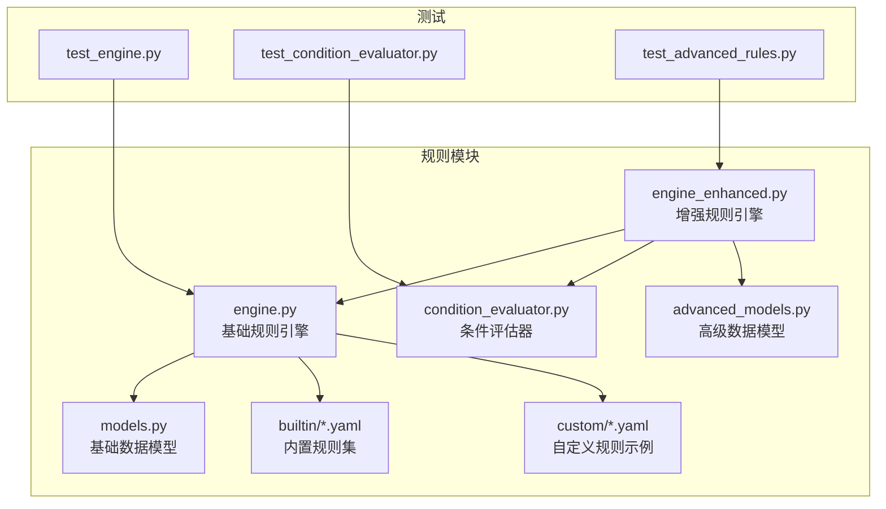
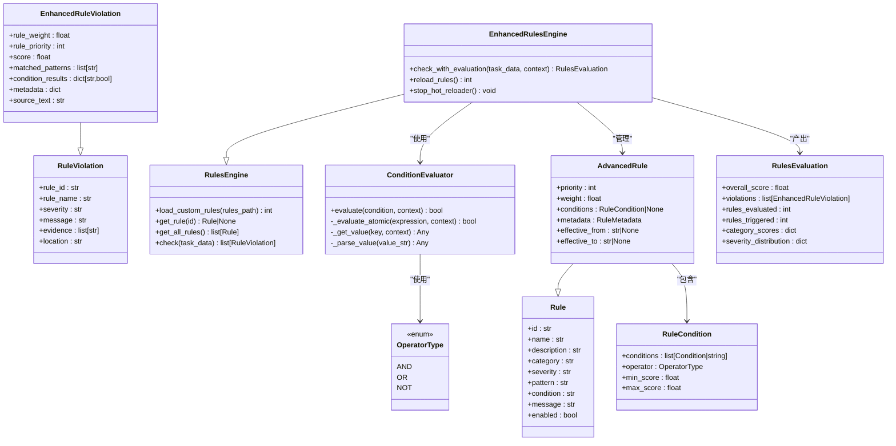
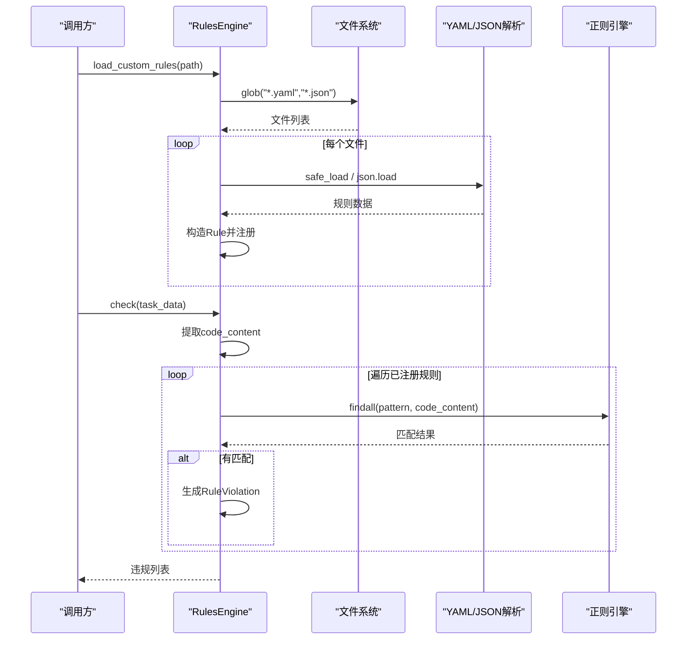
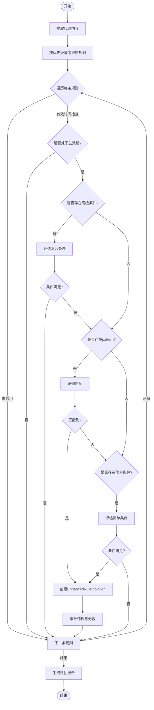
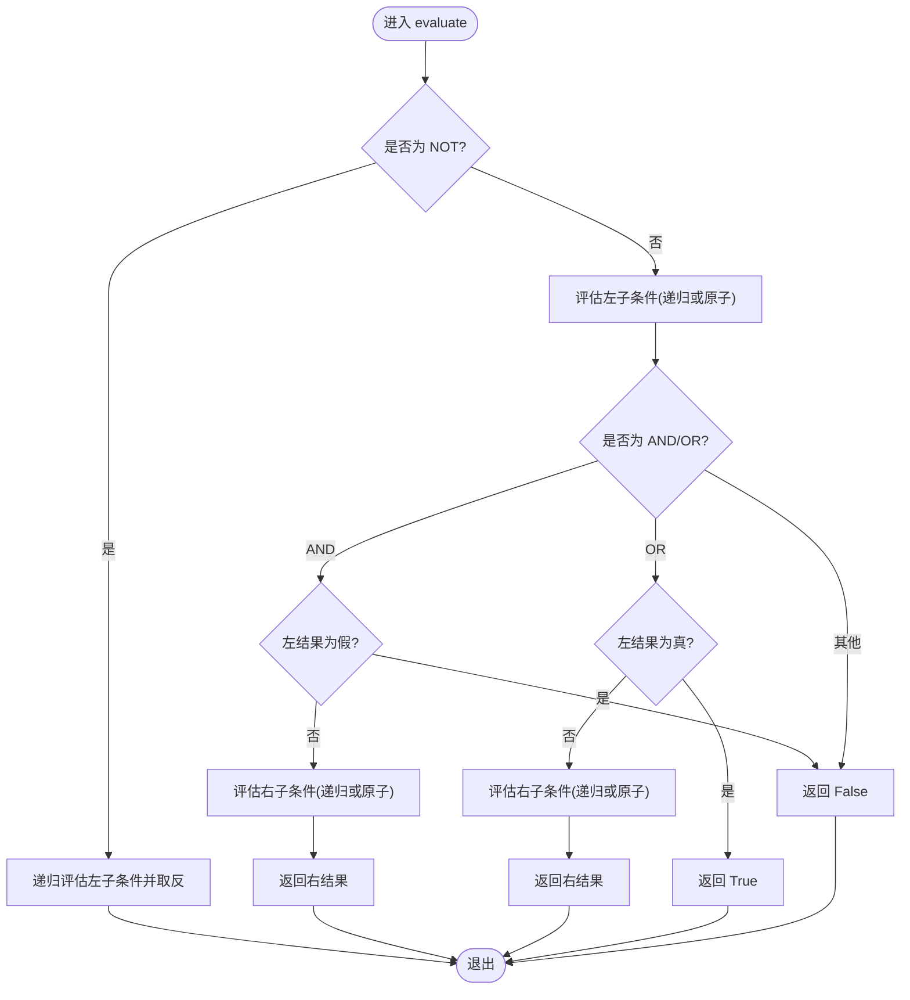
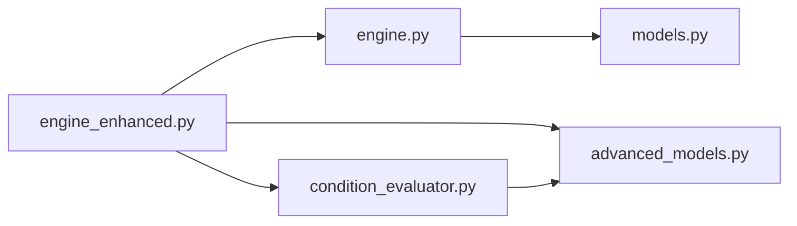

# 规则执行引擎

<cite>
**本文引用的文件列表**
- [src/rules/engine.py](file://src/rules/engine.py)
- [src/rules/engine_enhanced.py](file://src/rules/engine_enhanced.py)
- [src/rules/condition_evaluator.py](file://src/rules/condition_evaluator.py)
- [src/rules/models.py](file://src/rules/models.py)
- [src/rules/advanced_models.py](file://src/rules/advanced_models.py)
- [src/rules/builtin/database_rules.yaml](file://src/rules/builtin/database_rules.yaml)
- [src/rules/builtin/java_rules.yaml](file://src/rules/builtin/java_rules.yaml)
- [src/rules/custom/example_custom_rules.yaml](file://src/rules/custom/example_custom_rules.yaml)
- [tests/rules/test_engine.py](file://tests/rules/test_engine.py)
- [tests/rules/test_condition_evaluator.py](file://tests/rules/test_condition_evaluator.py)
- [tests/rules/test_advanced_rules.py](file://tests/rules/test_advanced_rules.py)
</cite>

## 目录
1. [简介](#简介)
2. [项目结构](#项目结构)
3. [核心组件](#核心组件)
4. [架构总览](#架构总览)
5. [详细组件分析](#详细组件分析)
6. [依赖关系分析](#依赖关系分析)
7. [性能与缓存](#性能与缓存)
8. [故障排查指南](#故障排查指南)
9. [结论](#结论)
10. [附录](#附录)

## 简介
本技术文档围绕“规则执行引擎”的实现与使用，系统性说明以下主题：
- 规则匹配算法：正则表达式匹配、条件表达式求值、简单条件判断。
- 规则加载机制：支持 YAML 和 JSON 配置文件解析，内置规则与自定义规则管理。
- 执行优先级与并发策略：基于优先级的排序执行、线程安全与热重载。
- 规则缓存与性能优化：当前实现要点与可扩展方向。
- 条件评估器：工作原理、操作符集合、扩展方式。
- 增强版规则引擎：动态规则加载、规则依赖（通过条件组合表达）、执行监控（日志与评估报告）。
- 调试与性能分析：测试用例与日志定位方法。
- 错误处理与异常恢复：容错策略与降级路径。

## 项目结构
规则相关代码位于 src/rules 下，包含基础引擎、增强引擎、模型定义、条件评估器以及内置/自定义规则示例；测试覆盖在 tests/rules 下。

图表来源
- [src/rules/engine.py:217-352](file://src/rules/engine.py#L217-L352)
- [src/rules/engine_enhanced.py:22-118](file://src/rules/engine_enhanced.py#L22-L118)
- [src/rules/condition_evaluator.py:12-164](file://src/rules/condition_evaluator.py#L12-L164)
- [src/rules/models.py:5-51](file://src/rules/models.py#L5-L51)
- [src/rules/advanced_models.py:10-102](file://src/rules/advanced_models.py#L10-L102)
- [src/rules/builtin/database_rules.yaml:1-39](file://src/rules/builtin/database_rules.yaml#L1-L39)
- [src/rules/builtin/java_rules.yaml:1-48](file://src/rules/builtin/java_rules.yaml#L1-L48)
- [src/rules/custom/example_custom_rules.yaml:1-41](file://src/rules/custom/example_custom_rules.yaml#L1-L41)
- [tests/rules/test_engine.py:1-367](file://tests/rules/test_engine.py#L1-L367)
- [tests/rules/test_condition_evaluator.py:1-407](file://tests/rules/test_condition_evaluator.py#L1-L407)
- [tests/rules/test_advanced_rules.py:1-331](file://tests/rules/test_advanced_rules.py#L1-L331)

章节来源
- [src/rules/engine.py:217-352](file://src/rules/engine.py#L217-L352)
- [src/rules/engine_enhanced.py:22-118](file://src/rules/engine_enhanced.py#L22-L118)
- [src/rules/condition_evaluator.py:12-164](file://src/rules/condition_evaluator.py#L12-L164)
- [src/rules/models.py:5-51](file://src/rules/models.py#L5-L51)
- [src/rules/advanced_models.py:10-102](file://src/rules/advanced_models.py#L10-L102)
- [src/rules/builtin/database_rules.yaml:1-39](file://src/rules/builtin/database_rules.yaml#L1-L39)
- [src/rules/builtin/java_rules.yaml:1-48](file://src/rules/builtin/java_rules.yaml#L1-L48)
- [src/rules/custom/example_custom_rules.yaml:1-41](file://src/rules/custom/example_custom_rules.yaml#L1-L41)
- [tests/rules/test_engine.py:1-367](file://tests/rules/test_engine.py#L1-L367)
- [tests/rules/test_condition_evaluator.py:1-407](file://tests/rules/test_condition_evaluator.py#L1-L407)
- [tests/rules/test_advanced_rules.py:1-331](file://tests/rules/test_advanced_rules.py#L1-L331)

## 核心组件
- 基础规则引擎 RulesEngine：负责内置规则加载、YAML/JSON 自定义规则加载、按 ID 查询、按分类过滤、基于正则的违规检测。
- 增强规则引擎 EnhancedRulesEngine：继承基础引擎，增加优先级、权重、时间有效性、高级条件组合、评分与评估报告生成、热重载能力。
- 条件评估器 ConditionEvaluator：解析并求值字符串条件表达式，支持 AND/OR/NOT 组合与多种原子操作符。
- 数据模型：
  - 基础模型 Rule、RuleViolation、RuleCheckResult、RulesConfig。
  - 高级模型 AdvancedRule、EnhancedRuleViolation、RuleCondition、OperatorType、RulesEvaluation 等。

章节来源
- [src/rules/engine.py:217-352](file://src/rules/engine.py#L217-L352)
- [src/rules/engine_enhanced.py:22-118](file://src/rules/engine_enhanced.py#L22-L118)
- [src/rules/condition_evaluator.py:12-164](file://src/rules/condition_evaluator.py#L12-L164)
- [src/rules/models.py:5-51](file://src/rules/models.py#L5-L51)
- [src/rules/advanced_models.py:10-102](file://src/rules/advanced_models.py#L10-L102)

## 架构总览
增强版引擎在基础引擎之上提供高级特性，并通过条件评估器进行复杂条件求值。

图表来源
- [src/rules/models.py:5-51](file://src/rules/models.py#L5-L51)
- [src/rules/advanced_models.py:10-102](file://src/rules/advanced_models.py#L10-L102)
- [src/rules/engine.py:217-352](file://src/rules/engine.py#L217-L352)
- [src/rules/engine_enhanced.py:22-118](file://src/rules/engine_enhanced.py#L22-L118)
- [src/rules/condition_evaluator.py:12-164](file://src/rules/condition_evaluator.py#L12-L164)

## 详细组件分析

### 基础规则引擎（RulesEngine）
- 内置规则加载：从内存中的内置规则清单构建 Rule 对象并注册。
- 自定义规则加载：扫描指定目录下 .yaml/.json 文件，解析 rules 数组，构造 Rule 并注册。
- 规则检查：提取任务数据中的开发提交信息作为匹配文本，遍历所有启用规则，对 pattern 字段执行正则匹配，命中则生成 RuleViolation。
- 查询接口：按 ID 获取、获取全部、按分类过滤。

图表来源
- [src/rules/engine.py:239-310](file://src/rules/engine.py#L239-L310)
- [src/rules/engine.py:324-352](file://src/rules/engine.py#L324-L352)

章节来源
- [src/rules/engine.py:217-352](file://src/rules/engine.py#L217-L352)

### 增强规则引擎（EnhancedRulesEngine）
- 继承基础引擎，内部维护 AdvancedRule 集合，支持优先级 priority、权重 weight、生效时间 effective_from/effective_to。
- 规则加载：复用父类加载逻辑，支持 hot_reload 热重载（基于 watchdog 监听目录变更）。
- 规则检查流程：
  - 提取代码内容。
  - 按 priority 降序排序后逐一检查。
  - 若存在 conditions，先通过 ConditionEvaluator 评估复合条件，不满足则跳过。
  - 若存在 pattern，正则匹配命中则创建 EnhancedRuleViolation。
  - 若存在 condition（简单条件），按内置逻辑评估。
  - 计算 score 并汇总为 RulesEvaluation。
- 兼容旧接口：check 返回 RuleViolation 列表。

图表来源
- [src/rules/engine_enhanced.py:170-201](file://src/rules/engine_enhanced.py#L170-L201)
- [src/rules/engine_enhanced.py:222-258](file://src/rules/engine_enhanced.py#L222-L258)
- [src/rules/engine_enhanced.py:319-373](file://src/rules/engine_enhanced.py#L319-L373)

章节来源
- [src/rules/engine_enhanced.py:22-118](file://src/rules/engine_enhanced.py#L22-L118)
- [src/rules/engine_enhanced.py:170-201](file://src/rules/engine_enhanced.py#L170-L201)
- [src/rules/engine_enhanced.py:222-258](file://src/rules/engine_enhanced.py#L222-L258)
- [src/rules/engine_enhanced.py:319-373](file://src/rules/engine_enhanced.py#L319-L373)

### 条件评估器（ConditionEvaluator）
- 支持的原子操作符：==、!=、>、<、>=、<=、contains、not_contains、matches、in、not_in、starts_with、ends_with、exists、is_empty。
- 表达式语法：key == value、key contains 'substring'、key matches 'pattern' 等；支持点号访问嵌套键。
- 复合条件：AND/OR/NOT 组合，支持嵌套 Condition 对象与字符串表达式混合。
- 值解析：自动识别布尔、null、整数、浮点数、引号字符串、JSON 数组。

图表来源
- [src/rules/condition_evaluator.py:35-75](file://src/rules/condition_evaluator.py#L35-L75)
- [src/rules/condition_evaluator.py:77-110](file://src/rules/condition_evaluator.py#L77-L110)
- [src/rules/condition_evaluator.py:112-164](file://src/rules/condition_evaluator.py#L112-L164)

章节来源
- [src/rules/condition_evaluator.py:12-164](file://src/rules/condition_evaluator.py#L12-L164)

### 数据模型与配置
- 基础模型：Rule、RuleViolation、RuleCheckResult、RulesConfig。
- 高级模型：AdvancedRule、EnhancedRuleViolation、RuleCondition、OperatorType、RulesEvaluation。
- 规则配置：
  - YAML/JSON 顶层需包含 rules 数组。
  - 字段包括 id、name、description、category、severity、pattern、condition、message、enabled 等。
  - 内置规则示例：数据库规则、Java 规则。
  - 自定义规则示例：硬编码 IP、TODO 残留、函数行数过长等。

章节来源
- [src/rules/models.py:5-51](file://src/rules/models.py#L5-L51)
- [src/rules/advanced_models.py:10-102](file://src/rules/advanced_models.py#L10-L102)
- [src/rules/builtin/database_rules.yaml:1-39](file://src/rules/builtin/database_rules.yaml#L1-L39)
- [src/rules/builtin/java_rules.yaml:1-48](file://src/rules/builtin/java_rules.yaml#L1-L48)
- [src/rules/custom/example_custom_rules.yaml:1-41](file://src/rules/custom/example_custom_rules.yaml#L1-L41)

## 依赖关系分析
- 模块内依赖：
  - engine_enhanced 依赖 engine 的基础能力与 advanced_models、condition_evaluator。
  - condition_evaluator 依赖 advanced_models 的 Condition 与 OperatorType。
  - 规则加载依赖 yaml/json 标准库。
- 外部依赖：
  - watchdog 用于热重载（可选，仅在启用时导入）。
  - loguru 用于日志记录。

图表来源
- [src/rules/engine_enhanced.py:11-18](file://src/rules/engine_enhanced.py#L11-L18)
- [src/rules/condition_evaluator.py:9-9](file://src/rules/condition_evaluator.py#L9-L9)
- [src/rules/engine.py:11-11](file://src/rules/engine.py#L11-L11)

章节来源
- [src/rules/engine_enhanced.py:11-18](file://src/rules/engine_enhanced.py#L11-L18)
- [src/rules/condition_evaluator.py:9-9](file://src/rules/condition_evaluator.py#L9-L9)
- [src/rules/engine.py:11-11](file://src/rules/engine.py#L11-L11)

## 性能与缓存
- 当前实现要点：
  - 规则加载阶段仅做文件读取与解析，无持久化缓存。
  - 规则检查阶段按优先级排序后顺序执行，避免重复计算。
  - 条件评估器对表达式进行解析与求值，未引入表达式编译缓存。
- 可扩展优化建议：
  - 规则加载缓存：将解析后的规则对象序列化至磁盘或内存缓存，减少 I/O 与解析开销。
  - 正则预编译：对 pattern 字段进行 re.compile 缓存，降低重复编译成本。
  - 条件表达式缓存：对常见表达式进行 AST 或字节码级缓存，提升求值速度。
  - 批量检查并行化：对独立规则的匹配可考虑线程池或进程池并行执行（注意上下文隔离与锁）。
  - 增量更新：基于文件修改时间戳的增量重加载，避免全量重建。

章节来源
- [src/rules/engine.py:239-310](file://src/rules/engine.py#L239-L310)
- [src/rules/engine_enhanced.py:170-201](file://src/rules/engine_enhanced.py#L170-L201)
- [src/rules/condition_evaluator.py:77-110](file://src/rules/condition_evaluator.py#L77-L110)

## 故障排查指南
- 规则加载失败：
  - YAML/JSON 格式错误或缺少 rules 字段会导致加载计数为 0，并记录错误日志。
  - 排查步骤：确认文件路径、文件格式、顶层 keys 是否正确。
- 条件表达式解析问题：
  - 操作符匹配存在歧义风险（如 contains/not_contains、in/not_in、>=/<= 等），当 key 名包含操作符子串时可能误匹配。
  - 建议：避免使用含操作符子串的键名，或使用更明确的表达式结构。
- 规则未生效：
  - 检查 enabled 字段、effective_from/effective_to 时间范围、priority 排序是否符合预期。
- 性能问题：
  - 关注正则复杂度与匹配文本大小，必要时拆分规则或预编译正则。
  - 使用评估报告查看 overall_score、category_scores、severity_distribution 以定位高风险类别。

章节来源
- [src/rules/engine.py:252-310](file://src/rules/engine.py#L252-L310)
- [src/rules/engine_enhanced.py:213-221](file://src/rules/engine_enhanced.py#L213-L221)
- [src/rules/condition_evaluator.py:77-110](file://src/rules/condition_evaluator.py#L77-L110)
- [tests/rules/test_condition_evaluator.py:154-187](file://tests/rules/test_condition_evaluator.py#L154-L187)

## 结论
该规则执行引擎提供了从基础到增强的完整能力：
- 基础引擎聚焦于规则加载与正则匹配，适合快速集成与轻量场景。
- 增强引擎引入优先级、权重、时间有效性、高级条件组合与评估报告，适用于生产环境的精细化治理。
- 条件评估器支持丰富的原子操作符与复合逻辑，便于灵活表达业务约束。
- 通过测试与日志体系，可实现良好的可观测性与可维护性。
- 后续可在缓存、预编译、并行化等方面进一步优化性能。

## 附录

### 规则匹配算法与条件求值要点
- 正则匹配：对提取的代码文本执行 findall，命中即产生违规证据片段。
- 简单条件：基于固定表达式（如 lines > 100）进行数值比较。
- 高级条件：通过 ConditionEvaluator 解析字符串表达式与嵌套 Condition 树，支持短路求值。

章节来源
- [src/rules/engine.py:324-352](file://src/rules/engine.py#L324-L352)
- [src/rules/engine_enhanced.py:288-297](file://src/rules/engine_enhanced.py#L288-L297)
- [src/rules/condition_evaluator.py:35-75](file://src/rules/condition_evaluator.py#L35-L75)

### 规则加载机制与配置文件格式
- YAML/JSON 顶层必须包含 rules 数组。
- 字段说明：
  - id：唯一标识
  - name：名称
  - description：描述
  - category：分类
  - severity：严重程度
  - pattern：正则表达式
  - condition：简单条件表达式
  - message：提示信息
  - enabled：是否启用
- 内置规则示例：数据库规则、Java 规则。
- 自定义规则示例：硬编码 IP、TODO 残留、函数行数过长。

章节来源
- [src/rules/engine.py:239-310](file://src/rules/engine.py#L239-L310)
- [src/rules/builtin/database_rules.yaml:1-39](file://src/rules/builtin/database_rules.yaml#L1-L39)
- [src/rules/builtin/java_rules.yaml:1-48](file://src/rules/builtin/java_rules.yaml#L1-L48)
- [src/rules/custom/example_custom_rules.yaml:1-41](file://src/rules/custom/example_custom_rules.yaml#L1-L41)

### 执行优先级与并发策略
- 优先级：按 priority 降序执行，确保高优先级规则优先触发。
- 并发策略：当前实现为单线程顺序执行；可通过工厂创建实例并在上层封装并行策略（如线程池）。
- 热重载：基于 watchdog 的文件系统事件监听，支持运行时重新加载规则。

章节来源
- [src/rules/engine_enhanced.py:188-192](file://src/rules/engine_enhanced.py#L188-L192)
- [src/rules/engine_enhanced.py:76-103](file://src/rules/engine_enhanced.py#L76-L103)

### 增强版规则引擎的高级功能
- 动态规则加载：支持热重载与 reload_rules 全量刷新。
- 规则依赖管理：通过 RuleCondition 的 AND/OR/NOT 组合表达依赖关系。
- 执行监控：生成 RulesEvaluation，包含总体分数、各类别得分、严重级别分布等。

章节来源
- [src/rules/engine_enhanced.py:105-118](file://src/rules/engine_enhanced.py#L105-L118)
- [src/rules/engine_enhanced.py:335-373](file://src/rules/engine_enhanced.py#L335-L373)
- [src/rules/advanced_models.py:28-36](file://src/rules/advanced_models.py#L28-L36)

### 调试与性能分析方法
- 单元测试：
  - 基础引擎：验证规则注册、运行、异常处理与统计。
  - 条件评估器：覆盖各操作符与边界情况。
  - 增强引擎：验证优先级、权重、时间有效性、评估计算。
- 日志定位：
  - 规则加载失败、条件评估失败均会记录警告/错误日志。
- 评估报告：
  - 使用 check_with_evaluation 获取整体评分与分类得分，辅助定位问题集中领域。

章节来源
- [tests/rules/test_engine.py:1-367](file://tests/rules/test_engine.py#L1-L367)
- [tests/rules/test_condition_evaluator.py:1-407](file://tests/rules/test_condition_evaluator.py#L1-L407)
- [tests/rules/test_advanced_rules.py:1-331](file://tests/rules/test_advanced_rules.py#L1-L331)

### 错误处理与异常恢复
- 规则加载异常：捕获并记录错误，返回 0 计数，不影响其他文件加载。
- 条件评估异常：捕获并记录警告，返回 False，保证整体流程继续。
- 规则执行异常：在增强引擎中捕获并记录警告，跳过该规则，避免中断整个检查流程。

章节来源
- [src/rules/engine.py:279-310](file://src/rules/engine.py#L279-L310)
- [src/rules/condition_evaluator.py:108-110](file://src/rules/condition_evaluator.py#L108-L110)
- [src/rules/engine_enhanced.py:255-258](file://src/rules/engine_enhanced.py#L255-L258)
