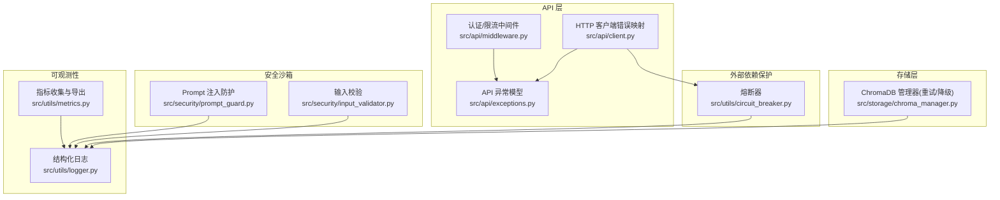
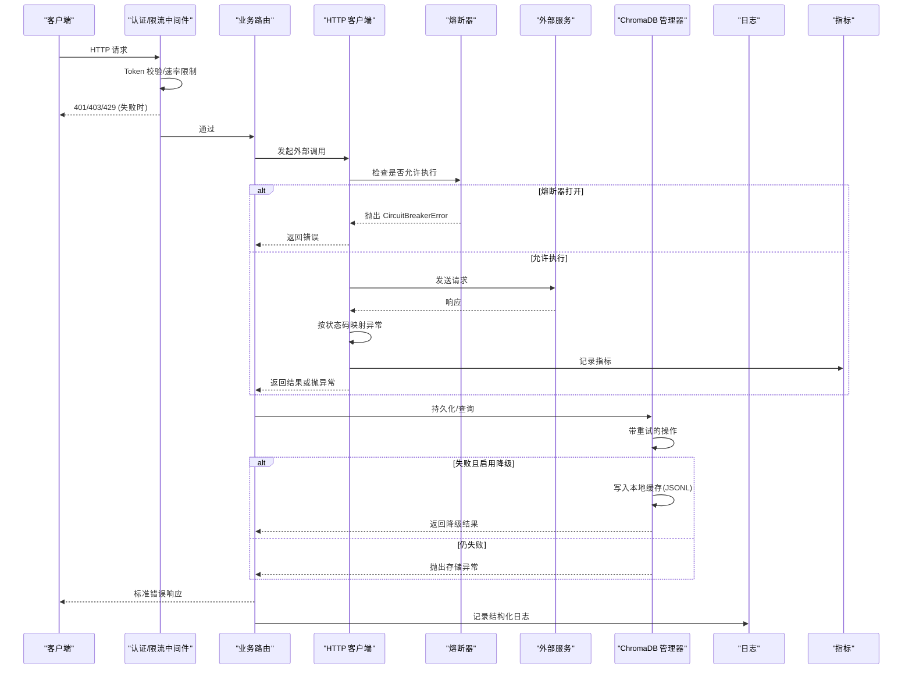
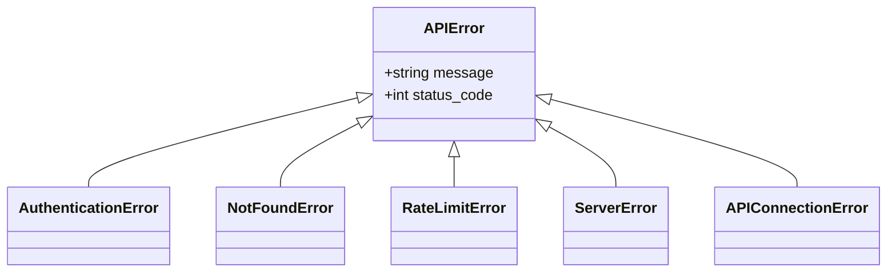
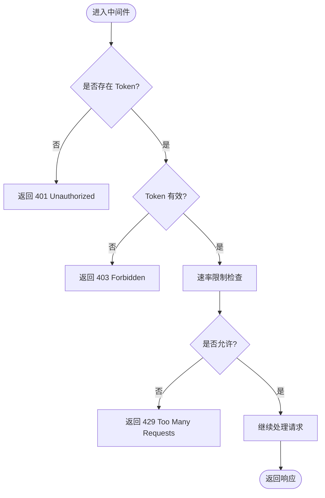
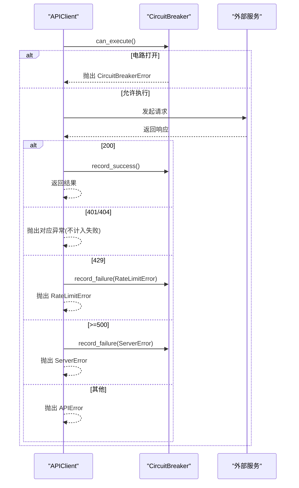
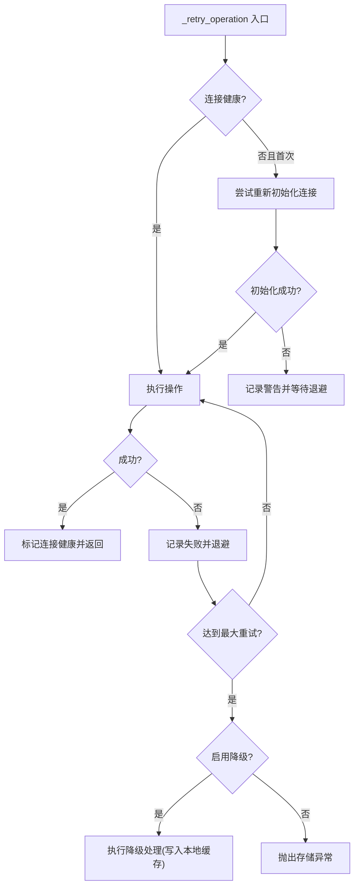
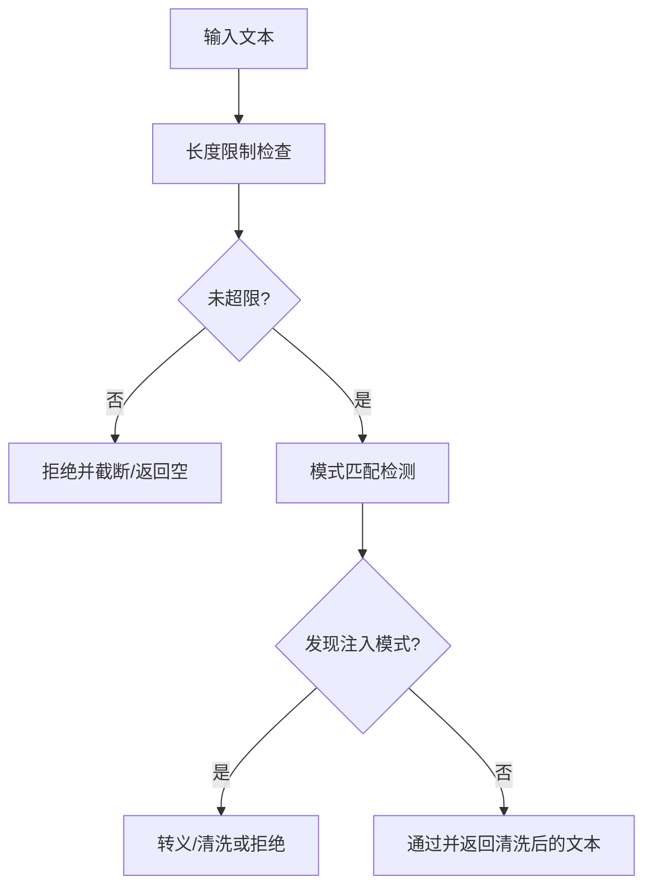
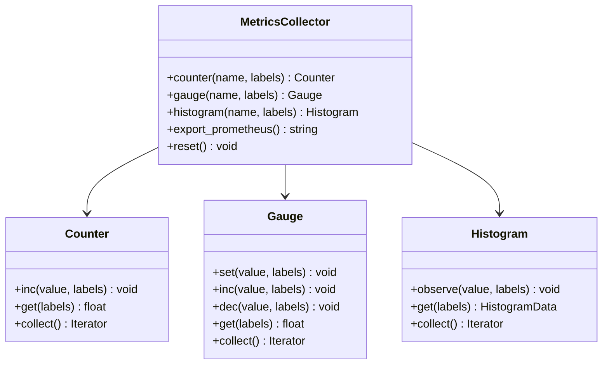
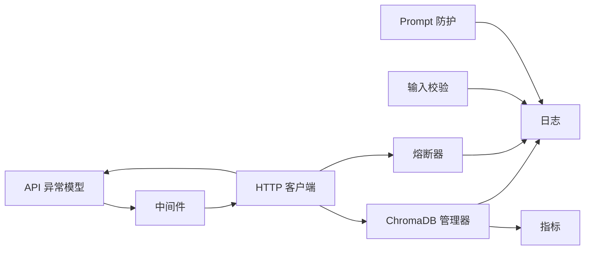

# 错误处理

<cite>
**本文引用的文件**   
- [src/utils/circuit_breaker.py](file://src/utils/circuit_breaker.py)
- [tests/utils/test_circuit_breaker.py](file://tests/utils/test_circuit_breaker.py)
- [src/api/exceptions.py](file://src/api/exceptions.py)
- [src/api/middleware.py](file://src/api/middleware.py)
- [src/api/client.py](file://src/api/client.py)
- [src/storage/chroma_manager.py](file://src/storage/chroma_manager.py)
- [src/security/input_validator.py](file://src/security/input_validator.py)
- [src/security/prompt_guard.py](file://src/security/prompt_guard.py)
- [src/utils/logger.py](file://src/utils/logger.py)
- [src/utils/metrics.py](file://src/utils/metrics.py)
- [docs/observability_guide.md](file://docs/observability_guide.md)
- [example_observability.py](file://example_observability.py)
</cite>

## 目录
1. [简介](#简介)
2. [项目结构](#项目结构)
3. [核心组件](#核心组件)
4. [架构总览](#架构总览)
5. [详细组件分析](#详细组件分析)
6. [依赖关系分析](#依赖关系分析)
7. [性能与可靠性考量](#性能与可靠性考量)
8. [故障诊断与排错指南](#故障诊断与排错指南)
9. [结论](#结论)
10. [附录](#附录)

## 简介
本文件系统化梳理并文档化本仓库的错误处理机制，覆盖规则执行过程中的异常捕获与分类、API 层错误模型、外部依赖的熔断与重试、存储层的降级策略、安全沙箱输入防护、日志与指标的可观测性方案、结构化错误报告输出以及趋势监控。目标是帮助开发者快速定位问题、设计稳健的恢复策略，并在生产环境中实现可观测与可治理的错误闭环。

## 项目结构
围绕错误处理的关键模块分布如下：
- API 层：统一异常模型、认证与限流中间件、HTTP 客户端错误映射
- 外部依赖保护：熔断器（Circuit Breaker）
- 存储层：ChromaDB 管理器，包含重试与本地缓存降级
- 安全沙箱：输入校验与 Prompt 注入防护
- 可观测性：结构化日志与 Prometheus 风格指标导出
- 示例与文档：使用示例与可观测性指南

图表来源
- [src/api/exceptions.py:1-31](file://src/api/exceptions.py#L1-L31)
- [src/api/middleware.py:1-173](file://src/api/middleware.py#L1-L173)
- [src/api/client.py:122-145](file://src/api/client.py#L122-L145)
- [src/utils/circuit_breaker.py:1-306](file://src/utils/circuit_breaker.py#L1-L306)
- [src/storage/chroma_manager.py:1-250](file://src/storage/chroma_manager.py#L1-L250)
- [src/security/input_validator.py:1-74](file://src/security/input_validator.py#L1-L74)
- [src/security/prompt_guard.py:1-198](file://src/security/prompt_guard.py#L1-L198)
- [src/utils/logger.py:1-160](file://src/utils/logger.py#L1-L160)
- [src/utils/metrics.py:1-252](file://src/utils/metrics.py#L1-L252)

章节来源
- [src/api/exceptions.py:1-31](file://src/api/exceptions.py#L1-L31)
- [src/api/middleware.py:1-173](file://src/api/middleware.py#L1-L173)
- [src/api/client.py:122-145](file://src/api/client.py#L122-L145)
- [src/utils/circuit_breaker.py:1-306](file://src/utils/circuit_breaker.py#L1-L306)
- [src/storage/chroma_manager.py:1-250](file://src/storage/chroma_manager.py#L1-L250)
- [src/security/input_validator.py:1-74](file://src/security/input_validator.py#L1-L74)
- [src/security/prompt_guard.py:1-198](file://src/security/prompt_guard.py#L1-L198)
- [src/utils/logger.py:1-160](file://src/utils/logger.py#L1-L160)
- [src/utils/metrics.py:1-252](file://src/utils/metrics.py#L1-L252)

## 核心组件
- 统一异常模型：定义 APIError 及其子类，用于在 API 层标准化错误响应与状态码。
- 熔断器：对不稳定外部服务进行保护，避免雪崩；支持 CLOSED/OPEN/HALF_OPEN 三态切换与统计。
- 存储容错：ChromaDB 操作封装了重试与本地 JSONL 缓存降级，保障写入可用性。
- 安全沙箱：输入格式校验与 Prompt 注入检测/清洗，阻断恶意输入。
- 可观测性：结构化日志（JSON/文本）、Prometheus 风格指标导出，便于追踪与告警。

章节来源
- [src/api/exceptions.py:1-31](file://src/api/exceptions.py#L1-L31)
- [src/utils/circuit_breaker.py:1-306](file://src/utils/circuit_breaker.py#L1-L306)
- [src/storage/chroma_manager.py:1-250](file://src/storage/chroma_manager.py#L1-L250)
- [src/security/input_validator.py:1-74](file://src/security/input_validator.py#L1-L74)
- [src/security/prompt_guard.py:1-198](file://src/security/prompt_guard.py#L1-L198)
- [src/utils/logger.py:1-160](file://src/utils/logger.py#L1-L160)
- [src/utils/metrics.py:1-252](file://src/utils/metrics.py#L1-L252)

## 架构总览
下图展示一次典型请求从进入 API 到调用外部服务与存储的完整错误路径与恢复点。

图表来源
- [src/api/middleware.py:62-173](file://src/api/middleware.py#L62-L173)
- [src/api/client.py:122-145](file://src/api/client.py#L122-L145)
- [src/utils/circuit_breaker.py:146-186](file://src/utils/circuit_breaker.py#L146-L186)
- [src/storage/chroma_manager.py:173-222](file://src/storage/chroma_manager.py#L173-L222)
- [src/utils/logger.py:34-104](file://src/utils/logger.py#L34-L104)
- [src/utils/metrics.py:151-252](file://src/utils/metrics.py#L151-L252)

## 详细组件分析

### 组件一：API 异常模型与中间件
- 异常模型
  - 基类 APIError 携带 message 与 status_code，派生出 AuthenticationError、NotFoundError、RateLimitError、ServerError、APIConnectionError 等，用于统一错误语义与 HTTP 状态码。
- 中间件
  - 认证与限流：缺失 Token 返回 401，无效 Token 返回 403，超过速率限制返回 429，并附加 X-RateLimit-* 头。
  - 日志中间件：记录请求/响应耗时与异常堆栈信息。

图表来源
- [src/api/exceptions.py:1-31](file://src/api/exceptions.py#L1-L31)

图表来源
- [src/api/middleware.py:81-141](file://src/api/middleware.py#L81-L141)

章节来源
- [src/api/exceptions.py:1-31](file://src/api/exceptions.py#L1-L31)
- [src/api/middleware.py:1-173](file://src/api/middleware.py#L1-L173)

### 组件二：HTTP 客户端错误映射与熔断器集成
- 客户端根据响应状态码映射为具体异常类型：
  - 401/404 不视为服务故障，直接抛出对应异常
  - 429 记录为失败但不触发重试
  - 5xx 记录为失败并抛出服务端错误
  - 其他错误统一包装为通用 API 错误
- 熔断器
  - 提供上下文管理器与装饰器两种用法
  - 当电路打开时立即拒绝执行，防止雪崩
  - 半开状态下以成功阈值判定恢复

图表来源
- [src/api/client.py:122-145](file://src/api/client.py#L122-L145)
- [src/utils/circuit_breaker.py:146-186](file://src/utils/circuit_breaker.py#L146-L186)

章节来源
- [src/api/client.py:122-145](file://src/api/client.py#L122-L145)
- [src/utils/circuit_breaker.py:1-306](file://src/utils/circuit_breaker.py#L1-L306)
- [tests/utils/test_circuit_breaker.py:1-206](file://tests/utils/test_circuit_breaker.py#L1-L206)

### 组件三：存储层重试与降级（ChromaDB）
- 初始化与连接健康检查：带指数退避的重试，失败后若未启用降级则抛出连接异常。
- 操作重试：对任意操作封装 _retry_operation，支持最大重试次数与间隔，首次失败尝试重连。
- 降级策略：当所有重试失败且启用降级时，将数据写入本地 JSONL 缓存，保证最终一致性。

图表来源
- [src/storage/chroma_manager.py:138-172](file://src/storage/chroma_manager.py#L138-L172)
- [src/storage/chroma_manager.py:173-222](file://src/storage/chroma_manager.py#L173-L222)

章节来源
- [src/storage/chroma_manager.py:1-250](file://src/storage/chroma_manager.py#L1-L250)

### 组件四：安全沙箱（输入校验与 Prompt 防护）
- 输入校验：对任务编号、令牌等关键输入进行格式与长度校验，失败即拒绝。
- Prompt 注入防护：基于正则的模式检测与文本清洗，拦截系统提示词覆盖、模式切换、XML 标签注入等常见攻击面。

图表来源
- [src/security/input_validator.py:11-45](file://src/security/input_validator.py#L11-L45)
- [src/security/prompt_guard.py:100-141](file://src/security/prompt_guard.py#L100-L141)

章节来源
- [src/security/input_validator.py:1-74](file://src/security/input_validator.py#L1-L74)
- [src/security/prompt_guard.py:1-198](file://src/security/prompt_guard.py#L1-L198)

### 组件五：日志与指标（可观测性）
- 结构化日志
  - 支持控制台与文件输出，可选 JSON 格式；自动附带时间戳、级别、文件名/行号、函数名及额外字段；异常信息自动序列化。
- 指标收集
  - 计数器、仪表盘、直方图三类指标，支持标签维度聚合与 Prometheus 格式导出；提供全局收集器实例。

图表来源
- [src/utils/metrics.py:151-252](file://src/utils/metrics.py#L151-L252)

章节来源
- [src/utils/logger.py:1-160](file://src/utils/logger.py#L1-L160)
- [src/utils/metrics.py:1-252](file://src/utils/metrics.py#L1-L252)
- [docs/observability_guide.md:63-168](file://docs/observability_guide.md#L63-L168)
- [example_observability.py:1-85](file://example_observability.py#L1-L85)

## 依赖关系分析
- API 层依赖异常模型与中间件，客户端将外部服务错误映射为统一异常，并与熔断器协作。
- 存储层独立于 API 层，通过重试与降级提升鲁棒性。
- 安全模块作为前置校验，降低后续链路风险。
- 可观测性贯穿全链路，提供统一的日志与指标能力。

图表来源
- [src/api/exceptions.py:1-31](file://src/api/exceptions.py#L1-L31)
- [src/api/middleware.py:1-173](file://src/api/middleware.py#L1-L173)
- [src/api/client.py:122-145](file://src/api/client.py#L122-L145)
- [src/utils/circuit_breaker.py:1-306](file://src/utils/circuit_breaker.py#L1-L306)
- [src/storage/chroma_manager.py:1-250](file://src/storage/chroma_manager.py#L1-L250)
- [src/security/input_validator.py:1-74](file://src/security/input_validator.py#L1-L74)
- [src/security/prompt_guard.py:1-198](file://src/security/prompt_guard.py#L1-L198)
- [src/utils/logger.py:1-160](file://src/utils/logger.py#L1-L160)
- [src/utils/metrics.py:1-252](file://src/utils/metrics.py#L1-L252)

## 性能与可靠性考量
- 熔断器参数调优
  - failure_threshold：控制敏感度，过高易放大故障，过低易误判
  - reset_timeout：决定探测恢复频率，需结合下游 SLA
  - success_threshold：在半开阶段确认恢复的稳定性
- 重试与退避
  - 指数退避避免“惊群效应”，建议配合抖动
  - 幂等性要求：仅对幂等操作启用重试
- 降级与最终一致性
  - 本地缓存写入应确保顺序与去重，必要时引入补偿任务
- 指标与告警
  - 针对错误率、延迟分布、活跃请求数、熔断状态建立看板与阈值告警

[本节为通用指导，无需代码引用]

## 故障诊断与排错指南
- 常见问题定位
  - 401/403：检查 Token 配置与传递方式（Header 或 Query）
  - 429：查看速率限制计数与剩余配额，适当放宽或优化客户端重试策略
  - 5xx：关注服务端错误与熔断器状态，必要时手动重置熔断器
  - ChromaDB 不可用：观察初始化重试日志与降级写入情况，确认磁盘空间与权限
- 日志与指标排查
  - 开启 JSON 日志便于集中采集与检索
  - 使用 get_metrics_collector 获取全局指标，导出 Prometheus 格式对接监控系统
- 安全相关
  - 输入校验失败：核对任务编号/令牌格式与长度
  - Prompt 注入：审查被拦截的模式与清洗结果，必要时扩展白名单或调整正则

章节来源
- [src/api/middleware.py:81-141](file://src/api/middleware.py#L81-L141)
- [src/api/client.py:122-145](file://src/api/client.py#L122-L145)
- [src/storage/chroma_manager.py:138-222](file://src/storage/chroma_manager.py#L138-L222)
- [src/utils/logger.py:34-104](file://src/utils/logger.py#L34-L104)
- [src/utils/metrics.py:151-252](file://src/utils/metrics.py#L151-L252)
- [docs/observability_guide.md:63-168](file://docs/observability_guide.md#L63-L168)

## 结论
本项目的错误处理体系以“统一异常模型 + 熔断保护 + 重试与降级 + 安全前置校验 + 可观测性”为核心，形成端到端的健壮性与可治理性。建议在上线前完善指标看板与告警策略，并对关键路径补充单元测试与混沌演练，持续验证恢复策略的有效性。

[本节为总结，无需代码引用]

## 附录
- 术语
  - 熔断器：对外部依赖进行短路保护的状态机
  - 降级：在主服务不可用时切换到备用路径以保证基本可用
  - 可观测性：通过日志、指标、追踪等手段理解系统运行状态

[本节为概念说明，无需代码引用]
