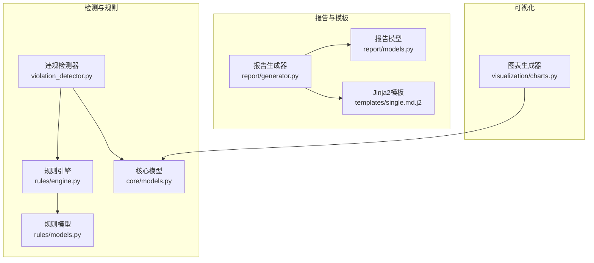
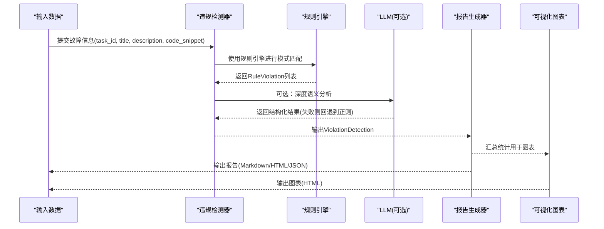
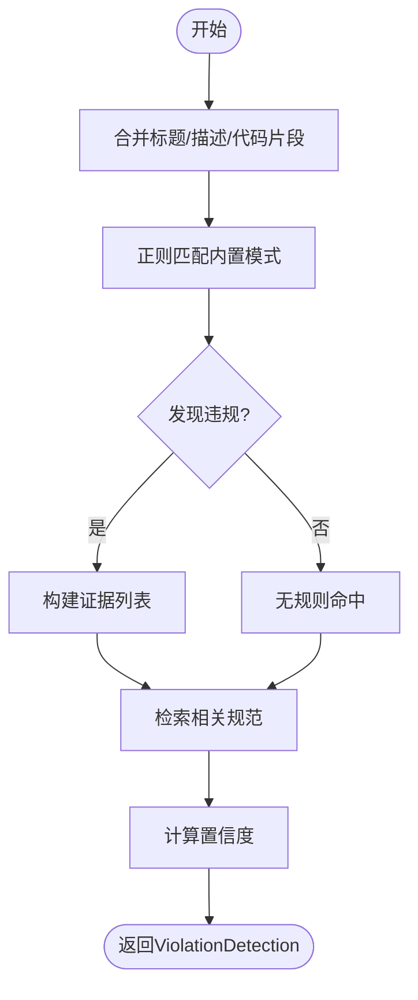
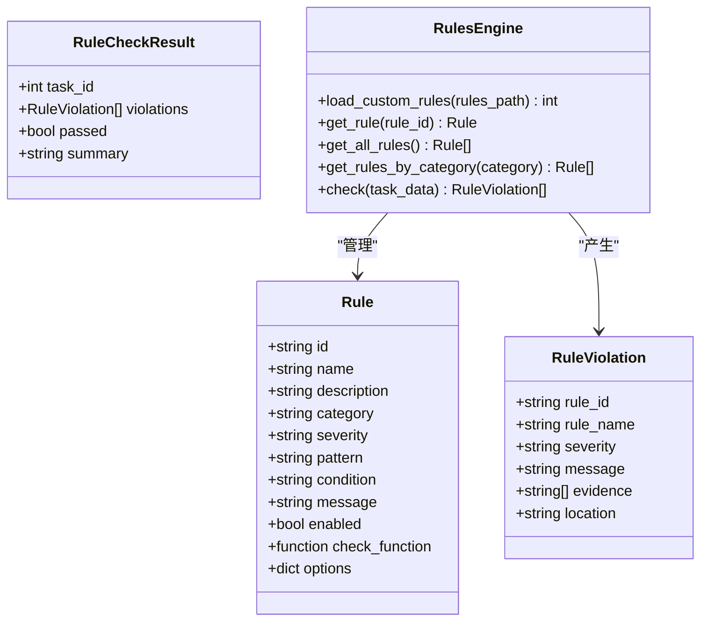
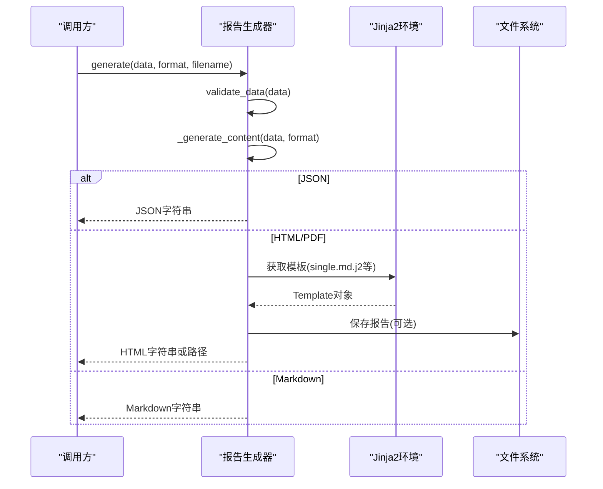
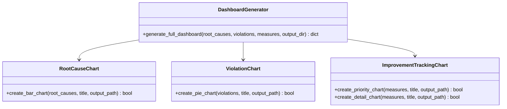
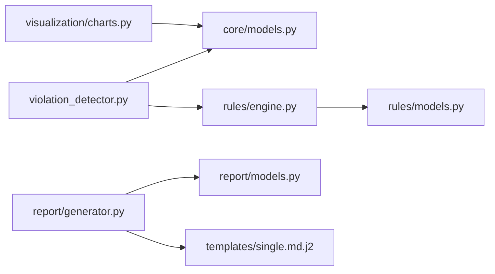

# 违规检测与报告

<cite>
**本文引用的文件**   
- [violation_detector.py](file://src/analysis/violation_detector.py)
- [models.py（规则模型）](file://src/rules/models.py)
- [engine.py（规则引擎）](file://src/rules/engine.py)
- [models.py（核心模型）](file://src/core/models.py)
- [generator.py（报告生成器）](file://src/report/generator.py)
- [models.py（报告模型）](file://src/report/models.py)
- [single.md.j2（单任务模板）](file://src/report/templates/single.md.j2)
- [charts.py（可视化图表）](file://src/visualization/charts.py)
</cite>

## 目录
1. [简介](#简介)
2. [项目结构](#项目结构)
3. [核心组件](#核心组件)
4. [架构总览](#架构总览)
5. [详细组件分析](#详细组件分析)
6. [依赖关系分析](#依赖关系分析)
7. [性能考虑](#性能考虑)
8. [故障排查指南](#故障排查指南)
9. [结论](#结论)
10. [附录](#附录)

## 简介
本技术文档面向“违规检测与报告系统”，聚焦以下目标：
- 说明违规检测的工作流程与数据处理管道
- 详细介绍 RuleViolation 数据模型的结构与字段含义
- 文档化违规证据的收集与格式化机制
- 说明违规报告的生成格式（HTML、Markdown、JSON），并解释统计信息与严重级别计算
- 提供报告定制与模板修改方法
- 说明违规数据的可视化与图表生成功能
- 文档化违规历史追踪与趋势分析方法
- 提供修复建议与最佳实践指导

## 项目结构
围绕违规检测与报告的核心代码分布在如下模块：
- 违规检测与分析：src/analysis/violation_detector.py
- 规则定义与执行：src/rules/models.py、src/rules/engine.py
- 核心数据模型（含 ViolationDetection）：src/core/models.py
- 报告生成与模板：src/report/generator.py、src/report/models.py、src/report/templates/*.j2
- 可视化图表：src/visualization/charts.py

**图示来源**
- [violation_detector.py:55-104](file://src/analysis/violation_detector.py#L55-L104)
- [engine.py:217-352](file://src/rules/engine.py#L217-L352)
- [models.py（规则模型）:22-42](file://src/rules/models.py#L22-L42)
- [models.py（核心模型）:339-349](file://src/core/models.py#L339-L349)
- [generator.py:222-303](file://src/report/generator.py#L222-L303)
- [models.py（报告模型）:15-28](file://src/report/models.py#L15-L28)
- [single.md.j2:1-58](file://src/report/templates/single.md.j2#L1-L58)
- [charts.py:15-84](file://src/visualization/charts.py#L15-L84)

**章节来源**
- [violation_detector.py:55-104](file://src/analysis/violation_detector.py#L55-L104)
- [engine.py:217-352](file://src/rules/engine.py#L217-L352)
- [models.py（规则模型）:22-42](file://src/rules/models.py#L22-L42)
- [models.py（核心模型）:339-349](file://src/core/models.py#L339-L349)
- [generator.py:222-303](file://src/report/generator.py#L222-L303)
- [models.py（报告模型）:15-28](file://src/report/models.py#L15-L28)
- [single.md.j2:1-58](file://src/report/templates/single.md.j2#L1-L58)
- [charts.py:15-84](file://src/visualization/charts.py#L15-L84)

## 核心组件
- 违规检测器：基于正则模式匹配与可选LLM增强，输出 ViolationDetection。
- 规则引擎：加载内置/自定义规则，按模式或条件检查，产出 RuleViolation 列表。
- 报告生成器：支持 Markdown、HTML、PDF（HTML包装）、JSON 多格式输出，并提供模板渲染。
- 可视化图表：根因分布、违规类型分布、改进措施优先级等交互式图表。

**章节来源**
- [violation_detector.py:55-104](file://src/analysis/violation_detector.py#L55-L104)
- [engine.py:217-352](file://src/rules/engine.py#L217-L352)
- [generator.py:222-303](file://src/report/generator.py#L222-L303)
- [charts.py:87-160](file://src/visualization/charts.py#L87-L160)

## 架构总览
下图展示从输入到输出的端到端流程：输入故障信息 → 规则匹配/LLM增强 → 违规检测结果 → 报告生成 → 可视化图表。

**图示来源**
- [violation_detector.py:62-104](file://src/analysis/violation_detector.py#L62-L104)
- [engine.py:324-352](file://src/rules/engine.py#L324-L352)
- [generator.py:250-303](file://src/report/generator.py#L250-L303)
- [charts.py:335-399](file://src/visualization/charts.py#L335-L399)

## 详细组件分析

### 违规检测器（ViolationDetector）
- 工作流程
  - 组合标题、描述与代码片段文本，进行正则模式匹配，收集违规规则ID、类型、类别与证据。
  - 结合规范知识库（StandardsManager）查找相关规范，计算置信度。
  - 可选通过LLM进行更深入的语义判断，解析JSON响应；异常时回退至正则检测。
- 关键输出
  - ViolationDetection：包含是否违规、类型、类别、违反规则、证据、置信度、相关规范引用。

**图示来源**
- [violation_detector.py:62-104](file://src/analysis/violation_detector.py#L62-L104)
- [violation_detector.py:122-142](file://src/analysis/violation_detector.py#L122-L142)

**章节来源**
- [violation_detector.py:55-104](file://src/analysis/violation_detector.py#L55-L104)
- [violation_detector.py:144-218](file://src/analysis/violation_detector.py#L144-L218)
- [models.py（核心模型）:339-349](file://src/core/models.py#L339-L349)

### 规则模型与引擎（Rule / RuleViolation / RulesEngine）
- 数据模型
  - Rule：规则定义（id、name、description、category、severity、pattern、condition、message、enabled、check_function、options）。
  - RuleViolation：违规实例（rule_id、rule_name、severity、message、evidence、location）。
  - RuleCheckResult：检查结果（task_id、violations、passed、summary）。
- 引擎能力
  - 加载内置规则与自定义规则（YAML/JSON）。
  - 对开发提交信息进行模式匹配，收集证据片段。
  - 兼容旧API（Rule.execute、RuleResult、RuleSeverity）。

**图示来源**
- [models.py（规则模型）:5-42](file://src/rules/models.py#L5-L42)
- [engine.py:217-352](file://src/rules/engine.py#L217-L352)

**章节来源**
- [models.py（规则模型）:5-42](file://src/rules/models.py#L5-L42)
- [engine.py:159-214](file://src/rules/engine.py#L159-L214)
- [engine.py:239-310](file://src/rules/engine.py#L239-L310)
- [engine.py:324-352](file://src/rules/engine.py#L324-L352)

### 报告生成器（ReportGenerator）
- 支持的报告类型与格式
  - 类型：摘要、详细、聚类、根因、趋势。
  - 格式：Markdown、HTML、PDF（HTML包装）、JSON。
- 生成流程
  - generate_single/generate_cluster/generate_batch：根据输入数据与模板渲染内容。
  - _generate_content：统一入口，按格式选择渲染策略。
  - 模板优先：若存在自定义模板目录，优先使用Jinja2模板；否则回退默认模板。
- 输出结构
  - ReportData：包含标题、类型、生成时间、摘要、图表数据、表格数据。
  - 单任务/聚类/批量报告均支持JSON导出，便于后续处理与可视化。

**图示来源**
- [generator.py:395-447](file://src/report/generator.py#L395-L447)
- [generator.py:250-303](file://src/report/generator.py#L250-L303)
- [single.md.j2:1-58](file://src/report/templates/single.md.j2#L1-L58)

**章节来源**
- [generator.py:222-303](file://src/report/generator.py#L222-L303)
- [generator.py:395-447](file://src/report/generator.py#L395-L447)
- [models.py（报告模型）:15-28](file://src/report/models.py#L15-L28)

### 可视化图表（Visualization Charts）
- 根因分布图：柱状图，显示各根因数量与占比。
- 违规类型分布图：饼图，展示各类违规数量与百分比。
- 改进措施追踪图：优先级分布与详情横向柱状图。
- 仪表板生成：整合上述图表，批量输出HTML文件。

**图示来源**
- [charts.py:15-84](file://src/visualization/charts.py#L15-L84)
- [charts.py:87-160](file://src/visualization/charts.py#L87-L160)
- [charts.py:163-332](file://src/visualization/charts.py#L163-L332)
- [charts.py:335-399](file://src/visualization/charts.py#L335-L399)

**章节来源**
- [charts.py:15-84](file://src/visualization/charts.py#L15-L84)
- [charts.py:87-160](file://src/visualization/charts.py#L87-L160)
- [charts.py:163-332](file://src/visualization/charts.py#L163-L332)
- [charts.py:335-399](file://src/visualization/charts.py#L335-L399)

## 依赖关系分析
- 模块耦合
  - 违规检测器依赖规则引擎与核心模型。
  - 报告生成器依赖报告模型与Jinja2模板。
  - 可视化模块独立，但消费核心模型中的统计信息。
- 外部依赖
  - Jinja2用于模板渲染。
  - Plotly用于交互式图表。
  - Pydantic用于核心模型的校验与序列化。

**图示来源**
- [violation_detector.py:55-104](file://src/analysis/violation_detector.py#L55-L104)
- [engine.py:217-352](file://src/rules/engine.py#L217-L352)
- [generator.py:222-303](file://src/report/generator.py#L222-L303)
- [charts.py:335-399](file://src/visualization/charts.py#L335-L399)

**章节来源**
- [violation_detector.py:55-104](file://src/analysis/violation_detector.py#L55-L104)
- [engine.py:217-352](file://src/rules/engine.py#L217-L352)
- [generator.py:222-303](file://src/report/generator.py#L222-L303)
- [charts.py:335-399](file://src/visualization/charts.py#L335-L399)

## 性能考虑
- 正则匹配开销：在大规模代码库中，建议对规则进行预编译与索引优化，减少重复扫描。
- LLM调用成本：仅在必要时启用LLM增强，并设置超时与重试策略，失败自动回退。
- 报告生成：批量生成时采用异步与缓存机制，避免重复渲染相同模板。
- 图表生成：限制数据规模（如前N项），避免生成超大HTML导致浏览器卡顿。

[本节为通用指导，不直接分析具体文件]

## 故障排查指南
- 模板未找到或渲染失败
  - 现象：自定义模板缺失或语法错误，回退默认模板。
  - 排查：确认模板目录路径与文件名后缀正确，检查Jinja2语法。
- 规则加载失败
  - 现象：自定义规则文件无法解析或格式不正确。
  - 排查：验证YAML/JSON结构与字段完整性，关注日志错误信息。
- 图表生成失败
  - 现象：Plotly写入HTML失败或数据为空。
  - 排查：确保输出目录可写，数据非空，检查依赖安装。

**章节来源**
- [generator.py:250-303](file://src/report/generator.py#L250-L303)
- [engine.py:239-310](file://src/rules/engine.py#L239-L310)
- [charts.py:335-399](file://src/visualization/charts.py#L335-L399)

## 结论
本系统以规则引擎为核心，结合可选LLM增强，形成稳定的违规检测流水线；报告生成器提供多格式输出与模板定制能力；可视化模块将统计结果转化为交互式图表，辅助决策与复盘。通过合理的配置与优化，可在保证质量的同时提升效率。

[本节为总结性内容，不直接分析具体文件]

## 附录

### RuleViolation 数据模型与字段含义
- rule_id：规则唯一标识。
- rule_name：规则名称。
- severity：严重级别（如 info/warning/error/critical）。
- message：违规消息。
- evidence：证据片段列表（匹配到的代码片段或上下文）。
- location：位置信息（如文件路径、行号等，视实现而定）。

**章节来源**
- [models.py（规则模型）:22-42](file://src/rules/models.py#L22-L42)

### 违规证据的收集与格式化机制
- 收集方式
  - 规则引擎通过正则匹配收集证据片段，限制最大数量以避免过大负载。
  - 违规检测器将匹配结果拼接为可读证据文本。
- 格式化
  - 报告生成器将证据嵌入Markdown/HTML结构中，便于阅读与分享。

**章节来源**
- [engine.py:324-352](file://src/rules/engine.py#L324-L352)
- [violation_detector.py:62-104](file://src/analysis/violation_detector.py#L62-L104)
- [generator.py:250-303](file://src/report/generator.py#L250-L303)

### 违规报告生成格式与示例结构
- Markdown：适合快速审阅与版本控制。
- HTML：适合在线查看与交互展示。
- PDF：以HTML包装，便于打印与归档。
- JSON：结构化数据，便于二次处理与集成。

**章节来源**
- [generator.py:222-303](file://src/report/generator.py#L222-L303)
- [generator.py:395-447](file://src/report/generator.py#L395-L447)

### 严重级别计算方法与统计汇总
- 严重级别
  - 规则定义中包含 severity 字段，引擎据此分类统计。
  - 兼容枚举 RuleSeverity 提供比较与排序能力。
- 统计汇总
  - 报告生成器汇总违规数量、类别分布、置信度等信息。
  - 可视化模块按类别与优先级生成图表。

**章节来源**
- [engine.py:22-34](file://src/rules/engine.py#L22-L34)
- [generator.py:395-447](file://src/report/generator.py#L395-L447)
- [charts.py:87-160](file://src/visualization/charts.py#L87-L160)

### 报告定制与模板修改方法
- 自定义模板目录
  - 初始化报告生成器时传入 template_dir，优先加载该目录下的模板。
- 模板命名与扩展名
  - 单任务模板：single.md.j2；聚类模板：cluster.md.j2；批量模板：batch.md.j2。
- 变量注入
  - 模板中可使用 task_id、title、summary、segments、labels、root_causes、suggestions、metadata.generated_at 等变量。

**章节来源**
- [generator.py:225-248](file://src/report/generator.py#L225-L248)
- [single.md.j2:1-58](file://src/report/templates/single.md.j2#L1-L58)

### 违规数据可视化与图表生成
- 根因分布：柱状图，展示高频根因。
- 违规类型：饼图，展示各类违规占比。
- 改进措施：优先级分布与详情横向柱状图。
- 仪表板：一键生成多个图表文件，便于集中查看。

**章节来源**
- [charts.py:15-84](file://src/visualization/charts.py#L15-L84)
- [charts.py:87-160](file://src/visualization/charts.py#L87-L160)
- [charts.py:163-332](file://src/visualization/charts.py#L163-L332)
- [charts.py:335-399](file://src/visualization/charts.py#L335-L399)

### 违规历史追踪与趋势分析方法
- 历史数据
  - 通过任务ID与时间戳记录每次检测结果，形成时序数据。
- 趋势分析
  - 按时间窗口聚合违规数量与类别，观察上升/下降趋势。
  - 结合根因统计与改进措施落地情况，评估治理效果。

[本节为概念性说明，不直接分析具体文件]

### 修复建议与最佳实践
- 规则维护
  - 定期评审与更新规则，避免误报与漏报。
  - 使用条件与上下文增强规则准确性。
- 工程化
  - 将规则检查纳入CI/CD，提前拦截高风险问题。
  - 对LLM调用设置熔断与降级策略。
- 报告与可视化
  - 标准化报告模板，统一输出格式。
  - 将图表嵌入看板，持续跟踪指标变化。

[本节为通用指导，不直接分析具体文件]