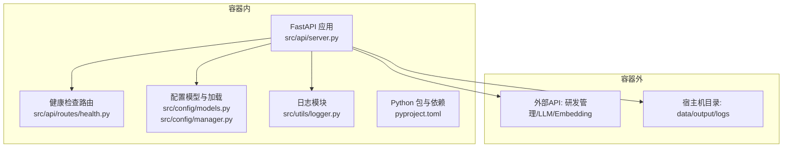
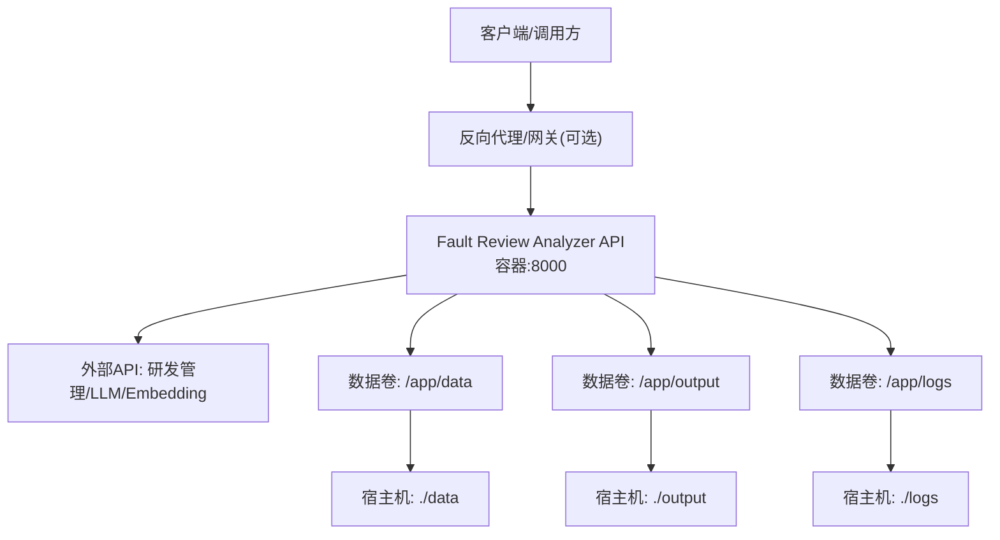
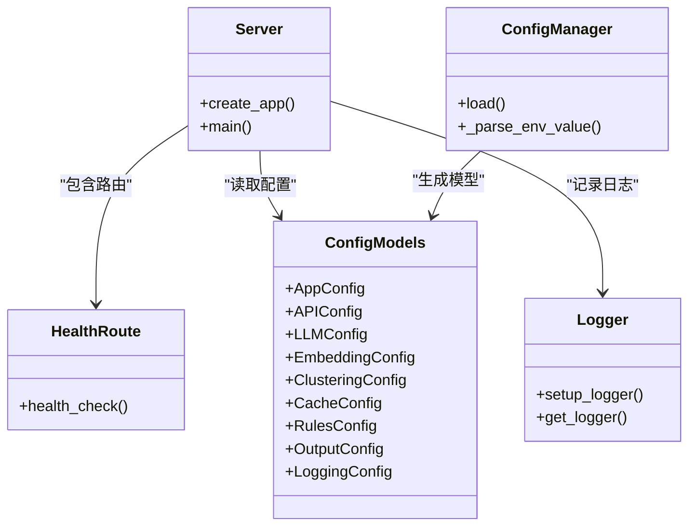

# Docker容器化部署

<cite>
**本文引用的文件**   
- [README.md](file://README.md)
- [pyproject.toml](file://pyproject.toml)
- [config/config.yaml.example](file://config/config.yaml.example)
- [docs/DEPLOYMENT.md](file://docs/DEPLOYMENT.md)
- [src/api/server.py](file://src/api/server.py)
- [src/api/routes/health.py](file://src/api/routes/health.py)
- [src/config/models.py](file://src/config/models.py)
- [src/config/manager.py](file://src/config/manager.py)
- [src/utils/logger.py](file://src/utils/logger.py)
</cite>

## 目录
1. [简介](#简介)
2. [项目结构](#项目结构)
3. [核心组件](#核心组件)
4. [架构总览](#架构总览)
5. [详细组件分析](#详细组件分析)
6. [依赖关系分析](#依赖关系分析)
7. [性能与资源调优](#性能与资源调优)
8. [故障排查指南](#故障排查指南)
9. [结论](#结论)
10. [附录](#附录)

## 简介
本指南面向将“故障复盘分析工具”进行Docker容器化部署的工程师，覆盖镜像构建最佳实践、多阶段构建与体积优化、Compose编排（服务定义、网络、数据卷、环境变量）、运行参数调优（资源限制、健康检查、重启策略）、容器间通信与数据持久化、以及监控与日志收集方案。文档同时结合仓库现有配置与API能力，给出可直接落地的步骤与注意事项。

## 项目结构
从容器化视角，关键要素包括：
- Python应用入口：FastAPI服务由uvicorn启动，暴露HTTP端口与健康检查端点
- 配置体系：支持YAML配置文件与环境变量注入，提供结构化模型校验
- 日志系统：基于loguru，支持控制台与文件输出，可切换JSON格式便于采集
- 外部依赖：LLM/Embedding API、研发管理系统API、可选向量数据库与缓存存储

图表来源
- [src/api/server.py:1-152](file://src/api/server.py#L1-L152)
- [src/api/routes/health.py:1-22](file://src/api/routes/health.py#L1-L22)
- [src/config/models.py:1-144](file://src/config/models.py#L1-L144)
- [src/config/manager.py:224-267](file://src/config/manager.py#L224-L267)
- [src/utils/logger.py:1-160](file://src/utils/logger.py#L1-L160)
- [pyproject.toml:1-165](file://pyproject.toml#L1-L165)

章节来源
- [README.md:1-101](file://README.md#L1-L101)
- [pyproject.toml:1-165](file://pyproject.toml#L1-L165)

## 核心组件
- API服务与生命周期
  - FastAPI应用创建、中间件注册、路由挂载与主进程启动逻辑
  - 健康检查端点用于负载均衡与编排平台探测
- 配置管理
  - YAML配置与环境变量映射，类型校验与默认值
- 日志系统
  - 结构化日志输出，支持JSON格式与文件轮转

章节来源
- [src/api/server.py:1-152](file://src/api/server.py#L1-L152)
- [src/api/routes/health.py:1-22](file://src/api/routes/health.py#L1-L22)
- [src/config/models.py:1-144](file://src/config/models.py#L1-L144)
- [src/config/manager.py:224-267](file://src/config/manager.py#L224-L267)
- [src/utils/logger.py:1-160](file://src/utils/logger.py#L1-L160)

## 架构总览
下图展示容器化后服务与外部系统的交互关系，以及数据与日志的持久化路径。

图表来源
- [src/api/server.py:114-152](file://src/api/server.py#L114-L152)
- [docs/DEPLOYMENT.md:201-320](file://docs/DEPLOYMENT.md#L201-L320)

## 详细组件分析

### 镜像构建与优化（Dockerfile）
- 基础镜像选择
  - 使用官方Python slim或alpine变体，减少基础体积
  - 明确Python版本与项目要求一致（>=3.10）
- 多阶段构建建议
  - 构建阶段：安装编译依赖、构建wheel、缓存pip层
  - 运行阶段：仅拷贝必要产物与运行时依赖，避免源码与开发工具
- 依赖安装优化
  - 先复制依赖清单再复制代码，利用Docker缓存加速重复构建
  - 使用--no-cache-dir与离线缓存目录提升构建稳定性
- 安全与最小权限
  - 非root用户运行容器
  - 仅暴露必要端口
- 示例参考
  - 仓库已提供Docker部署示例与命令，可作为起点进行多阶段与体积优化改造

章节来源
- [docs/DEPLOYMENT.md:201-320](file://docs/DEPLOYMENT.md#L201-L320)
- [pyproject.toml:1-165](file://pyproject.toml#L1-L165)

### Compose编排与服务定义
- 服务定义
  - 镜像名称、容器名、端口映射、环境变量、数据卷挂载、重启策略
- 健康检查
  - 通过HTTP GET /health实现，配合interval/timeout/retries
- 数据持久化
  - 将data/output/logs映射到宿主机目录，确保重启不丢失
- 环境变量管理
  - 使用.env文件或直接传入，敏感信息建议使用Secrets或外部密钥管理

章节来源
- [docs/DEPLOYMENT.md:249-320](file://docs/DEPLOYMENT.md#L249-L320)

### 环境变量与配置映射
- 环境变量覆盖优先级
  - 环境变量优先于YAML配置，支持布尔、整数、浮点自动解析
- 关键配置项
  - API、LLM、Embedding、聚类、缓存、规则、输出、日志等分组
- 示例参考
  - 提供YAML示例与完整的环境变量说明表

章节来源
- [src/config/manager.py:224-267](file://src/config/manager.py#L224-L267)
- [config/config.yaml.example:1-38](file://config/config.yaml.example#L1-L38)
- [docs/DEPLOYMENT.md:43-128](file://docs/DEPLOYMENT.md#L43-L128)

### 健康检查与探针
- 健康检查端点
  - /health返回服务状态，供编排平台探测
- 探针配置
  - liveness/readiness探针指向同一端点，合理设置初始延迟与周期

章节来源
- [src/api/routes/health.py:1-22](file://src/api/routes/health.py#L1-L22)
- [docs/DEPLOYMENT.md:277-282](file://docs/DEPLOYMENT.md#L277-L282)

### 日志收集与结构化输出
- 日志模式
  - 支持控制台彩色输出与文件轮转；可切换JSON格式便于集中采集
- 容器集成
  - 将日志输出至stderr或文件卷，配合宿主机日志驱动或侧车采集器

章节来源
- [src/utils/logger.py:1-160](file://src/utils/logger.py#L1-L160)

### 容器运行参数调优
- 资源限制
  - CPU/内存requests与limits，结合工作负载特征设定
- 并发与线程
  - uvicorn worker数与线程数根据CPU核数与I/O特性调整
- 超时与重试
  - 对外部API请求设置合理的超时与重试次数，避免雪崩

章节来源
- [docs/DEPLOYMENT.md:440-458](file://docs/DEPLOYMENT.md#L440-L458)
- [src/api/server.py:114-152](file://src/api/server.py#L114-L152)

### 容器间通信与数据持久化
- 网络
  - 同Compose网络下通过服务名访问；跨主机需借助Overlay或Ingress
- 数据卷
  - data/output/logs持久化到宿主机或云盘，保障重启与扩缩容一致性
- 外部服务
  - LLM/Embedding/研发管理API通过环境变量配置域名与认证

章节来源
- [docs/DEPLOYMENT.md:272-306](file://docs/DEPLOYMENT.md#L272-L306)

### 监控与告警
- 指标与追踪
  - 可在应用层暴露Prometheus指标端点，结合Sidecar或Agent采集
- 健康与可用性
  - 使用/health端点作为存活与就绪探针
- 日志聚合
  - JSON格式日志便于ELK/Loki等系统统一收集与分析

章节来源
- [src/api/routes/health.py:1-22](file://src/api/routes/health.py#L1-L22)
- [src/utils/logger.py:1-160](file://src/utils/logger.py#L1-L160)

## 依赖关系分析
- 应用入口与路由
  - server.py负责创建FastAPI实例、注册中间件与路由，并启动uvicorn
- 健康检查
  - health.py提供轻量级健康接口，供编排平台探测
- 配置模型
  - models.py定义各模块配置结构与校验规则
  - manager.py负责YAML与环境变量的合并与类型解析
- 日志
  - logger.py提供结构化日志能力，支持JSON输出与文件轮转

图表来源
- [src/api/server.py:1-152](file://src/api/server.py#L1-L152)
- [src/api/routes/health.py:1-22](file://src/api/routes/health.py#L1-L22)
- [src/config/models.py:1-144](file://src/config/models.py#L1-L144)
- [src/config/manager.py:224-267](file://src/config/manager.py#L224-L267)
- [src/utils/logger.py:1-160](file://src/utils/logger.py#L1-L160)

章节来源
- [src/api/server.py:1-152](file://src/api/server.py#L1-L152)
- [src/api/routes/health.py:1-22](file://src/api/routes/health.py#L1-L22)
- [src/config/models.py:1-144](file://src/config/models.py#L1-L144)
- [src/config/manager.py:224-267](file://src/config/manager.py#L224-L267)
- [src/utils/logger.py:1-160](file://src/utils/logger.py#L1-L160)

## 性能与资源调优
- 镜像体积
  - 采用多阶段构建，剥离构建期依赖与源码，仅保留运行时所需
  - 使用slim/alpine基础镜像，清理包管理器缓存
- 启动时间
  - 预取常用依赖，启用连接池与懒加载
  - 合理设置探针初始延迟，避免过早判定失败
- 并发与吞吐
  - 依据CPU核数与外部API限流策略调整worker与线程数
  - 对耗时任务引入队列与异步处理，避免阻塞请求
- 资源配额
  - requests略低于limits，预留突发空间；内存limit防止OOM
- 外部依赖
  - 为LLM/Embedding/研发管理API设置超时与重试上限，避免级联失败

[本节为通用指导，无需特定文件引用]

## 故障排查指南
- 常见问题定位
  - 查看容器日志与文件日志，确认启动参数与端口绑定
  - 验证健康检查端点是否可达
  - 核对环境变量与YAML配置冲突与缺失
- 外部依赖连通性
  - 测试研发管理/LLM/Embedding API连通性与鉴权
- 资源与限流
  - 检查CPU/内存使用率与外部API速率限制
- 数据持久化
  - 确认数据卷挂载路径与权限，避免写入失败

章节来源
- [docs/DEPLOYMENT.md:910-939](file://docs/DEPLOYMENT.md#L910-L939)
- [src/api/routes/health.py:1-22](file://src/api/routes/health.py#L1-L22)
- [src/utils/logger.py:1-160](file://src/utils/logger.py#L1-L160)

## 结论
通过多阶段构建与最小化镜像、完善的Compose编排与数据卷持久化、合理的健康检查与资源限制、以及结构化日志与监控接入，可将该故障复盘分析工具稳定地部署在本地或生产环境。建议在CI中集成镜像构建与安全扫描，并在生产环境引入统一的日志与指标采集平台，以提升可观测性与运维效率。

[本节为总结性内容，无需特定文件引用]

## 附录

### 快速部署步骤（基于仓库示例）
- 准备镜像
  - 参考仓库提供的Docker示例，构建镜像并打标签
- 运行容器
  - 使用docker run或docker-compose启动，映射端口与数据卷
- 验证服务
  - 访问/health端点，确认服务健康
- 配置变更
  - 通过环境变量或YAML文件更新配置，重启生效

章节来源
- [docs/DEPLOYMENT.md:201-320](file://docs/DEPLOYMENT.md#L201-L320)