# Kubernetes集群部署

<cite>
**本文引用的文件**   
- [docs/DEPLOYMENT.md](file://docs/DEPLOYMENT.md)
- [config/config.yaml.example](file://config/config.yaml.example)
- [src/api/server.py](file://src/api/server.py)
- [src/utils/logger.py](file://src/utils/logger.py)
- [src/utils/metrics.py](file://src/utils/metrics.py)
- [docs/observability_guide.md](file://docs/observability_guide.md)
</cite>

## 目录
1. [简介](#简介)
2. [项目结构](#项目结构)
3. [核心组件](#核心组件)
4. [架构总览](#架构总览)
5. [详细组件分析](#详细组件分析)
6. [依赖关系分析](#依赖关系分析)
7. [性能与扩缩容](#性能与扩缩容)
8. [存储与备份策略](#存储与备份策略)
9. [网络安全配置](#网络安全配置)
10. [监控与日志收集方案](#监控与日志收集方案)
11. [故障排查指南](#故障排查指南)
12. [结论](#结论)

## 简介
本指南面向生产环境，提供基于Kubernetes的完整部署方案。内容覆盖：
- 资源配置：Deployment、Service、ConfigMap、Secret、PVC、Ingress、HPA等
- 高可用与弹性：多副本、负载均衡、自动扩缩容
- 存储与备份：持久化卷声明、数据备份策略、存储类选择建议
- 网络安全：Ingress路由、TLS证书管理、网络策略建议
- 可观测性：结构化日志、Prometheus指标导出、Grafana集成思路

## 项目结构
仓库包含应用代码、文档与示例配置。与K8s部署直接相关的资源定义集中在部署文档中；应用侧提供API服务入口、结构化日志与指标导出能力，便于在K8s中落地监控与日志采集。

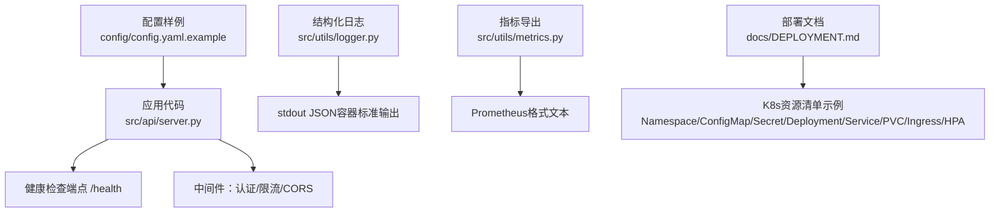

图表来源
- [src/api/server.py:1-152](file://src/api/server.py#L1-L152)
- [config/config.yaml.example:1-38](file://config/config.yaml.example#L1-L38)
- [src/utils/logger.py:1-160](file://src/utils/logger.py#L1-L160)
- [src/utils/metrics.py:1-252](file://src/utils/metrics.py#L1-L252)
- [docs/DEPLOYMENT.md:321-640](file://docs/DEPLOYMENT.md#L321-L640)

章节来源
- [docs/DEPLOYMENT.md:321-640](file://docs/DEPLOYMENT.md#L321-L640)
- [config/config.yaml.example:1-38](file://config/config.yaml.example#L1-L38)
- [src/api/server.py:1-152](file://src/api/server.py#L1-L152)
- [src/utils/logger.py:1-160](file://src/utils/logger.py#L1-L160)
- [src/utils/metrics.py:1-252](file://src/utils/metrics.py#L1-L252)

## 核心组件
- API服务：FastAPI应用，暴露健康检查与分析相关接口，支持CORS、令牌校验与速率限制。
- 配置管理：环境变量优先，YAML配置文件作为补充。
- 可观测性：结构化日志（JSON）与自定义指标（Prometheus格式）。
- K8s资源：命名空间、配置项、密钥、工作负载、服务、持久卷、入口、水平扩缩容。

章节来源
- [src/api/server.py:1-152](file://src/api/server.py#L1-L152)
- [config/config.yaml.example:1-38](file://config/config.yaml.example#L1-L38)
- [docs/DEPLOYMENT.md:321-640](file://docs/DEPLOYMENT.md#L321-L640)

## 架构总览
下图展示K8s中典型的数据与控制面交互：外部流量经Ingress进入ClusterIP Service，由Deployment的多副本Pod承载；Pod通过ConfigMap/Secret注入配置，读写PVC持久化数据；日志与指标分别通过stdout和HTTP端点被采集。

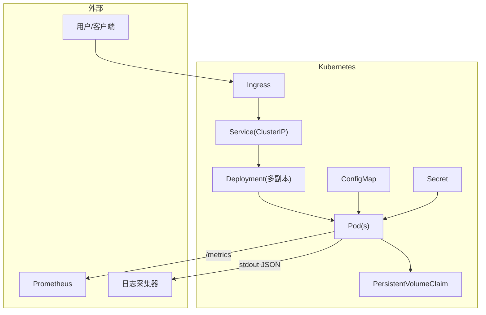

图表来源
- [docs/DEPLOYMENT.md:321-640](file://docs/DEPLOYMENT.md#L321-L640)
- [src/api/server.py:1-152](file://src/api/server.py#L1-L152)
- [src/utils/logger.py:1-160](file://src/utils/logger.py#L1-L160)
- [src/utils/metrics.py:1-252](file://src/utils/metrics.py#L1-L252)

## 详细组件分析

### 工作负载与探针
- Deployment：设置副本数、镜像拉取策略、容器端口、资源请求/限制、存活/就绪探针指向健康检查路径。
- Pod模板：通过环境变量从ConfigMap/Secret注入配置，挂载PVC到/data、/output、/logs等目录。

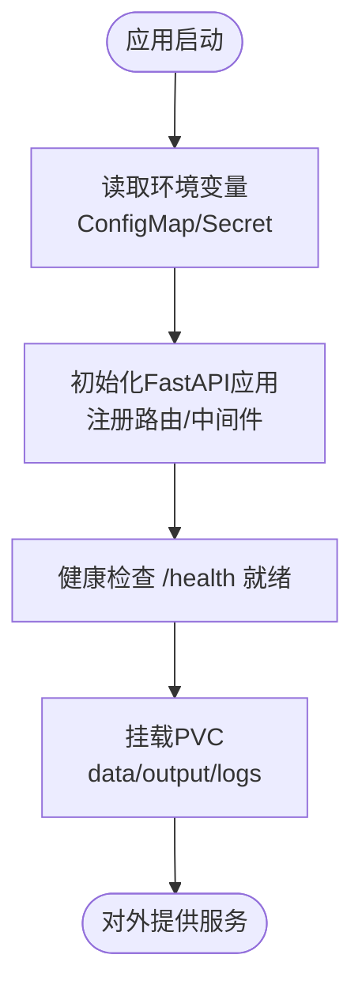

图表来源
- [docs/DEPLOYMENT.md:367-476](file://docs/DEPLOYMENT.md#L367-L476)
- [src/api/server.py:1-152](file://src/api/server.py#L1-L152)

章节来源
- [docs/DEPLOYMENT.md:367-476](file://docs/DEPLOYMENT.md#L367-L476)

### 服务发现与负载均衡
- Service：ClusterIP类型，将80端口转发至容器8000端口，实现内部负载均衡。
- Ingress：基于域名规则将外部流量引入Service，并启用SSL重定向与TLS终止。

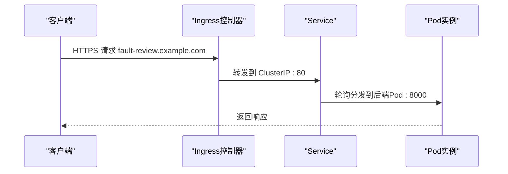

图表来源
- [docs/DEPLOYMENT.md:478-524](file://docs/DEPLOYMENT.md#L478-L524)

章节来源
- [docs/DEPLOYMENT.md:478-524](file://docs/DEPLOYMENT.md#L478-L524)

### 配置与密钥管理
- ConfigMap：存放非敏感配置（如LLM提供商、模型名、日志级别等）。
- Secret：存放敏感信息（如各类API Key、访问令牌），以环境变量形式注入。

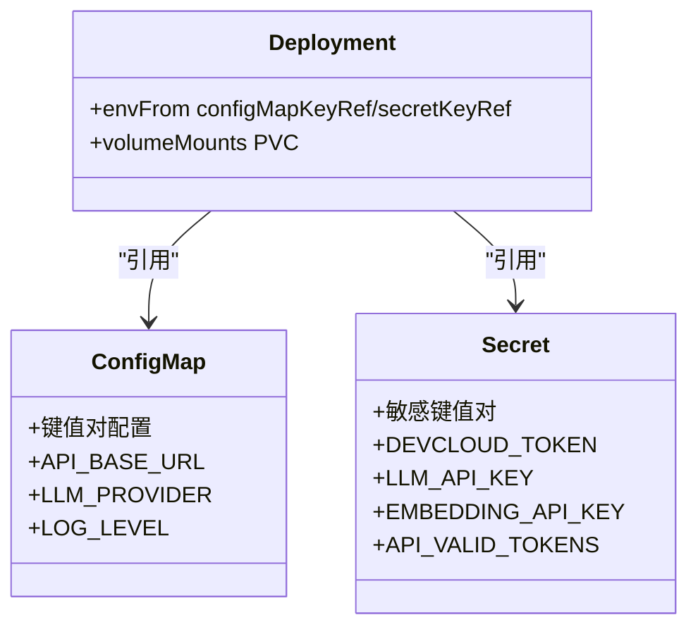

图表来源
- [docs/DEPLOYMENT.md:334-365](file://docs/DEPLOYMENT.md#L334-L365)

章节来源
- [docs/DEPLOYMENT.md:334-365](file://docs/DEPLOYMENT.md#L334-L365)

### 持久化存储
- PVC：为data、output、logs分别创建独立卷声明，使用ReadWriteOnce模式，容量按需调整。
- 建议：根据实际数据量与I/O需求选择合适的StorageClass；若需跨节点共享，应评估RWX或分布式存储方案。

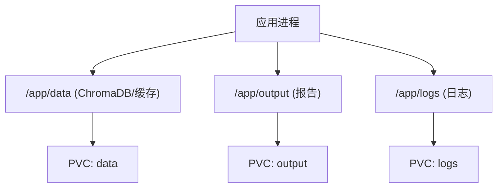

图表来源
- [docs/DEPLOYMENT.md:526-564](file://docs/DEPLOYMENT.md#L526-L564)

章节来源
- [docs/DEPLOYMENT.md:526-564](file://docs/DEPLOYMENT.md#L526-L564)

### 自动扩缩容（HPA）
- 基于CPU与内存利用率阈值进行水平扩展，最小/最大副本数可按业务峰值设定。
- 注意：确保Deployment已设置requests/limits，否则HPA无法计算利用率。

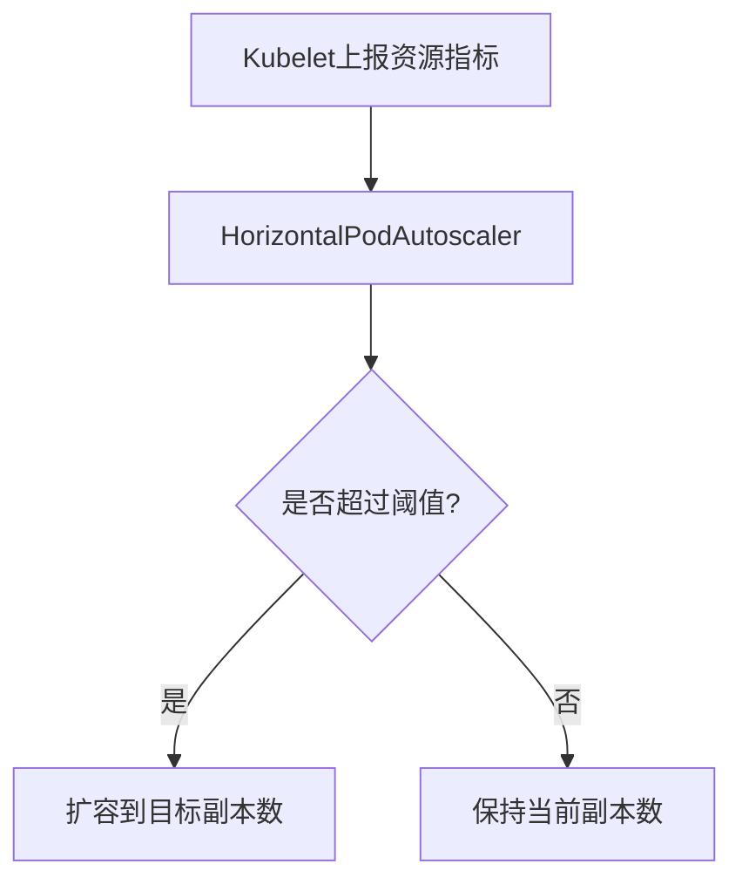

图表来源
- [docs/DEPLOYMENT.md:566-594](file://docs/DEPLOYMENT.md#L566-L594)

章节来源
- [docs/DEPLOYMENT.md:566-594](file://docs/DEPLOYMENT.md#L566-L594)

## 依赖关系分析
- API服务依赖：
  - 配置来源：环境变量（优先级高于YAML配置）
  - 健康检查：/health端点用于探针
  - 可观测性：stdout JSON日志、指标导出（Prometheus格式）
- K8s资源依赖：
  - Deployment依赖ConfigMap/Secret/PVC
  - Service依赖Deployment标签选择器
  - Ingress依赖Service与TLS Secret

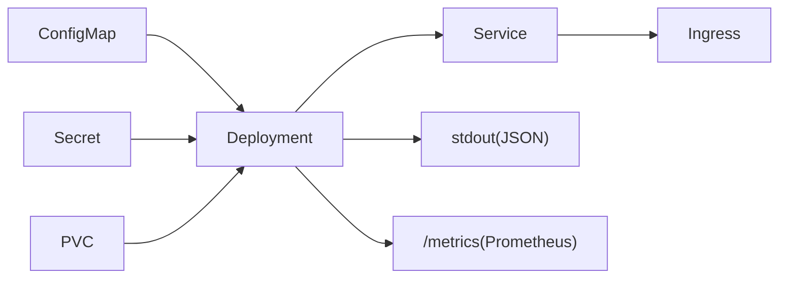

图表来源
- [docs/DEPLOYMENT.md:321-640](file://docs/DEPLOYMENT.md#L321-L640)
- [src/api/server.py:1-152](file://src/api/server.py#L1-L152)
- [src/utils/logger.py:1-160](file://src/utils/logger.py#L1-L160)
- [src/utils/metrics.py:1-252](file://src/utils/metrics.py#L1-L252)

章节来源
- [docs/DEPLOYMENT.md:321-640](file://docs/DEPLOYMENT.md#L321-L640)
- [src/api/server.py:1-152](file://src/api/server.py#L1-L152)
- [src/utils/logger.py:1-160](file://src/utils/logger.py#L1-L160)
- [src/utils/metrics.py:1-252](file://src/utils/metrics.py#L1-L252)

## 性能与扩缩容
- 资源配额：为容器设置合理的requests/limits，避免资源争用与OOM。
- 副本数：结合HPA与压测结果确定初始副本数与扩缩容阈值。
- 连接池与并发：根据Uvicorn/Gunicorn参数与外部依赖（如LLM/Embedding服务）QPS调优。
- 缓存：开启本地缓存减少重复计算，降低外部调用压力。

[本节为通用指导，不直接分析具体文件]

## 存储与备份策略
- 数据目录：data（向量库/缓存）、output（报告）、logs（日志）
- 备份方式：定期打包快照，保留策略按合规要求执行
- 恢复流程：停止服务→覆盖数据→重启验证

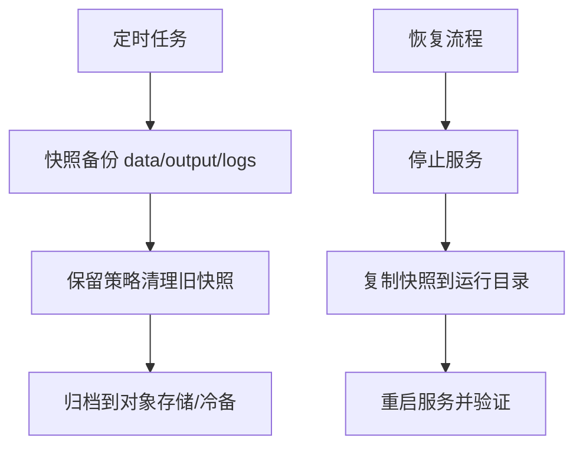

图表来源
- [docs/DEPLOYMENT.md:741-819](file://docs/DEPLOYMENT.md#L741-L819)

章节来源
- [docs/DEPLOYMENT.md:741-819](file://docs/DEPLOYMENT.md#L741-L819)

## 网络安全配置
- Ingress：
  - 启用HTTPS与SSL重定向
  - 配置主机名与路径规则，绑定TLS Secret
- TLS证书：
  - 使用cert-manager自动签发与管理证书，或通过自有CA导入Secret
- 网络策略（建议）：
  - 仅允许Ingress控制器访问Service
  - 限制Pod间不必要的出站访问
  - 隔离命名空间访问边界

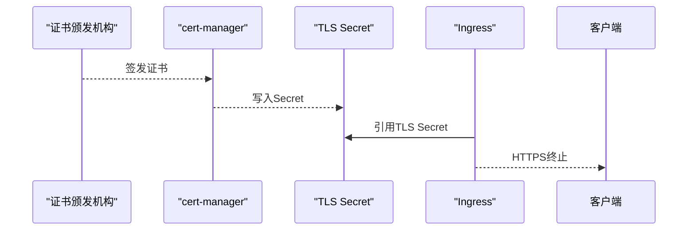

[本节为通用实践建议，未直接映射具体源码文件]

## 监控与日志收集方案
- 日志：
  - 应用输出JSON格式日志到stdout，便于DaemonSet/Fluent Bit/Filebeat采集
  - 支持按文件轮转与保留（本地调试场景）
- 指标：
  - 内置MetricsCollector导出Prometheus格式文本，可通过HTTP端点暴露
  - Prometheus抓取后，Grafana可视化展示
- 关键指标建议：
  - API请求总量、错误率、延迟分布（直方图）
  - 活跃请求数（仪表盘）
  - 聚类耗时、失败次数等业务指标

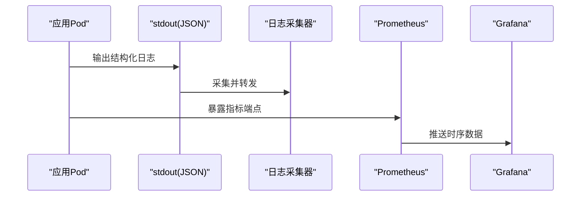

图表来源
- [src/utils/logger.py:1-160](file://src/utils/logger.py#L1-L160)
- [src/utils/metrics.py:1-252](file://src/utils/metrics.py#L1-L252)
- [docs/observability_guide.md:1-229](file://docs/observability_guide.md#L1-L229)

章节来源
- [src/utils/logger.py:1-160](file://src/utils/logger.py#L1-L160)
- [src/utils/metrics.py:1-252](file://src/utils/metrics.py#L1-L252)
- [docs/observability_guide.md:1-229](file://docs/observability_guide.md#L1-L229)

## 故障排查指南
- 健康检查：
  - 确认/health端点可达，探针状态正常
- 配置问题：
  - 核对ConfigMap/Secret键名与值是否正确注入
- 存储问题：
  - 检查PVC绑定状态与容量，确认读写权限
- 扩缩容异常：
  - 确认资源requests/limits已设置，HPA指标可用
- 日志与指标：
  - 查看Pod stdout日志与指标端点输出，定位瓶颈与错误

章节来源
- [docs/DEPLOYMENT.md:622-640](file://docs/DEPLOYMENT.md#L622-L640)
- [src/api/server.py:1-152](file://src/api/server.py#L1-L152)

## 结论
通过将应用容器化并在Kubernetes上编排，可实现高可用、弹性伸缩与统一的可观测性。配合完善的配置管理、持久化存储、网络安全与监控告警体系，能够稳定支撑生产环境的AI驱动故障复盘分析服务。