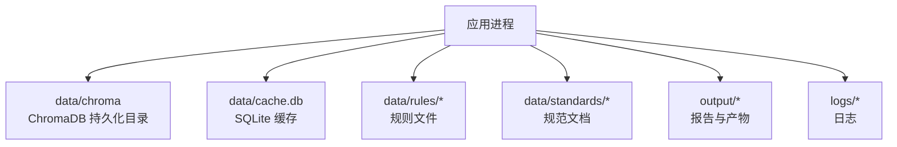
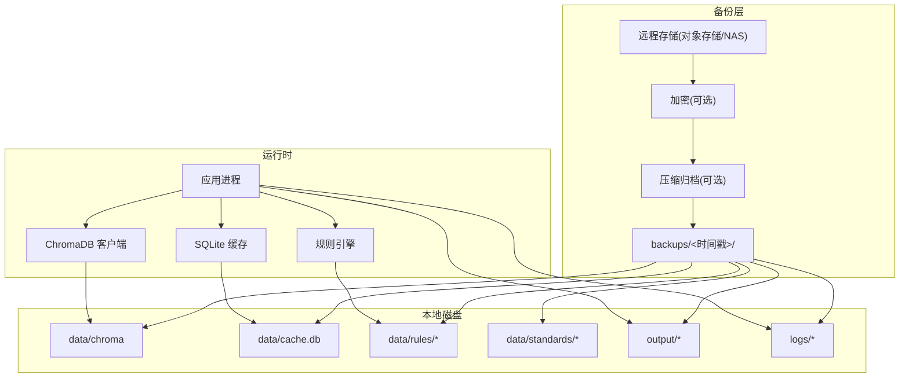
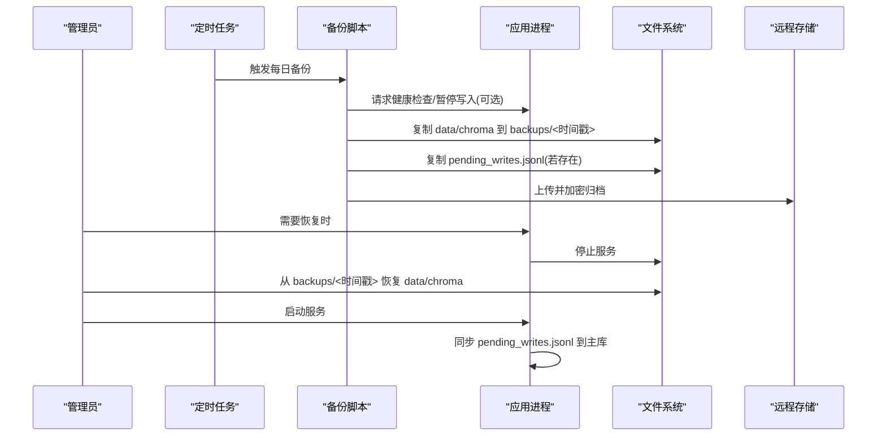
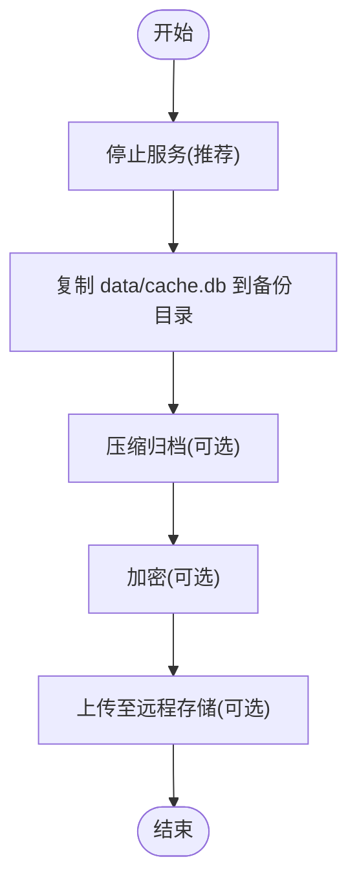
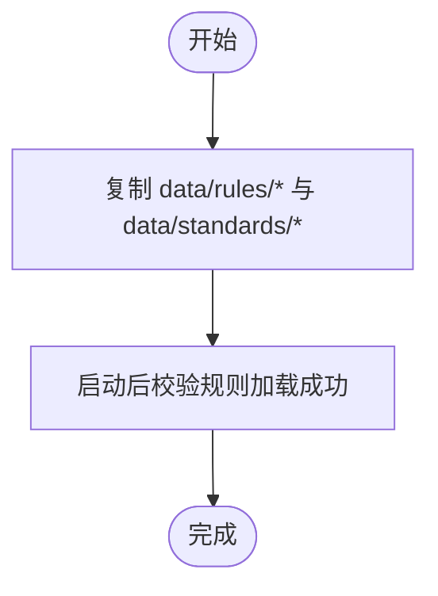
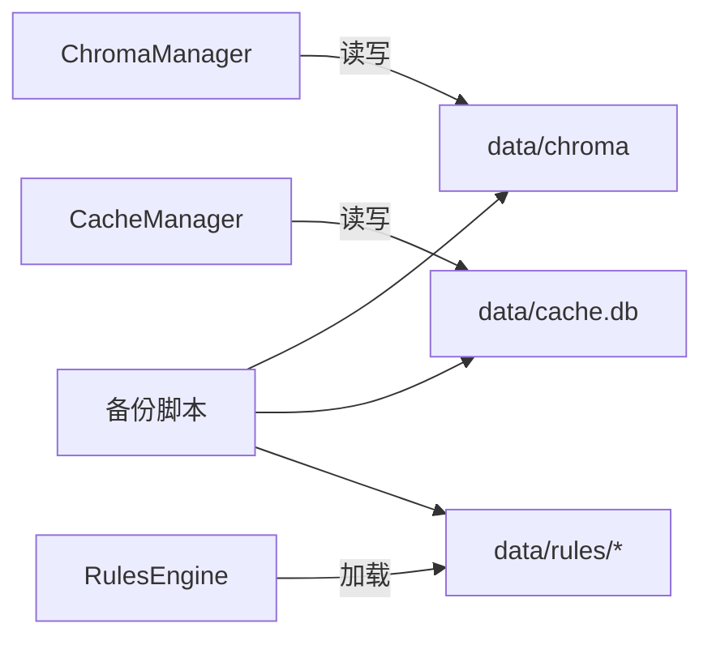

# 数据备份与恢复

<cite>
**本文引用的文件**   
- [README.md](file://README.md)
- [DEPLOYMENT.md](file://docs/DEPLOYMENT.md)
- [chroma_manager.py](file://src/storage/chroma_manager.py)
- [manager.py](file://src/cache/manager.py)
- [engine.py](file://src/rules/engine.py)
</cite>

## 目录
1. [简介](#简介)
2. [项目结构](#项目结构)
3. [核心组件](#核心组件)
4. [架构总览](#架构总览)
5. [详细组件分析](#详细组件分析)
6. [依赖关系分析](#依赖关系分析)
7. [性能考虑](#性能考虑)
8. [故障排查指南](#故障排查指南)
9. [结论](#结论)
10. [附录](#附录)

## 简介
本指南面向生产与运维人员，提供完整的数据备份与恢复操作手册。内容覆盖：
- 关键数据目录结构与重要性（ChromaDB 向量数据库、SQLite 缓存、规则文件、输出报告等）
- 自动化备份脚本的实现要点与使用方式（含定时任务配置、增量策略建议、压缩归档）
- 数据恢复流程（完全恢复、部分恢复、灾难恢复）
- 数据一致性检查与完整性验证方法
- 备份数据的安全存储与传输加密方案

## 项目结构
根据部署文档与源码实现，系统的关键持久化与输出目录如下：
- data/chroma：ChromaDB 向量数据库本地持久化目录
- data/cache.db：SQLite 缓存数据库文件
- data/rules/builtin 与 data/rules/custom：内置与自定义规则文件
- data/standards：开发规范文档
- output：分析报告与导出产物
- logs：运行日志

图示来源
- [DEPLOYMENT.md:741-756](file://docs/DEPLOYMENT.md#L741-L756)

章节来源
- [README.md:77-96](file://README.md#L77-L96)
- [DEPLOYMENT.md:741-756](file://docs/DEPLOYMENT.md#L741-L756)

## 核心组件
本节聚焦三类关键数据及其在系统中的角色与备份要点：
- ChromaDB 向量数据库（data/chroma）
  - 作用：持久化存储故障文本的向量嵌入与元数据，支撑相似检索与聚类结果关联
  - 备份要点：直接复制整个 data/chroma 目录；若启用降级缓存，需同时备份 data/chroma_fallback/pending_writes.jsonl
- SQLite 缓存（data/cache.db）
  - 作用：缓存 API 调用与分析中间结果，支持 TTL 过期清理
  - 备份要点：单文件备份；建议在写锁或停止服务后执行，避免并发写入导致不一致
- 规则与规范（data/rules/*, data/standards/*）
  - 作用：内置与自定义规则、开发规范文档，驱动违规检测与根因分析
  - 备份要点：YAML/JSON 文本文件，版本化管理更佳

章节来源
- [chroma_manager.py:118-136](file://src/storage/chroma_manager.py#L118-L136)
- [chroma_manager.py:43-108](file://src/storage/chroma_manager.py#L43-L108)
- [manager.py:10-35](file://src/cache/manager.py#L10-L35)
- [engine.py:239-250](file://src/rules/engine.py#L239-L250)
- [DEPLOYMENT.md:741-756](file://docs/DEPLOYMENT.md#L741-L756)

## 架构总览
下图展示备份与恢复过程中，应用与关键数据目录的关系以及外部备份工具的作用。

图示来源
- [DEPLOYMENT.md:741-756](file://docs/DEPLOYMENT.md#L741-L756)
- [chroma_manager.py:118-136](file://src/storage/chroma_manager.py#L118-L136)
- [manager.py:10-35](file://src/cache/manager.py#L10-L35)
- [engine.py:239-250](file://src/rules/engine.py#L239-L250)

## 详细组件分析

### 组件一：ChromaDB 向量数据库备份与恢复
- 备份策略
  - 全量备份：直接复制 data/chroma 目录
  - 增量建议：基于文件系统变更时间戳或使用快照卷（如 LVM/ZFS），结合 cron 定期执行
  - 降级缓存：若启用 fallback，需额外备份 pending_writes.jsonl，并在恢复后同步回主库
- 恢复流程
  - 完全恢复：停止服务后替换 data/chroma，重启服务
  - 部分恢复：仅替换特定集合对应子目录（若采用多集合分目录策略）
  - 一致性校验：通过统计接口核对集合数量与健康状态
- 注意事项
  - 写入期间复制可能导致不一致，建议在低峰期或停止服务时执行
  - 若存在待同步记录，需在恢复后执行同步命令以补齐缺失数据

图示来源
- [chroma_manager.py:118-136](file://src/storage/chroma_manager.py#L118-L136)
- [chroma_manager.py:43-108](file://src/storage/chroma_manager.py#L43-L108)
- [chroma_manager.py:437-482](file://src/storage/chroma_manager.py#L437-L482)
- [DEPLOYMENT.md:741-813](file://docs/DEPLOYMENT.md#L741-L813)

章节来源
- [chroma_manager.py:118-136](file://src/storage/chroma_manager.py#L118-L136)
- [chroma_manager.py:437-482](file://src/storage/chroma_manager.py#L437-L482)
- [DEPLOYMENT.md:741-813](file://docs/DEPLOYMENT.md#L741-L813)

### 组件二：SQLite 缓存备份与恢复
- 备份策略
  - 单文件备份：data/cache.db
  - 一致性保障：优先在停止服务或获取写锁后进行拷贝
  - 增量建议：基于快照或差异备份
- 恢复流程
  - 完全恢复：停止服务后替换 cache.db，重启服务
  - 部分恢复：可通过 SQL 导入导出指定表或行
- 一致性校验
  - 统计条目数与过期条目数，确认与预期一致
  - 抽样读取若干 task_id 验证数据可读性

图示来源
- [manager.py:10-35](file://src/cache/manager.py#L10-L35)
- [manager.py:122-138](file://src/cache/manager.py#L122-L138)
- [DEPLOYMENT.md:741-813](file://docs/DEPLOYMENT.md#L741-L813)

章节来源
- [manager.py:10-35](file://src/cache/manager.py#L10-L35)
- [manager.py:122-138](file://src/cache/manager.py#L122-L138)
- [DEPLOYMENT.md:741-813](file://docs/DEPLOYMENT.md#L741-L813)

### 组件三：规则与规范文件备份与恢复
- 备份策略
  - 文本文件直拷，建议纳入版本控制
  - 区分内置与自定义规则，重点保护 custom 目录
- 恢复流程
  - 完全恢复：替换 data/rules 与 data/standards 目录
  - 部分恢复：仅替换自定义规则文件
- 一致性校验
  - 启动后加载规则，统计规则数量与类别分布，确保无解析错误

图示来源
- [engine.py:239-250](file://src/rules/engine.py#L239-L250)
- [DEPLOYMENT.md:741-756](file://docs/DEPLOYMENT.md#L741-L756)

章节来源
- [engine.py:239-250](file://src/rules/engine.py#L239-L250)
- [DEPLOYMENT.md:741-756](file://docs/DEPLOYMENT.md#L741-L756)

### 组件四：输出报告与日志
- 输出报告（output/*）
  - 可独立备份与恢复，便于离线审计与分发
- 日志（logs/*）
  - 建议轮转与归档，保留周期按合规要求设定

章节来源
- [DEPLOYMENT.md:741-756](file://docs/DEPLOYMENT.md#L741-L756)

## 依赖关系分析
- 应用对数据的读写路径
  - ChromaManager 初始化与持久化目录指向 data/chroma
  - CacheManager 使用 data/cache.db 作为后端
  - RulesEngine 从 data/rules 下加载 YAML/JSON 规则
- 备份与恢复的外部依赖
  - 操作系统命令 cp/tar/gzip
  - 可选加密工具（如 openssl）
  - 可选对象存储客户端（如 aws cli / ossutil）

图示来源
- [chroma_manager.py:118-136](file://src/storage/chroma_manager.py#L118-L136)
- [manager.py:10-35](file://src/cache/manager.py#L10-L35)
- [engine.py:239-250](file://src/rules/engine.py#L239-L250)

章节来源
- [chroma_manager.py:118-136](file://src/storage/chroma_manager.py#L118-L136)
- [manager.py:10-35](file://src/cache/manager.py#L10-L35)
- [engine.py:239-250](file://src/rules/engine.py#L239-L250)

## 性能考虑
- 备份窗口
  - 选择业务低峰期执行，减少 I/O 竞争
- 并发写入
  - 对 SQLite 与 ChromaDB 的写入高峰期进行避让，必要时暂停服务
- 压缩与加密
  - 压缩可降低网络与存储成本，但会增加 CPU 开销；建议按需开启
- 增量策略
  - 使用快照或文件系统级增量，降低全量复制耗时

[本节为通用指导，不直接分析具体文件]

## 故障排查指南
- 常见问题
  - 备份期间写入导致数据不一致：建议在停止服务或获取写锁后执行
  - ChromaDB 不可用时的降级写入未同步：恢复后需执行同步待写入数据流程
  - 规则文件损坏：启动后检查规则加载日志，定位异常 YAML/JSON
- 诊断步骤
  - 查看备份日志与返回码
  - 校验备份文件大小与时间戳
  - 恢复后执行健康检查与统计接口，对比预期指标

章节来源
- [chroma_manager.py:437-482](file://src/storage/chroma_manager.py#L437-L482)
- [DEPLOYMENT.md:741-813](file://docs/DEPLOYMENT.md#L741-L813)

## 结论
通过明确的数据目录划分、标准化的备份与恢复流程、以及必要的一致性校验与安全加固，可有效保障系统在各类场景下的数据安全与快速恢复能力。建议将备份策略纳入日常运维巡检与演练计划，持续优化备份窗口与恢复时间目标。

[本节为总结性内容，不直接分析具体文件]

## 附录

### 自动化备份脚本实现要点
- 基本步骤
  - 创建带时间戳的备份目录
  - 复制 data、output、config 等关键目录
  - 可选：压缩归档、加密、上传远程存储
- 定时任务
  - 使用 crontab 配置每日凌晨执行
- 增量备份建议
  - 基于快照或文件系统差异工具实现
  - 结合对象存储生命周期策略管理保留周期

章节来源
- [DEPLOYMENT.md:741-813](file://docs/DEPLOYMENT.md#L741-L813)

### 数据恢复流程
- 完全恢复
  - 停止服务 → 替换 data 与 output → 启动服务 → 校验健康
- 部分恢复
  - 仅替换特定目录（如 rules/custom 或单个集合子目录）
- 灾难恢复
  - 从远程存储拉取最新备份 → 执行完全恢复 → 执行待写入数据同步（如适用）

章节来源
- [DEPLOYMENT.md:778-813](file://docs/DEPLOYMENT.md#L778-L813)

### 数据一致性检查与完整性验证
- 向量数据库
  - 核对集合数量与总条目数
  - 随机抽样查询验证相似度检索可用性
- 缓存数据库
  - 统计总条目、有效条目与过期条目
  - 抽样读取若干任务数据验证可读性
- 规则与规范
  - 启动后检查规则加载数量与类别分布
  - 校验 YAML/JSON 语法正确性

章节来源
- [manager.py:122-138](file://src/cache/manager.py#L122-L138)
- [engine.py:239-250](file://src/rules/engine.py#L239-L250)

### 安全存储与传输加密方案
- 静态加密
  - 对备份压缩包使用对称加密算法（如 AES）
- 传输加密
  - 使用 HTTPS/SFTP 上传至远程存储
- 密钥管理
  - 使用密钥管理服务或硬件安全模块保管密钥
- 访问控制
  - 最小权限原则，限制备份目录与远程桶的访问主体

[本节为通用指导，不直接分析具体文件]