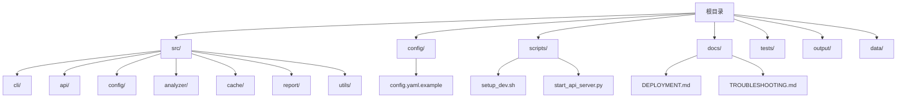
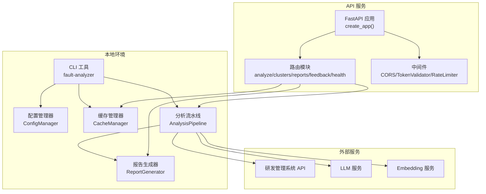
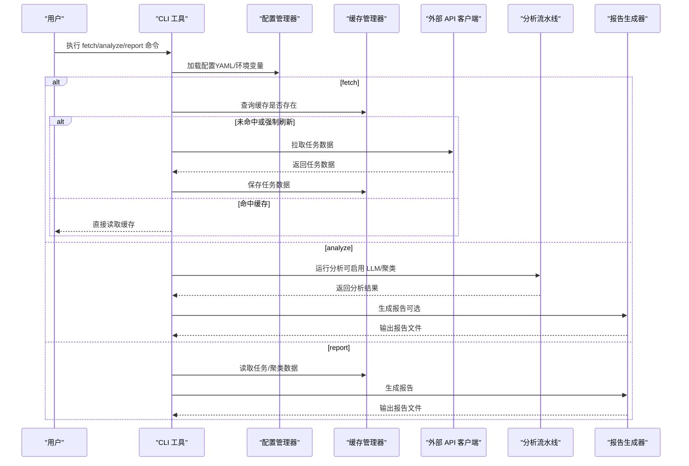
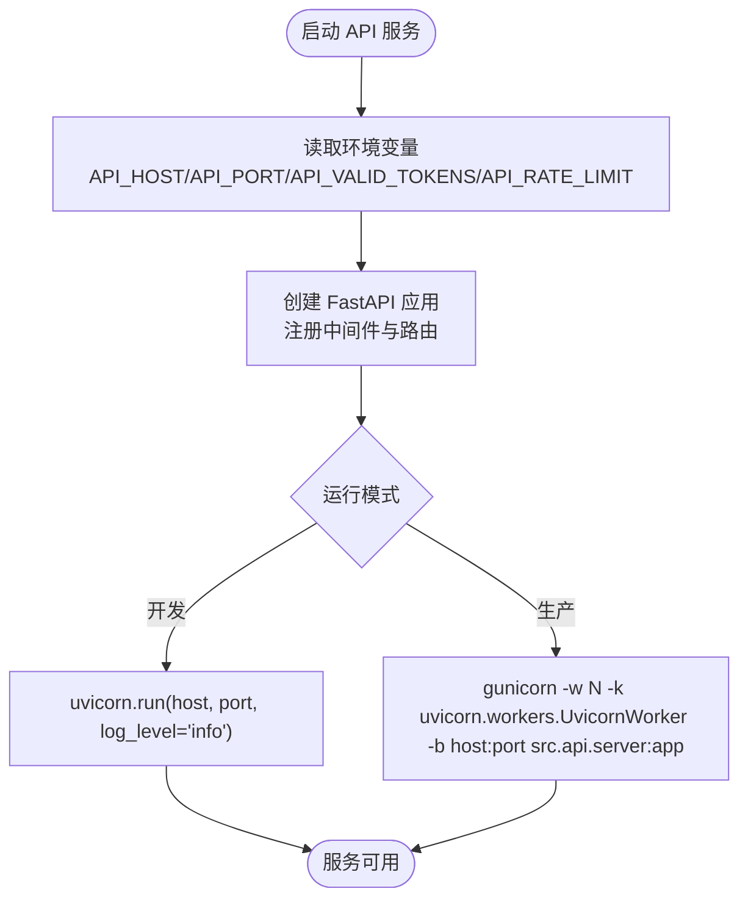
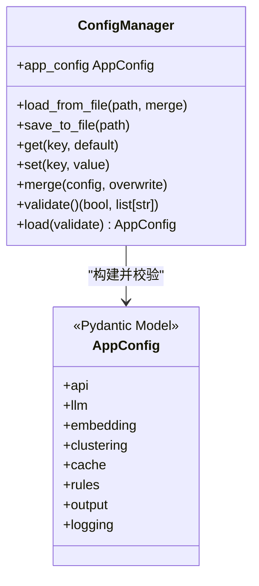
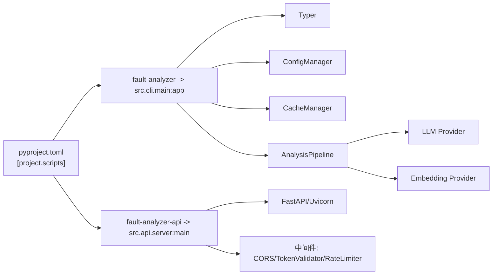

# 本地部署

<cite>
**本文引用的文件**   
- [README.md](file://README.md)
- [pyproject.toml](file://pyproject.toml)
- [config/config.yaml.example](file://config/config.yaml.example)
- [scripts/setup_dev.sh](file://scripts/setup_dev.sh)
- [src/cli/main.py](file://src/cli/main.py)
- [src/api/server.py](file://src/api/server.py)
- [scripts/start_api_server.py](file://scripts/start_api_server.py)
- [src/config/manager.py](file://src/config/manager.py)
- [src/cli/commands/fetch.py](file://src/cli/commands/fetch.py)
- [src/cli/commands/analyze.py](file://src/cli/commands/analyze.py)
- [src/cli/commands/report.py](file://src/cli/commands/report.py)
- [docs/DEPLOYMENT.md](file://docs/DEPLOYMENT.md)
- [docs/TROUBLESHOOTING.md](file://docs/TROUBLESHOOTING.md)
</cite>

## 目录
1. [简介](#简介)
2. [项目结构](#项目结构)
3. [核心组件](#核心组件)
4. [架构总览](#架构总览)
5. [详细组件分析](#详细组件分析)
6. [依赖关系分析](#依赖关系分析)
7. [性能与调优建议](#性能与调优建议)
8. [故障排查与日志](#故障排查与日志)
9. [结论](#结论)
10. [附录：常用命令速查](#附录常用命令速查)

## 简介
本指南面向本地开发与测试环境，提供从代码克隆到服务启动的完整流程，涵盖虚拟环境创建、依赖安装、目录初始化、CLI 工具使用（fetch、analyze、report）、API 服务本地启动（开发模式与生产模式差异）、调试技巧与日志查看方法，以及常见问题诊断与性能调优建议。

## 项目结构
仓库采用模块化组织方式，核心入口包括 CLI 主程序与 FastAPI 服务；配置通过环境变量与 YAML 配置文件共同管理；数据与输出目录在运行期按需创建。

图表来源
- [pyproject.toml:66-68](file://pyproject.toml#L66-L68)
- [src/cli/main.py:1-40](file://src/cli/main.py#L1-L40)
- [src/api/server.py:1-152](file://src/api/server.py#L1-L152)
- [config/config.yaml.example:1-38](file://config/config.yaml.example#L1-L38)
- [scripts/setup_dev.sh:1-79](file://scripts/setup_dev.sh#L1-L79)

章节来源
- [README.md:1-101](file://README.md#L1-L101)
- [pyproject.toml:1-165](file://pyproject.toml#L1-L165)
- [config/config.yaml.example:1-38](file://config/config.yaml.example#L1-L38)
- [scripts/setup_dev.sh:1-79](file://scripts/setup_dev.sh#L1-L79)

## 核心组件
- CLI 命令行工具：基于 Typer 实现，提供 fetch、analyze、report、config、cache 等子命令，统一入口为 fault-analyzer。
- API 服务：基于 FastAPI + Uvicorn，提供健康检查、任务分析、聚类管理、报告获取与反馈接口，支持中间件（CORS、鉴权、限流）。
- 配置管理：支持 YAML 配置文件与环境变量覆盖，提供类型化模型校验与默认值合并。
- 缓存与存储：SQLite 缓存数据库用于任务数据与结果缓存，ChromaDB 用于向量检索（可选）。
- 报告生成：模板渲染生成 Markdown 报告，支持单任务与聚类报告。

章节来源
- [src/cli/main.py:1-40](file://src/cli/main.py#L1-L40)
- [src/api/server.py:1-152](file://src/api/server.py#L1-L152)
- [src/config/manager.py:1-268](file://src/config/manager.py#L1-L268)
- [src/cli/commands/fetch.py:1-235](file://src/cli/commands/fetch.py#L1-L235)
- [src/cli/commands/analyze.py:1-258](file://src/cli/commands/analyze.py#L1-L258)
- [src/cli/commands/report.py:1-140](file://src/cli/commands/report.py#L1-L140)

## 架构总览
下图展示了本地部署时的主要组件交互：CLI 通过配置管理器加载配置并调用外部 API 获取数据，分析流水线执行预处理、嵌入、聚类等步骤，最终由报告生成器输出文档；API 服务暴露 REST 接口供客户端访问。

图表来源
- [src/cli/main.py:1-40](file://src/cli/main.py#L1-L40)
- [src/config/manager.py:1-268](file://src/config/manager.py#L1-L268)
- [src/api/server.py:1-152](file://src/api/server.py#L1-L152)
- [src/cli/commands/fetch.py:1-235](file://src/cli/commands/fetch.py#L1-L235)
- [src/cli/commands/analyze.py:1-258](file://src/cli/commands/analyze.py#L1-L258)
- [src/cli/commands/report.py:1-140](file://src/cli/commands/report.py#L1-L140)

## 详细组件分析

### 本地部署流程（从克隆到启动）
- 克隆仓库并进入项目目录。
- 创建并激活 Python 虚拟环境（要求 Python >= 3.10）。
- 安装开发依赖（包含测试、格式化、类型检查等）。
- 复制并编辑 .env 或 config/config.yaml 完成必要配置。
- 创建必要的运行时目录（data/chroma、data/rules/custom、data/standards、output、logs）。
- 验证安装（运行单元测试）。
- 启动 CLI 或 API 服务。

章节来源
- [README.md:12-45](file://README.md#L12-L45)
- [scripts/setup_dev.sh:1-79](file://scripts/setup_dev.sh#L1-L79)
- [docs/DEPLOYMENT.md:130-199](file://docs/DEPLOYMENT.md#L130-L199)

### CLI 工具使用方法
- 入口命令：fault-analyzer
- 子命令：
  - fetch：获取单个或批量任务数据，支持缓存状态查看与列表展示。
  - analyze：对单个或批量任务进行分析，支持是否启用 LLM、是否进行聚类分析、输出报告路径等选项。
  - report：生成分析报告，支持按任务 ID 或聚类 ID 生成，支持批量生成与报告列表查看。

图表来源
- [src/cli/main.py:1-40](file://src/cli/main.py#L1-L40)
- [src/cli/commands/fetch.py:1-235](file://src/cli/commands/fetch.py#L1-L235)
- [src/cli/commands/analyze.py:1-258](file://src/cli/commands/analyze.py#L1-L258)
- [src/cli/commands/report.py:1-140](file://src/cli/commands/report.py#L1-L140)
- [src/config/manager.py:1-268](file://src/config/manager.py#L1-L268)

章节来源
- [src/cli/main.py:1-40](file://src/cli/main.py#L1-L40)
- [src/cli/commands/fetch.py:1-235](file://src/cli/commands/fetch.py#L1-L235)
- [src/cli/commands/analyze.py:1-258](file://src/cli/commands/analyze.py#L1-L258)
- [src/cli/commands/report.py:1-140](file://src/cli/commands/report.py#L1-L140)

### API 服务本地启动（开发模式 vs 生产模式）
- 开发模式
  - 使用 uvicorn 直接启动，监听地址与端口可通过环境变量配置。
  - 支持 CORS 中间件（开发时允许所有来源），便于前端联调。
  - 可选 Token 鉴权与速率限制，适合本地快速验证。
- 生产模式
  - 建议使用多进程 WSGI/ASGI 服务器（如 Gunicorn + UvicornWorker）提升并发能力。
  - 反向代理（Nginx）处理静态资源、HTTPS、请求体大小限制等。
  - 通过 systemd 管理服务生命周期，结合日志轮转与健康检查。

图表来源
- [src/api/server.py:114-152](file://src/api/server.py#L114-L152)
- [scripts/start_api_server.py:1-69](file://scripts/start_api_server.py#L1-L69)
- [docs/DEPLOYMENT.md:642-739](file://docs/DEPLOYMENT.md#L642-L739)

章节来源
- [src/api/server.py:1-152](file://src/api/server.py#L1-L152)
- [scripts/start_api_server.py:1-69](file://scripts/start_api_server.py#L1-L69)
- [docs/DEPLOYMENT.md:642-739](file://docs/DEPLOYMENT.md#L642-L739)

### 配置管理与环境变量覆盖
- 支持 YAML 配置文件与环境变量双重配置。
- 环境变量优先级高于配置文件，自动映射到对应配置段与字段。
- 提供类型化模型校验，确保必填项与格式正确。

图表来源
- [src/config/manager.py:42-268](file://src/config/manager.py#L42-L268)

章节来源
- [src/config/manager.py:1-268](file://src/config/manager.py#L1-L268)
- [config/config.yaml.example:1-38](file://config/config.yaml.example#L1-L38)

## 依赖关系分析
- 包入口与脚本
  - CLI 入口：fault-analyzer -> src.cli.main:app
  - API 入口：fault-analyzer-api -> src.api.server:main
- 关键依赖
  - Typer（CLI）、FastAPI/Uvicorn（API）、Pydantic/Pydantic Settings（配置校验）、Loguru（日志）、Rich（终端美化）、Jinja2（模板）、HDBSCAN/UMAP（聚类与降维）、OpenAI/LangChain（LLM 集成）、httpx（HTTP 客户端）、aiosqlite（异步 SQLite）。

图表来源
- [pyproject.toml:66-68](file://pyproject.toml#L66-L68)
- [src/cli/main.py:1-40](file://src/cli/main.py#L1-L40)
- [src/api/server.py:1-152](file://src/api/server.py#L1-L152)

章节来源
- [pyproject.toml:1-165](file://pyproject.toml#L1-L165)

## 性能与调优建议
- 分析与嵌入
  - 调整嵌入批处理大小以平衡吞吐与内存占用。
  - 选择轻量级嵌入模型以提升速度，必要时切换至本地模型。
  - 合理设置最小聚类大小与样本数，避免空聚类或噪声过多。
- 缓存策略
  - 启用缓存并设置合适的 TTL，减少重复网络请求与计算。
  - 定期清理过期条目，保持缓存库体积可控。
- API 服务
  - 生产环境使用多进程工作进程，配合反向代理与连接池优化。
  - 根据负载调整速率限制与超时时间，避免雪崩效应。
- 资源限制
  - 控制最大生成 Token 数与温度参数，降低 LLM 调用成本与延迟。
  - 监控内存使用，及时释放大对象，避免 OOM。

章节来源
- [docs/TROUBLESHOOTING.md:409-488](file://docs/TROUBLESHOOTING.md#L409-L488)
- [config/config.yaml.example:1-38](file://config/config.yaml.example#L1-L38)

## 故障排查与日志
- 常见安装与配置问题
  - Python 版本不兼容、依赖安装失败、系统依赖缺失。
  - 环境变量未加载、配置验证失败。
- API 与 LLM 问题
  - 认证失败、连接超时、接口 404。
  - LLM 认证失败、服务超时、模型不存在。
- 嵌入与聚类问题
  - 嵌入生成失败或速度慢。
  - 聚类结果为空或效果不佳。
- 数据存储与权限
  - ChromaDB 无法启动、SQLite 错误、文件系统权限错误。
- 日志查看
  - 确认日志级别与文件路径配置。
  - 在代码中手动设置日志级别与输出目标。

章节来源
- [docs/TROUBLESHOOTING.md:23-140](file://docs/TROUBLESHOOTING.md#L23-L140)
- [docs/TROUBLESHOOTING.md:142-232](file://docs/TROUBLESHOOTING.md#L142-L232)
- [docs/TROUBLESHOOTING.md:233-364](file://docs/TROUBLESHOOTING.md#L233-L364)
- [docs/TROUBLESHOOTING.md:366-408](file://docs/TROUBLESHOOTING.md#L366-L408)
- [docs/TROUBLESHOOTING.md:490-554](file://docs/TROUBLESHOOTING.md#L490-L554)
- [docs/TROUBLESHOOTING.md:555-591](file://docs/TROUBLESHOOTING.md#L555-L591)

## 结论
通过本指南，您可以在本地快速完成从环境准备到服务启动的全流程，掌握 CLI 工具的核心用法与 API 服务的启动差异，并结合日志与排障文档高效定位问题。在生产环境中，建议采用多进程服务器与反向代理，配合合理的缓存与限流策略，以获得稳定与高性能的服务体验。

## 附录：常用命令速查
- 环境初始化
  - 运行开发环境初始化脚本，自动创建虚拟环境、安装依赖、预置目录与示例配置。
- CLI 基本操作
  - 查看帮助：fault-analyzer --help
  - 获取任务：fault-analyzer fetch --task-id <ID>
  - 分析任务：fault-analyzer analyze --task-id <ID>
  - 生成报告：fault-analyzer report --task-id <ID> --output ./output/
- API 服务
  - 开发模式：python -m src.api.server 或 fault-analyzer-api
  - 生产模式：gunicorn -w N -k uvicorn.workers.UvicornWorker -b 0.0.0.0:8000 src.api.server:app

章节来源
- [scripts/setup_dev.sh:1-79](file://scripts/setup_dev.sh#L1-L79)
- [README.md:31-45](file://README.md#L31-L45)
- [docs/DEPLOYMENT.md:177-199](file://docs/DEPLOYMENT.md#L177-L199)
- [docs/DEPLOYMENT.md:642-654](file://docs/DEPLOYMENT.md#L642-L654)
