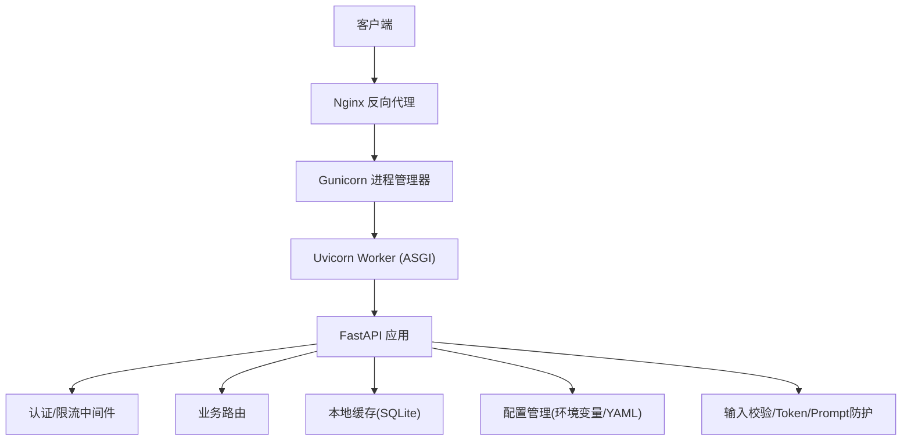
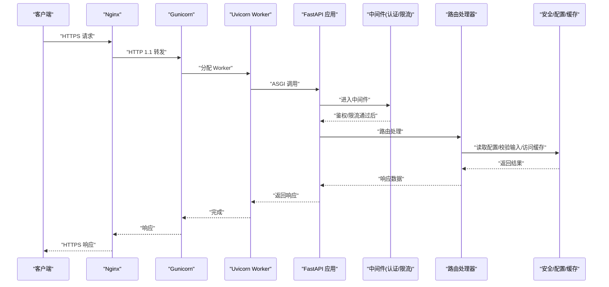
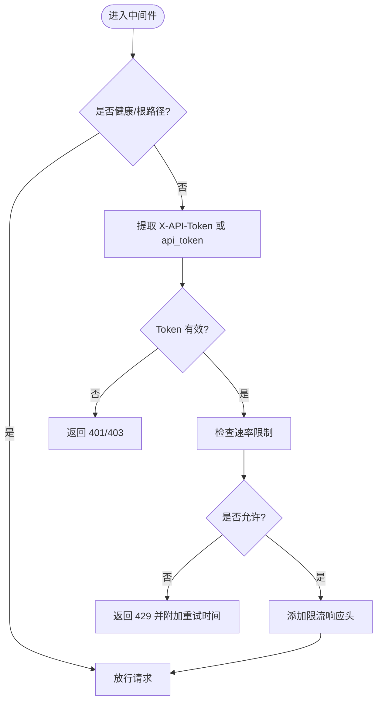
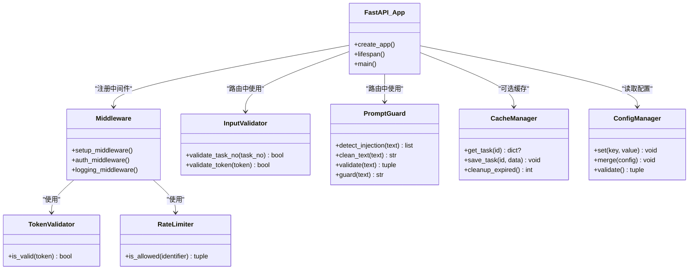

# 生产环境部署

<cite>
**本文引用的文件**
- [docs/DEPLOYMENT.md](file://docs/DEPLOYMENT.md)
- [src/api/server.py](file://src/api/server.py)
- [src/api/middleware.py](file://src/api/middleware.py)
- [config/config.yaml.example](file://config/config.yaml.example)
- [src/config/manager.py](file://src/config/manager.py)
- [docs/observability_guide.md](file://docs/observability_guide.md)
- [src/security/input_validator.py](file://src/security/input_validator.py)
- [src/security/token_manager.py](file://src/security/token_manager.py)
- [src/security/prompt_guard.py](file://src/security/prompt_guard.py)
- [src/cache/manager.py](file://src/cache/manager.py)
</cite>

## 目录
1. [简介](#简介)
2. [项目结构](#项目结构)
3. [核心组件](#核心组件)
4. [架构总览](#架构总览)
5. [详细组件分析](#详细组件分析)
6. [依赖关系分析](#依赖关系分析)
7. [性能考虑](#性能考虑)
8. [故障排查指南](#故障排查指南)
9. [结论](#结论)
10. [附录](#附录)

## 简介
本指南面向生产环境，提供从 Web 服务器配置、系统服务管理、安全加固、性能优化到监控告警的完整最佳实践。内容基于仓库中现有实现与文档进行提炼，确保可落地执行。

## 项目结构
本项目采用分层模块化组织：API 层（FastAPI）、中间件（认证与限流）、业务路由、配置管理、缓存与安全模块等。生产部署通常以 Gunicorn + Uvicorn Worker 运行 FastAPI 应用，并通过 Nginx 反向代理暴露 HTTPS 入口，使用 systemd 管理服务进程。

图表来源
- [src/api/server.py:1-152](file://src/api/server.py#L1-L152)
- [src/api/middleware.py:1-172](file://src/api/middleware.py#L1-L172)
- [src/cache/manager.py:1-164](file://src/cache/manager.py#L1-L164)
- [config/config.yaml.example:1-38](file://config/config.yaml.example#L1-38)
- [docs/DEPLOYMENT.md:642-739](file://docs/DEPLOYMENT.md#L642-L739)

章节来源
- [docs/DEPLOYMENT.md:1-120](file://docs/DEPLOYMENT.md#L1-L120)
- [src/api/server.py:1-152](file://src/api/server.py#L1-L152)

## 核心组件
- API 服务器：FastAPI 应用创建、生命周期、CORS、路由注册与启动参数读取。
- 中间件：Token 验证、请求速率限制、日志记录。
- 配置管理：环境变量与 YAML 配置文件映射与合并。
- 缓存：SQLite 持久化缓存，支持 TTL 与过期清理。
- 安全：输入校验、Token 生命周期管理、Prompt 注入防护。
- 可观测性：结构化日志与指标收集（Prometheus 格式导出）。

章节来源
- [src/api/server.py:38-111](file://src/api/server.py#L38-L111)
- [src/api/middleware.py:13-141](file://src/api/middleware.py#L13-L141)
- [src/config/manager.py:214-222](file://src/config/manager.py#L214-L222)
- [src/cache/manager.py:10-36](file://src/cache/manager.py#L10-L36)
- [src/security/input_validator.py:8-74](file://src/security/input_validator.py#L8-L74)
- [src/security/token_manager.py:8-115](file://src/security/token_manager.py#L8-L115)
- [src/security/prompt_guard.py:12-142](file://src/security/prompt_guard.py#L12-L142)
- [docs/observability_guide.md:1-114](file://docs/observability_guide.md#L1-L114)

## 架构总览
下图展示生产环境的端到端调用链：Nginx 接收外部流量并转发至 Gunicorn，后者通过 Uvicorn Worker 驱动 FastAPI 应用；中间件负责鉴权与限流；业务逻辑访问缓存与外部依赖；可观测性组件输出结构化日志与指标。

图表来源
- [docs/DEPLOYMENT.md:642-739](file://docs/DEPLOYMENT.md#L642-L739)
- [src/api/server.py:114-152](file://src/api/server.py#L114-L152)
- [src/api/middleware.py:62-141](file://src/api/middleware.py#L62-L141)

## 详细组件分析

### Web 服务器与反向代理
- Gunicorn 进程管理
  - 使用多 worker 与异步 UvicornWorker 提升并发能力。
  - 绑定本地回环地址，仅接受来自 Nginx 的请求。
- Nginx 反向代理
  - 设置合理的请求体大小、转发真实 IP 与协议头。
  - 可选静态资源缓存与 WebSocket 升级支持。
- SSL 证书配置
  - 在 Nginx 层启用 HTTPS，强制重定向到 TLS。
  - 建议结合 Ingress 或证书自动续期方案（如 Let's Encrypt）。

章节来源
- [docs/DEPLOYMENT.md:642-739](file://docs/DEPLOYMENT.md#L642-L739)

### 系统服务管理（systemd）
- 服务定义
  - 指定用户与工作目录，加载虚拟环境 PATH。
  - 使用 Restart=always 实现崩溃自恢复。
- 开机自启与日志
  - enable 后随系统启动；journalctl 统一查看服务日志。

章节来源
- [docs/DEPLOYMENT.md:701-739](file://docs/DEPLOYMENT.md#L701-L739)

### 安全加固措施
- 访问控制
  - Token 验证器：支持从 Header 或 Query 获取令牌；未配置有效令牌集合时允许所有（开发模式），生产需严格配置。
  - 健康检查与根路径豁免鉴权。
- 请求限流
  - 基于内存的每分钟计数窗口，超限返回 429，并在响应头中返回剩余配额。
- 输入验证
  - 任务编号与 Token 长度/字符集校验，防止异常输入导致下游错误。
- Prompt 注入防护
  - 检测常见注入模式，转义危险字符，拒绝不安全文本。
- 敏感信息保护
  - 通过环境变量与 Secret 管理密钥；避免在代码或日志中泄露。

图表来源
- [src/api/middleware.py:62-141](file://src/api/middleware.py#L62-L141)
- [src/security/input_validator.py:8-74](file://src/security/input_validator.py#L8-L74)
- [src/security/prompt_guard.py:12-142](file://src/security/prompt_guard.py#L12-L142)

章节来源
- [src/api/middleware.py:13-141](file://src/api/middleware.py#L13-L141)
- [src/security/input_validator.py:8-74](file://src/security/input_validator.py#L8-L74)
- [src/security/token_manager.py:8-115](file://src/security/token_manager.py#L8-L115)
- [src/security/prompt_guard.py:12-142](file://src/security/prompt_guard.py#L12-L142)

### 性能优化配置
- 连接池调优
  - 当前缓存使用 SQLite，适合轻量场景；高并发下建议引入 Redis 或数据库连接池。
- 缓存策略
  - 基于 TTL 的过期机制与定期清理，减少重复计算与 I/O。
- 数据库优化
  - 对高频查询字段建立索引；避免 N+1 查询与全表扫描。
- 应用层优化
  - 合理设置 worker 数量与超时；开启 gzip 压缩；静态资源 CDN 加速。

章节来源
- [src/cache/manager.py:10-36](file://src/cache/manager.py#L10-L36)
- [src/cache/manager.py:156-164](file://src/cache/manager.py#L156-L164)
- [docs/DEPLOYMENT.md:910-939](file://docs/DEPLOYMENT.md#L910-L939)

### 监控与告警方案
- 结构化日志
  - 使用 JSON 格式输出，便于集中采集与分析；包含 correlation_id 用于链路追踪。
- 性能指标
  - 计数器、直方图、仪表盘三类指标；支持 Prometheus 格式导出。
- 告警规则
  - 针对错误率、响应延迟、限流触发、缓存命中率等设定阈值告警。

章节来源
- [docs/observability_guide.md:1-114](file://docs/observability_guide.md#L1-L114)

## 依赖关系分析
- 应用层依赖中间件（认证/限流/日志）
- 路由依赖安全模块（输入校验、Prompt 防护）
- 配置由环境变量与 YAML 共同决定，优先级遵循设计
- 缓存为可选优化层，降低后端压力

图表来源
- [src/api/server.py:38-111](file://src/api/server.py#L38-L111)
- [src/api/middleware.py:62-141](file://src/api/middleware.py#L62-L141)
- [src/security/input_validator.py:8-74](file://src/security/input_validator.py#L8-L74)
- [src/security/prompt_guard.py:12-142](file://src/security/prompt_guard.py#L12-L142)
- [src/cache/manager.py:10-36](file://src/cache/manager.py#L10-L36)
- [src/config/manager.py:214-222](file://src/config/manager.py#L214-L222)

章节来源
- [src/api/server.py:38-111](file://src/api/server.py#L38-L111)
- [src/api/middleware.py:62-141](file://src/api/middleware.py#L62-L141)
- [src/config/manager.py:214-222](file://src/config/manager.py#L214-L222)

## 性能考虑
- 进程模型
  - Gunicorn + UvicornWorker 组合适合高并发 ASGI 应用；根据 CPU 核数与内存调整 worker 数量。
- 反向代理
  - Nginx 启用 keepalive、gzip、缓冲与超时优化；合理设置 client_max_body_size。
- 缓存与存储
  - 热点数据入缓存；SQLite 适合小规模，大规模迁移至 Redis/PostgreSQL 并配置连接池。
- 资源限制
  - 通过 systemd 与容器编排限制 CPU/内存，避免单点过载影响整体稳定性。

[本节为通用指导，不直接分析具体文件]

## 故障排查指南
- 服务状态
  - 使用 systemctl 查看服务状态与重启历史；journalctl 过滤关键日志关键字。
- 网络与代理
  - 验证 Nginx 配置语法与健康检查可达；确认上游端口监听与防火墙策略。
- 认证与限流
  - 检查 Token 是否正确传递；观察 429 响应与限流头，定位限流阈值是否过低。
- 缓存与数据
  - 检查缓存 TTL 与过期清理；必要时清空缓存重建。
- 可观测性
  - 启用 JSON 日志与指标导出；结合 Prometheus/Grafana 可视化与告警。

章节来源
- [docs/DEPLOYMENT.md:701-739](file://docs/DEPLOYMENT.md#L701-L739)
- [src/api/middleware.py:122-141](file://src/api/middleware.py#L122-L141)
- [docs/observability_guide.md:1-114](file://docs/observability_guide.md#L1-L114)

## 结论
通过 Gunicorn + UvicornWorker 作为应用运行时、Nginx 作为反向代理与 HTTPS 入口、systemd 进行进程守护与自动重启，并结合严格的认证限流、输入校验与 Prompt 防护，可在生产环境中获得稳定、安全且可观测的服务。配合缓存与数据库优化以及完善的监控告警体系，进一步提升系统的可靠性与性能。

[本节为总结，不直接分析具体文件]

## 附录

### 环境变量与配置项参考
- 常用环境变量
  - API_BASE_URL、DEVCLOUD_TOKEN、LLM_PROVIDER、LLM_MODEL、LLM_API_KEY、EMBEDDING_PROVIDER、EMBEDDING_MODEL、EMBEDDING_API_KEY、CACHE_ENABLED、CACHE_TTL、CACHE_STORAGE、LOG_LEVEL、LOG_FILE、API_HOST、API_PORT、API_VALID_TOKENS、API_RATE_LIMIT。
- YAML 配置示例
  - config/config.yaml.example 提供 API、LLM、Embedding、聚类、缓存、规则、输出与日志等分组配置。

章节来源
- [docs/DEPLOYMENT.md:43-128](file://docs/DEPLOYMENT.md#L43-L128)
- [config/config.yaml.example:1-38](file://config/config.yaml.example#L1-38)
- [src/config/manager.py:214-222](file://src/config/manager.py#L214-L222)
