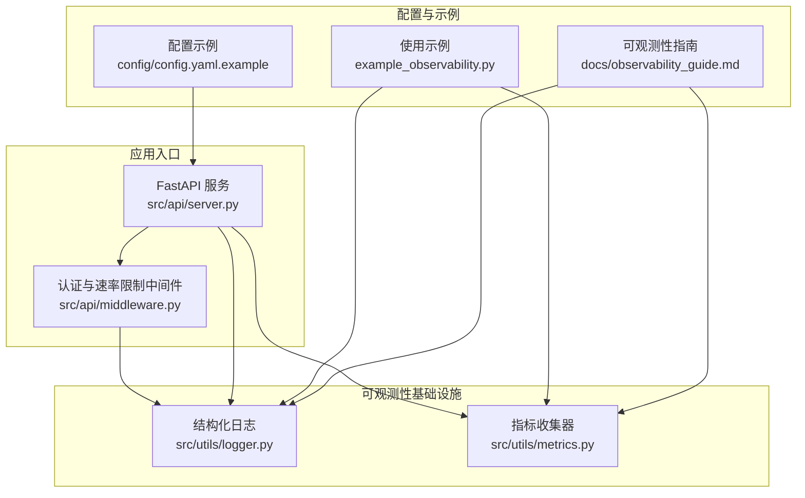
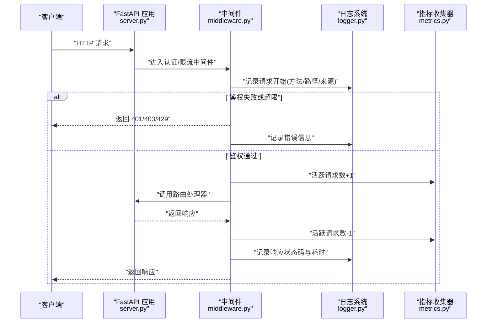
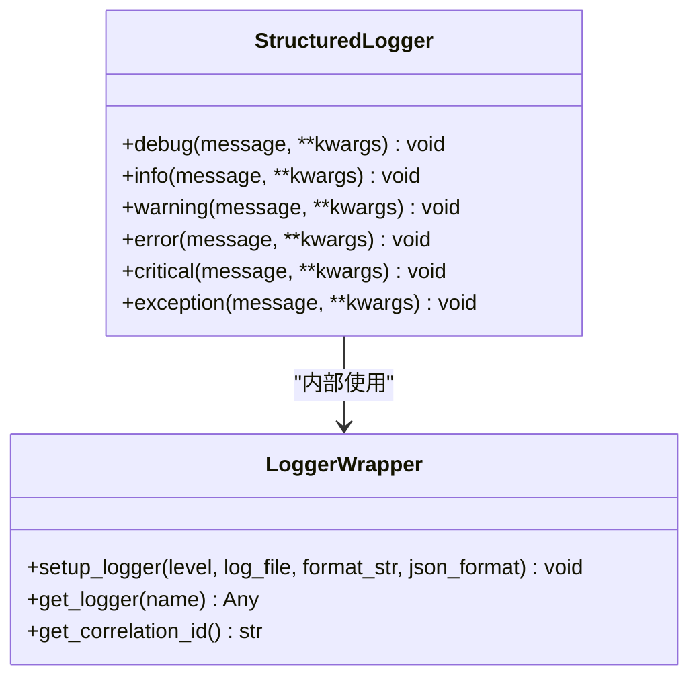
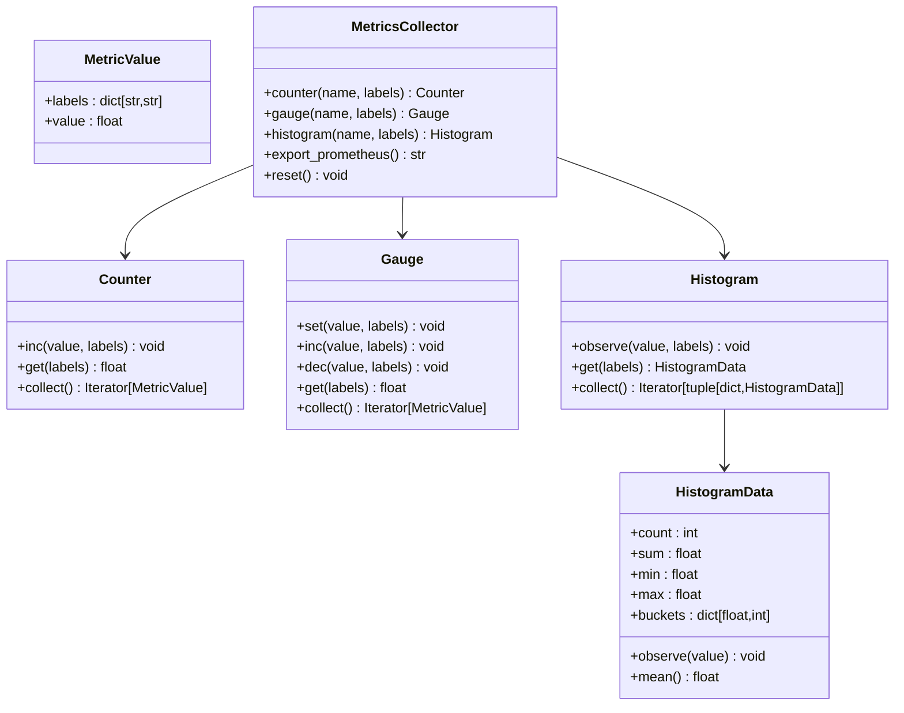
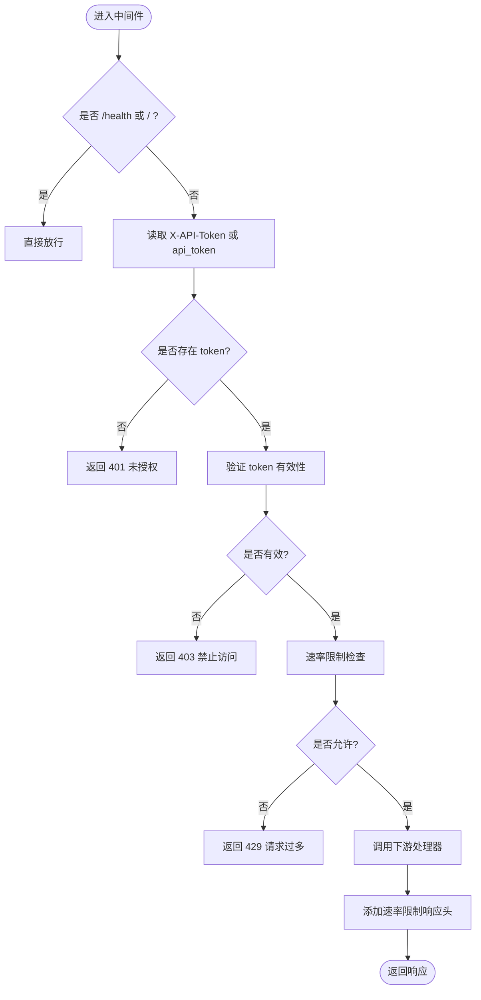
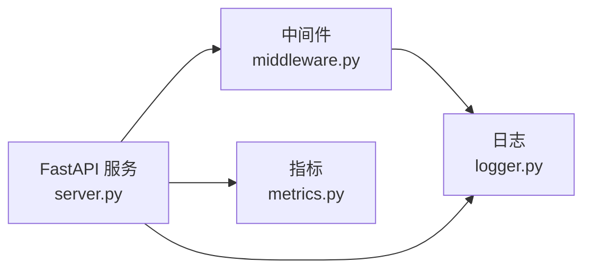

# 监控与日志

<cite>
**本文引用的文件**   
- [src/utils/logger.py](file://src/utils/logger.py)
- [src/utils/metrics.py](file://src/utils/metrics.py)
- [src/api/middleware.py](file://src/api/middleware.py)
- [src/api/server.py](file://src/api/server.py)
- [config/config.yaml.example](file://config/config.yaml.example)
- [docs/observability_guide.md](file://docs/observability_guide.md)
- [example_observability.py](file://example_observability.py)
- [tests/utils/test_logger.py](file://tests/utils/test_logger.py)
- [tests/utils/test_metrics.py](file://tests/utils/test_metrics.py)
</cite>

## 目录
1. [简介](#简介)
2. [项目结构](#项目结构)
3. [核心组件](#核心组件)
4. [架构总览](#架构总览)
5. [详细组件分析](#详细组件分析)
6. [依赖关系分析](#依赖关系分析)
7. [性能考虑](#性能考虑)
8. [故障排查指南](#故障排查指南)
9. [结论](#结论)
10. [附录](#附录)

## 简介
本指南面向生产环境的可观测性建设，围绕“指标采集、日志管理、分布式追踪、告警规则、仪表板”五大主题，结合代码库中已有的结构化日志与指标能力，给出落地方案与最佳实践。文档既覆盖现有实现细节，也提供扩展建议（如 Prometheus 导出端点、集中式日志、Grafana 面板等），帮助团队快速搭建稳定可靠的监控体系。

## 项目结构
本项目在 utils 层提供了日志与指标的基础设施，API 层通过中间件记录请求处理过程，示例与文档展示了使用方式与输出格式。

图表来源
- [src/api/server.py:1-152](file://src/api/server.py#L1-L152)
- [src/api/middleware.py:1-173](file://src/api/middleware.py#L1-L173)
- [src/utils/logger.py:1-160](file://src/utils/logger.py#L1-L160)
- [src/utils/metrics.py:1-252](file://src/utils/metrics.py#L1-L252)
- [config/config.yaml.example:1-38](file://config/config.yaml.example#L1-L38)
- [docs/observability_guide.md:1-229](file://docs/observability_guide.md#L1-L229)
- [example_observability.py:1-86](file://example_observability.py#L1-L86)

章节来源
- [src/api/server.py:1-152](file://src/api/server.py#L1-L152)
- [src/api/middleware.py:1-173](file://src/api/middleware.py#L1-L173)
- [src/utils/logger.py:1-160](file://src/utils/logger.py#L1-L160)
- [src/utils/metrics.py:1-252](file://src/utils/metrics.py#L1-L252)
- [config/config.yaml.example:1-38](file://config/config.yaml.example#L1-L38)
- [docs/observability_guide.md:1-229](file://docs/observability_guide.md#L1-L229)
- [example_observability.py:1-86](file://example_observability.py#L1-L86)

## 核心组件
- 结构化日志：基于 loguru 的 JSON/控制台双模式输出，支持文件写入与轮转，附带 correlation_id 生成与命名 logger 绑定。
- 指标收集：自实现的 Counter/Gauge/Histogram 三类指标，支持标签维度与 Prometheus 文本格式导出。
- API 中间件：统一鉴权、限流与请求/响应日志记录，便于接入链路追踪与性能统计。
- 配置与示例：配置文件提供日志级别等基础项；示例与指南展示如何组合日志与指标进行业务监控。

章节来源
- [src/utils/logger.py:1-160](file://src/utils/logger.py#L1-L160)
- [src/utils/metrics.py:1-252](file://src/utils/metrics.py#L1-L252)
- [src/api/middleware.py:1-173](file://src/api/middleware.py#L1-L173)
- [config/config.yaml.example:1-38](file://config/config.yaml.example#L1-L38)
- [docs/observability_guide.md:1-229](file://docs/observability_guide.md#L1-L229)
- [example_observability.py:1-86](file://example_observability.py#L1-L86)

## 架构总览
下图展示从 HTTP 请求进入，到中间件鉴权/限流、日志记录、指标采集，再到最终响应的完整流程。

图表来源
- [src/api/server.py:1-152](file://src/api/server.py#L1-L152)
- [src/api/middleware.py:1-173](file://src/api/middleware.py#L1-L173)
- [src/utils/logger.py:1-160](file://src/utils/logger.py#L1-L160)
- [src/utils/metrics.py:1-252](file://src/utils/metrics.py#L1-L252)

## 详细组件分析

### 结构化日志组件
- 功能要点
  - 支持 JSON 与控制台两种输出模式，生产推荐 JSON 以便集中收集。
  - 支持写入文件并自动轮转与保留策略。
  - 提供 get_correlation_id 用于跨模块的请求关联。
  - StructuredLogger 封装常用级别方法，便于统一风格。
- 关键接口
  - setup_logger(level, log_file, format_str, json_format)
  - get_logger(name)
  - get_correlation_id()
  - StructuredLogger.debug/info/warning/error/critical/exception
- 典型用法
  - 在 API 中间件或业务入口处生成 correlation_id 并随上下文传递。
  - 在异常分支记录 exception 级别日志，便于定位问题。

图表来源
- [src/utils/logger.py:1-160](file://src/utils/logger.py#L1-L160)

章节来源
- [src/utils/logger.py:1-160](file://src/utils/logger.py#L1-L160)
- [tests/utils/test_logger.py:1-174](file://tests/utils/test_logger.py#L1-L174)
- [docs/observability_guide.md:1-229](file://docs/observability_guide.md#L1-L229)
- [example_observability.py:1-86](file://example_observability.py#L1-L86)

### 指标收集组件
- 功能要点
  - 提供 Counter/Gauge/Histogram 三类指标，均支持标签维度。
  - MetricsCollector 统一管理指标实例，支持 reset 与全局单例。
  - export_prometheus 输出标准 Prometheus 文本格式，便于外部抓取。
- 关键接口
  - MetricsCollector.counter/gauge/histogram
  - MetricsCollector.export_prometheus()
  - get_metrics_collector(namespace)
- 设计注意
  - 直方图默认分桶包含常见阈值，可根据业务调整。
  - 标签基数需控制，避免高基数字段导致存储膨胀。

图表来源
- [src/utils/metrics.py:1-252](file://src/utils/metrics.py#L1-L252)

章节来源
- [src/utils/metrics.py:1-252](file://src/utils/metrics.py#L1-L252)
- [tests/utils/test_metrics.py:1-390](file://tests/utils/test_metrics.py#L1-390)
- [docs/observability_guide.md:1-229](file://docs/observability_guide.md#L1-L229)
- [example_observability.py:1-86](file://example_observability.py#L1-L86)

### API 中间件（鉴权、限流、日志）
- 功能要点
  - 统一 Token 校验与速率限制，未通过则返回相应错误码。
  - 记录请求开始与响应结束日志，包含状态码与耗时。
  - 为后续接入链路追踪与指标埋点提供良好切面。
- 关键逻辑
  - 跳过健康检查与根路径的鉴权。
  - 从 Header 或 Query 参数获取 token。
  - 添加速率限制响应头，便于客户端退避。

图表来源
- [src/api/middleware.py:1-173](file://src/api/middleware.py#L1-L173)

章节来源
- [src/api/middleware.py:1-173](file://src/api/middleware.py#L1-L173)
- [src/api/server.py:1-152](file://src/api/server.py#L1-L152)

### 配置与环境
- 配置项
  - logging.level：控制日志级别，便于调试与生产切换。
- 环境变量（服务器启动）
  - API_HOST、API_PORT：监听地址与端口。
  - API_VALID_TOKENS：逗号分隔的有效 token 列表。
  - API_RATE_LIMIT：每分钟请求上限。

章节来源
- [config/config.yaml.example:1-38](file://config/config.yaml.example#L1-L38)
- [src/api/server.py:114-152](file://src/api/server.py#L114-L152)

## 依赖关系分析
- 组件耦合
  - API 中间件依赖日志系统记录请求与错误，不直接依赖指标模块，但可在其中便捷接入指标埋点。
  - 指标收集器独立于日志系统，二者共同服务于上层业务。
- 外部依赖
  - 日志基于 loguru；指标导出遵循 Prometheus 文本协议。
- 潜在风险
  - 指标标签基数需严格控制，避免内存增长。
  - 日志文件轮转与保留策略需根据磁盘容量规划。

图表来源
- [src/api/server.py:1-152](file://src/api/server.py#L1-L152)
- [src/api/middleware.py:1-173](file://src/api/middleware.py#L1-L173)
- [src/utils/logger.py:1-160](file://src/utils/logger.py#L1-L160)
- [src/utils/metrics.py:1-252](file://src/utils/metrics.py#L1-L252)

章节来源
- [src/api/server.py:1-152](file://src/api/server.py#L1-L152)
- [src/api/middleware.py:1-173](file://src/api/middleware.py#L1-L173)
- [src/utils/logger.py:1-160](file://src/utils/logger.py#L1-L160)
- [src/utils/metrics.py:1-252](file://src/utils/metrics.py#L1-L252)

## 性能考虑
- 指标采样与聚合
  - 对高频操作建议使用直方图记录分布，避免逐条上报原始数据。
  - 合理设置直方图分桶，兼顾精度与体积。
- 日志吞吐
  - 生产环境启用 JSON 输出，配合异步 I/O 与批量落盘策略。
  - 控制 DEBUG 级别日志在生产开启范围，减少 IO 压力。
- 标签基数
  - 避免将用户 ID、随机字符串等作为标签值，必要时进行哈希或截断。
- 中间件开销
  - 鉴权与限流逻辑应尽量轻量，避免阻塞主流程。

## 故障排查指南
- 常见问题
  - 无法解析 JSON 日志：确认已启用 JSON 模式且输出到 stderr 或文件。
  - 指标缺失：检查是否在关键路径调用 inc/observe/set，并确保命名空间一致。
  - 鉴权失败：核对 token 来源（Header 或 Query）与配置的有效 token 列表。
  - 限流触发：观察 429 响应与速率限制头，评估阈值是否过低。
- 定位步骤
  - 使用 correlation_id 串联同一请求的日志与指标。
  - 通过中间件日志中的状态码与耗时快速定位慢请求与异常分支。
  - 导出 Prometheus 文本格式，离线分析指标分布与趋势。

章节来源
- [src/api/middleware.py:1-173](file://src/api/middleware.py#L1-L173)
- [src/utils/logger.py:1-160](file://src/utils/logger.py#L1-L160)
- [src/utils/metrics.py:1-252](file://src/utils/metrics.py#L1-L252)
- [docs/observability_guide.md:1-229](file://docs/observability_guide.md#L1-L229)

## 结论
本项目已具备完善的结构化日志与指标采集基础，结合中间件的统一切面，能够快速构建端到端的可观测性体系。建议在现有基础上补充 Prometheus 导出端点、集中式日志平台与 Grafana 面板，完善告警规则与通知渠道，形成闭环的监控与排障能力。

## 附录

### 指标采集与展示方案
- 指标分类
  - 业务指标：任务处理总量、聚类成功率、反馈提交量等。
  - 系统指标：CPU/内存/磁盘/网络（由宿主或容器运行时提供）。
  - 性能指标：API 响应时间、P95/P99、错误率、并发数等。
- 采集与展示
  - 使用 MetricsCollector.export_prometheus() 输出文本格式。
  - 通过 Prometheus 抓取后，在 Grafana 中创建仪表盘，按 endpoint/method/service 等维度下钻。

章节来源
- [src/utils/metrics.py:1-252](file://src/utils/metrics.py#L1-L252)
- [docs/observability_guide.md:1-229](file://docs/observability_guide.md#L1-L229)

### 日志收集与分析方案
- 结构化日志格式
  - JSON 字段包含时间戳、级别、消息、名称、文件位置、函数名及额外上下文。
- 日志轮转与保留
  - 支持按大小轮转与按天数保留，适合本地持久化与集中收集。
- 集中式日志管理
  - 将 stderr 或文件输出转发至 ELK/Loki/云厂商日志服务，建立索引与检索。

章节来源
- [src/utils/logger.py:1-160](file://src/utils/logger.py#L1-L160)
- [docs/observability_guide.md:1-229](file://docs/observability_guide.md#L1-L229)

### 分布式追踪集成
- 请求链路追踪
  - 使用 correlation_id 贯穿请求生命周期，并在各子系统日志中携带该 ID。
- 性能瓶颈分析
  - 结合中间件记录的耗时与指标直方图，识别慢接口与热点路径。
- 错误定位
  - 在异常分支记录 exception 级别日志，附带堆栈与上下文，配合 correlation_id 快速回溯。

章节来源
- [src/utils/logger.py:1-160](file://src/utils/logger.py#L1-L160)
- [src/api/middleware.py:1-173](file://src/api/middleware.py#L1-L173)
- [docs/observability_guide.md:1-229](file://docs/observability_guide.md#L1-L229)

### 告警规则配置
- 阈值告警
  - 错误率超过阈值、P99 延迟超阈、活跃请求数突增等。
- 异常检测
  - 基于历史基线进行动态阈值告警，降低误报。
- 通知渠道
  - 对接邮件、企业微信、钉钉、Slack 等，确保及时触达。

章节来源
- [src/api/middleware.py:1-173](file://src/api/middleware.py#L1-L173)
- [src/utils/metrics.py:1-252](file://src/utils/metrics.py#L1-L252)

### 监控仪表板搭建指南
- Grafana 配置
  - 数据源：Prometheus。
  - 关键图表：QPS、错误率、响应时间分位、活跃请求数、直方图分布。
- 实时监控面板
  - 以时间窗口聚合指标，支持下钻到具体 endpoint/method/service。
  - 叠加告警状态与事件标记，辅助快速定位。

章节来源
- [src/utils/metrics.py:1-252](file://src/utils/metrics.py#L1-L252)
- [docs/observability_guide.md:1-229](file://docs/observability_guide.md#L1-L229)