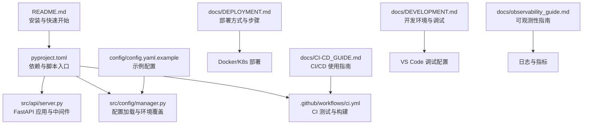
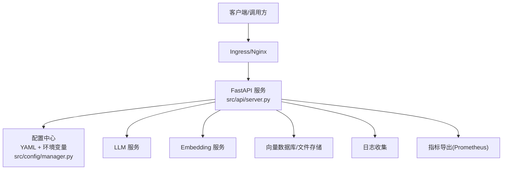
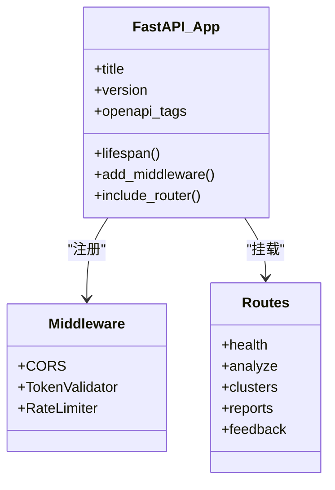
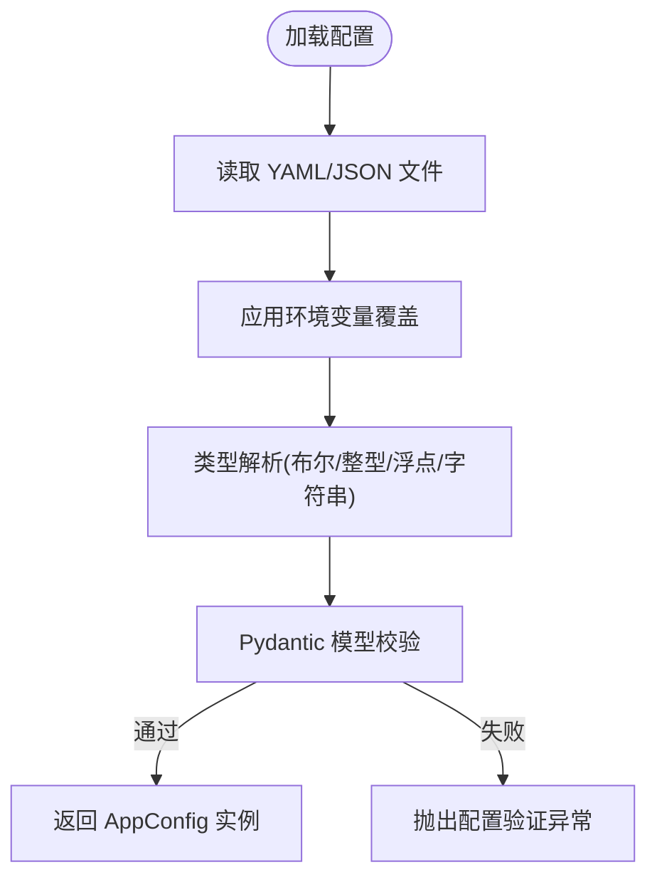
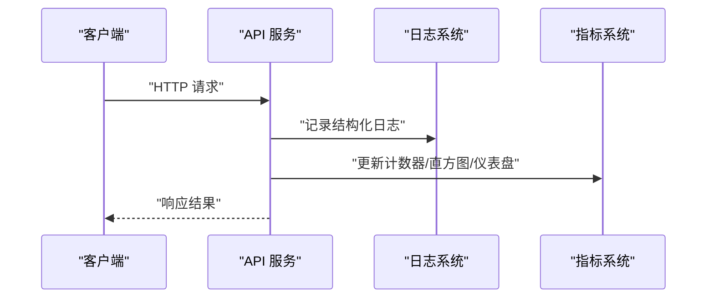
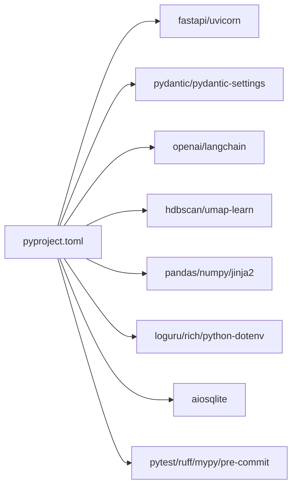
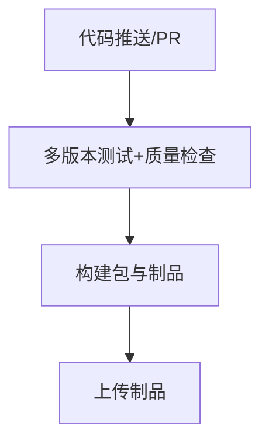

# 部署指南

<cite>
**本文引用的文件**   
- [README.md](file://README.md)
- [pyproject.toml](file://pyproject.toml)
- [docs/DEPLOYMENT.md](file://docs/DEPLOYMENT.md)
- [docs/CI-CD_GUIDE.md](file://docs/CI-CD_GUIDE.md)
- [docs/DEVELOPMENT.md](file://docs/DEVELOPMENT.md)
- [docs/observability_guide.md](file://docs/observability_guide.md)
- [config/config.yaml.example](file://config/config.yaml.example)
- [src/api/server.py](file://src/api/server.py)
- [src/config/manager.py](file://src/config/manager.py)
- [.github/workflows/ci.yml](file:.github/workflows/ci.yml)
</cite>

## 目录
1. [简介](#简介)
2. [项目结构](#项目结构)
3. [核心组件](#核心组件)
4. [架构总览](#架构总览)
5. [详细组件分析](#详细组件分析)
6. [依赖分析](#依赖分析)
7. [性能与容量规划](#性能与容量规划)
8. [监控与日志](#监控与日志)
9. [安全加固与合规检查清单](#安全加固与合规检查清单)
10. [灾难恢复与备份策略](#灾难恢复与备份策略)
11. [扩缩容与负载均衡](#扩缩容与负载均衡)
12. [CI/CD 流水线配置](#cicd-流水线配置)
13. [云平台部署策略](#云平台部署策略)
14. [故障排查指南](#故障排查指南)
15. [结论](#结论)

## 简介
本指南面向生产环境，提供从开发环境搭建、容器化与编排、云平台部署、CI/CD 流水线、监控与日志、安全加固、灾备与扩容等全链路操作说明。项目为 AI 驱动的故障复盘分析工具，支持本地 CLI、API 服务、Docker/Kubernetes 部署，并内置结构化日志与指标采集能力。

## 项目结构
仓库采用模块化组织：CLI、API、分析引擎、规则引擎、报告生成、缓存与存储、配置管理、可观测性工具等。关键入口包括 CLI 命令与 FastAPI 服务；配置通过环境变量与 YAML 合并加载；构建与发布由 pyproject 与 GitHub Actions 驱动。

图表来源
- [README.md:1-101](file://README.md#L1-L101)
- [pyproject.toml:1-165](file://pyproject.toml#L1-L165)
- [src/api/server.py:1-152](file://src/api/server.py#L1-L152)
- [src/config/manager.py:1-268](file://src/config/manager.py#L1-L268)
- [config/config.yaml.example:1-38](file://config/config.yaml.example#L1-L38)
- [docs/DEPLOYMENT.md:1-800](file://docs/DEPLOYMENT.md#L1-L800)
- [docs/CI-CD_GUIDE.md:1-261](file://docs/CI-CD_GUIDE.md#L1-L261)
- [docs/DEVELOPMENT.md:1-648](file://docs/DEVELOPMENT.md#L1-L648)
- [docs/observability_guide.md:1-229](file://docs/observability_guide.md#L1-L229)
- [.github/workflows/ci.yml:1-78](file:.github/workflows/ci.yml#L1-L78)

章节来源
- [README.md:1-101](file://README.md#L1-L101)
- [pyproject.toml:1-165](file://pyproject.toml#L1-L165)

## 核心组件
- API 服务：基于 FastAPI，提供健康检查、分析、聚类、报告与反馈接口，内置认证与速率限制中间件。
- 配置系统：支持 YAML 配置文件与环境变量覆盖，启动时进行类型校验。
- CLI 与脚本：提供 fault-analyzer 与 fault-analyzer-api 两个命令入口。
- CI/CD：GitHub Actions 多 Python 版本矩阵测试、代码质量检查、包构建与制品上传。
- 可观测性：结构化 JSON 日志与 Prometheus 格式指标导出。

章节来源
- [src/api/server.py:1-152](file://src/api/server.py#L1-L152)
- [src/config/manager.py:1-268](file://src/config/manager.py#L1-L268)
- [pyproject.toml:66-69](file://pyproject.toml#L66-L69)
- [.github/workflows/ci.yml:1-78](file:.github/workflows/ci.yml#L1-L78)
- [docs/observability_guide.md:1-229](file://docs/observability_guide.md#L1-L229)

## 架构总览
下图展示生产环境典型部署形态：客户端通过 Ingress/Nginx 访问 API 服务，服务读取配置与外部 LLM/Embedding 服务，持久化数据到向量库与文件系统，日志与指标输出到集中式平台。

图表来源
- [src/api/server.py:1-152](file://src/api/server.py#L1-L152)
- [src/config/manager.py:1-268](file://src/config/manager.py#L1-L268)
- [docs/DEPLOYMENT.md:321-640](file://docs/DEPLOYMENT.md#L321-L640)
- [docs/observability_guide.md:1-229](file://docs/observability_guide.md#L1-L229)

## 详细组件分析

### API 服务组件
- 应用创建与生命周期：定义 lifespan 钩子用于资源初始化与清理。
- 中间件：CORS、Token 校验、速率限制。
- 路由注册：健康检查、分析、聚类、报告、反馈等模块。
- 启动参数：主机、端口、有效 Token 列表、速率限制来自环境变量。

图表来源
- [src/api/server.py:1-152](file://src/api/server.py#L1-L152)

章节来源
- [src/api/server.py:1-152](file://src/api/server.py#L1-L152)

### 配置管理组件
- 配置来源优先级：命令行 > 环境变量 > 配置文件 > 默认值。
- 环境变量映射：将常见键映射到内部配置段（如 api、llm、embedding、clustering、cache、rules、output、logging）。
- 类型解析：自动识别布尔、整数、浮点与字符串。
- 校验：通过 Pydantic 模型进行强类型校验。

图表来源
- [src/config/manager.py:1-268](file://src/config/manager.py#L1-L268)
- [config/config.yaml.example:1-38](file://config/config.yaml.example#L1-L38)

章节来源
- [src/config/manager.py:1-268](file://src/config/manager.py#L1-L268)
- [config/config.yaml.example:1-38](file://config/config.yaml.example#L1-L38)

### 可观测性组件
- 结构化日志：支持 JSON 与控制台格式，包含 correlation_id 便于追踪。
- 指标采集：Counter/Histogram/Gauge，支持导出 Prometheus 文本格式。
- 使用建议：在 API 请求处理路径中记录耗时与错误计数，避免高频路径过度日志。

图表来源
- [docs/observability_guide.md:1-229](file://docs/observability_guide.md#L1-L229)

章节来源
- [docs/observability_guide.md:1-229](file://docs/observability_guide.md#L1-L229)

## 依赖分析
- 运行时依赖：FastAPI、Uvicorn、Pydantic、OpenAI/LangChain、HDBSCAN、UMAP、Pandas、NumPy、Jinja2、Loguru、Rich、python-dotenv、aiosqlite 等。
- 开发依赖：pytest、ruff、mypy、pre-commit、playwright 等。
- 脚本入口：fault-analyzer、fault-analyzer-api。

图表来源
- [pyproject.toml:22-69](file://pyproject.toml#L22-L69)

章节来源
- [pyproject.toml:1-165](file://pyproject.toml#L1-L165)

## 性能与容量规划
- CPU/内存：LLM 与 Embedding 调用为计算密集与网络敏感场景，建议按并发量与批大小评估资源；K8s 资源配置参考文档中的 requests/limits 示例。
- 并发与队列：API 服务建议使用多进程 Worker（如 Gunicorn + UvicornWorker），结合反向代理连接池与超时设置。
- 缓存：启用 SQLite 或外部缓存以降低重复计算成本，合理设置 TTL。
- 向量库：ChromaDB 数据目录需独立持久卷，注意磁盘 I/O 与空间增长。

[本节为通用指导，不直接分析具体文件]

## 监控与日志
- 日志：在生产环境启用 JSON 格式，统一字段（时间戳、级别、消息、correlation_id、端点、方法等），集中收集至日志平台。
- 指标：暴露 /metrics 或通过侧车/Exporter 采集，关注 API 请求总量、延迟分布、活跃请求数、错误率。
- 告警：对错误率突增、P95/P99 延迟升高、资源利用率超阈值设置告警。

章节来源
- [docs/observability_guide.md:1-229](file://docs/observability_guide.md#L1-L229)

## 安全加固与合规检查清单
- 密钥管理：所有敏感信息通过环境变量或 Secret 注入，禁止硬编码；使用最小权限原则。
- 传输安全：强制 HTTPS，配置 TLS 证书与严格的安全头。
- 访问控制：启用 Token 校验与速率限制，限制 CORS 白名单。
- 输入校验：服务端对所有入参进行严格校验与长度限制。
- 依赖安全：定期扫描依赖漏洞，锁定版本，启用预提交检测。
- 审计与合规：开启审计日志，保留必要日志周期，满足数据留存策略。

[本节为通用指导，不直接分析具体文件]

## 灾难恢复与备份策略
- 备份范围：data/chroma、SQLite 缓存、自定义规则、输出报告、日志归档、配置文件。
- 备份策略：定时增量/全量备份，异地冗余，保留策略与加密存储。
- 恢复流程：停止服务 -> 恢复数据 -> 校验一致性 -> 重启服务 -> 冒烟测试。
- 演练：定期进行恢复演练，验证 RTO/RPO 目标达成。

章节来源
- [docs/DEPLOYMENT.md:741-800](file://docs/DEPLOYMENT.md#L741-L800)

## 扩缩容与负载均衡
- 水平扩展：K8s Deployment 多副本，HPA 基于 CPU/内存利用率自动扩缩容。
- 负载均衡：Ingress/Nginx 做七层负载与健康检查，后端多 Pod 分发。
- 会话与状态：无状态服务设计，状态外置到持久卷或外部存储。
- 流量治理：灰度发布、蓝绿部署、滚动升级，配合探针与就绪/存活检查。

章节来源
- [docs/DEPLOYMENT.md:321-640](file://docs/DEPLOYMENT.md#L321-L640)

## CI/CD 流水线配置
- 触发条件：push 到 main/master/develop 分支，PR 到 main/master。
- 测试矩阵：Python 3.10/3.11/3.12 并行执行。
- 质量门禁：ruff 检查与格式化、mypy 类型检查、pytest 覆盖率。
- 构建产物：构建 wheel/sdist，twine 校验，上传 artifacts。
- 可选发布：后续可扩展为打包镜像并推送至镜像仓库。

图表来源
- [.github/workflows/ci.yml:1-78](file:.github/workflows/ci.yml#L1-L78)

章节来源
- [docs/CI-CD_GUIDE.md:1-261](file://docs/CI-CD_GUIDE.md#L1-L261)
- [.github/workflows/ci.yml:1-78](file:.github/workflows/ci.yml#L1-L78)

## 云平台部署策略

### AWS 部署要点
- 容器编排：EKS + Helm 管理命名空间、ConfigMap/Secret、Deployment/Service/Ingress/HPA。
- 存储：EBS/EFS 作为 PVC 后端，持久化 data/output/logs。
- 网络：ALB/NLB 作为 Ingress 控制器，TLS 终止于 ALB。
- 监控：CloudWatch 日志聚合，Prometheus/Grafana 托管或自建。
- 安全：IAM 角色绑定 Pod，VPC 安全组与 NACL 最小开放。

[本节为通用指导，不直接分析具体文件]

### 阿里云部署要点
- 容器编排：ACK + HELM，使用 Namespace/ConfigMap/Secret 管理配置。
- 存储：云盘/NAS 作为 PVC 后端，保障高可用与快照备份。
- 网络：ALB/SLB 作为 Ingress 控制器，HTTPS 证书托管。
- 监控：ARMS/SLS 日志与指标，Grafana 可视化。
- 安全：RAM 角色授权，VPC 安全组最小开放，密钥使用 KMS。

[本节为通用指导，不直接分析具体文件]

## 故障排查指南
- 启动失败：检查环境变量与配置文件是否齐全，确认端口占用与权限。
- 外部依赖失败：核对 LLM/Embedding 的 Provider、Model、API Key 与 Base URL。
- 性能问题：查看指标与日志，定位慢查询与热点路径，调整批大小与并发。
- 存储问题：检查 PVC 挂载、ChromaDB 目录权限与磁盘空间。
- 日志与指标：确认 JSON 日志与指标导出是否正常，集中平台是否可达。

章节来源
- [docs/DEPLOYMENT.md:1-800](file://docs/DEPLOYMENT.md#L1-L800)
- [docs/DEVELOPMENT.md:539-648](file://docs/DEVELOPMENT.md#L539-L648)
- [docs/observability_guide.md:1-229](file://docs/observability_guide.md#L1-L229)

## 结论
本指南提供了从开发到生产的完整落地方案。建议在正式上线前完成安全加固、监控接入、备份演练与压测验证，确保系统在稳定性、安全性与可维护性方面达到生产标准。
