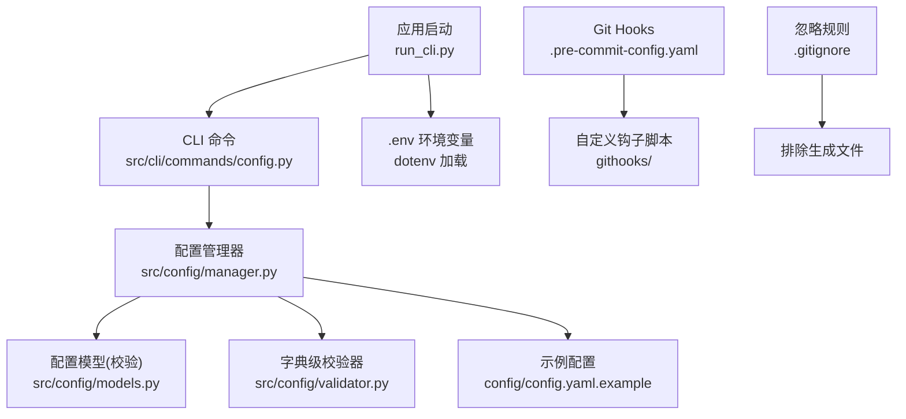
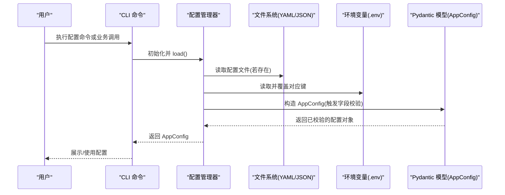
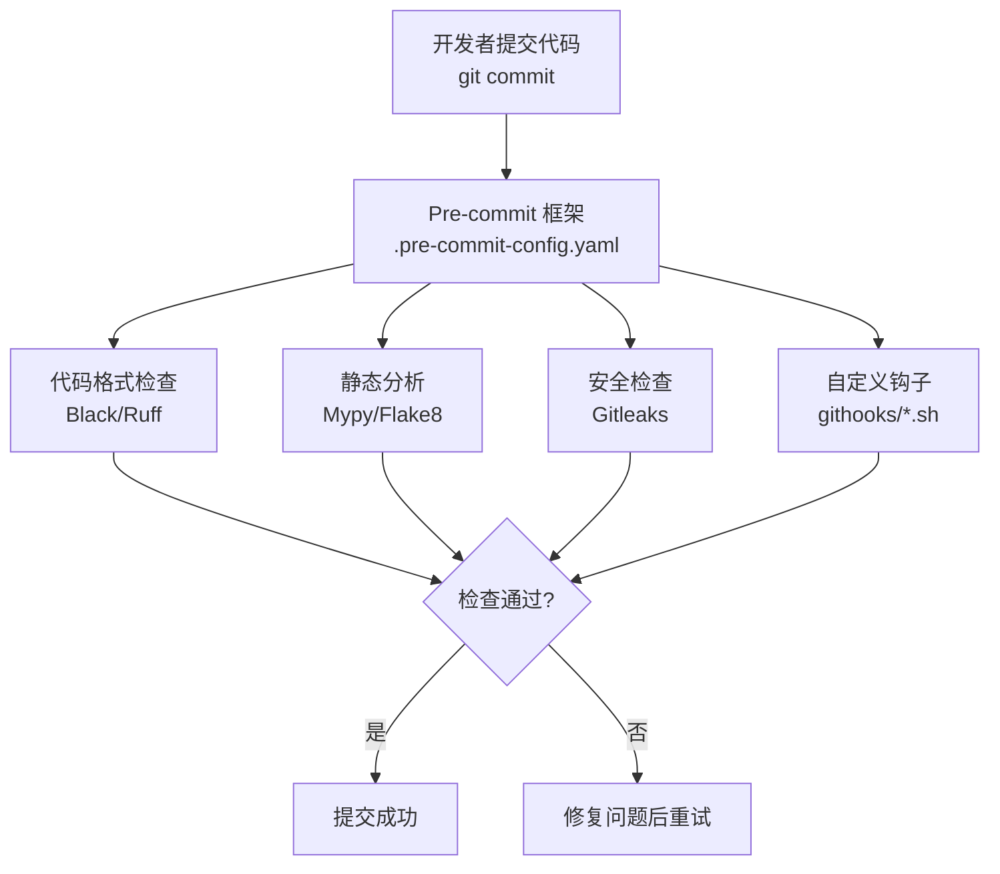
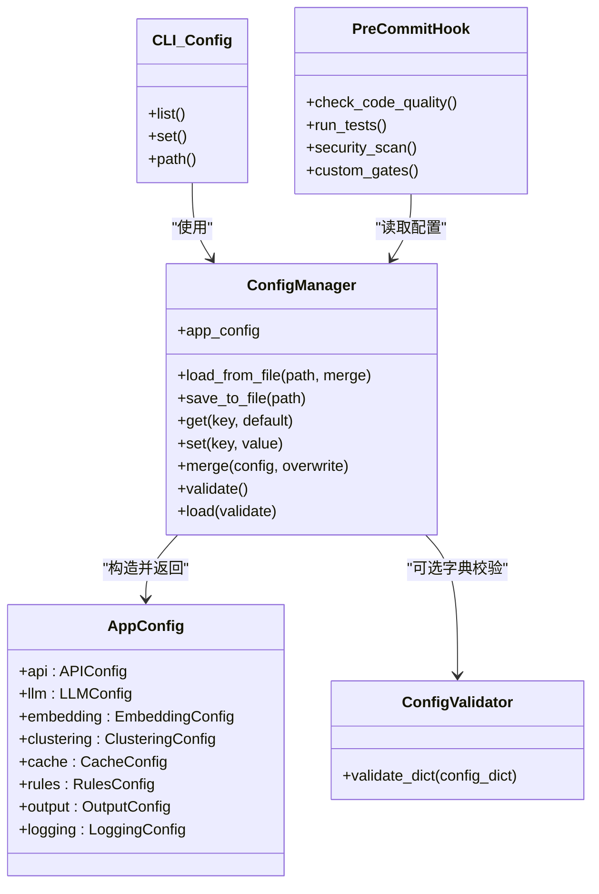

# 配置管理

<cite>
**本文引用的文件**
- [config.yaml.example](file://config/config.yaml.example)
- [manager.py](file://src/config/manager.py)
- [models.py](file://src/config/models.py)
- [validator.py](file://src/config/validator.py)
- [__init__.py](file://src/config/__init__.py)
- [config.py](file://src/cli/commands/config.py)
- [run_cli.py](file://run_cli.py)
- [README.md](file://README.md)
- [test_manager.py](file://tests/config/test_manager.py)
- [test_validator.py](file://tests/config/test_validator.py)
- [.pre-commit-config.yaml](file://.pre-commit-config.yaml)
- [.gitignore](file://.gitignore)
- [AGENTS.md](file://AGENTS.md)
</cite>

## 更新摘要
**变更内容**
- 更新了嵌入提供程序配置，现在仅支持'sentence-transformers'作为唯一的嵌入提供程序
- 移除了旧的HTTP-based嵌入提供程序选项（openai/bge/m3e/codebert/zhipu/local/volcengine/custom）
- 增强了测试环境的环境变量隔离机制
- 简化了Embedding配置模型，专注于sentence-transformers本地实现

## 目录
1. [简介](#简介)
2. [项目结构](#项目结构)
3. [核心组件](#核心组件)
4. [架构总览](#架构总览)
5. [详细组件分析](#详细组件分析)
6. [Git Hooks 与代码质量保证](#git-hooks-与代码质量保证)
7. [依赖关系分析](#依赖关系分析)
8. [性能与扩展性考虑](#性能与扩展性考虑)
9. [故障排查指南](#故障排查指南)
10. [结论](#结论)
11. [附录](#附录)

## 简介
本指南面向配置管理系统的使用者与集成者，系统说明配置文件结构与环境变量设置（YAML 与 .env），逐项解释所有配置项含义与默认值（API、LLM、Embedding、聚类、缓存、规则、输出、日志等），文档化配置验证规则与错误提示，说明配置热重载机制与动态更新方法，给出开发/测试/生产环境的最佳实践，解释配置继承与覆盖机制，并提供模板与示例、安全与权限控制建议。同时涵盖 Git Hooks 集成和代码质量保证流程。

**重要更新**：当前版本已简化嵌入提供程序配置，仅支持'sentence-transformers'作为唯一的嵌入解决方案，移除了所有外部HTTP API嵌入服务的支持。

## 项目结构
配置相关代码集中在 src/config 模块，CLI 提供查看与设置配置的命令；入口脚本在运行前加载 .env 环境变量；示例 YAML 位于 config/config.yaml.example。项目还集成了标准的 pre-commit 框架用于代码质量保证。

**图示来源**
- [run_cli.py:1-14](file://run_cli.py#L1-L14)
- [config.py:1-69](file://src/cli/commands/config.py#L1-L69)
- [manager.py:1-268](file://src/config/manager.py#L1-L268)
- [models.py:1-144](file://src/config/models.py#L1-L144)
- [validator.py:1-196](file://src/config/validator.py#L1-L196)
- [config.yaml.example:1-38](file://config/config.yaml.example#L1-L38)
- [.pre-commit-config.yaml:1-50](file://.pre-commit-config.yaml#L1-L50)
- [.gitignore:1-100](file://.gitignore#L1-L100)

**章节来源**
- [README.md:47-60](file://README.md#L47-L60)
- [config.yaml.example:1-38](file://config/config.yaml.example#L1-L38)
- [manager.py:1-268](file://src/config/manager.py#L1-L268)
- [models.py:1-144](file://src/config/models.py#L1-L144)
- [validator.py:1-196](file://src/config/validator.py#L1-L196)
- [config.py:1-69](file://src/cli/commands/config.py#L1-L69)
- [run_cli.py:1-14](file://run_cli.py#L1-L14)
- [.pre-commit-config.yaml:1-50](file://.pre-commit-config.yaml#L1-L50)
- [.gitignore:1-100](file://.gitignore#L1-L100)

## 核心组件
- 配置管理器：负责加载 YAML/JSON 配置、合并、读写、环境变量覆盖、类型解析、AppConfig 构建与校验。
- 配置模型：基于 Pydantic 的强类型定义与字段校验，提供默认值与约束。
- 字典级校验器：对原始字典进行更细粒度的业务校验并返回错误列表。
- CLI 配置命令：提供 list/set/path 三个子命令用于查看、设置与显示配置文件路径。
- 示例配置：提供一份可复制的 YAML 模板。
- Git Hooks 集成：通过 pre-commit 框架集成代码质量检查工具。

**章节来源**
- [manager.py:42-268](file://src/config/manager.py#L42-L268)
- [models.py:4-144](file://src/config/models.py#L4-L144)
- [validator.py:16-196](file://src/config/validator.py#L16-L196)
- [config.py:15-69](file://src/cli/commands/config.py#L15-L69)
- [config.yaml.example:1-38](file://config/config.yaml.example#L1-L38)
- [.pre-commit-config.yaml:1-50](file://.pre-commit-config.yaml#L1-L50)

## 架构总览
配置加载与生效流程如下：

**图示来源**
- [manager.py:245-268](file://src/config/manager.py#L245-L268)
- [manager.py:191-243](file://src/config/manager.py#L191-243)
- [models.py:135-144](file://src/config/models.py#L135-L144)
- [run_cli.py:1-14](file://run_cli.py#L1-L14)

## 详细组件分析

### 配置模型与默认值
- API 配置
  - base_url: 字符串，必填格式为 http(s) 开头
  - timeout: 整数，大于 0
  - retry: 整数，0~10
  - api_key: 字符串
  - api_path_prefix: 字符串，以 / 开头
- LLM 配置
  - provider: 枚举(openai/qwen/wenxin/zhipu/custom/volcengine)
  - model: 字符串，必填
  - api_key: 字符串，必填
  - temperature: 浮点，0.0~1.0
  - max_tokens: 整数，>0
  - base_url: 可选，http(s) 格式
- **更新后的 Embedding 配置**
  - provider: 固定为 'sentence-transformers'（唯一支持的提供程序）
  - model: 字符串，必填，指定使用的sentence-transformers模型名称
  - batch_size: 整数，>0，批处理大小
  - 移除了api_key和base_url字段，因为sentence-transformers是本地实现
- 聚类配置
  - algorithm: 枚举(hdbscan/kmeans/dbscan)
  - min_cluster_size: 整数，>=2
  - min_samples: 整数，>=1
  - metric: 枚举(cosine/euclidean/manhattan)
- 缓存配置
  - enabled: 布尔
  - ttl: 整数，>=0
  - storage: 枚举(sqlite/file/memory)
  - db_path: sqlite/file 时必填
- 规则配置
  - builtin_enabled: 布尔
  - custom_paths: 字符串列表
- 输出配置
  - format: 枚举(markdown/html/json)
  - directory: 字符串
- 日志配置
  - level: 枚举(DEBUG/INFO/WARNING/ERROR/CRITICAL)
  - format: 字符串
  - file: 可选路径

**章节来源**
- [models.py:4-144](file://src/config/models.py#L4-L144)

### 环境变量映射与覆盖
支持通过环境变量覆盖配置项，变量名到配置路径的映射包括（节选）：
- API_BASE_URL -> api.base_url
- API_TIMEOUT -> api.timeout
- API_RETRY -> api.retry
- DEVCLOUD_TOKEN -> api.api_key
- LLM_PROVIDER/MODEL/API_KEY/TEMPERATURE/MAX_TOKENS/BASE_URL -> llm.*
- **更新后的 Embedding 环境变量**
  - EMBEDDING_MODEL -> embedding.model
  - EMBEDDING_BATCH_SIZE -> embedding.batch_size
  - 移除了EMBEDDING_API_KEY和EMBEDDING_BASE_URL环境变量
- CLUSTERING_* -> clustering.*
- CACHE_ENABLED/TTL/STORAGE/DB_PATH -> cache.*
- RULES_BUILTIN_ENABLED -> rules.builtin_enabled
- OUTPUT_FORMAT/DIRECTORY -> output.*
- LOG_LEVEL/FILE -> logging.*

类型自动解析：true/false 转为布尔，其次尝试 int/float，否则保持字符串。

**章节来源**
- [manager.py:191-243](file://src/config/manager.py#L191-243)

### 配置加载、合并与保存
- 加载：支持 YAML 与 JSON；当未传入初始配置且存在默认路径时会尝试从文件加载。
- 合并：merge(config, overwrite=False) 支持深度合并；overwrite=True 允许覆盖已有键。
- 保存：save_to_file(path) 自动创建父目录；save() 保存到当前配置路径。
- 重置：reset() 回退到 defaults 或空配置。

**章节来源**
- [manager.py:82-117](file://src/config/manager.py#L82-L117)
- [manager.py:146-160](file://src/config/manager.py#L146-L160)
- [manager.py:175-182](file://src/config/manager.py#L175-L182)

### 配置验证与错误提示
- 模型层校验：Pydantic 字段校验失败会抛出异常，由管理器包装为 ConfigValidationError。
- 字典层校验：ConfigValidator.validate_dict 返回 (is_valid, errors)，涵盖各段关键约束与缺失检查。
- 常见错误提示：
  - API base URL 必须为 http(s) 开头
  - API key 必填
  - API path prefix 必须以 / 开头
  - LLM provider 必须在允许集合中
  - LLM temperature 范围 0.0~1.0
  - **更新后的 Embedding 验证规则**：provider 必须为 'sentence-transformers'，model 必填，batch_size > 0
  - Cache storage 取值限制及 db_path 条件必填

**章节来源**
- [manager.py:161-173](file://src/config/manager.py#L161-173)
- [validator.py:19-196](file://src/config/validator.py#L19-L196)
- [test_validator.py:50-376](file://tests/config/test_validator.py#L50-L376)

### CLI 配置命令
- list：列出当前主要配置项（如 API、LLM、Embedding、Clustering、Cache、Output）。
- set：按 dot-separated 键设置值并持久化到文件。
- path：显示当前使用的配置文件路径。

**章节来源**
- [config.py:15-69](file://src/cli/commands/config.py#L15-L69)

### 环境变量加载与 .env 语法
- 入口脚本 run_cli.py 在启动时通过 dotenv 加载 .env 并覆盖环境变量。
- .env 语法为 KEY=VALUE，支持布尔、数字、字符串等；具体类型由配置管理器解析。

**章节来源**
- [run_cli.py:1-14](file://run_cli.py#L1-L14)
- [manager.py:231-243](file://src/config/manager.py#L231-L243)

### 配置模板与示例
- 示例 YAML：config/config.yaml.example 包含 api、llm、embedding、clustering、cache、rules、output、logging 等基础结构。
- README 提供了快速开始与环境变量说明。

**章节来源**
- [config.yaml.example:1-38](file://config/config.yaml.example#L1-L38)
- [README.md:47-60](file://README.md#L47-L60)

## Git Hooks 与代码质量保证

### Pre-commit 框架集成
项目集成了标准的 pre-commit 框架，通过 .pre-commit-config.yaml 配置文件统一管理代码质量检查工具。该配置将自定义 Git hooks 集成到标准 pre-commit 框架中，确保代码提交前的质量检查。

**图示来源**
- [.pre-commit-config.yaml:1-50](file://.pre-commit-config.yaml#L1-L50)
- [githooks/gate-3.sh:1-50](file://githooks/gate-3.sh#L1-L50)
- [githooks/gate-4.sh:1-50](file://githooks/gate-4.sh#L1-L50)

### 自定义 Git Hooks
项目在 githooks 目录下维护了一系列自定义钩子脚本，包括：
- gate-3.sh：代码风格和质量检查
- gate-4.sh：单元测试执行
- gate-7.sh：集成测试验证
- gate-8.sh：安全扫描
- gate-9.sh：部署预检查

每个钩子都针对特定的语言和技术栈提供了适配器支持。

### Git 忽略规则
.gitignore 文件正确配置了需要排除生成的文件，包括：
- Python 缓存文件：__pycache__/, *.pyc, *.pyo
- IDE 配置文件：.idea/, .vscode/, *.swp
- 虚拟环境：venv/, env/, .venv/
- 构建产物：dist/, build/, *.egg-info/
- 日志文件：*.log, logs/
- 临时文件：tmp/, temp/
- 配置文件：.env.local, config/config.yaml

**章节来源**
- [.pre-commit-config.yaml:1-50](file://.pre-commit-config.yaml#L1-L50)
- [.gitignore:1-100](file://.gitignore#L1-L100)
- [githooks/gate-3.sh:1-50](file://githooks/gate-3.sh#L1-L50)
- [githooks/gate-4.sh:1-50](file://githooks/gate-4.sh#L1-L50)
- [githooks/gate-7.sh:1-50](file://githooks/gate-7.sh#L1-L50)
- [githooks/gate-8.sh:1-50](file://githooks/gate-8.sh#L1-L50)
- [githooks/gate-9.sh:1-50](file://githooks/gate-9.sh#L1-L50)

## 依赖关系分析

**图示来源**
- [manager.py:42-268](file://src/config/manager.py#L42-L268)
- [models.py:135-144](file://src/config/models.py#L135-L144)
- [validator.py:16-52](file://src/config/validator.py#L16-L52)
- [config.py:15-69](file://src/cli/commands/config.py#L15-L69)
- [.pre-commit-config.yaml:1-50](file://.pre-commit-config.yaml#L1-L50)

**章节来源**
- [manager.py:42-268](file://src/config/manager.py#L42-L268)
- [models.py:135-144](file://src/config/models.py#L135-L144)
- [validator.py:16-52](file://src/config/validator.py#L16-L52)
- [config.py:15-69](file://src/cli/commands/config.py#L15-L69)
- [.pre-commit-config.yaml:1-50](file://.pre-commit-config.yaml#L1-L50)

## 性能与扩展性考虑
- 配置加载与校验仅在进程启动或显式调用时发生，运行时开销极低。
- 环境变量覆盖在内存中进行，避免重复 I/O。
- Git Hooks 在提交时执行，不影响运行时性能。
- **更新后的扩展性考虑**：由于嵌入提供程序已简化为单一的sentence-transformers实现，系统更加专注和高效。
- 可扩展点：
  - 新增配置项：在 models.py 中添加 Pydantic 模型字段与默认值，并在 manager.py 的环境变量映射中补充映射。
  - 新增校验规则：在 validator.py 中增加对应段的校验逻辑。
  - 新增 CLI 命令：在 CLI 模块中扩展子命令。
  - 新增 Git Hook：在 githooks 目录下添加新脚本并在 .pre-commit-config.yaml 中注册。

## 故障排查指南
- 常见问题
  - 配置文件不存在：加载时抛出"配置文件未找到"异常。
  - 配置键不存在：访问嵌套键时抛出"配置键未找到"异常。
  - 校验失败：构造 AppConfig 时抛出"配置校验失败"，包含具体错误信息。
  - **更新后的嵌入配置错误**：如果provider不是'sentence-transformers'或model为空，将抛出验证错误。
  - Git Hooks 失败：检查 .pre-commit-config.yaml 配置和自定义钩子脚本权限。
- 定位步骤
  - 使用 CLI list 查看当前生效配置。
  - 检查 .env 是否被正确加载（入口脚本已启用 override）。
  - 使用 validate() 获取结构化错误列表。
  - 参考单元测试用例复现问题场景。
  - 手动执行 pre-commit 检查：`pre-commit run --all-files`

**章节来源**
- [manager.py:12-40](file://src/config/manager.py#L12-L40)
- [manager.py:161-173](file://src/config/manager.py#L161-L173)
- [test_manager.py:110-116](file://tests/config/test_manager.py#L110-L116)
- [test_manager.py:357-363](file://tests/config/test_manager.py#L357-L363)
- [.pre-commit-config.yaml:1-50](file://.pre-commit-config.yaml#L1-L50)

## 结论
该配置管理系统以 Pydantic 模型为核心，结合 YAML/JSON 文件与环境变量覆盖，提供强类型、可校验、易扩展的配置能力。通过 CLI 命令与完善的错误提示，便于开发与运维在不同环境中高效管理与维护配置。新增的 Git Hooks 集成进一步提升了代码质量和开发体验。**最新版本特别简化了嵌入提供程序配置，专注于sentence-transformers本地实现，提高了系统的稳定性和可维护性。**

## 附录

### 环境变量清单与映射
- API 相关
  - API_BASE_URL -> api.base_url
  - API_TIMEOUT -> api.timeout
  - API_RETRY -> api.retry
  - DEVCLOUD_TOKEN -> api.api_key
- LLM 相关
  - LLM_PROVIDER -> llm.provider
  - LLM_MODEL -> llm.model
  - LLM_API_KEY -> llm.api_key
  - LLM_TEMPERATURE -> llm.temperature
  - LLM_MAX_TOKENS -> llm.max_tokens
  - LLM_BASE_URL -> llm.base_url
- **更新后的 Embedding 相关**
  - EMBEDDING_MODEL -> embedding.model
  - EMBEDDING_BATCH_SIZE -> embedding.batch_size
  - 注意：provider固定为'sentence-transformers'，无需配置
- 聚类相关
  - CLUSTERING_ALGORITHM -> clustering.algorithm
  - CLUSTERING_MIN_CLUSTER_SIZE -> clustering.min_cluster_size
  - CLUSTERING_MIN_SAMPLES -> clustering.min_samples
  - CLUSTERING_METRIC -> clustering.metric
- 缓存相关
  - CACHE_ENABLED -> cache.enabled
  - CACHE_TTL -> cache.ttl
  - CACHE_STORAGE -> cache.storage
  - CACHE_DB_PATH -> cache.db_path
- 规则相关
  - RULES_BUILTIN_ENABLED -> rules.builtin_enabled
- 输出相关
  - OUTPUT_FORMAT -> output.format
  - OUTPUT_DIRECTORY -> output.directory
- 日志相关
  - LOG_LEVEL -> logging.level
  - LOG_FILE -> logging.file

**章节来源**
- [manager.py:191-222](file://src/config/manager.py#L191-L222)

### 配置继承与覆盖机制
- 优先级顺序（从高到低）
  - 环境变量（经 dotenv 加载后）
  - 运行时传入的初始配置 dict
  - 配置文件（YAML/JSON）
  - 内置默认值（Pydantic 模型默认）
- 覆盖方式
  - 通过环境变量直接覆盖目标键
  - 通过 merge(config, overwrite=True) 覆盖现有键
  - 通过 set("a.b.c", value) 写入并持久化

**章节来源**
- [manager.py:146-160](file://src/config/manager.py#L146-L160)
- [manager.py:191-243](file://src/config/manager.py#L191-L243)
- [manager.py:133-144](file://src/config/manager.py#L133-L144)

### 不同环境下的最佳实践
- 开发环境
  - 使用本地 .env 存放敏感信息，确保不被提交至版本库
  - 开启 DEBUG 日志级别以便调试
  - 使用 memory 或 sqlite 缓存，缩短冷启动时间
  - 启用完整的 Git Hooks 检查以确保代码质量
  - 使用 pre-commit 框架进行统一的代码质量检查
  - **嵌入配置**：直接使用默认的sentence-transformers模型，无需额外配置
- 测试环境
  - 通过环境变量注入测试数据与短 TTL
  - 使用最小化数据集与轻量模型
  - 跳过耗时的 Git Hooks 以提高测试效率
  - **增强的环境变量隔离**：测试环境使用独立的.env.test文件，避免污染主配置
- 生产环境
  - 使用环境变量集中注入密钥与连接地址
  - 选择稳定可靠的存储后端与合理的 TTL
  - 关闭冗余日志，仅保留必要级别
  - 禁用开发阶段的 Git Hooks 以提升部署效率
  - **嵌入配置优化**：根据硬件资源调整batch_size参数以获得最佳性能

### 配置安全管理与权限控制
- 敏感信息
  - 优先通过环境变量注入（如 LLM_API_KEY、DEVCLOUD_TOKEN），避免明文写入配置文件
  - .env 文件应加入 .gitignore，防止泄露
  - 使用 .secrets.baseline 文件管理已知安全的密钥基线
  - **更新后的安全性**：由于移除了外部API密钥需求，安全性得到进一步提升
- 权限控制
  - 配置文件与 .env 文件应限制读写权限，仅允许运行账户访问
  - 在生产容器或编排平台中通过 Secret 管理注入环境变量
  - Git Hooks 脚本应具有适当的执行权限
- 审计与轮换
  - 定期轮换密钥，记录变更审计日志
  - 对配置变更引入审批流程与灰度发布
  - 使用 Gitleaks 等工具扫描代码中的敏感信息

### 配置热重载与动态更新
- 当前实现
  - 配置在进程启动时加载并构建 AppConfig，随后通过 get/set 修改内存中的配置
  - save() 可将内存配置持久化到文件
- 热重载建议
  - 可在外部进程监听配置文件变化，向主进程发送信号后重新加载配置
  - 或在服务内部提供 API/CLI 触发 reload 流程，重建 AppConfig 并刷新依赖

### Git Hooks 配置与管理
- 安装与初始化
  - 安装 pre-commit：`pip install pre-commit`
  - 初始化 Git Hooks：`pre-commit install`
  - 手动运行所有检查：`pre-commit run --all-files`
- 自定义钩子开发
  - 在 githooks 目录下创建新的钩子脚本
  - 在 .pre-commit-config.yaml 中注册新钩子
  - 为不同语言和技术栈提供适配器支持
- 跳过检查
  - 临时跳过检查：`git commit --no-verify`
  - 注意：仅在紧急情况下使用，不应成为常规操作

**章节来源**
- [.pre-commit-config.yaml:1-50](file://.pre-commit-config.yaml#L1-L50)
- [.gitignore:1-100](file://.gitignore#L1-L100)
- [AGENTS.md:1-100](file://AGENTS.md#L1-L100)
