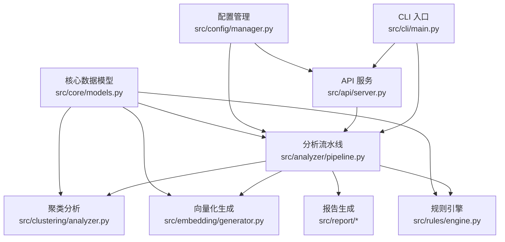
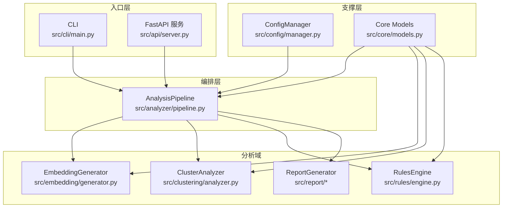
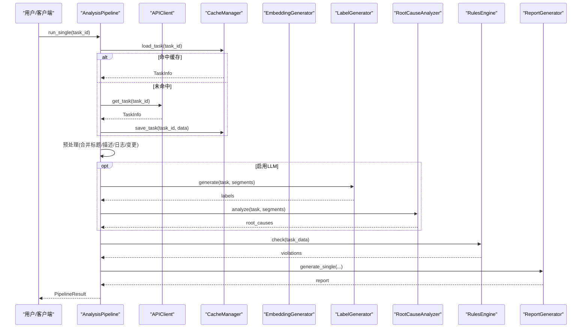
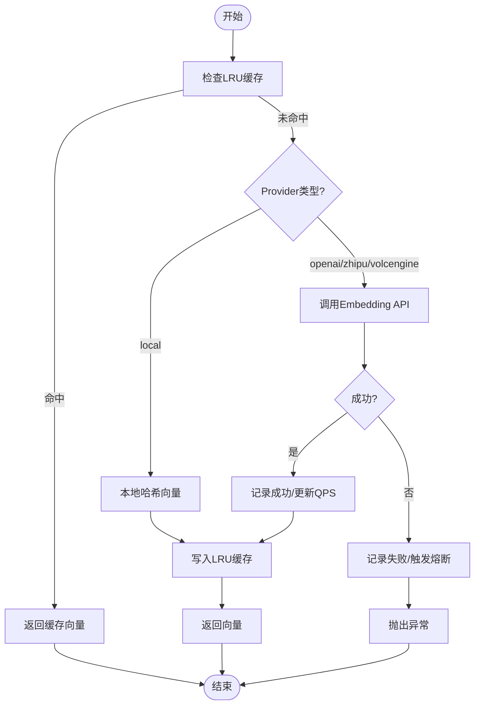
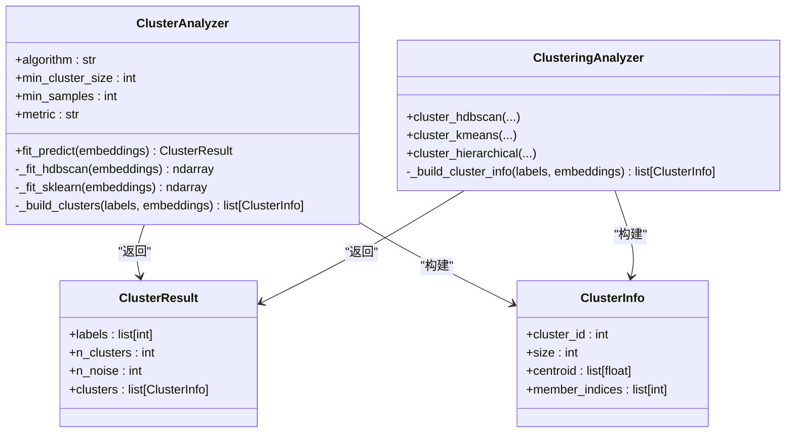
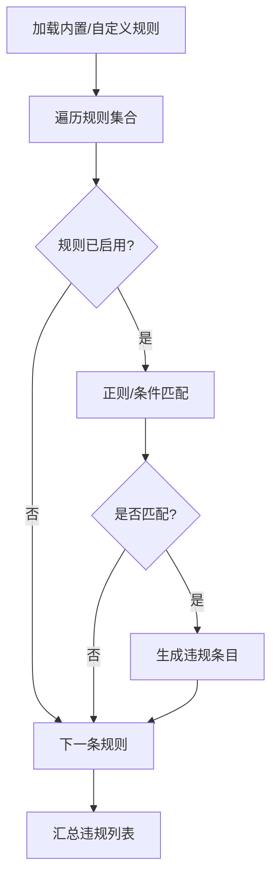
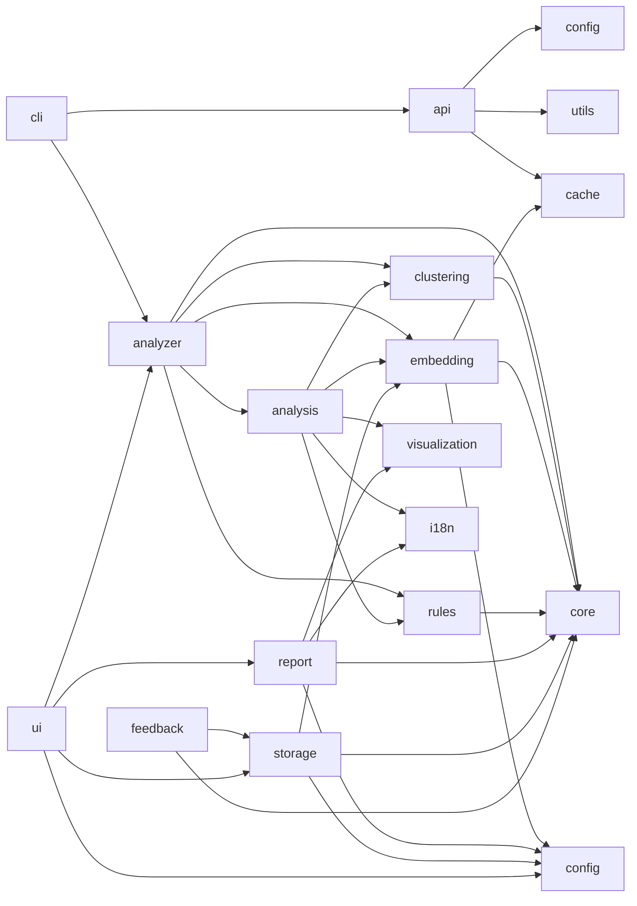

# 项目概述

<cite>
**本文引用的文件**   
- [README.md](file://README.md)
- [pyproject.toml](file://pyproject.toml)
- [architecture.yaml](file://architecture.yaml)
- [AI 驱动的缺陷根因自动聚类与习得方案.md](file://AI%20驱动的缺陷根因自动聚类与习得方案.md)
- [src/core/models.py](file://src/core/models.py)
- [src/analyzer/pipeline.py](file://src/analyzer/pipeline.py)
- [src/clustering/analyzer.py](file://src/clustering/analyzer.py)
- [src/analysis/clustering.py](file://src/analysis/clustering.py)
- [src/embedding/generator.py](file://src/embedding/generator.py)
- [src/rules/engine.py](file://src/rules/engine.py)
- [src/api/server.py](file://src/api/server.py)
- [src/cli/main.py](file://src/cli/main.py)
- [src/config/manager.py](file://src/config/manager.py)
- [config/config.yaml.example](file://config/config.yaml.example)
</cite>

## 目录
1. [引言](#引言)
2. [项目结构](#项目结构)
3. [核心组件](#核心组件)
4. [架构总览](#架构总览)
5. [详细组件分析](#详细组件分析)
6. [依赖关系分析](#依赖关系分析)
7. [性能考量](#性能考量)
8. [故障排查指南](#故障排查指南)
9. [结论](#结论)
10. [附录](#附录)

## 引言
本项目为“AI驱动的故障复盘分析工具”，聚焦于在软件工程领域对历史缺陷进行无预设标签的自动学习、智能聚类与规范冲突识别，从而沉淀可复用的知识并驱动系统性改进。其设计理念强调：
- 不依赖人工预设原因分类，从数据中自动习得主题与模式
- 使用HDBSCAN等密度聚类算法发现自然簇，避免K值主观性
- 借助LLM进行零样本技术标签抽取与深度根因推理，形成动态知识库
- 将聚类结果与企业研发规范进行对抗式比对，自动识别违反规范的“慢性浪费”问题

该工具适用于跨团队、跨项目的缺陷治理与质量提升，帮助组织从“偶发复盘”走向“结构性根治”。

**章节来源**
- [README.md:1-101](file://README.md#L1-L101)
- [AI 驱动的缺陷根因自动聚类与习得方案.md:1-50](file://AI%20驱动的缺陷根因自动聚类与习得方案.md#L1-L50)

## 项目结构
仓库采用分层模块化设计，入口层（CLI/API）调用编排层（Pipeline），再调度分析子域（Embedding、Clustering、Rules、Report等）。配置集中管理，模型与中间结果通过核心数据模型统一描述。

**图表来源**
- [src/cli/main.py:1-40](file://src/cli/main.py#L1-L40)
- [src/api/server.py:1-152](file://src/api/server.py#L1-L152)
- [src/analyzer/pipeline.py:1-468](file://src/analyzer/pipeline.py#L1-L468)
- [src/embedding/generator.py:1-427](file://src/embedding/generator.py#L1-L427)
- [src/clustering/analyzer.py:1-121](file://src/clustering/analyzer.py#L1-L121)
- [src/rules/engine.py:1-376](file://src/rules/engine.py#L1-L376)
- [src/config/manager.py:1-268](file://src/config/manager.py#L1-L268)
- [src/core/models.py:1-426](file://src/core/models.py#L1-L426)

**章节来源**
- [README.md:77-96](file://README.md#L77-L96)
- [architecture.yaml:1-106](file://architecture.yaml#L1-L106)

## 核心组件
- 分析流水线（AnalysisPipeline）
  - 负责端到端编排：拉取任务、预处理、可选LLM标注与根因分析、规则检查、报告生成；并提供批量与聚类运行能力。
- 向量化生成器（EmbeddingGenerator）
  - 支持多提供商（OpenAI、智谱、火山等）、本地哈希向量、LRU缓存、自适应速率限制与熔断保护，提供单条与批量接口。
- 聚类分析器（ClusterAnalyzer / ClusteringAnalyzer）
  - 默认HDBSCAN，支持余弦距离归一化等价欧氏加速；回退到层次聚类；输出簇信息、噪声点统计与成员索引。
- 规则引擎（RulesEngine）
  - 内置安全、代码、性能等多类规则，支持YAML/JSON自定义规则加载与正则匹配检测。
- 配置管理（ConfigManager）
  - 支持YAML/JSON加载、环境变量覆盖、类型校验与AppConfig实例化。
- 核心数据模型（core.models）
  - 统一定义任务、嵌入、标签、根因、违规、聚类结果等Pydantic模型，贯穿各模块。

**章节来源**
- [src/analyzer/pipeline.py:66-183](file://src/analyzer/pipeline.py#L66-L183)
- [src/embedding/generator.py:91-217](file://src/embedding/generator.py#L91-L217)
- [src/clustering/analyzer.py:8-121](file://src/clustering/analyzer.py#L8-L121)
- [src/analysis/clustering.py:22-94](file://src/analysis/clustering.py#L22-L94)
- [src/rules/engine.py:217-352](file://src/rules/engine.py#L217-L352)
- [src/config/manager.py:42-173](file://src/config/manager.py#L42-L173)
- [src/core/models.py:31-226](file://src/core/models.py#L31-L226)

## 架构总览
系统由“入口层—编排层—分析域—存储与可视化”构成。入口层提供CLI与REST API；编排层串联预处理、向量化、聚类、规则与报告；分析域包含LLM集成、标签生成、根因分析与解释性模块；配置与核心模型作为横切支撑。

**图表来源**
- [src/cli/main.py:1-40](file://src/cli/main.py#L1-L40)
- [src/api/server.py:1-152](file://src/api/server.py#L1-L152)
- [src/analyzer/pipeline.py:1-468](file://src/analyzer/pipeline.py#L1-L468)
- [src/embedding/generator.py:1-427](file://src/embedding/generator.py#L1-L427)
- [src/clustering/analyzer.py:1-121](file://src/clustering/analyzer.py#L1-L121)
- [src/rules/engine.py:1-376](file://src/rules/engine.py#L1-L376)
- [src/config/manager.py:1-268](file://src/config/manager.py#L1-L268)
- [src/core/models.py:1-426](file://src/core/models.py#L1-L426)

## 详细组件分析

### 分析流水线（AnalysisPipeline）
- 职责：协调数据获取、预处理、LLM标注/根因分析、规则检查、报告生成；支持单任务与批量并发执行；提供run_clustering用于端到端聚类流程。
- 关键路径：
  - run_single：拉取任务→预处理→LLM分析→规则检查→报告生成
  - run_batch：并发执行多个单任务
  - run_clustering：拉取任务→批量预处理→批量embedding→HDBSCAN聚类→返回任务-簇映射与统计
- 错误处理：异常捕获后写入result.error，保证批处理稳定性。

**图表来源**
- [src/analyzer/pipeline.py:105-183](file://src/analyzer/pipeline.py#L105-L183)
- [src/analyzer/pipeline.py:228-244](file://src/analyzer/pipeline.py#L228-L244)
- [src/analyzer/pipeline.py:293-321](file://src/analyzer/pipeline.py#L293-L321)
- [src/analyzer/pipeline.py:322-349](file://src/analyzer/pipeline.py#L322-L349)
- [src/analyzer/pipeline.py:428-441](file://src/analyzer/pipeline.py#L428-L441)
- [src/analyzer/pipeline.py:443-468](file://src/analyzer/pipeline.py#L443-L468)

**章节来源**
- [src/analyzer/pipeline.py:66-183](file://src/analyzer/pipeline.py#L66-L183)
- [src/analyzer/pipeline.py:184-227](file://src/analyzer/pipeline.py#L184-L227)

### 向量化生成器（EmbeddingGenerator）
- 特性：
  - 多提供商适配（OpenAI、智谱、火山等）与本地哈希向量
  - LRU文本→向量缓存，TTL过期清理
  - 自适应QPS限流与熔断器，失败退避与恢复
  - 并发控制（信号量）与分批处理
- 复杂度：
  - 单次embedding O(d)，批量O(n·d)；缓存命中O(1)
  - 内存占用与max_size和维度相关

**图表来源**
- [src/embedding/generator.py:162-217](file://src/embedding/generator.py#L162-L217)
- [src/embedding/generator.py:245-311](file://src/embedding/generator.py#L245-L311)
- [src/embedding/generator.py:323-357](file://src/embedding/generator.py#L323-L357)

**章节来源**
- [src/embedding/generator.py:91-217](file://src/embedding/generator.py#L91-L217)
- [src/embedding/generator.py:245-311](file://src/embedding/generator.py#L245-L311)

### 聚类分析器（ClusterAnalyzer / ClusteringAnalyzer）
- 算法选择：
  - HDBSCAN为主，支持cosine距离归一化后以欧氏距离高效计算
  - 当hdbscan不可用时回退至AgglomerativeClustering（ward连接要求欧氏）
- 输出：labels、n_clusters、n_noise、clusters（含centroid与member_indices）
- 复杂度：HDBSCAN近似O(n log n)~O(n^2)取决于实现与数据规模；余弦归一化O(n·d)

**图表来源**
- [src/clustering/analyzer.py:8-121](file://src/clustering/analyzer.py#L8-L121)
- [src/analysis/clustering.py:22-260](file://src/analysis/clustering.py#L22-L260)
- [src/core/models.py:210-226](file://src/core/models.py#L210-L226)
- [src/core/models.py:91-117](file://src/core/models.py#L91-L117)

**章节来源**
- [src/clustering/analyzer.py:22-96](file://src/clustering/analyzer.py#L22-L96)
- [src/analysis/clustering.py:25-94](file://src/analysis/clustering.py#L25-L94)

### 规则引擎（RulesEngine）
- 功能：内置安全、代码、性能等规则集，支持YAML/JSON自定义规则加载；基于正则匹配与条件评估检测违规。
- 扩展性：可通过custom_paths加载企业级规范，结合LLM生成的标签进行“对抗式审核”。

**图表来源**
- [src/rules/engine.py:217-352](file://src/rules/engine.py#L217-L352)

**章节来源**
- [src/rules/engine.py:217-352](file://src/rules/engine.py#L217-L352)

### 配置管理（ConfigManager）
- 能力：YAML/JSON读取、环境变量覆盖、深合并、AppConfig强类型校验。
- 典型覆盖项：API、LLM、Embedding、Clustering、Cache、Rules、Output、Logging等。

**章节来源**
- [src/config/manager.py:82-173](file://src/config/manager.py#L82-L173)
- [src/config/manager.py:191-243](file://src/config/manager.py#L191-L243)
- [config/config.yaml.example:1-38](file://config/config.yaml.example#L1-L38)

### 核心数据模型（core.models）
- 涵盖：TaskData、AnalysisResult、ClusterInfo、EmbeddingData、LabelInfo、RootCauseInfo、ClusterResult、StandardRule、CodeChange、ViolationDetection、RootCauseValidation、LLMAnalysisResult等。
- 作用：统一数据结构契约，确保各模块间数据一致性与可验证性。

**章节来源**
- [src/core/models.py:31-226](file://src/core/models.py#L31-L226)
- [src/core/models.py:248-294](file://src/core/models.py#L248-L294)
- [src/core/models.py:302-380](file://src/core/models.py#L302-L380)

## 依赖关系分析
- 外部依赖（部分）：typer、pydantic、httpx、openai、langchain、sentence-transformers、hdbscan、umap-learn、pandas、numpy、jinja2、loguru、rich、fastapi、uvicorn等。
- 内部依赖约束由architecture.yaml定义，明确各层允许依赖范围，防止循环耦合。

**图表来源**
- [architecture.yaml:1-106](file://architecture.yaml#L1-L106)

**章节来源**
- [pyproject.toml:22-44](file://pyproject.toml#L22-L44)
- [architecture.yaml:1-106](file://architecture.yaml#L1-L106)

## 性能考量
- 向量化阶段
  - 使用LRU缓存减少重复计算；自适应QPS限流与熔断降低外部服务抖动影响；并发控制与分批处理提升吞吐。
- 聚类阶段
  - HDBSCAN在大规模数据上具备较好鲁棒性；余弦距离通过归一化转欧氏以提升效率；小样本时直接标记为噪声避免误聚。
- 规则检查
  - 正则匹配开销与规则数量线性相关，建议按需启用与增量加载。
- 报告生成
  - 模板渲染轻量，注意批量场景下的I/O与磁盘空间。

[本节为通用指导，无需具体文件引用]

## 故障排查指南
- 启动与配置
  - 确认配置文件存在且格式正确；环境变量覆盖生效；AppConfig校验通过。
- LLM/Embedding
  - 检查API Key、Base URL、Model名称；观察熔断器状态与QPS变化；必要时切换provider或开启本地模式。
- 聚类结果异常
  - 调整min_cluster_size/min_samples；检查输入向量维度与归一化；关注噪声点比例。
- 规则误报/漏报
  - 审查正则表达式与条件逻辑；补充自定义规则；按类别过滤查看。

**章节来源**
- [src/config/manager.py:161-173](file://src/config/manager.py#L161-L173)
- [src/embedding/generator.py:178-217](file://src/embedding/generator.py#L178-L217)
- [src/clustering/analyzer.py:22-46](file://src/clustering/analyzer.py#L22-L46)
- [src/rules/engine.py:324-352](file://src/rules/engine.py#L324-L352)

## 结论
本方案以“无预设标签+自动聚类+LLM自习得+规范冲突识别”为核心，构建了从数据到洞察再到行动的闭环。通过HDBSCAN发现自然簇，结合LLM提取技术标签与根因，并以规则引擎进行对抗式审核，最终沉淀高质量的知识库与改进建议，推动组织级质量治理与持续改进。

[本节为总结性内容，无需具体文件引用]

## 附录
- 快速开始与安装说明参见项目自述文档。
- 示例配置见config/config.yaml.example。
- 开发、测试与部署指南详见docs目录。

**章节来源**
- [README.md:12-45](file://README.md#L12-L45)
- [config/config.yaml.example:1-38](file://config/config.yaml.example#L1-L38)