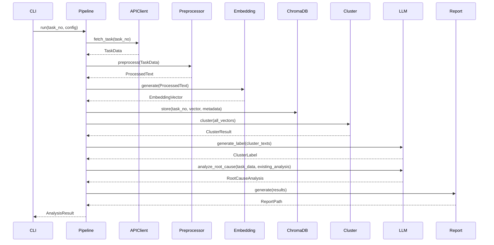

# Implementation Plan

## Feature
故障复盘分析系统 - 核心流水线

## Overview
构建五阶段流水线架构：Fetch → Preprocess → Embed → Cluster → Analyze。采用 Clean Architecture 分层设计，通过依赖注入实现组件解耦，支持多 LLM/Embedding Provider 切换。

## Architecture

### Components
1. **APIClient** (`src/api/client.py`)
   - **Purpose**: 从研发云平台获取故障工单数据
   - **Responsibilities**: 异步 HTTP 请求、认证处理、响应解析、错误重试
   - **Dependencies**: httpx, CacheManager

2. **CacheManager** (`src/cache/manager.py`)
   - **Purpose**: SQLite 缓存层，减少重复 API 调用
   - **Responsibilities**: 缓存读写、TTL 过期检查、缓存清理
   - **Dependencies**: SQLite

3. **DataPreprocessor** (`src/preprocessor/`)
   - **Purpose**: 文本预处理，提取关键信息组合分析文本
   - **Responsibilities**: 字段提取、文本清洗、组合策略
   - **Dependencies**: 无

4. **EmbeddingGenerator** (`src/embedding/`)
   - **Purpose**: 生成向量 Embedding
   - **Responsibilities**: 多 Provider 支持、批量生成、降维处理
   - **Dependencies**: OpenAI SDK / Zhipu SDK / sentence-transformers

5. **ClusterAnalyzer** (`src/clustering/`)
   - **Purpose**: HDBSCAN 密度聚类
   - **Responsibilities**: 聚类计算、参数调优、结果输出
   - **Dependencies**: hdbscan, numpy

6. **ChromaManager** (`src/storage/chroma_manager.py`)
   - **Purpose**: ChromaDB 向量数据库管理
   - **Responsibilities**: 向量存储、检索、元数据管理
   - **Dependencies**: chromadb

7. **AnalysisPipeline** (`src/analyzer/pipeline.py`)
   - **Purpose**: 流水线编排，协调各组件
   - **Responsibilities**: 流程调度、进度追踪、错误处理
   - **Dependencies**: 所有上述组件

8. **ViolationDetector** (`src/analysis/violation_detector.py`)
   - **Purpose**: 代码变更违规检测
   - **Responsibilities**: 规则匹配、违规识别、证据收集
   - **Dependencies**: RulesEngine

9. **RootCauseAnalyzer** (`src/analyzer/reasoning/`, `src/analysis/root_cause/`)
   - **Purpose**: 深度根因分析
   - **Responsibilities**: 5层追问、根因挖掘、改进建议生成
   - **Dependencies**: LLM Provider

10. **RulesEngine** (`src/rules/`)
    - **Purpose**: 规则引擎，基于开发规范检测违规
    - **Responsibilities**: 规则加载、模式匹配、违规判定
    - **Dependencies**: KnowledgeManager

11. **ReportGenerator** (`src/report/`)
    - **Purpose**: 报告生成
    - **Responsibilities**: Excel 导出、HTML 报告、可视化图表
    - **Dependencies**: Jinja2, Plotly

### Data Flow
```
[CLI/Streamlit] → [Pipeline] → [APIClient] → [Cache] → [Preprocessor] → [Embedding] → [ChromaDB]
                                              ↓
                                        [ClusterAnalyzer]
                                              ↓
                                    [LabelGenerator + RootCauseAnalyzer]
                                              ↓
                                    [ViolationDetector + ImprovementRecommender]
                                              ↓
                                        [ReportGenerator]
```

### Sequence Diagram


## Implementation Strategy

### Phase 1: Foundation
- [ ] 完善数据模型 (`src/core/models.py`)
- [ ] 定义组件接口/抽象
- [ ] 配置管理优化 (`src/config/manager.py`)

### Phase 2: Core Functionality
- [ ] APIClient 异步实现与缓存集成
- [ ] Preprocessor 文本处理逻辑
- [ ] EmbeddingGenerator 多 Provider 实现
- [ ] ChromaManager 向量存储
- [ ] ClusterAnalyzer HDBSCAN 实现
- [ ] Pipeline 流程编排

### Phase 3: Analysis Layer
- [ ] LabelGenerator LLM 标签生成
- [ ] RootCauseAnalyzer 深度分析（5层追问）
- [ ] ViolationDetector 规则检测
- [ ] ImprovementRecommender 改进建议

### Phase 4: Output Layer
- [ ] ReportGenerator 报告生成
- [ ] Visualization 图表组件
- [ ] CLI 命令完善
- [ ] Streamlit UI 交互

### Phase 5: Testing
- [ ] 单元测试（覆盖率 ≥ 79.9%）
- [ ] 集成测试（流水线端到端）
- [ ] E2E 测试（CLI + Streamlit）

## Technical Details

### Database Schema

**SQLite Cache** (`data/cache.db`):
```sql
CREATE TABLE api_cache (
    cache_key TEXT PRIMARY KEY,
    response_data TEXT NOT NULL,
    created_at TIMESTAMP DEFAULT CURRENT_TIMESTAMP,
    expires_at TIMESTAMP NOT NULL
);
```

**ChromaDB Collections** (`data/chroma/`):
- `fault_embeddings`: 故障单 Embedding 向量 + 元数据
- Metadata: `{task_no, task_name, cluster_id, created_at}`

### API Design（CLI Commands）

| Command | Description | Arguments |
|---------|-------------|-----------|
| `fault-analyzer fetch --task-id <id>` | 获取单个故障单 | task-id |
| `fault-analyzer analyze --task-id <id>` | 分析单个故障单 | task-id |
| `fault-analyzer report --task-id <id> --output <path>` | 生成报告 | task-id, output |

### Class Design

```python
# src/analyzer/pipeline.py
class AnalysisPipeline:
    """流水线编排器，协调所有组件"""

    def __init__(
        self,
        api_client: APIClient,
        preprocessor: DataPreprocessor,
        embedding_gen: EmbeddingGenerator,
        cluster_analyzer: ClusterAnalyzer,
        chroma_manager: ChromaManager,
        config: PipelineConfig
    ):
        self._api_client = api_client
        self._preprocessor = preprocessor
        self._embedding_gen = embedding_gen
        self._cluster_analyzer = cluster_analyzer
        self._chroma_manager = chroma_manager
        self._config = config

    async def run(self, task_no: str, config: PipelineConfig) -> AnalysisResult:
        """执行完整分析流水线"""
        ...

    async def fetch_phase(self, task_no: str) -> TaskData:
        """Phase 1: 数据获取"""
        ...

    async def preprocess_phase(self, task_data: TaskData) -> ProcessedData:
        """Phase 2: 文本预处理"""
        ...

    async def embed_phase(self, processed_data: ProcessedData) -> EmbeddingResult:
        """Phase 3: 向量生成"""
        ...

    async def cluster_phase(self, embeddings: list[EmbeddingResult]) -> ClusterResult:
        """Phase 4: 聚类分析"""
        ...

    async def analyze_phase(self, cluster_result: ClusterResult) -> AnalysisResult:
        """Phase 5: 根因分析"""
        ...
```

```python
# src/analysis/root_cause/analyzer.py
class DeepRootCauseAnalyzer:
    """深度根因分析器，实现5层追问机制"""

    def __init__(self, llm_provider: LLMProvider):
        self._llm = llm_provider

    async def analyze(
        self,
        fault_input: FaultAnalysisInput,
        existing_analysis: Optional[ExistingFaultAnalysis]
    ) -> DeepRootCauseResult:
        """执行深度根因分析"""
        ...
```

## Dependencies

### New Dependencies
| 库 | 版本 | 用途 | 备选方案 |
|----|------|------|----------|
| hdbscan | ≥0.8.33 | 密度聚类 | 无 |
| chromadb | ≥0.4.0 | 向量数据库 | 无 |
| httpx | ≥0.25.0 | 异步 HTTP | aiohttp |
| plotly | ≥5.0 | 可视化 | matplotlib |
| jinja2 | ≥3.0 | 报告模板 | 无 |
| loguru | ≥0.7.0 | 日志 | logging |
| pydantic | ≥2.0 | 数据模型 | dataclasses |

### Internal Dependencies
- 所有分析组件依赖 `src/core/models.py` 定义的数据模型
- 所有 LLM 相关组件依赖 `LLMProvider` 抽象接口
- CLI 和 UI 依赖 Pipeline 组件

## Risk Analysis

| Risk | Likelihood | Impact | Mitigation |
|------|------------|--------|------------|
| API 认证失败 | Medium | High | 提供详细错误信息，引导用户检查 DEVCLOUD_TOKEN |
| LLM API 不稳定 | Medium | High | 支持多 Provider 切换，提供本地备用模型 |
| 聚类结果质量差 | Medium | Medium | 提供参数调优接口，支持人工复核 |
| ChromaDB 性能瓶颈 | Low | Medium | 批量写入优化，定期清理过期数据 |
| 开发规范解析失败 | Low | Low | 提供 PDF 解析备选方案 |

## Testing Strategy

### Unit Tests
- [ ] APIClient HTTP 请求逻辑（Mock httpx）
- [ ] Preprocessor 文本处理逻辑
- [ ] EmbeddingGenerator 向量生成（Mock Provider）
- [ ] ClusterAnalyzer 聚类算法
- [ ] ViolationDetector 规则匹配
- [ ] RootCauseAnalyzer 分析逻辑（Mock LLM）

### Integration Tests
- [ ] Pipeline 端到端流程（Mock API/LLM）
- [ ] ChromaDB 存储检索
- [ ] Cache 缓存读写

### E2E Tests
- [ ] CLI 命令完整流程
- [ ] Streamlit UI 交互流程

### Coverage Target
- **Unit tests**: >80% 核心模块
- **Integration tests**: >60% 流水线
- **E2E tests**: 关键用户流程

## Deployment Plan

### Environment Setup
1. 配置 `DEVCLOUD_TOKEN` 环境变量
2. 配置 LLM Provider（`LLM_API_KEY`, `LLM_BASE_URL`）
3. 配置 Embedding Provider
4. 初始化 ChromaDB 数据目录

### Rollback Plan
1. 保留上一版本代码分支
2. ChromaDB 数据备份
3. SQLite 缓存备份

## Open Questions

1. **Question**: 是否需要支持离线分析模式？
   - **Status**: Open
   - **Decision**: 第一版依赖在线 API，离线模式作为备选方案

2. **Question**: 聚类参数是否需要动态调优？
   - **Status**: Resolved
   - **Decision**: 提供配置文件指定参数，支持运行时调整

## References

- **API Documentation**: `swagger.txt`
- **Data Models**: `src/core/models.py`
- **Configuration**: `config/config.yaml`
- **Standards**: `docs/浩鲸在线规范库.pdf`

---

## GSTACK CEO Review Report

**Review Date**: 2026-03-30
**Review Mode**: SCOPE EXPANSION
**Reviewer**: Claude Code (GSTACK)

### Approved Expansions (5)

| # | Expansion | Description | Priority |
|---|-----------|-------------|----------|
| 1 | CI/CD Integration | Pre-commit hooks for fault prevention, CI pipeline integration | P1 |
| 2 | Feedback Loop | Recurrence tracking, pattern alerts | P1 |
| 3 | Actionable Recommendations | Code fix suggestions, test case generation | P2 |
| 4 | Real-time Processing | Stream processing, incremental clustering | P3 |
| 5 | REST API Layer | FastAPI endpoints for platform access | P0 |

### Approved Architecture Fixes (3)

| # | Issue | Resolution |
|---|-------|------------|
| Arch #1 | Duplicate ClusteringResult | Unify to single model |
| Arch #2 | No Circuit Breaker | Add circuit breaker for external APIs |
| Arch #3 | ChromaDB Single Point of Failure | Add fallback/retry logic |

### Approved Error Handling (2)

| # | Issue | Resolution |
|---|-------|------------|
| Error #1 | No Error Framework | Create custom exception hierarchy |
| Error #2 | LLM Response Validation | Add LLM response guard |

### Approved Security Improvements (3)

| # | Issue | Resolution |
|---|-------|------------|
| Sec #1 | No Token Rotation | Add token rotation mechanism |
| Sec #2 | No Input Validation | Add taskNo format validation |
| Sec #3 | Prompt Injection Risk | Add prompt guard |

### Approved Edge Case Handling (3)

| # | Issue | Resolution |
|---|-------|------------|
| Edge #1 | datetime ValueError | Add fallback handler |
| Edge #2 | No Embedding Timeout | Add timeout configuration |
| Edge #3 | No Batch Status | Add per-item status tracking |

### Approved Code Quality (2)

| # | Issue | Resolution |
|---|-------|------------|
| Quality #1 | Pipeline SRP Violation | Split into orchestrator + handlers |
| Quality #2 | Generic Exception | Create custom exception hierarchy |

### Approved Testing (2)

| # | Issue | Resolution |
|---|-------|------------|
| Test #1 | No Mutation Testing | Add mutmut framework |
| Test #2 | Limited Integration Tests | Expand integration test coverage |

### Approved Performance (3)

| # | Issue | Resolution |
|---|-------|------------|
| Perf #1 | Sequential Embedding | Add concurrent API calls |
| Perf #2 | No Embedding Cache | Add embedding cache |
| Perf #3 | No Rate Limiting | Add adaptive rate limiting |

### Approved Observability (3)

| # | Issue | Resolution |
|---|-------|------------|
| Obs #1 | Text Logs Only | Add JSON structured logging |
| Obs #2 | No Metrics | Add Prometheus metrics |
| Obs #3 | No Tracing | Add correlation IDs |

### Deployment Decisions (3)

| # | Decision | Choice |
|---|----------|--------|
| Deploy #1 | Containerization | No (local Python env) |
| Deploy #2 | CI/CD Pipeline | Pre-commit only |
| Deploy #3 | Health Checks | Add for REST API |

### Summary Statistics

- **Total Improvements Approved**: 26
- **P0 (Critical)**: 5 items
- **P1 (High)**: 8 items
- **P2 (Medium)**: 8 items
- **P3 (Low)**: 5 items

### Recommended Execution Order

1. **Week 1-2**: Security + Error Handling + Architecture Fixes (P0)
2. **Week 3-4**: REST API Layer + Performance (P1)
3. **Week 5-6**: Observability + Testing (P1-P2)
4. **Month 2+**: Advanced Expansions (P2-P3)

---

**Status**: Reviewed
**Owner**: Development Team
**Last Updated**: 2026-03-30