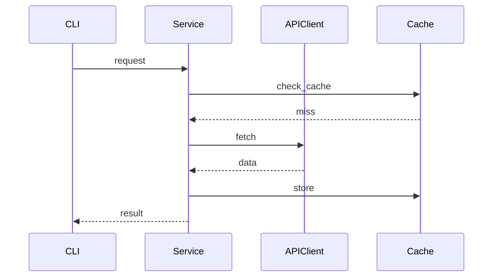

# Implementation Plan

## Feature
[与 specify.md 中的功能名称保持一致]

## Overview
[高层次的技术实现思路，回答 HOW，对应 specify.md 的 WHAT]

## Architecture

### Components
1. **组件名称**
   - **Purpose**: [做什么]
   - **Responsibilities**: [职责列表]
   - **Dependencies**: [依赖哪些组件]

### Data Flow
```
[Client/CLI] → [Preprocessor] → [Embedding] → [Clustering] → [Report]
```

### Sequence Diagram（可选）


## Implementation Strategy

### Phase 1: Foundation
- [ ] 创建/扩展数据模型
- [ ] 定义接口/抽象

### Phase 2: Core Functionality
- [ ] 实现核心业务逻辑
- [ ] 处理边界情况
- [ ] 添加错误处理

### Phase 3: Integration
- [ ] 与现有模块集成
- [ ] 连接 CLI 命令

### Phase 4: Testing
- [ ] 单元测试（覆盖率 ≥ 80%）
- [ ] 集成测试
- [ ] 边界用例测试

### Phase 5: Polish
- [ ] 代码审查与重构
- [ ] 性能优化（如需）
- [ ] 文档更新

## Technical Details

### New/Modified Classes
```python
class ExampleService:
    """职责说明"""

    def __init__(self, dependency: AbstractDep):
        self._dep = dependency

    def do_something(self, input_data: InputModel) -> OutputModel:
        """方法说明"""
        ...
```

### New Dependencies
| 库 | 版本 | 用途 | 备选方案 |
|----|------|------|----------|
| 库名 | x.y.z | 说明 | 无 |

## Risk Analysis

| 风险 | 可能性 | 影响 | 缓解措施 |
|------|--------|------|----------|
| [描述] | 低/中/高 | 低/中/高 | [措施] |

## Testing Strategy

### Unit Tests
- [ ] 测试核心业务逻辑（使用 Mock 隔离依赖）
- [ ] 测试边界情况
- [ ] 测试异常路径

### Integration Tests
- [ ] 测试组件间交互
- [ ] 测试完整数据流

### Coverage Target
- 单元测试覆盖率 ≥ 80%

## Open Questions

1. **技术问题**：[待确认的技术决策]
   - **状态**：Open / In Progress / Resolved
   - **决策**：[解决后填写]

## References
- **Specification**: `.speckit/specify.md`
- **Architecture**: `.speckit/constitution.md`

---

**Status**: Draft / In Review / Approved / In Progress / Completed
**Owner**: [Name]
**Last Updated**: [YYYY-MM-DD]
